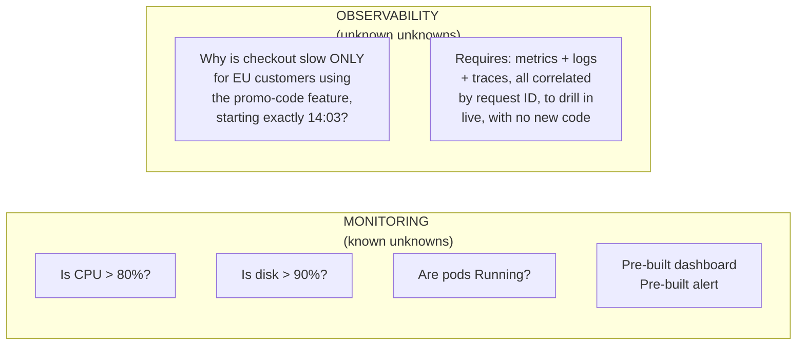
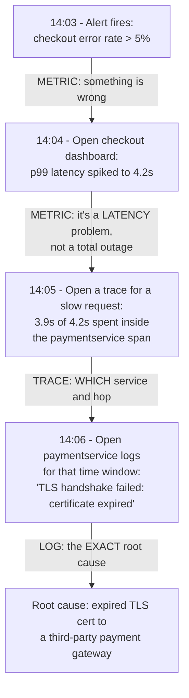
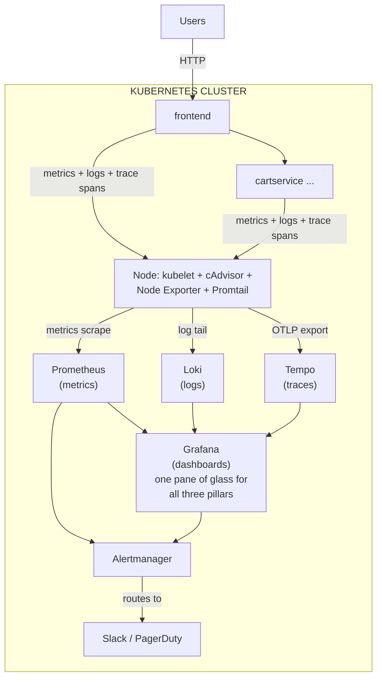
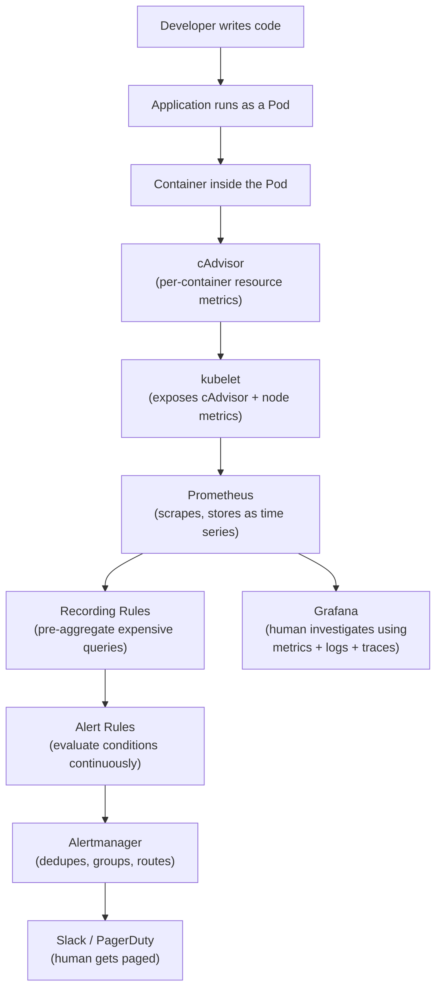

# Chapter 1: What Is Monitoring? Metrics, Logs, Traces, and Observability

> **Part 1 — Monitoring Fundamentals**

---

## 1. Objective

By the end of this chapter you will be able to:

- Explain, in plain English, what "monitoring" actually means in a production system, and why it exists.
- Explain the difference between **monitoring** and **observability**, and why enterprises treat them as related but distinct disciplines.
- Name the three pillars of observability — **metrics, logs, and traces** — and explain what question each one answers, and which it *cannot* answer.
- Explain why Kubernetes made monitoring harder than it was on static VMs, and what new failure modes it introduced.
- Read and understand the reference architecture diagram that every later chapter in this handbook builds on.

This chapter has almost no hands-on lab, because there is nothing to install yet — its job is to build the mental model that every later chapter (and every 2 a.m. page you will ever get) depends on. If you skip this chapter because "monitoring is just Grafana dashboards," you will misunderstand why the rest of the stack is shaped the way it is.

---

## 2. Concept

### 2.1 What problem is monitoring actually solving?

Imagine you deploy an application to production and never look at it again. Most of the time it works. Then, one day, a deploy introduces a memory leak. Pods start restarting. Customers start seeing errors. Nobody notices for six hours, because nobody was watching.

**Monitoring is the practice of continuously collecting, storing, and evaluating signals from a running system so that humans (or automation) can know its health without having to guess.**

That's it. Strip away all the tool names — Prometheus, Grafana, Datadog, whatever — and monitoring is fundamentally answering one question, over and over, forever:

> **"Is the system doing what it's supposed to be doing right now, and if not, why not?"**

Before monitoring existed as a discipline, teams found out about outages the worst possible way: a customer emailed support, or the CEO couldn't check out at checkout. Monitoring exists to make sure **you find out before your customer does.**

### 2.2 Monitoring vs. Observability — they are not the same word

This is the single most confused pair of terms in this entire field, and getting it right changes how you design systems, so let's be precise.

| | Monitoring | Observability |
|---|---|---|
| **Definition** | Watching a system against a set of *known* failure modes you predicted in advance | Having enough raw signal exported from a system that you can answer *new, unanticipated* questions about it without shipping new code |
| **Mental model** | "I built a dashboard and an alert for the failure modes I already know about." | "I have metrics + logs + traces with enough detail that when something weird I've *never seen before* happens, I can drill in and figure out why." |
| **Analogy** | A car's dashboard: fuel gauge, speedometer, check-engine light — all pre-built gauges for known things | A mechanic with a full diagnostic computer who can plug in and ask *any* question about *any* subsystem, even ones nobody anticipated |
| **Fails when...** | Something breaks in a way nobody thought to build a dashboard/alert for — you're blind | The system doesn't expose enough raw, high-cardinality signal to reconstruct what happened |
| **Question it answers** | "Is CPU usage above 80%?" (a question you decided to ask ahead of time) | "Why did request `abc123` from customer `xyz` take 4.2 seconds when everyone else got 40ms?" (a question you couldn't have pre-built a dashboard for) |

**Key idea:** Monitoring is a *subset* of observability. You can be "monitored" (dashboards exist, alerts fire) while still being *not observable* (when a truly novel failure hits, you have no way to investigate it, because the underlying data was never captured with enough detail — no request IDs, no per-pod labels, no trace context).

Modern platforms — including everything in this handbook — are built observability-first. We don't just build dashboards for problems we've seen before. We instrument the system so that Prometheus, Loki, and Tempo capture enough labeled, correlated, high-resolution data that an engineer can answer questions nobody wrote an alert for.



### 2.3 The Three Pillars: Metrics, Logs, and Traces

Enterprises consistently converge on three categories of telemetry data. Each one answers a different kind of question, and — this is the part beginners get wrong — **none of them can fully replace the others.** A mature platform (which is exactly what this handbook builds) collects all three and *correlates* them.

#### Metrics

A **metric** is a numeric measurement of something, recorded over time, usually with labels attached. Example: `cpu_usage_percent{pod="checkout-7f9d", node="worker-2"} = 73.2` at `14:03:00`.

- **What it answers:** "How much / how many / how fast, over time, in aggregate?" — CPU usage trending up, error rate spiking, request latency at the 99th percentile.
- **What it's good at:** Cheap to store (a handful of bytes per data point), cheap to query even across millions of time series, perfect for dashboards, trending, and alerting thresholds.
- **What it cannot do:** Tell you about one *specific* request. A metric like `http_requests_total{status="500"} = 42` tells you 42 requests failed in the last minute — it will never tell you *which customer*, *which request ID*, or *what the stack trace was*. Metrics are aggregates by design; that's the tradeoff that makes them cheap.

This handbook is built around **Prometheus**, the dominant open-source metrics system in the Kubernetes ecosystem (Part 4 onward covers it in exhaustive detail).

#### Logs

A **log** is a timestamped, unstructured or structured text record of a discrete event. Example: `2026-07-24T14:03:01Z level=error msg="failed to charge card" request_id=abc123 customer_id=88291 error="card declined"`.

- **What it answers:** "What exactly happened, in detail, for this one event?" Logs are the ground truth for root-causing a specific failure.
- **What it's good at:** Rich, arbitrary detail — stack traces, exact error messages, request payloads (careful with PII).
- **What it cannot do:** Scale cheaply across millions of events without careful indexing, and logs alone don't naturally give you trends or aggregates (you'd have to grep/count after the fact — which is exactly what LogQL in Loki, covered in Part 15, lets you do efficiently).

This handbook uses **Loki** for logs (Part 15) because it indexes only labels (not full text), which is dramatically cheaper at Kubernetes scale than traditional full-text-indexed logging systems — a deliberate architectural choice we'll justify in that chapter.

#### Traces

A **trace** is the end-to-end path of a single request as it flows through multiple services, broken into timed **spans**. Example: a checkout request touches `frontend` (12ms) → `cartservice` (8ms) → `paymentservice` (340ms, the slow one) → `emailservice` (5ms).

- **What it answers:** "In a system made of 11 microservices, which *one* of them is the bottleneck for *this specific request*?"
- **What it's good at:** Pinpointing latency and failures in distributed systems where a single user request fans out across many services — something metrics and logs, taken separately, are terrible at, because neither one naturally shows you causality *across service boundaries* for one request.
- **What it cannot do:** Replace metrics for cheap, high-volume trending (tracing every request at 100% sample rate is expensive at scale, so production systems usually sample).

This handbook uses **Tempo** for traces (Part 16), fed by **OpenTelemetry** (Part 14).

#### Why you need all three (and why this trips up beginners)

A single real incident makes this concrete:



Notice the pattern: **metrics told you something was wrong and roughly where (fast, cheap, always-on). Traces told you precisely which service and which hop. Logs told you the exact root cause.** Take any one pillar away and this investigation either becomes impossible or takes hours of guessing instead of three minutes. This is why Part 14–16 of this handbook build out OpenTelemetry, Loki, and Tempo *alongside* Prometheus — a production monitoring platform is never metrics-only.

### 2.4 A brief history: why did this become a discipline?

- **Pre-2000s / "ops" era:** A human logged into a server, ran `top`, checked `df -h`, tailed a log file by hand. Worked fine for a handful of servers.
- **Nagios / Zabbix era (2000s):** First generation of automated monitoring — mostly binary up/down checks ("is this host pingable?"). Good for infrastructure, poor for understanding application-level behavior.
- **Cloud + microservices era (2010s):** Applications stopped being "one big server" and became dozens or hundreds of independently deployed services. A single user request might now touch 15 services. Nagios-style up/down checks couldn't answer "why is checkout slow" anymore — you needed per-request, cross-service visibility. This is the era that produced Prometheus (built at SoundCloud, 2012), Grafana, and eventually distributed tracing (Dapper at Google, Zipkin at Twitter, Jaeger at Uber).
- **Kubernetes era (2015–now):** Kubernetes made things simultaneously better and much harder for monitoring — the next section explains exactly why.

### 2.5 Why Kubernetes makes monitoring specifically hard

If you've only monitored a handful of static VMs before, Kubernetes introduces failure modes and scale problems you likely haven't dealt with:

1. **Ephemeral identity.** A VM named `web-01` might live for a year. A pod named `checkout-7f9d8c6b45-xk2pl` might live for 40 seconds before it's rescheduled, OOMKilled, or replaced by a rolling deploy. Any monitoring system that assumes "hostnames are stable" breaks immediately. Prometheus's answer to this is **service discovery** (Part 9) — it asks the Kubernetes API "who's alive right now?" continuously, instead of relying on a static list.

2. **Massive scale of things to watch.** A single node used to be one thing to monitor. Now one node might run 30, 50, 100+ containers, each with its own CPU/memory/network/filesystem metrics (via cAdvisor, Part 6), on top of the node's own OS-level metrics (via Node Exporter, Part 7), on top of Kubernetes *object* state — is this Deployment's replica count actually satisfied? Is this PVC bound? (via kube-state-metrics, Part 8). That's three entirely different metric sources per node, multiplied across every node in the cluster.

3. **Multi-layer failure domains.** A single "slow checkout" symptom in Kubernetes could originate from: the container process itself, a CPU throttle imposed by a resource limit, a noisy-neighbor pod on the same node, the node's kernel, the pod network (CNI), a DNS resolution delay, an upstream service's pod being mid-restart, or the underlying cloud provider's disk. Static-VM-era monitoring never had this many layers stacked on top of each other.

4. **Self-healing hides problems until they compound.** Kubernetes will quietly restart a crashing container, reschedule a pod off a failing node, and scale up under load — all without a human noticing. This is a feature, but it also means small problems (a slow memory leak causing periodic OOMKills) can silently repeat for weeks with no visible customer impact, then suddenly cascade when the cluster runs out of headroom. You need monitoring that surfaces *restart counts and trends*, not just current up/down state.

5. **Declarative desired-state vs. actual-state drift.** In Kubernetes you declare "I want 5 replicas of checkout" and the control plane continuously reconciles toward that. Monitoring in this world isn't just "is the process alive" — it's "does actual state match desired state" (e.g., `kube_deployment_status_replicas_available` vs `kube_deployment_spec_replicas` — a kube-state-metrics concept we cover in Part 8).

This is precisely why the Kubernetes ecosystem standardized on **Prometheus** rather than older tools: Prometheus was designed from day one around pull-based service discovery, multi-dimensional labeled data, and being comfortable with targets appearing and disappearing constantly — exactly the Kubernetes operating model.

### 2.6 Where this handbook is going

Every part of this handbook maps onto this chapter's concepts:

```
 THIS CHAPTER'S CONCEPT                    WHERE WE BUILD IT
 ───────────────────────                   ──────────────────
 Metrics (cluster + node + container)  →   Parts 2–9  (Prometheus, cAdvisor,
                                             Node Exporter, kube-state-metrics)
 Metrics (application)                 →   Part 10    (instrumenting Online Boutique)
 Visualizing metrics                   →   Part 11    (Grafana)
 Acting on metrics (SLOs, alerts)      →   Parts 12–13 (Alertmanager, Recording Rules)
 Logs                                  →   Part 15    (Loki + Promtail)
 Traces                                →   Part 16    (Tempo)
 Unifying metrics+logs+traces          →   Part 14    (OpenTelemetry)
 Scale + durability                    →   Part 17    (Thanos)
 Keeping it running & secure           →   Part 18    (Production Operations)
 When it breaks                        →   Part 19    (100+ real incidents)
```

---

## 3. Why This Matters

Getting the mental model right in Chapter 1 has direct, expensive consequences later:

- **If you think "monitoring = dashboards," you will under-invest in logs and traces**, and when a genuinely novel incident happens (not the ones you pre-built dashboards for), you will be stuck guessing instead of investigating. This is the #1 reason "we had monitoring but still had a 6-hour outage" happens at real companies.
- **If you don't understand why metrics/logs/traces are complementary, not redundant,** you'll try to force one tool to do all three jobs badly (e.g., grepping logs to compute a rate, which doesn't scale) instead of using the right cheap tool for each job.
- **If you don't understand why Kubernetes broke old monitoring assumptions,** you'll try to bring VM-era habits (static host lists, SSH-and-grep, Nagios-style checks) into a Kubernetes cluster and be constantly surprised when pods you were "watching" simply vanish and get replaced.
- Every interview for an SRE/Platform Engineer role dealing with Kubernetes monitoring will test whether you can articulate *this exact distinction* (monitoring vs. observability, and the three pillars) in your own words. It is the single most common opening interview question in this domain (see the Interview Questions section below, and the full masterclass in Part 20).

---

## 4. Architecture

This is the target end-state architecture for the *entire handbook* — you are not expected to understand every box yet. Refer back to this diagram after each future chapter; more of it will make sense every time.



The "known unknowns vs. unknown unknowns" flow, applied to a real page:



---

## 5. Hands-on Lab

There is genuinely no cluster work yet — that starts in Chapter 5 once we've covered *why* the architecture is shaped this way (Chapters 2–4). Instead, this chapter's lab is a diagnostic exercise you can do with pen and paper (or in your own notes file), and it's one you should revisit after Part 19.

**Exercise: Classify the signal.**

For each scenario below, decide whether a **metric**, a **log**, or a **trace** is the *primary* tool you'd reach for to answer the question (some scenarios are actually best answered in combination — note that too):

1. "What's our error rate trending over the last 7 days?"
2. "Why did this exact customer's checkout fail at 3:42 PM?"
3. "Which of our 11 microservices is adding the most latency to the average checkout request?"
4. "Are we about to run out of disk on any node in the next 6 hours?"
5. "What was the exact SQL query that timed out?"
6. "Is our 99th percentile API latency within SLO this month?"

<details>
<summary>Suggested answers (click to expand in your own notes)</summary>

1. **Metric** (a time series of error rate over time — cheap, aggregable, perfect for a dashboard/trend).
2. **Log** (a specific, discrete event needs the exact error text/context, likely correlated via a request ID trace).
3. **Trace** (cross-service latency attribution for one request path is exactly what spans are for).
4. **Metric** (a filesystem usage gauge, trended — this is also a great candidate for a **predictive alert** using `predict_linear()`, which you'll learn in Part 5).
5. **Log** (or trace span with attached query text — full detail of a single execution).
6. **Metric**, specifically an SLI computed from a **Recording Rule** (Part 13) — this is precisely what Chapter 3 (SLIs/SLOs) formalizes.

</details>

---

## 6. Verification

Since there's no cluster yet, "verification" for this chapter is conceptual — confirm you can do the following without looking back at the text:

- [ ] Define monitoring in one sentence, in your own words.
- [ ] Define observability in one sentence, and explain how it differs from monitoring using the "known unknowns vs. unknown unknowns" framing.
- [ ] Name all three pillars and, for each, give one example question it answers that the *other two* cannot answer as well.
- [ ] List at least 3 specific reasons Kubernetes makes monitoring harder than a fleet of static VMs.

If you can't yet do all four confidently, re-read section 2 before moving to Chapter 2 — everything from here forward assumes this vocabulary.

---

## 7. Troubleshooting

Since this chapter has no lab infrastructure, "troubleshooting" here covers the conceptual traps beginners fall into:

| Symptom | Root Cause | Fix |
|---|---|---|
| "We have Grafana dashboards for everything but we still get blindsided by outages nobody predicted." | You built *monitoring* (known unknowns) but never invested in *observability* (unknown unknowns) — likely missing high-cardinality labels, correlated logs, or traces. | Add request IDs to logs, add tracing to critical paths, ensure metrics have enough labels (pod, namespace, version) to slice by unexpected dimensions. |
| "Our on-call engineer greps through logs to compute error rates by hand during an incident." | Using logs for a job metrics are built for — this doesn't scale and is slow exactly when speed matters most. | Emit a proper counter metric (e.g., `http_requests_total{status=~"5.."}`) instead of relying on log-based counting. |
| "We have great metrics but still can't figure out *why* a specific request was slow in a 12-service call chain." | Missing distributed tracing — metrics show *that* something's slow in aggregate, not the causal chain for *one* request. | Instrument services with OpenTelemetry (Part 14) and ship spans to Tempo (Part 16). |
| "New engineer says 'monitoring' and 'observability' interchangeably in a design doc and it causes confusion about scope." | Team hasn't agreed on shared vocabulary. | Point them at this chapter's section 2.2 table — get everyone using the same definitions. |

---

## 8. Production Notes

- **Real companies budget for all three pillars, not just metrics.** It's extremely common for a team to start with "just Prometheus + Grafana" (cheap, easy) and only add logs and tracing after their first "we couldn't figure out why this broke" postmortem. You are about to build the full stack from the start — treat that as the enterprise-correct default, not overkill.
- **Observability is a spending decision, not just a technical one.** Full-fidelity logs and 100%-sampled traces at high request volume get expensive fast (storage + cardinality). Production systems make deliberate tradeoffs: sampling traces (e.g., 1–10% of requests, or "always trace errors and slow requests"), setting log retention windows, and using recording rules to pre-aggregate expensive metric queries. You'll see these tradeoffs made explicitly in Parts 13, 16, and 17.
- **"Golden Signals" and "RED"/"USE"** (Chapter 2) are the industry-standard *frameworks* for deciding *which* metrics to prioritize out of the infinite number you could collect — without them, teams drown in dashboards nobody looks at.

---

## 9. Best Practices

1. **Instrument for observability from day one**, not monitoring-only. Adding request IDs and trace context after the fact, once services are already in production, is dramatically more expensive than building it in from the start.
2. **Every request that crosses a service boundary should carry a correlation ID** (or full trace context) so metrics, logs, and traces can be tied back to the same user request during an investigation.
3. **Don't build a dashboard for every metric that exists** — this chapter's "Golden Signals / RED / USE" preview (fully covered in Chapter 2) exists specifically to stop teams from drowning in noise.
4. **Agree on vocabulary as a team.** "Monitoring" vs "observability," "alert" vs "incident," "SLI" vs "SLO" — misaligned terminology causes real miscommunication during incidents, when precision matters most.

---

## 10. Interview Questions

1. **"What's the difference between monitoring and observability?"**
   *Answer:* Monitoring watches for pre-defined, known failure conditions using pre-built dashboards/alerts ("known unknowns"). Observability is a property of the system itself — having enough raw, correlated telemetry (metrics, logs, traces) that you can investigate and answer *novel* questions you didn't anticipate ("unknown unknowns"), without shipping new code to add visibility.

2. **"Name the three pillars of observability and what each is best at."**
   *Answer:* Metrics (cheap, aggregable, great for trends/alerting thresholds), logs (rich per-event detail, great for root cause on a specific event), traces (causal chain across services for one request, great for pinpointing which service in a distributed call is the bottleneck).

3. **"Why can't you just use logs for everything?"**
   *Answer:* Logs don't scale cheaply as an aggregation mechanism — computing a rate or percentile by parsing logs at query time is slow and expensive compared to a purpose-built counter/histogram metric that's pre-aggregated. Logs also don't natively express cross-service causality the way a trace does.

4. **"Why is monitoring harder in Kubernetes than on a set of static VMs?"**
   *Answer:* Ephemeral pod identity (targets appear/disappear constantly, requiring service discovery instead of static host lists), far higher density of things to watch per node (container + node + Kubernetes-object metrics), more failure-domain layers (container, cgroup limits, node, CNI network, DNS, control plane), and self-healing behavior that can mask small recurring problems until they cascade.

5. **"Give an example where you needed all three pillars to resolve an incident."**
   *Answer:* Use the walkthrough in section 2.3 (metric shows error-rate spike → trace shows which service/span is slow → log shows the exact root cause, e.g., an expired TLS cert) — be ready to tell a similar story from your own experience if you have one.

---

## 11. Real Incident

**Company type:** Mid-size e-commerce platform, ~40 microservices on Kubernetes.

**What happened:** A routine dependency upgrade introduced a subtle bug: under a specific, rare combination of request headers, one internal service would enter an infinite retry loop calling a downstream service, but each individual retry succeeded quickly (200ms), so **the error-rate metric never crossed any alert threshold** — no request ever "failed," they just multiplied. CPU and request-count metrics for that one internal service crept up slowly over 9 days, easily within normal day-to-day variance for a growing platform, so nobody's dashboard flagged it as anomalous.

**Why monitoring alone didn't catch it:** The team had solid *monitoring* — dashboards for CPU, memory, error rate, and latency, with alert thresholds. But no single threshold was breached; the growth was gradual and every individual metric stayed inside its "normal" band. This was a textbook "unknown unknown" — nobody had thought to alert on "ratio of downstream calls per inbound request," because nobody anticipated a retry-storm bug that never actually errors.

**How it was eventually found:** A different, unrelated alert fired — the cluster's overall node CPU utilization crossed 85%, which was a Golden-Signal-style saturation alert (see Chapter 2). During investigation, an engineer used **traces** to look at a sample of requests to the affected service and immediately saw spans with 40+ retried downstream calls per single inbound request — something no metric dashboard showed directly, but was instantly obvious in a single trace waterfall view.

**Root cause:** A retry-on-timeout policy with an overly aggressive retry count, combined with a downstream service's response time inching just over the retry-triggering timeout under normal (not even elevated) load.

**Resolution:** Capped retry count, added a circuit breaker, and — critically — added a *new* metric: retry count per inbound request, specifically because this incident revealed a monitoring blind spot.

**Prevention:** The team's postmortem action item was exactly this chapter's thesis: monitoring alone (fixed thresholds on known signals) will always miss classes of problems that don't look like the failures you predicted. The fix wasn't "add more dashboards" — it was investing in tracing so that *any* future weird-shaped incident could be investigated even without a pre-built alert for it.

---

## 12. Summary

- **Monitoring** watches for pre-defined, known failure conditions. **Observability** is the underlying property that lets you investigate failures nobody anticipated.
- The **three pillars** — metrics, logs, traces — each answer a different class of question and are cheapest/best used together, correlated by request/trace ID, not as substitutes for one another.
- **Kubernetes fundamentally changes the monitoring problem**: ephemeral pod identity requires service discovery, the sheer density of containers-per-node multiplies what needs watching, and multiple new failure-domain layers (cgroups, CNI, control-plane reconciliation) didn't exist in the static-VM world.
- Every subsequent part of this handbook is building one piece of the end-state architecture diagram in section 4 — keep referring back to it.

---

## 13. Next Chapter

**Chapter 2: SRE, Golden Signals, RED, and USE** — now that you know *what* to measure in principle (metrics/logs/traces), Chapter 2 answers the next question every team asks: *out of the infinite things you could measure, which ones actually matter?* You'll learn the frameworks (Golden Signals, RED, USE) that Google, and every serious SRE org since, uses to decide exactly that — and the SRE discipline that formalizes how monitoring data turns into operational decisions.
