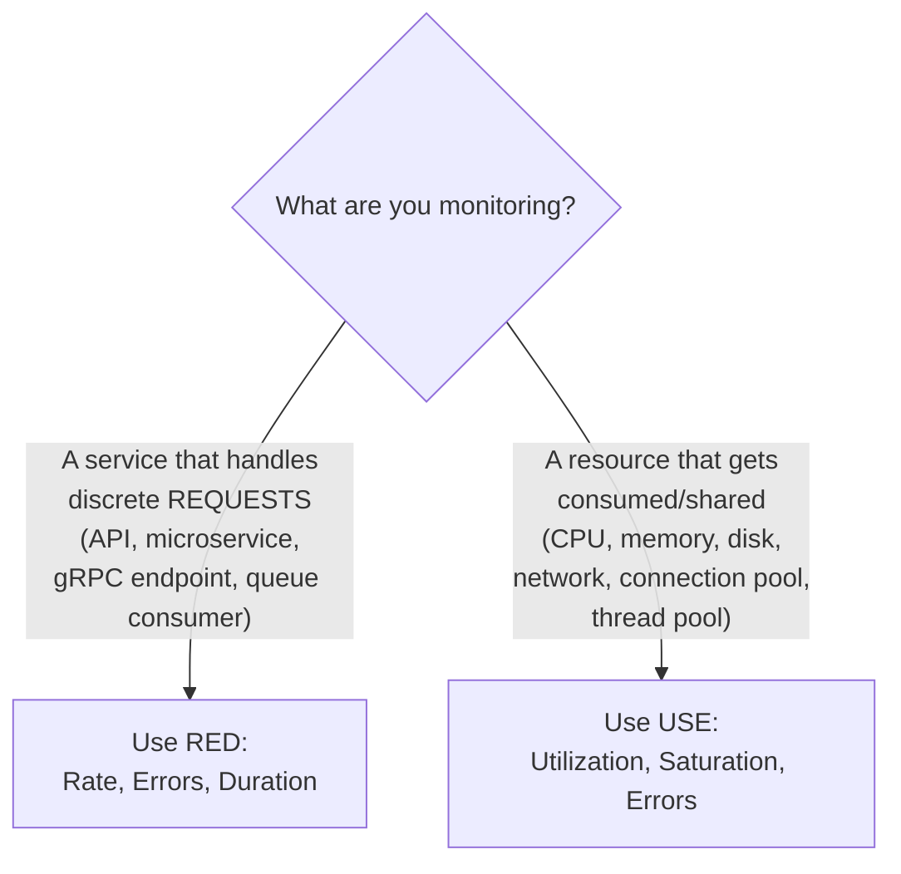
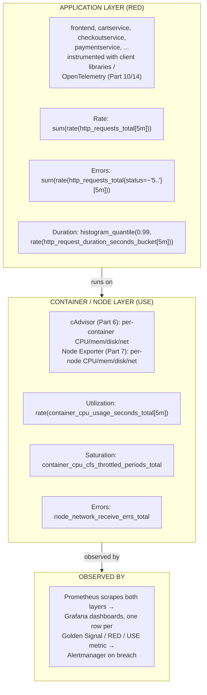

# Chapter 2: SRE, Golden Signals, RED, and USE

> **Part 1 — Monitoring Fundamentals**

---

## 1. Objective

By the end of this chapter you will be able to:

- Explain what Site Reliability Engineering (SRE) is, where it came from, and how it differs from traditional Ops/sysadmin work.
- Explain the **Four Golden Signals** (Latency, Traffic, Errors, Saturation) from Google's SRE book and apply them to any service.
- Explain the **RED method** (Rate, Errors, Duration) and when to use it (request-driven services).
- Explain the **USE method** (Utilization, Saturation, Errors) and when to use it (resources: CPU, memory, disk, network).
- Choose the right framework — RED vs. USE — for a given monitoring target, and know why applying the wrong one produces a blind spot.

---

## 2. Concept

### 2.1 What is SRE, really?

**Site Reliability Engineering (SRE)** is a discipline, originated at Google in the early 2000s (formalized publicly in the 2016 book *Site Reliability Engineering: How Google Runs Production Systems*), that applies **software engineering practices to operations problems**. Ben Treynor Sloss, who founded the discipline at Google, famously described it as: *"SRE is what happens when you ask a software engineer to design an operations function."*

The core difference from traditional "Ops"/sysadmin work:

| Traditional Ops | SRE |
|---|---|
| Manually respond to every incident | Automate away repetitive manual work ("toil") wherever possible |
| "Keep it up 100% of the time" (unrealistic, and wastes velocity) | Define an explicit, agreed **error budget** — a *deliberate* allowance for imperfection (Chapter 3) |
| Reliability work is reactive (firefighting) | Reliability work is proactive and measured (SLOs, capacity planning, postmortems) |
| Tribal knowledge, undocumented runbooks | Blameless postmortems, written runbooks, monitoring-as-code |
| Ops and Dev are separate, sometimes adversarial, teams | SREs often *write code* — automation, tooling, and yes, the monitoring platform this handbook builds |

**Why this matters for you as a monitoring engineer specifically:** SRE is the discipline that *consumes* the monitoring platform you're about to build. Prometheus, Grafana, and Alertmanager aren't ends in themselves — they exist to feed the SRE practices of SLOs (Chapter 3), on-call alerting (Part 12), incident response (Part 19), and capacity planning (Part 18). Understanding SRE tells you *why* the stack is shaped the way it is, not just how to install it.

### 2.2 The Four Golden Signals

From Google's SRE book, chapter 6: if you can only monitor four things about a user-facing system, monitor these:

| Signal | What it means |
|---|---|
| **Latency** | How long do requests take? Split success vs. error latency separately — a fast error is very different from a slow success, and averaging them together lies to you. |
| **Traffic** | How much demand is the system under? Requests/sec for an API, messages/sec for a queue consumer, concurrent connections for a streaming service — the "unit of demand" depends on the system. |
| **Errors** | Rate of requests that fail. Explicit failures (HTTP 500s) AND implicit ones: a 200 OK with the wrong content, or a response that violated a policy/SLA, e.g. "succeeded but took 30 seconds." |
| **Saturation** | How "full" is the system? CPU, memory, disk, connection pool, queue depth — the resource closest to its limit is usually the best saturation signal, and it's often useful to track "how much headroom is left" as a leading indicator, not just current usage. |

Why these four, specifically? Because **almost every real production incident shows up as an anomaly in at least one of these four**, and together they cover both the *user experience* side (latency, errors) and the *system health* side (traffic, saturation) — a slow leak in saturation is often the leading indicator that predicts a latency/error problem before customers even notice.

### 2.3 The RED Method (for request-driven services)

Coined by Tom Wilkie (Grafana Labs / Weaveworks), **RED** is Golden Signals distilled down to exactly the three that matter most for a *request-driven* service (an API, a microservice, anything that receives discrete requests):

- **R**ate — requests per second
- **E**rrors — failed requests per second (or as a % of rate)
- **D**uration — how long requests take (as a distribution — p50/p90/p99, never just an average)

```
   RED = Golden Signals minus Saturation
   (because for a stateless request-driven service, saturation
    is usually a property of its underlying NODE/RESOURCES,
    not of the service's request-handling logic itself —
    that's what USE is for, see 2.4)
```

RED is the framework you'll use constantly once you get to PromQL (Part 5) and building service dashboards (Part 11) — nearly every microservice dashboard in this handbook's reference app (Part 10) is structured as three rows: Rate, Errors, Duration.

**Why average duration is a trap (a very common beginner mistake):** If 99 requests take 10ms and 1 request takes 10 seconds, the *average* is ~110ms — which looks totally fine and hides the fact that 1% of your users just had a terrible experience. This is why RED (and Golden Signals) always says "duration as a distribution," and why Part 4 spends real time on **histograms** and computing percentiles correctly with `histogram_quantile()` in PromQL (Part 5) — it is one of the most-tested practical skills in this entire handbook.

### 2.4 The USE Method (for resources)

Coined by Brendan Gregg (performance engineering, ex-Netflix/Intel), **USE** is designed for **resources** — CPU, memory, disk, network interface, a connection pool, a thread pool — not for request-driven services:

- **U**tilization — the average % of time the resource was busy doing work (e.g., CPU utilization)
- **S**aturation — the amount of work the resource has queued up that it can't service right now (e.g., CPU run-queue length, i.e. processes waiting for a CPU slot)
- **E**rrors — count of error events for that resource (e.g., disk I/O errors, NIC packet drops)

The critical, easy-to-miss distinction: **utilization and saturation are not the same thing, and a resource can be dangerously saturated while utilization still looks "fine."** A CPU at 70% utilization with a deep run-queue (lots of processes waiting) is in worse shape than a CPU at 95% utilization with an empty run-queue. This distinction becomes very concrete in Part 6 (cAdvisor) and Part 7 (Node Exporter), where you'll learn to read CPU throttling metrics (`container_cpu_cfs_throttled_seconds_total`) — a container can be "only" using 60% of its CPU *limit* on average while still being throttled (saturated) during bursts, and average-based dashboards will completely miss this.

### 2.5 RED vs. USE — picking the right lens



In a real Kubernetes monitoring platform you use **both, layered**: RED for every microservice's request-handling behavior (Part 10's dashboards), and USE for every node and container's underlying resources (Parts 6–7's dashboards). A single incident often needs both views — e.g., "checkout's RED dashboard shows p99 duration spiking" leads you to "the node's USE dashboard shows CPU saturation (throttling) on that pod," which is your root cause.

---

## 3. Why This Matters

- Without a framework like Golden Signals/RED/USE, teams build dashboards ad hoc, based on whatever metric happened to be easy to expose, and end up with either far too few signals (blind spots) or far too many (nobody looks at any of them — "dashboard fatigue"). These frameworks exist specifically to bound the problem: a *finite*, *proven-sufficient* set of things to watch for any service or resource.
- Nearly every dashboard, alert, and SLO you build for the rest of this handbook is implicitly organized around RED (for the 11 Online Boutique microservices in Part 10) or USE (for nodes/containers in Parts 6–7). Recognizing which lens applies to what you're looking at is a daily skill, not a one-time lesson.
- This is one of the most common SRE interview topics — being able to instantly say "that's a request-driven service, I'd reach for RED" or "that's a shared resource, I'd reach for USE" signals real operational maturity to an interviewer.

---

## 4. Architecture

How Golden Signals / RED / USE map onto the Kubernetes monitoring stack you'll build starting in Part 3:



---

## 5. Hands-on Lab

Still no cluster required — this is a design exercise you'll directly reuse when you build real dashboards in Part 11.

**Exercise: Design the signal set.**

For each system below, decide RED, USE, or both, and list the specific signals you'd track:

1. `checkoutservice` — a gRPC microservice in Online Boutique that receives checkout requests.
2. A Kubernetes **node** running 40 pods.
3. A **Redis** cache used by `cartservice`.
4. A **Kafka consumer** processing an order-events queue.

<details>
<summary>Suggested answers</summary>

1. **RED** — Rate: checkouts/sec. Errors: failed checkouts/sec (gRPC status != OK). Duration: p50/p90/p99 checkout handling time.
2. **USE** — Utilization: node CPU %, memory %. Saturation: CPU run-queue / load average vs. core count, memory pressure (`node_pressure` metrics). Errors: kernel/network interface errors.
3. **Both** — RED for Redis *commands* (ops/sec, error/timeout rate, command duration) and USE for the underlying resource (memory utilization since Redis is memory-bound, eviction rate as a saturation-adjacent signal).
4. **USE-flavored RED** — Rate: messages consumed/sec. Errors: failed message processing/sec (sent to a dead-letter queue). Duration: processing time per message. Plus a saturation-style signal unique to queues: **consumer lag** (how far behind the consumer is from the producer) — arguably the single most important signal for any queue consumer, and a good example of a system needing a custom signal beyond the textbook frameworks.

</details>

---

## 6. Verification

- [ ] Recite the Four Golden Signals from memory, with a one-line definition of each.
- [ ] Recite RED and explain why it drops Saturation compared to Golden Signals.
- [ ] Recite USE and explain the difference between Utilization and Saturation with a concrete example.
- [ ] Given an arbitrary system description, correctly decide RED vs. USE vs. both within 10 seconds.

---

## 7. Troubleshooting

| Symptom | Root Cause | Fix |
|---|---|---|
| "Our average latency dashboard looks fine but users are complaining about slowness." | Averaging hides tail latency — a small % of very slow requests get washed out by the majority of fast ones. | Switch to percentile-based duration metrics (p90/p99) using histograms, per RED's "Duration" signal. Covered in depth in Part 5 (`histogram_quantile`). |
| "CPU utilization graphs show 60% and everyone says the node has headroom, but pods are getting throttled." | Utilization ≠ Saturation. Bursty CPU usage can hit the per-container CFS quota (throttling) even while the average looks low. | Add `container_cpu_cfs_throttled_periods_total` (a saturation signal) alongside utilization, per the USE method. Covered in Part 6. |
| "We monitor a Kafka consumer with RED (rate/errors/duration) and still got blindsided by a backlog." | RED alone misses the queue-specific saturation signal: consumer lag. A consumer can have healthy rate/errors/duration per message while still falling further and further behind. | Add consumer lag as a first-class signal — an example of adapting the frameworks, not following them blindly. |
| "We built dashboards for literally every metric Prometheus exposes and nobody uses any of them." | No framework was applied — dashboard sprawl without a prioritization method. | Rebuild top-level dashboards strictly around Golden Signals/RED/USE; push everything else to secondary/debug dashboards. |

---

## 8. Production Notes

- Google's SRE book is explicit that these four signals are a **starting point**, not an exhaustive list — some systems need extra, domain-specific signals (like consumer lag above, or cache hit ratio for a caching layer). Treat RED/USE as the mandatory baseline, then add what the specific system needs.
- In practice, most mature platforms implement RED automatically at the **service mesh or ingress layer** (e.g., Istio, Linkerd, or even just a shared HTTP middleware library) so that every service gets consistent Rate/Errors/Duration metrics for free, without every team hand-rolling their own instrumentation differently. We approximate this in Part 10 with consistent OpenTelemetry instrumentation across Online Boutique's services.
- Saturation is consistently the *hardest* signal to get right and the one most commonly missing from real dashboards, because it's the least obvious to instrument — utilization and errors are usually already exposed by a library or exporter, but meaningful saturation (queue depth, run-queue length, connection pool exhaustion) often needs deliberate extra instrumentation.

---

## 9. Best Practices

1. **Every new service gets a RED dashboard before it ships to production** — make this a checklist item in your deploy process, not an afterthought.
2. **Every node/resource type gets a USE dashboard once, reused everywhere** — you don't need a bespoke USE dashboard per node; Part 7 builds one Grafana dashboard templated across all nodes using variables (Part 11).
3. **Never alert on averages for latency** — always alert on a percentile (Part 12 covers exactly how, using recording rules from Part 13 to make this cheap).
4. **Treat Golden Signals/RED/USE as your minimum bar, not your ceiling** — add domain-specific signals (queue lag, cache hit ratio, connection pool exhaustion) where the textbook framework has a gap for your specific system.

---

## 10. Interview Questions

1. **"What are the Four Golden Signals?"** — Latency, Traffic, Errors, Saturation (with the "split success/error latency" and "saturation is a leading indicator" nuances from section 2.2).
2. **"What's the difference between RED and USE, and when do you use each?"** — RED (Rate, Errors, Duration) for request-driven services; USE (Utilization, Saturation, Errors) for resources; RED effectively drops the "Saturation" Golden Signal because saturation belongs to the underlying resource, which USE covers separately.
3. **"What's the difference between utilization and saturation, with an example?"** — Utilization is % busy time; saturation is queued/unmet demand. Example: a CPU can show 60% average utilization while still throttling a bursty container, because saturation (CFS throttling) is a separate signal from average utilization.
4. **"Why is average latency a misleading metric?"** — Averages hide tail latency; a small fraction of very slow requests can be invisible in an average while still representing a bad experience for real users — always use percentiles/histograms instead.
5. **"Give an example of a signal that doesn't fit cleanly into RED or USE."** — Consumer lag for a queue/stream consumer; cache hit ratio for a caching layer — both are domain-specific saturation-adjacent signals the textbook frameworks don't name explicitly.

---

## 11. Real Incident

**Company type:** SaaS analytics platform, Kubernetes-based, using a Kafka-backed event pipeline.

**What happened:** The team had a RED dashboard for their stream-processing consumer service: Rate (events/sec) looked steady, Errors (failed events) were near zero, and Duration (per-event processing time) was consistently under 5ms — every RED signal was green. Yet customers began reporting that their analytics dashboards were showing data that was **hours stale**.

**Root cause:** The consumer was processing every event it *received* quickly and successfully (which is exactly what RED measured), but it had fallen behind the producer — a partition rebalance days earlier had left one consumer instance responsible for 3x its normal partition load, and while it kept up with new messages arriving, it never had spare capacity to catch up on the growing backlog. **RED was blind to this because RED only measures work actually being done, not work waiting to be done.**

**Investigation:** An engineer, after ruling out anything RED showed as unhealthy, manually queried Kafka consumer group offsets and discovered lag in the millions of messages for one partition — a saturation signal that had never been added to any dashboard or alert.

**Resolution:** Rebalanced partition assignment, scaled the consumer group, and — the actual fix that mattered long-term — added **consumer lag** as a first-class alerted metric.

**Prevention:** This incident is now used internally as the canonical example of "RED is necessary but not sufficient for queue-based systems" — a direct, real-world instance of this chapter's section 2.5 principle: pick the framework (or combination, or extension) that matches what you're actually monitoring, don't apply RED or USE by rote without checking for domain-specific gaps.

---

## 12. Summary

- **SRE** applies software-engineering discipline to operations — automating toil, defining explicit reliability targets (Chapter 3), and treating monitoring as the foundation that all of this sits on.
- The **Four Golden Signals** (Latency, Traffic, Errors, Saturation) are the proven minimum signal set for any user-facing system.
- **RED** (Rate, Errors, Duration) is Golden Signals specialized for request-driven services.
- **USE** (Utilization, Saturation, Errors) is specialized for shared resources, and captures the crucial Utilization-vs-Saturation distinction that RED does not.
- Real systems often need **both**, layered, plus domain-specific extensions (queue lag, cache hit ratio) that neither textbook framework names explicitly.

---

## 13. Next Chapter

**Chapter 3: SLIs, SLOs, and Error Budgets** — Golden Signals/RED/USE tell you *what* to measure. Chapter 3 answers the next logical question: *given these measurements, how good is "good enough," and who decides?* You'll learn how to turn a raw metric into a **Service Level Indicator**, set a **Service Level Objective** target for it, and use the resulting **Error Budget** to make data-driven decisions about when to slow down for reliability work versus ship features faster — the formal bridge between "we have metrics" and "we make business decisions with metrics."
