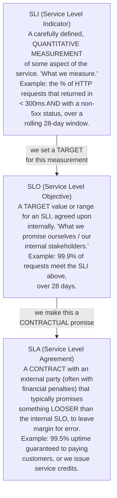
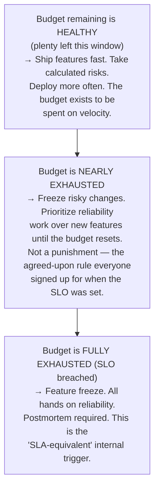
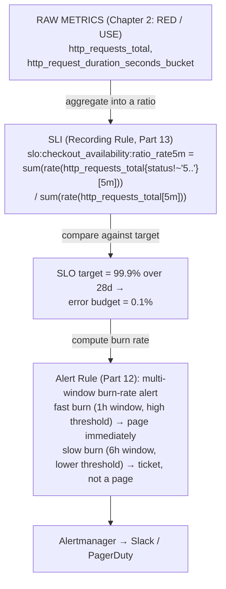

# Chapter 3: SLIs, SLOs, and Error Budgets

> **Part 1 — Monitoring Fundamentals**

---

## 1. Objective

By the end of this chapter you will be able to:

- Define **SLI**, **SLO**, and **SLA** precisely, and explain how they relate to each other.
- Turn a raw metric (from Chapter 2's RED/USE signals) into a properly formed SLI.
- Calculate an **error budget** from an SLO and explain what it's *for* — a decision-making tool, not just a number.
- Explain **burn rate** and why multi-window burn-rate alerting (which you'll build in Part 12) is the modern best practice over naive threshold alerting.
- Avoid the most common SLO design mistakes: too many SLOs, unmeasurable SLOs, and SLOs nobody agreed to.

---

## 2. Concept

### 2.1 The chain: SLI → SLO → SLA

These three terms are related but distinct, and interviewers love testing whether you can keep them straight:



**The critical relationship:** SLA ≤ SLO, always, with intentional margin. If your internal SLO is 99.9% and your external SLA is 99.5%, you have a buffer — you can miss your *internal* target for a while and still be safely within the *contractual* promise to customers. If you ever set your SLA equal to or tighter than your SLO, you have zero margin for error and every internal miss becomes a contract breach. This is a deliberate, common enterprise pattern, not an oversight.

**Not every SLI needs an SLA.** Most internal services (e.g., an internal microservice with no direct external customer contract) have SLIs and SLOs but no SLA at all — SLAs are specifically for externally-facing, often paid, commitments.

### 2.2 What makes a good SLI

A poorly formed SLI is one of the most common real-world mistakes. A good SLI must be:

1. **User-centric.** Measure what the user actually experiences, not an internal implementation detail. "CPU usage is under 80%" is not a good SLI — users don't experience CPU usage, they experience slow page loads. A good SLI derived from that same underlying concern is "% of requests served in under 300ms."
2. **Precisely defined.** "The API is fast" is not measurable. "The proportion of requests to `/api/checkout` with `status < 500` and `duration < 300ms`, out of all requests to `/api/checkout`, over a rolling 28-day window" is measurable, and — crucially — it's exactly the kind of PromQL expression you'll write in Part 5.
3. **Directly tied to a Golden Signal / RED / USE metric.** This is why Chapter 2 came before this chapter — you almost always build an SLI *out of* a Rate/Errors/Duration or Utilization/Saturation/Errors metric you already committed to tracking.

The most common SLI shape in the industry is a **ratio of "good events" to "total events,"** expressed as a percentage:

```
SLI = (good events / total valid events) × 100%
```

For example, an **availability SLI**:

```
SLI(availability) = (requests with status != 5xx) / (total requests)
```

And a **latency SLI** (note this is also a ratio, not a raw latency number):

```
SLI(latency) = (requests with duration < 300ms) / (total requests)
```

This "ratio of good to total" shape is exactly what you'll compute with PromQL in Part 5, and pre-compute cheaply with Recording Rules in Part 13.

### 2.3 Setting the SLO target — the hardest part is agreement, not math

A common misconception: teams think choosing an SLO number is a technical/statistical exercise. It's actually mostly a **negotiation and business decision**:

- **100% is the wrong target — always.** Google's SRE book is emphatic about this: 100% reliability is both practically unachievable (networks fail, hardware fails, even Google-scale infrastructure has physical failures) and, more importantly, **the wrong target even if it were achievable**, because chasing the last fraction of a percent of reliability has exponentially increasing cost and directly trades off against feature velocity (more on this in 2.4).
- **The target should reflect what users actually need**, not what's technically achievable. If users can't perceive the difference between 99.9% and 99.99% availability for your specific product, targeting 99.99% just burns engineering effort for no perceived benefit.
- **The target must be agreed to by stakeholders** — product, engineering, and leadership — not set unilaterally by the SRE/platform team. An SLO nobody outside the platform team agreed to is not a real SLO; it's just a dashboard threshold with a fancier name.

A typical SLO looks like: *"99.9% of requests to the checkout API will complete successfully in under 300ms, measured over a rolling 28-day window."* Note the specific components: the SLI definition, the target percentage, and the measurement window — all three are required for an SLO to be unambiguous.

### 2.4 Error Budgets — the payoff for doing all this

Here is the concept that makes SLOs actually *useful*, not just a vanity number:

```
 error budget = 100% − SLO target

 Example: SLO = 99.9%  →  error budget = 0.1%
```

If your SLO is 99.9% over 28 days, your error budget is the 0.1% of requests/time you're **allowed** to fail and still be meeting your commitment. Converted to concrete time for a 28-day window:

```
 99.9%  SLO  →  ~40 minutes of budget over 28 days
 99.95% SLO  →  ~20 minutes of budget over 28 days
 99.99% SLO  →  ~4 minutes of budget over 28 days
```

**Why this number changes how teams operate, day to day:**



This is the single most important cultural shift SRE introduced: **reliability and feature velocity stop being a political argument and become a shared, pre-agreed number.** Nobody has to "feel" like it's time to slow down and fix things — the error budget makes that decision objectively, in advance, before anyone's emotionally invested in shipping the next feature.

### 2.5 Burn rate — the modern way to alert on error budgets

If you only alerted "error budget = 0%, page someone," you'd find out *after* your entire month's budget for the whole 28-day window is already gone — useless for an actual incident response. The fix is alerting on **burn rate**: *how fast* are you consuming the budget right now, extrapolated forward?

```
 burn rate = (actual failure rate right now) / (failure rate that would
              exactly exhaust the budget by the end of the window)

 burn rate = 1×   →  consuming budget exactly on pace to land at 0% right
                      at the end of the window (expected/nominal)
 burn rate = 10×  →  consuming budget 10x faster than sustainable —
                      at this rate you'll exhaust a 28-day budget in
                      ~2.8 days
 burn rate = 60×  →  a severe, fast-moving incident — you'd exhaust the
                      whole 28-day budget in about 11 hours
```

A high burn rate over even a short window is exactly the kind of thing you want to page a human for immediately — this is the basis of the **multi-window, multi-burn-rate alerting** strategy (short window for fast detection + long window to avoid noise from brief blips) that you'll actually implement with Alertmanager and PromQL in Part 12. Chapter 2's naive "alert if error rate > X%" is a blunt instrument; burn-rate alerting, introduced here, is the production-grade replacement, precisely because it accounts for your *budget*, not just a raw instantaneous threshold.

### 2.6 Common SLO mistakes (learn these now, before Part 12)

1. **Too many SLOs.** If every team defines 15 SLOs, nobody can hold all of them in their head during an incident, and error-budget policy becomes meaningless. Best practice: 2–5 SLOs per service, focused on what users actually care about (usually availability + latency).
2. **SLIs that aren't user-centric.** "99% of pods are Running" is an SLI about Kubernetes internals, not user experience — a pod can be "Running" and still failing every request. Tie SLIs to RED-style request outcomes instead.
3. **No agreed error budget policy.** Defining the SLO and error budget but never agreeing *in advance* what happens when the budget is exhausted (who has authority to freeze feature work?) makes the whole exercise toothless the first time it's actually tested.
4. **Setting the SLO from a single team's aspiration rather than data.** The right process is: look at historical performance data, understand what users actually need, negotiate with stakeholders — not "let's promise 99.99% because it sounds good."

---

## 3. Why This Matters

- SLOs and error budgets are the actual business justification for the entire monitoring platform this handbook builds. Without them, "monitoring" is just technical hygiene; with them, monitoring data directly drives concrete decisions (ship faster vs. slow down) that leadership and product teams care about.
- Part 12 (Alerting) and Part 13 (Recording Rules) are both built to *serve* SLO tracking — multi-window burn-rate alerts (Part 12) and pre-computed SLI recording rules (Part 13) only make sense once you understand *why* they're shaped this way, which is entirely this chapter's content.
- This is consistently one of the highest-signal SRE interview topics (see section 10) — interviewers use SLO questions specifically to distinguish candidates who've only used monitoring tools from candidates who understand *why* the tools are used the way they are.

---

## 4. Architecture

How SLIs/SLOs/error budgets sit on top of everything from Chapters 1–2:



---

## 5. Hands-on Lab

Design exercise — you'll implement this for real once Prometheus is installed (Part 3) and PromQL is covered (Part 5).

**Exercise: Write an SLO for `checkoutservice`.**

Using the RED signals you designed in Chapter 2's lab for `checkoutservice`, write out:

1. A precisely worded **availability SLI** (what counts as a "good" request?).
2. A precisely worded **latency SLI** (what threshold, what percentile or ratio?).
3. An **SLO target and window** for each.
4. The resulting **error budget**, in both percentage and approximate minutes/month.
5. A one-sentence **error budget policy**: what happens when it's exhausted?

<details>
<summary>Suggested answer</summary>

1. *Availability SLI:* the proportion of `checkoutservice` gRPC requests that return a non-error status, out of all `checkoutservice` requests, measured over a rolling 28-day window.
2. *Latency SLI:* the proportion of `checkoutservice` requests that complete in under 500ms, out of all `checkoutservice` requests, over the same rolling 28-day window.
3. *SLO:* 99.9% for availability, 99% for latency (note: latency SLOs are often set looser than availability SLOs, since a slow-but-successful checkout is a worse experience than an error, but not as bad as data loss).
4. *Error budget:* availability — 0.1% ≈ ~40 minutes/month; latency — 1% of requests allowed to exceed 500ms.
5. *Policy:* "If the availability error budget drops below 20% remaining in the current window, all new feature deploys to `checkoutservice` require a reliability review before merging; if it hits 0%, feature deploys are frozen until a postmortem is filed and the budget partially recovers."

</details>

---

## 6. Verification

- [ ] Explain the SLI → SLO → SLA relationship and why SLA is typically looser than SLO.
- [ ] Write a properly formed SLI (user-centric, precisely defined, ratio-based) for a service of your choosing.
- [ ] Calculate the error budget, in both % and approximate minutes, for a 99.95% SLO over 28 days.
- [ ] Explain burn rate in one sentence and why it's a better alerting signal than "error budget = 0%."

---

## 7. Troubleshooting

| Symptom | Root Cause | Fix |
|---|---|---|
| "We have SLOs but nobody changes behavior when the budget is low." | No agreed error-budget *policy* — the SLO exists but has no teeth. | Get explicit, written buy-in from product/eng leadership on what happens at each budget threshold, before the first time it's tested for real. |
| "Our SLO dashboard says we're at 99.92% against a 99.9% target, everything looks fine, but we just had a bad outage yesterday." | The SLO's measurement window (e.g., 28 days) is smoothing out a real, sharp incident. This isn't a bug — it's how rolling-window SLOs work — but it means SLO compliance alone is a lagging indicator, not an incident-detection tool. | Use burn-rate alerts (section 2.5, built in Part 12) for real-time incident detection; use the SLO compliance number for longer-term trend/reporting, not minute-to-minute awareness. |
| "We set 30 different SLOs across our services and nobody can tell you which ones matter during an incident." | SLO sprawl — too many, not prioritized. | Cut to 2–5 SLOs per service focused on user-facing availability and latency; retire the rest or demote them to internal-only metrics without formal SLO status. |
| "Engineering keeps missing the SLO but leadership won't allow a feature freeze." | The error budget policy was never actually agreed to with authority behind it — a common failure when SRE unilaterally defines SLOs without stakeholder buy-in (section 2.3). | Escalate and re-negotiate the SLO and its policy explicitly with the stakeholders who need to honor it — this is an organizational problem, not a technical one. |

---

## 8. Production Notes

- Most enterprises track SLOs over a **rolling window** (commonly 28 or 30 days) rather than a fixed calendar month, specifically so the budget doesn't reset all at once at midnight on the 1st, causing artificial end-of-month cliffs in behavior.
- **Multi-window, multi-burn-rate alerting** (briefly previewed in 2.5, fully implemented in Part 12) is the current industry-standard pattern popularized by Google's SRE Workbook — it balances **fast detection** (short window catches severe incidents quickly) against **alert noise** (a short window alone would fire on every brief blip, so it's paired with a longer window requiring sustained burn before paging).
- Tools like **Sloth**, **Pyrra**, and OpenSLO-based generators exist specifically to turn a short SLO definition (SLI + target + window) into the full set of PromQL recording rules and multi-window alert rules automatically — worth knowing these exist even though this handbook hand-writes the rules in Part 12–13 so you understand exactly what's being generated.

---

## 9. Best Practices

1. **Fewer, sharper SLOs beat many vague ones.** 2–5 per service, tied directly to user experience.
2. **Always define the error budget policy in writing, before you need it**, with explicit named owners for each threshold's response.
3. **Use rolling windows, not fixed calendar windows**, to avoid artificial reset-day cliffs.
4. **Alert on burn rate, not on raw SLO compliance** — compliance is a reporting/trend metric; burn rate is an incident-detection metric. Confusing the two is the most common practical mistake teams make when they first adopt SLOs.
5. **Revisit SLO targets periodically** (quarterly is common) — user expectations and system capabilities both change over time; an SLO set two years ago may no longer reflect reality.

---

## 10. Interview Questions

1. **"What's the difference between an SLI, an SLO, and an SLA?"** — SLI is the measurement; SLO is the internal target for that measurement; SLA is the external, often contractual, promise — typically set looser than the SLO to leave margin.
2. **"What is an error budget and what is it actually used for?"** — 100% minus the SLO target; used as an objective, pre-agreed decision-making tool for when to prioritize reliability work over feature velocity, removing the need for ad hoc, emotionally-charged "should we slow down" debates.
3. **"Why shouldn't you target 100% reliability?"** — It's practically unachievable given real-world failure modes (hardware, network), and even where technically possible, the marginal cost of chasing the last fractions of a percent grows exponentially while user-perceptible benefit often doesn't — that cost trades directly against feature velocity.
4. **"What is burn rate, and why is it a better alerting signal than 'error budget hit zero'?"** — Burn rate measures how fast the budget is being consumed right now relative to a sustainable pace; alerting only when the budget is fully exhausted means you find out after the entire window's budget is already gone, which is far too late for real-time incident response.
5. **"What makes a good SLI?"** — User-centric (reflects real user experience, not internal implementation detail), precisely and unambiguously defined, and typically expressed as a ratio of good events to total events over a stated window.
6. **"How do you decide what SLO target to set?"** — Primarily a negotiated business decision informed by historical performance data and actual user expectations/needs — not a purely technical or aspirational choice, and always requires buy-in from stakeholders beyond the platform/SRE team.

---

## 11. Real Incident

**Company type:** B2B SaaS platform with a contractual 99.5% uptime SLA to enterprise customers.

**What happened:** The platform team had an internal SLO of 99.9% availability but had never formally connected it to an error-budget *policy* — SLO breaches were noted in dashboards but didn't trigger any concrete process change. Over one quarter, availability slowly degraded to around 99.6% due to accumulating technical debt in a shared database layer, still comfortably above the 99.5% contractual SLA, so nobody with authority to prioritize the fix treated it as urgent — "we're still meeting the SLA" became the de facto justification for continuing to ship new features instead.

**What went wrong:** The team had backwards intuition about the SLO/SLA relationship (section 2.1) — they were using the *looser* external SLA as their operating bar instead of the *tighter* internal SLO, which defeated the entire purpose of having margin between the two. When a subsequent, unrelated incident caused a further availability dip, the platform blew through the 99.5% SLA within days, triggering contractual service-credit penalties — because there was no error-budget-driven early warning that had ever forced a course correction while there was still margin.

**Root cause:** No enforced error-budget policy tied to the *internal* SLO. The SLO existed on paper and on a dashboard, but nothing concrete happened when it was breached, so the margin between SLO and SLA — which existed specifically to catch and correct problems before they became contractual/financial ones — went unused.

**Resolution:** Immediate incident response on the database layer technical debt; renegotiated internal governance so that breaching the 99.9% SLO for more than one week automatically triggers a mandatory reliability-focused sprint, with authority to pause new feature work, before any risk of approaching the SLA.

**Prevention:** This incident is the canonical real-world illustration of section 2.1 and 2.4 together: the SLA/SLO gap only protects you if you actually *act* on SLO breaches before they compound into SLA breaches — a good number with no enforced policy behind it provides zero real protection.

---

## 12. Summary

- **SLI** = what you measure. **SLO** = your internal target for that measurement. **SLA** = a looser, often contractual, external promise, with deliberate margin below the SLO.
- Good SLIs are user-centric, precisely defined, and usually expressed as a ratio of good events to total events over a stated rolling window.
- **Error budget** = 100% − SLO target — a concrete, pre-agreed allowance for imperfection that turns "should we slow down and focus on reliability" from a political argument into an objective, data-driven decision.
- **Burn rate** measures how fast you're consuming that budget right now, and multi-window burn-rate alerting (built in Part 12) is the modern replacement for naive fixed-threshold alerting.
- The most common real-world failure isn't picking the wrong number — it's **never agreeing on and enforcing a policy** for what happens when the budget runs out.

---

## 13. Next Chapter

This closes out **Part 1: Monitoring Fundamentals.** You now have the complete conceptual foundation: what monitoring and observability are and how they differ (Chapter 1), which signals to prioritize (Chapter 2), and how to turn those signals into targets that drive real decisions (Chapter 3). Every remaining part of this handbook is about **building the actual system** that implements these ideas on Kubernetes.

**Part 2, Chapter 4: The Kubernetes Monitoring Stack — How Every Piece Fits Together** starts translating theory into architecture: Prometheus, Grafana, Alertmanager, Prometheus Operator, kubelet, cAdvisor, Node Exporter, kube-state-metrics, ServiceMonitor, PodMonitor, and how service discovery, scraping, storage, and alert evaluation all connect end to end — the complete internal workflow you'll then install for real in Part 3.
