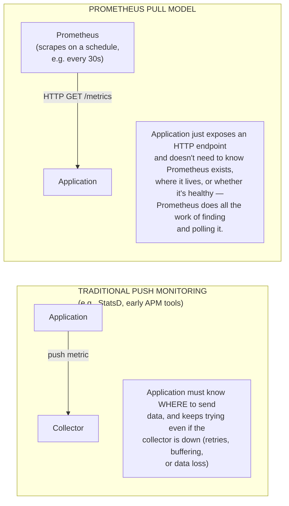
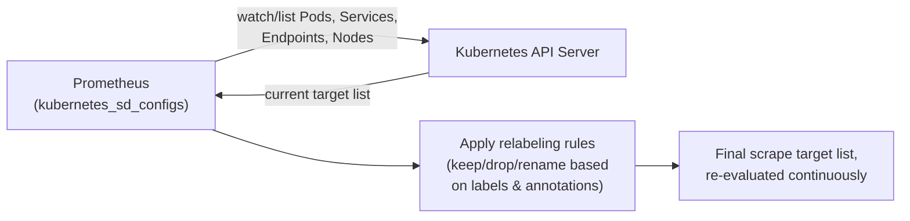
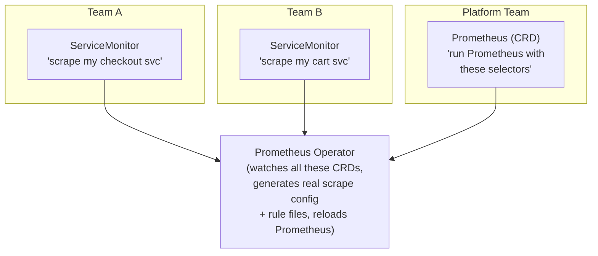
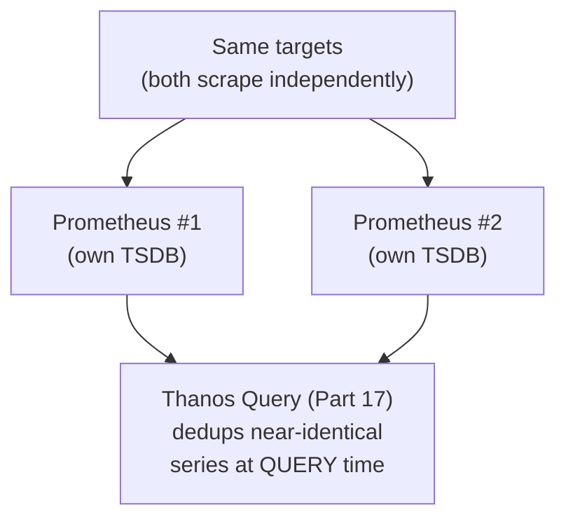
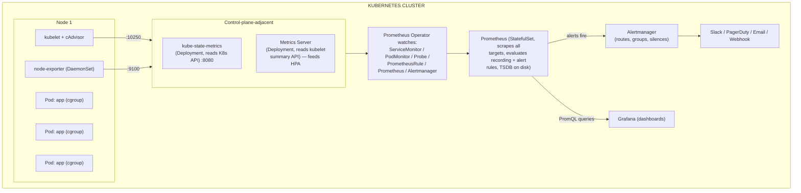

# Chapter 4: The Kubernetes Monitoring Stack — How Every Piece Fits Together

> **Part 2 — Monitoring Architecture**

---

## 1. Objective

By the end of this chapter you will be able to:

- Name every major component of a production Kubernetes monitoring stack and state, in one sentence, what each one is responsible for.
- Explain how Prometheus discovers what to scrape in a dynamic, ever-changing Kubernetes cluster (service discovery), and why this is fundamentally different from a static config file.
- Explain the role of the **Prometheus Operator** and its CRDs (`ServiceMonitor`, `PodMonitor`, `Probe`, `PrometheusRule`, `Prometheus`, `Alertmanager`) — why they exist and what problem they solve versus hand-editing `prometheus.yml`.
- Trace a metric's entire journey from a running container to a Grafana panel, end to end.
- Explain, at a conceptual level, how Prometheus's storage (TSDB), retention, and HA model work — enough to reason correctly about the deep dives in Parts 4 and 17.

This chapter is entirely conceptual — it is the map you'll use for the rest of the handbook. Part 3 installs every component described here; Parts 4–13 go deep on each one individually.

---

## 2. Concept

### 2.1 The cast of components, at a glance

Before any diagram, meet every actor by name and role. You will install every single one of these in Part 3.

| Component | One-sentence role |
|---|---|
| **kubelet** | The per-node agent that runs pods; also exposes a `/metrics` and `/metrics/cadvisor` HTTP endpoint with node- and container-level metrics. |
| **cAdvisor** | Built into the kubelet; collects per-container resource usage (CPU, memory, filesystem, network) directly from Linux cgroups. |
| **Node Exporter** | A separate DaemonSet that exposes *host-level* Linux metrics (CPU, memory, disk, network, filesystem) that aren't container-scoped — the OS's own vital signs. |
| **kube-state-metrics** | Watches the Kubernetes API and turns *object state* (is this Deployment's replica count satisfied? is this PVC Bound?) into Prometheus metrics — it does not talk to containers at all, only to the API server. |
| **Metrics Server** | A separate, lightweight, in-memory-only metrics pipeline used specifically to power `kubectl top` and the Horizontal Pod Autoscaler (HPA) — not for dashboards/alerting/long-term storage. |
| **Prometheus** | The core time-series database and scrape engine — pulls metrics from every target above on a schedule, stores them, evaluates rules, and serves PromQL queries. |
| **Prometheus Operator** | A Kubernetes controller that lets you *declare* Prometheus configuration (what to scrape, what alerts to fire) as Kubernetes Custom Resources (YAML objects) instead of hand-editing Prometheus's config file. |
| **ServiceMonitor / PodMonitor / Probe** | CRDs provided by the Operator that declare "scrape this Service/Pod/external endpoint" — the Operator turns these into actual Prometheus scrape config. |
| **PrometheusRule** | A CRD that declares Recording Rules and Alert Rules as YAML, which the Operator assembles into Prometheus's rule files. |
| **Alertmanager** | Receives firing alerts from Prometheus, deduplicates, groups, silences, and routes them to Slack/PagerDuty/email/webhooks. |
| **Grafana** | The visualization and dashboarding layer — queries Prometheus (and Loki, and Tempo) and renders panels/dashboards. |
| **Thanos** *(Part 17)* | Extends Prometheus for high availability, long-term/object-storage-backed retention, and global querying across multiple Prometheus instances/clusters. |

### 2.2 The fundamental model: Prometheus *pulls*, it doesn't receive pushes

This is the single most important architectural fact about Prometheus, and it explains almost every design decision downstream of it.

**Why pull, specifically for Kubernetes:** because Prometheus initiates every scrape, it can trivially tell the difference between "the metric value is 0" and "I couldn't reach this target at all" (the built-in `up` metric — `up == 0` means Prometheus failed to scrape that target, an incredibly useful signal you'll use constantly starting in Part 5). A push model can't distinguish "target is silent because it's healthy and idle" from "target is silent because it's dead and never sent anything." Pull also means Prometheus, not each individual application, owns the responsibility of knowing *which targets currently exist* — which is exactly what **service discovery** (2.3) is for.

The one place Prometheus can't pull is short-lived batch/cron jobs that finish before a scrape could ever happen — that's what **Pushgateway** exists for (a deliberate, narrow exception, covered when we deploy CronJobs in Part 10).

### 2.3 Service Discovery: how Prometheus finds targets in a cluster where nothing stays still

Recall from Chapter 1: pods are ephemeral. A static `prometheus.yml` with a hardcoded list of IPs would be stale within minutes. Instead, Prometheus continuously talks to the **Kubernetes API server** and asks, essentially, "give me the current list of Pods / Services / Endpoints / Nodes matching these criteria," and re-evaluates that list on an ongoing basis.

Raw Kubernetes service discovery gives Prometheus *everything* — every pod, every service, in every namespace — which is far too much and far too noisy to scrape blindly. **Relabeling** (covered in full in Part 9) is the filtering/transformation layer that turns "every pod in the cluster" into "only the pods that opted in via a specific annotation or label." This is precisely the gap that `ServiceMonitor` and `PodMonitor` (2.4) exist to make ergonomic — writing raw relabeling rules by hand is powerful but painful, so the Operator gives you a friendlier declarative interface on top of it.

### 2.4 The Prometheus Operator and its CRDs

Running Prometheus by hand means maintaining one large, hand-edited `prometheus.yml` — every new service that needs monitoring means someone edits that central file, which doesn't scale across teams and is a constant source of merge conflicts and mistakes in a large organization.

The **Prometheus Operator** solves this the way most mature Kubernetes platform tools solve "config sprawl": it introduces Custom Resource Definitions (CRDs) so that *configuration becomes just another Kubernetes object*, deployable by any team via `kubectl apply`, without anyone touching a shared central file. A controller (the Operator itself) continuously watches these CRDs and regenerates the real Prometheus configuration automatically.

The five CRDs you'll use constantly, each covered in full in later chapters:

- **`Prometheus`** — declares "run a Prometheus instance with these settings" (replica count, retention, storage, which ServiceMonitors/PodMonitors to select via label selectors). This is the top-level object; the Operator reads it and manages a StatefulSet of actual Prometheus pods for you.
- **`ServiceMonitor`** (Part 9) — "scrape the Service matching these labels, on this port, at this interval." The most commonly used discovery CRD, since most workloads are already fronted by a Kubernetes Service.
- **`PodMonitor`** (Part 9) — same idea, but targets Pods directly, bypassing a Service — useful when there's no stable Service in front of the pods you want to scrape, or you need per-pod granularity a Service would obscure.
- **`Probe`** (Part 9, used with Blackbox Exporter) — declares "probe this URL/target from outside," for synthetic/blackbox checks (is this endpoint reachable at all, from the outside in) rather than scraping a `/metrics` endpoint.
- **`PrometheusRule`** (Parts 12–13) — declares Recording Rules and Alert Rules as YAML; the Operator compiles many `PrometheusRule` objects from many teams into the rule files Prometheus actually loads.
- **`Alertmanager`** (Part 12) — same pattern as the `Prometheus` CRD, but for running and configuring Alertmanager itself.

**Why this matters practically:** this is why Part 3 installs everything via **kube-prometheus-stack**, a Helm chart that bundles the Operator, Prometheus, Alertmanager, Grafana, Node Exporter, and kube-state-metrics together with sane defaults — it is the de facto standard way any serious organization stands up this stack, and this handbook uses it exclusively (per the instruction: never standalone Prometheus).

### 2.5 The complete metric journey — container to Grafana panel

This is the single most important diagram in this chapter. Refer back to it constantly through Parts 3–13, since each part is implementing one stage of this pipeline.

```mermaid
flowchart TD
    S1["1. Container runs inside a Pod, its resource usage<br/>is tracked by the Linux kernel's cgroups"]
    S2["2. cAdvisor (embedded in kubelet) reads cgroup stats<br/>and exposes them as Prometheus-format metrics at<br/>https://&lt;node&gt;:10250/metrics/cadvisor"]
    S3["3. kubelet ALSO exposes its own node-level metrics at<br/>.../metrics, Node Exporter (separate DaemonSet pod)<br/>exposes deeper OS metrics at :9100/metrics.<br/>kube-state-metrics (separate Deployment) exposes<br/>Kubernetes OBJECT state (reads the API server) at<br/>:8080/metrics"]
    S4["4. Each target is discovered via Kubernetes Service<br/>Discovery (2.3), filtered/labeled via<br/>ServiceMonitor/PodMonitor objects (2.4) and<br/>relabeling rules (Part 9)"]
    S5["5. Prometheus scrapes each target on a schedule<br/>(e.g. every 30s), parses the exposition-format text<br/>response, and appends each sample to its TSDB<br/>(Time Series Database) on local disk (2.6)"]
    S6["6. Recording Rules (Part 13) periodically pre-compute<br/>expensive queries (e.g., SLI ratios) into new,<br/>cheap-to-query time series"]
    S7["7. Alert Rules (Part 12) continuously evaluate PromQL<br/>expressions against this data; when one is true for<br/>the configured 'for' duration, an alert fires and is<br/>sent to Alertmanager, which routes it to Slack/<br/>PagerDuty per its routing tree"]
    S8["8. Grafana (Part 11) sends live PromQL queries to<br/>Prometheus's HTTP API on-demand, whenever a human<br/>opens a dashboard, and renders the result as a panel"]
    S1 --> S2 --> S3 --> S4 --> S5 --> S6 --> S7 --> S8
```

### 2.6 Storage, retention, and HA — the conceptual model (deep dives in Part 4 & 17)

A few facts you need now, in outline, before Part 4 goes deep:

- **TSDB (Time Series Database):** Prometheus's own purpose-built local storage engine, organized into 2-hour immutable "blocks" on disk, with an in-memory head block for recent data. This is *why* Prometheus is so fast at the specific access pattern it's built for (recent-time-range queries across many series) and comparatively bad at things it wasn't built for (arbitrary long-term historical queries across huge time ranges without help — that's what Thanos, Part 17, adds).
- **Retention:** by default, local Prometheus storage only keeps a configurable window (commonly 15–30 days) because local disk isn't infinite — long-term retention beyond that requires either a bigger disk and more retention config, or (the production-standard answer) shipping blocks to object storage via Thanos or a remote-write-compatible system (Mimir), covered in Part 17.
- **HA (High Availability):** a single Prometheus instance is a single point of failure — if it restarts (upgrade, crash, node failure) you lose scraping during that window, and its local disk is not replicated. The standard pattern is running **two or more identical Prometheus replicas**, scraping the same targets independently, each with their own local TSDB — they are not clustered or synchronized with each other. Deduplication of the resulting near-identical data happens at query time, typically via Thanos Query (Part 17), not inside Prometheus itself. This "dumb replication, smart query-time dedup" design is deliberate — it keeps each Prometheus instance simple and independently reliable.

---

## 3. Why This Matters

- This chapter is the map. Every remaining technical part of this handbook (3 through 17) is a deep dive into exactly one box in the section 2.5 diagram. If you get lost in a later chapter's detail, come back here to re-orient yourself on where that detail fits in the whole pipeline.
- Understanding *why* Prometheus pulls instead of receives pushes, and *why* the Operator's CRD model exists, is what separates someone who can install a Helm chart from someone who can actually design and troubleshoot a monitoring platform — which is precisely this handbook's stated goal.
- Nearly every "why isn't Prometheus scraping my service" troubleshooting session (a constant reality of this job, covered extensively in Part 19) is really a question of "at which of the 8 stages in section 2.5 did this break" — having the full pipeline memorized turns debugging from guesswork into a systematic process of elimination.

---

## 4. Architecture

The full end-state architecture, now labeled with every component from section 2.1, exactly as you'll install it in Part 3:

All three of Grafana, Prometheus, and Alertmanager's web UIs are exposed via
NodePort Services in this handbook (Part 3) — no Ingress, no cloud LB, so this
exact architecture runs unmodified on Kind, Minikube, kubeadm, bare metal,
EKS, AKS, GKE, or RKE2.

---

## 5. Hands-on Lab

No cluster changes yet (Part 3 is the install), but this chapter's lab locks in the mental model with a tracing exercise.

**Exercise: Trace a real metric.**

Pick the metric `container_memory_working_set_bytes` for a specific pod. Write out, in your own words, each of the 8 stages from section 2.5 as it applies to this specific metric — from "which Linux kernel subsystem does this number originate from" all the way to "what would I click in Grafana to see it as a graph." This exercise is worth doing on paper now; you'll verify your answer for real once cAdvisor is covered in depth in Part 6.

---

## 6. Verification

- [ ] Name all 12 components from the section 2.1 table from memory, each with a correct one-sentence description.
- [ ] Explain why Prometheus uses a pull model, and name the specific problem this solves that a push model can't (the `up` metric / dead-vs-idle distinction).
- [ ] Explain what the Prometheus Operator adds on top of raw Prometheus, and why (config-as-CRDs vs. one shared hand-edited file).
- [ ] Draw (or narrate) the 8-stage metric journey from section 2.5 without looking at the text.
- [ ] Explain, at a high level, why Prometheus HA replicas don't "cluster" with each other, and where deduplication actually happens.

---

## 7. Troubleshooting

Since Part 3 hasn't installed anything yet, this section previews the *categories* of problems you'll learn to diagnose systematically once the stack exists (fully detailed in Part 19):

| Symptom | Which stage (section 2.5) is likely broken | Chapter that covers the fix |
|---|---|---|
| A target shows `up == 0` in Prometheus | Stage 5 (scrape failing) — network policy, wrong port, target down, TLS/auth misconfig | Part 9 (Service Discovery), Part 19 |
| A ServiceMonitor exists but Prometheus never picks up the target | Stage 4 (label selector mismatch between `Prometheus` CRD and `ServiceMonitor`, or namespace not selected) | Part 9 |
| Metrics exist in Prometheus but a Grafana panel is empty | Stage 8 (wrong datasource, wrong PromQL, dashboard variable mismatch) | Part 11 |
| An alert never fires despite the condition clearly being true | Stage 7 (PrometheusRule not loaded, wrong label selector on the rule, Alertmanager routing dropping it silently) | Part 12 |
| Old data missing beyond a certain point | Stage 5/6 storage (retention window exceeded, no Thanos/long-term storage configured) | Part 17 |

---

## 8. Production Notes

- Enterprises almost never run "vanilla" Prometheus by hand in production Kubernetes — the Operator + CRD model is the de facto standard specifically because it lets application teams self-serve their own monitoring config without a central platform team becoming a bottleneck, while the platform team retains control over the actual `Prometheus` CRD (resource limits, retention, global settings).
- A very common real-world topology is **one Prometheus Operator per cluster, but multiple `Prometheus` CRD instances** — e.g., one for platform/infra metrics and one for application metrics, each with different retention and resource budgets, selecting different `ServiceMonitor`s via label selectors. You'll see this pattern discussed again in Part 18 (capacity planning).
- **Metrics Server is not a substitute for Prometheus** and is frequently misunderstood by beginners — it holds no history (in-memory, last data point only) and exists solely to power `kubectl top` and HPA scaling decisions. If you need historical CPU/memory trends, that's Prometheus + cAdvisor/Node Exporter, not Metrics Server.

---

## 9. Best Practices

1. **Always install via kube-prometheus-stack (Helm)**, not hand-assembled manifests — you get the Operator, CRDs, and sane default `ServiceMonitor`s for the cluster's own core components for free, and it's what Part 3 uses.
2. **Let application teams own their own `ServiceMonitor`/`PodMonitor` objects**, deployed alongside their application manifests — this is the entire point of the Operator's CRD model; don't recreate a monitoring bottleneck by centralizing scrape config again.
3. **Separate platform-level and application-level Prometheus instances** once a cluster grows past a handful of teams, so one noisy team's metrics volume can't blow up retention/resource budgets for everyone else.
4. **Treat `up == 0` as your first troubleshooting checkpoint** for "why don't I see this metric" — it immediately tells you whether the problem is upstream (target unreachable) or downstream (target is fine, but your query/dashboard is wrong).

---

## 10. Interview Questions

1. **"Why does Prometheus use a pull model instead of push?"** — It lets Prometheus own target discovery and health detection (the `up` metric distinguishes "scrape failed" from "value is legitimately zero"), and it decouples applications from needing to know anything about the monitoring backend.
2. **"What problem does the Prometheus Operator solve?"** — It replaces a single, hand-edited, centrally-owned `prometheus.yml` with declarative Kubernetes CRDs (`ServiceMonitor`, `PodMonitor`, `PrometheusRule`, etc.) that individual teams can self-serve, while a controller continuously reconciles the real Prometheus configuration from those objects.
3. **"What's the difference between a ServiceMonitor and a PodMonitor?"** — `ServiceMonitor` scrapes through a Kubernetes Service (most common case); `PodMonitor` targets Pods directly, useful when there's no fronting Service or when per-pod granularity matters.
4. **"What's the difference between Metrics Server and Prometheus?"** — Metrics Server is a minimal, in-memory-only pipeline that exists solely to power `kubectl top` and HPA; it has no history and isn't queryable via PromQL. Prometheus is the full time-series database used for dashboards, alerting, and long-term analysis.
5. **"How does Prometheus achieve high availability, and where does deduplication happen?"** — By running multiple independent Prometheus replicas scraping the same targets (no clustering/replication between them); deduplication of the resulting near-duplicate series happens at query time, typically via Thanos Query, not inside Prometheus itself.
6. **"Walk me through what happens from a container using more memory to that shows up on a Grafana graph."** — Recite the 8-stage pipeline in section 2.5.

---

## 11. Real Incident

**Company type:** Mid-size fintech, multi-team Kubernetes platform, ~15 engineering teams.

**What happened:** Before adopting the Prometheus Operator, the platform team maintained one hand-written `prometheus.yml` in a shared Git repo. Every team that wanted a new service monitored had to open a PR against this shared file. As the org grew, PR review turned into a bottleneck — merge conflicts between teams editing the same file in the same sprint became routine, and the platform team became an unofficial gatekeeper for every application team's monitoring, slowing everyone down and creating exactly the kind of centralized bottleneck SRE practice tries to eliminate.

**Root cause:** The architecture itself — a single shared, centrally-owned config file — didn't scale past a handful of teams, regardless of how good anyone's process discipline was.

**Resolution:** Migrated to kube-prometheus-stack with the Prometheus Operator. Each application team was given permission (via RBAC, Part 18) to create `ServiceMonitor` objects in their own namespace; the platform team retained ownership only of the top-level `Prometheus` CRD (resource sizing, retention, global label selectors). PR review bottleneck disappeared because there was no longer a single shared file to contend over.

**Prevention / lesson:** This incident is really an architecture lesson, not an operational one — it's the canonical real-world justification for why this entire handbook (and the Kubernetes-native monitoring ecosystem broadly) standardized on the Operator/CRD pattern instead of hand-managed Prometheus config, and why Part 3 never even shows you the hand-written alternative.

---

## 12. Summary

- A production Kubernetes monitoring stack is a pipeline: containers → cAdvisor/kubelet/Node Exporter/kube-state-metrics → Prometheus (via service discovery + relabeling) → Recording/Alert Rules → Alertmanager + Grafana.
- Prometheus **pulls** metrics on a schedule rather than receiving pushes, which is what makes the `up` metric (scrape success/failure) possible and keeps applications decoupled from the monitoring backend.
- The **Prometheus Operator** turns Prometheus configuration into Kubernetes-native CRDs (`ServiceMonitor`, `PodMonitor`, `Probe`, `PrometheusRule`, `Prometheus`, `Alertmanager`), letting teams self-serve monitoring config instead of contending over one shared file.
- Prometheus storage (TSDB) is local-disk and retention-limited by design; HA is achieved via independent, non-clustered replicas with deduplication happening at query time (Thanos, Part 17), not through built-in replication.
- Metrics Server is a separate, narrow-purpose pipeline for `kubectl top`/HPA — not a substitute for Prometheus.

---

## 13. Next Chapter

This closes out **Part 2: Monitoring Architecture.** You now understand the full shape of the system before installing a single line of it.

**Part 3, Chapter 5: Installing kube-prometheus-stack with Helm (NodePort)** turns this chapter's architecture diagram into a real, running cluster: step-by-step Helm installation, every `values.yaml` field explained, every Kubernetes object and CRD the chart creates walked through individually, and Grafana/Prometheus/Alertmanager all exposed via NodePort so you can log in and look around for the first time.
