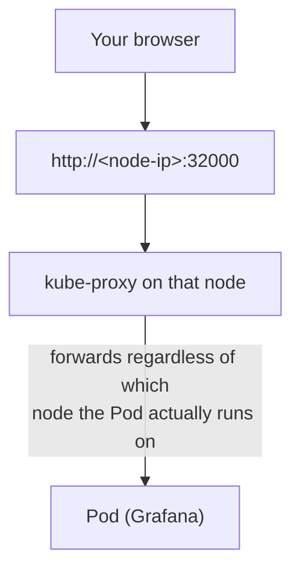
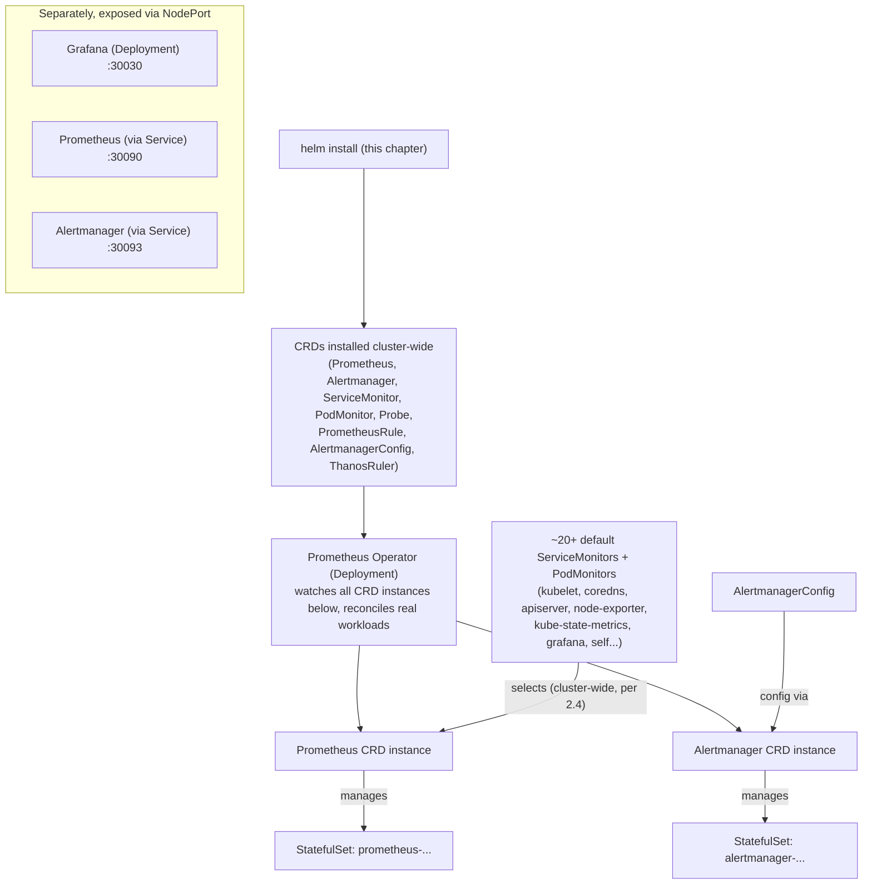

# Chapter 5: Installing kube-prometheus-stack with Helm (NodePort)

> **Part 3 — Install Production Monitoring**

---

## 1. Objective

By the end of this chapter you will have a fully running, production-shaped monitoring stack on your own cluster, and you will be able to:

- Install **kube-prometheus-stack** via Helm with a deliberate, explained `values.yaml`.
- Explain every value you set and why.
- List and explain every Kubernetes object and CRD the chart creates.
- Access Grafana, Prometheus, and Alertmanager's web UIs via **NodePort**, from your own machine, on any cluster type (Kind, Minikube, kubeadm, bare metal, EKS, AKS, GKE, RKE2).
- Verify the install is healthy using `kubectl` and each tool's own UI.

---

## 2. Concept

### 2.1 Why Helm, and why this specific chart

Chapter 4 established that this handbook installs via **kube-prometheus-stack**, a community-maintained Helm chart (published by the `prometheus-community` project) that bundles:

- Prometheus Operator
- Prometheus itself (as a `Prometheus` CRD + managed StatefulSet)
- Alertmanager (as an `Alertmanager` CRD + managed StatefulSet)
- Grafana (as a Deployment, with kube-prometheus-stack's own curated set of default dashboards pre-loaded)
- Node Exporter (as a DaemonSet)
- kube-state-metrics (as a Deployment)
- A large set of default `ServiceMonitor`s and `PrometheusRule`s for the cluster's own core components (kubelet, API server, CoreDNS, etc.)

**Why not install each piece separately by hand?** You could — but you'd be manually wiring together a dozen components' RBAC, Service objects, label selectors, and default alert rules that the community has already curated and battle-tested across thousands of production clusters. Hand-assembling this from scratch is a valid learning exercise (and you'll understand every piece by the end of this handbook), but it is not how any serious enterprise stands up this stack in practice — precisely because kube-prometheus-stack already encodes years of accumulated operational best practice as defaults.

### 2.2 Prerequisites

You need:

1. A running Kubernetes cluster and `kubectl` configured against it (Kind, Minikube, kubeadm, bare metal, EKS, AKS, GKE, or RKE2 — the instructions below are identical on all of them).
2. **Helm 3** installed locally.
3. Cluster-admin permissions (installing CRDs requires this).

Verify both tools:

```bash
kubectl version --client
helm version
kubectl get nodes
```

You should see your client versions print cleanly and at least one node in `Ready` state. If `kubectl get nodes` fails, fix your cluster connectivity before continuing — nothing in this chapter will work without it.

### 2.3 Why NodePort, specifically, for this handbook

A `NodePort` Service opens a specific port (30000–32767 by default) on **every node in the cluster**, and forwards traffic on that port to the Service's target pods, no matter which node actually receives the request. It requires no cloud provider integration, no external controller, and no DNS — you reach it at `http://<any-node-ip>:<nodeport>`.



This is deliberately the **simplest possible way** to expose a Service outside the cluster, which is exactly why we use it for learning: no MetalLB, no cloud load balancer bill, no Ingress controller to install and debug first. Every concept you learn about *Prometheus, Grafana, and Alertmanager themselves* in this handbook is unaffected by how you expose their UI — NodePort, LoadBalancer, or Ingress all sit strictly outside the monitoring stack's own architecture. Part 18's dedicated chapter revisits this decision and shows you LoadBalancer, Ingress, and Gateway API once you're ready.

> **Note if you're on Kind:** Kind runs nodes as Docker containers, so `<node-ip>` is the container's internal IP by default, which your host browser can't reach directly. The lab below includes the one extra step Kind needs (`kubectl port-forward` as a stand-in, or a Kind `extraPortMappings` cluster config) — call this out explicitly so Kind users aren't stuck.

### 2.4 The values.yaml, field by field

We will install with a deliberate, minimal-but-real `values.yaml` rather than 100% defaults, specifically so every choice is visible and explained. Create this file locally before running Helm.

```yaml
# values.yaml
# ── Prometheus ──────────────────────────────────────────────────────────
prometheus:
  prometheusSpec:
    retention: 15d                       # how long TSDB keeps data locally
    resources:
      requests:
        cpu: 250m
        memory: 512Mi
      limits:
        memory: 1Gi
    storageSpec:                          # persistent storage for the TSDB
      volumeClaimTemplate:
        spec:
          accessModes: ["ReadWriteOnce"]
          resources:
            requests:
              storage: 10Gi
    serviceMonitorSelectorNilUsesHelmValues: false   # see note below
    podMonitorSelectorNilUsesHelmValues: false        # see note below
  service:
    type: NodePort
    nodePort: 30090                       # http://<node-ip>:30090

# ── Alertmanager ────────────────────────────────────────────────────────
alertmanager:
  alertmanagerSpec:
    resources:
      requests:
        cpu: 50m
        memory: 64Mi
  service:
    type: NodePort
    nodePort: 30093                       # http://<node-ip>:30093

# ── Grafana ─────────────────────────────────────────────────────────────
grafana:
  adminPassword: "ChangeMe123!"           # lab-only; use a Secret in production (Part 18)
  service:
    type: NodePort
    nodePort: 30030                       # http://<node-ip>:30030
  resources:
    requests:
      cpu: 100m
      memory: 128Mi

# ── kube-state-metrics & node-exporter ─────────────────────────────────
kubeStateMetrics:
  enabled: true
nodeExporter:
  enabled: true
```

Explanation of every field, in order:

| Field | Why it's set this way |
|---|---|
| `prometheus.prometheusSpec.retention: 15d` | How long Prometheus keeps data on local disk before deleting old blocks (Chapter 4, section 2.6). 15 days is a common lab/mid-size default; production sizing is covered in Part 18. Beyond this window, use Thanos (Part 17) rather than just cranking retention up indefinitely. |
| `resources.requests/limits` | Every production workload should have explicit resource requests/limits — Prometheus and Alertmanager are no exception, and running them with *no* limits is a common real-world cause of a monitoring pod itself OOMKilling a node (ironic, and covered as a real incident in Part 19). |
| `storageSpec.volumeClaimTemplate` | Without this, Prometheus's TSDB lives on the pod's ephemeral filesystem and **all metric history is lost on every pod restart** — one of the most common beginner mistakes. This requests a real `PersistentVolumeClaim` so data survives restarts/rescheduling. Your cluster needs a working default `StorageClass` for dynamic provisioning (Kind and Minikube both ship one out of the box). |
| `serviceMonitorSelectorNilUsesHelmValues: false` | **Critical, frequently-misunderstood setting.** By default the `Prometheus` CRD only picks up `ServiceMonitor`s matching a specific label the chart sets. Setting this to `false` tells Prometheus to select **all** `ServiceMonitor`s in the cluster, cluster-wide, regardless of label — the right default for a lab/single-team cluster. In a real multi-team enterprise cluster (Part 18), you'd instead leave this stricter and use explicit label selectors to control which teams' `ServiceMonitor`s get picked up by which `Prometheus` instance. |
| `podMonitorSelectorNilUsesHelmValues: false` | Same idea, for `PodMonitor` objects. |
| `*.service.type: NodePort` + `nodePort: <port>` | Exposes each UI on a fixed, predictable port on every node — per section 2.3. Fixed ports (rather than letting Kubernetes assign a random one from the 30000–32767 range) make the lab instructions reproducible. |
| `grafana.adminPassword` | Sets Grafana's initial admin password directly for lab simplicity. **Never do this in production** — Part 18 shows you the correct pattern (a pre-created Kubernetes `Secret` referenced via `admin.existingSecret`). |

### 2.5 What actually gets installed

Understanding *what* `helm install` creates is as important as running the command. Here is every category of object the chart produces:

```
 CRDs (cluster-scoped, installed once):
   Prometheus, Alertmanager, ThanosRuler, ServiceMonitor, PodMonitor,
   Probe, PrometheusRule, AlertmanagerConfig

 Custom Resources (instances of the CRDs above, created by this install):
   Prometheus/<release>-kube-prometheus-prometheus
   Alertmanager/<release>-kube-prometheus-alertmanager
   ~20+ ServiceMonitors (kubelet, kube-apiserver, coredns, kube-state-metrics,
     node-exporter, grafana, alertmanager, prometheus itself, etc.)
   ~10+ default PrometheusRules (node/K8s alerting rules the community
     maintains — e.g. "KubePodCrashLooping", "NodeFilesystemAlmostOutOfSpace")

 Controllers / Deployments / StatefulSets / DaemonSets:
   Deployment: <release>-kube-prometheus-operator   (the Operator itself)
   StatefulSet: prometheus-<release>-kube-prometheus-prometheus  (managed BY the Operator)
   StatefulSet: alertmanager-<release>-kube-prometheus-alertmanager (managed BY the Operator)
   Deployment: <release>-grafana
   Deployment: <release>-kube-state-metrics
   DaemonSet: <release>-prometheus-node-exporter

 Supporting objects:
   Services (ClusterIP for internal scraping, NodePort for our UIs)
   ServiceAccounts + ClusterRoles + ClusterRoleBindings (RBAC — Part 18
     covers exactly what permissions each component actually needs and why)
   ConfigMaps (Grafana's default dashboards are loaded this way)
   Secrets (Grafana admin credentials, Alertmanager config)
```

**The key relationship to understand:** you do not create the Prometheus or Alertmanager StatefulSets directly — you create a `Prometheus`/`Alertmanager` **CRD instance**, and the **Operator** (a Deployment that's just a controller loop, per Chapter 4) watches that CRD and creates/manages the StatefulSet on your behalf. If you `kubectl delete` the StatefulSet directly, the Operator will simply recreate it — this is the same reconciliation pattern as any other Kubernetes controller (a Deployment recreating a Pod you delete), just one level higher up.

---

## 3. Why This Matters

- Every remaining chapter in this handbook assumes this exact install exists and is healthy. Getting the `values.yaml` choices right now (persistent storage, resource limits, cluster-wide ServiceMonitor selection) prevents confusing, hard-to-diagnose problems in later chapters (e.g., "why did my metric history disappear" — because storage wasn't persistent).
- Understanding *what the chart creates*, not just running `helm install` blindly, is what lets you actually operate this stack later — when Part 19 has you debugging a broken Prometheus pod, you need to already know it's a StatefulSet managed by the Operator, not a bare Deployment you can just edit directly.
- The NodePort decision made explicit here is revisited with full context in Part 18 — understanding *why* it was the right choice for learning (and where its limits are for real production traffic) is itself a piece of production judgment interviewers probe for.

---

## 4. Architecture



---

## 5. Hands-on Lab

**Step 1 — Add the Helm repo and update:**

```bash
helm repo add prometheus-community https://prometheus-community.github.io/helm-charts
helm repo update
```

**Step 2 — Create a namespace for monitoring:**

```bash
kubectl create namespace monitoring
```

*Why a dedicated namespace?* Isolation — RBAC, resource quotas, and network policies (Part 18) can all be scoped to `monitoring` cleanly, and it keeps `kubectl get pods` in your application namespaces uncluttered.

**Step 3 — Save the `values.yaml` from section 2.4** to a local file, e.g. `~/k8s-monitoring/values.yaml`.

**Step 4 — Install the chart:**

```bash
helm install kube-prom-stack prometheus-community/kube-prometheus-stack \
  --namespace monitoring \
  -f ~/k8s-monitoring/values.yaml \
  --version 65.x   # pin a specific chart version in real usage; check `helm search repo` for current
```

*Why pin a version?* Reproducibility — an unpinned `helm install` picks up whatever the latest chart version is at install time, which can silently differ between environments or over time. Always pin in anything beyond a quick local experiment.

**Step 5 — Watch the rollout:**

```bash
kubectl get pods -n monitoring -w
```

Wait until every pod reaches `Running` with all containers `Ready` (Ctrl+C once stable). Expect to see, roughly:

```
alertmanager-kube-prom-stack-kube-prome-alertmanager-0   2/2   Running
kube-prom-stack-grafana-xxxxxxxxxx-xxxxx                 3/3   Running
kube-prom-stack-kube-prome-operator-xxxxxxxxxx-xxxxx      1/1   Running
kube-prom-stack-kube-state-metrics-xxxxxxxxxx-xxxxx       1/1   Running
kube-prom-stack-prometheus-node-exporter-xxxxx (×N nodes) 1/1   Running
prometheus-kube-prom-stack-kube-prome-prometheus-0        2/2   Running
```

**Step 6 — Find a reachable node IP:**

```bash
kubectl get nodes -o wide
```

Use the `INTERNAL-IP` (or `EXTERNAL-IP` on a cloud cluster where your machine can reach it) of any node.

> **Kind users:** container-network node IPs typically aren't reachable from your host browser. Instead, port-forward each service:
> ```bash
> kubectl -n monitoring port-forward svc/kube-prom-stack-grafana 3000:80
> kubectl -n monitoring port-forward svc/kube-prom-stack-kube-prome-prometheus 9090:9090
> kubectl -n monitoring port-forward svc/kube-prom-stack-kube-prome-alertmanager 9093:9093
> ```
> and browse to `localhost:3000` / `9090` / `9093`. On Minikube, `minikube service kube-prom-stack-grafana -n monitoring --url` is the equivalent shortcut.

**Step 7 — Open each UI:**

- Grafana: `http://<node-ip>:30030` — log in with `admin` / `ChangeMe123!` (from `values.yaml`).
- Prometheus: `http://<node-ip>:30090` — try the "Status → Targets" page.
- Alertmanager: `http://<node-ip>:30093` — you should see the UI with (likely) zero firing alerts on a healthy new cluster.

---

## 6. Verification

Run these checks and confirm the expected result for each:

```bash
# All monitoring pods Running and Ready
kubectl get pods -n monitoring
```
Expected: every pod `Running`, all containers ready (e.g. `2/2`, `1/1`).

```bash
# CRDs were installed cluster-wide
kubectl get crd | grep monitoring.coreos.com
```
Expected: `alertmanagers.monitoring.coreos.com`, `podmonitors...`, `probes...`, `prometheuses...`, `prometheusrules...`, `servicemonitors...`, `thanosrulers...`, `alertmanagerconfigs...`.

```bash
# The Operator created real StatefulSets from the CRD instances
kubectl get statefulset -n monitoring
kubectl get prometheus -n monitoring
kubectl get alertmanager -n monitoring
```
Expected: one `Prometheus` object and one `Alertmanager` object, each backing a StatefulSet with matching name prefix.

```bash
# Storage is actually persistent
kubectl get pvc -n monitoring
```
Expected: `Bound` PVCs for Prometheus (and Alertmanager if configured) — if this is empty, you forgot `storageSpec` and your metric history will not survive a pod restart.

```bash
# Default ServiceMonitors exist and Prometheus is scraping them
kubectl get servicemonitor -n monitoring
```
Expected: ~20 objects. Cross-check in the Prometheus UI: **Status → Targets** — every target should show `State: UP`. Any target `DOWN` at this stage is worth investigating now (see Troubleshooting below) before building on top of it in later chapters.

In Grafana, go to **Dashboards** — kube-prometheus-stack pre-loads a set of default dashboards (Kubernetes / Compute Resources / Cluster, Node Exporter / Nodes, etc.). Open "Kubernetes / Compute Resources / Cluster" and confirm it renders real data, not "No Data" panels.

---

## 7. Troubleshooting

| Symptom | Root Cause | Fix |
|---|---|---|
| `helm install` fails with `CustomResourceDefinition ... already exists` | A previous partial install left CRDs behind (Helm's CRD handling is intentionally non-destructive on `uninstall`). | `kubectl get crd \| grep monitoring.coreos.com` then `helm uninstall` cleanly first, or manually delete leftover CRDs if truly starting fresh (destructive — confirm nothing depends on them first). |
| Pods stuck `Pending` | Insufficient cluster resources, or PVC can't bind (no default `StorageClass`). | `kubectl describe pod <pod> -n monitoring` — check Events. `kubectl get storageclass` to confirm a default class exists. |
| Prometheus pod `Running` but Targets page shows most targets `DOWN` | RBAC issue, or `serviceMonitorSelectorNilUsesHelmValues` left at its default (only selects specifically-labeled ServiceMonitors). | Confirm the `values.yaml` setting from section 2.4 was actually applied: `helm get values kube-prom-stack -n monitoring`. |
| Grafana shows "No Data" on default dashboards | Grafana's Prometheus datasource isn't reachable, or Prometheus itself has no data yet (just started). | Check Grafana → Connections → Data sources → Prometheus → "Test". Give Prometheus a few minutes after install for enough data points to render trend panels. |
| Can't reach NodePort from your browser | Firewall/security group blocking the NodePort range, or (on Kind) trying to hit a container-internal IP directly. | Cloud clusters: open the NodePort range (30000–32767) in your security group/firewall for your IP. Kind: use `port-forward` per the lab's Kind note. |
| `helm install` succeeds but `kubectl get pods` shows nothing in `monitoring` | Installed into the wrong/default namespace (forgot `--namespace monitoring` or it wasn't created first). | `helm list -A` to find which namespace it actually landed in; re-run with the explicit `--namespace` flag, creating the namespace first. |

---

## 8. Production Notes

- **Version pinning matters.** Always pin the chart version (`--version`) and track upgrades deliberately (Part 18 covers the upgrade procedure) rather than letting `helm upgrade` silently pull in a new major version's breaking changes.
- **Lab defaults are not production defaults.** `retention: 15d`, a plaintext `adminPassword`, and single-replica Prometheus/Alertmanager are all appropriate for this handbook's labs but need hardening for real production use — resource sizing and HA replica counts (Part 18), Secret-based credentials (Part 18), and long-term storage via Thanos (Part 17).
- **`serviceMonitorSelectorNilUsesHelmValues: false` is a lab/small-cluster convenience.** In a real multi-tenant enterprise cluster, unrestricted cluster-wide ServiceMonitor selection means any team can add scrape targets that consume the shared Prometheus's resources — most organizations move to explicit label-based selection (and sometimes multiple `Prometheus` instances) specifically to contain this, which Part 18 discusses.

---

## 9. Best Practices

1. **Always set explicit resource requests/limits** for Prometheus, Alertmanager, and Grafana — an unconstrained Prometheus is one of the most common real-world causes of node-level resource pressure incidents (Part 19).
2. **Always configure persistent storage** for Prometheus (and typically Alertmanager, for silence/notification state) — losing metric history on every pod restart defeats much of the point of running the stack.
3. **Pin your Helm chart version explicitly** and upgrade deliberately, never implicitly.
4. **Use a dedicated namespace** (`monitoring` here) for the whole stack, and plan for RBAC/NetworkPolicy scoping to that namespace from day one (Part 18).
5. **Verify via all three UIs, not just `kubectl get pods` showing Running** — a pod can be "Running" while still failing to actually scrape anything useful; the Prometheus Targets page and a real Grafana dashboard rendering data are the actual proof the stack works end to end.

---

## 10. Interview Questions

1. **"Why use the kube-prometheus-stack Helm chart instead of installing Prometheus standalone?"** — It bundles the Operator, curated default `ServiceMonitor`s/`PrometheusRule`s for core cluster components, and correctly wires RBAC and Grafana dashboards together, representing years of accumulated community operational best practice rather than a from-scratch, error-prone hand assembly.
2. **"What happens if you delete the Prometheus StatefulSet directly?"** — The Prometheus Operator, which reconciles the `Prometheus` CRD continuously, recreates it — the same reconciliation pattern as a Deployment recreating a deleted Pod, one level up the object hierarchy.
3. **"Why does Prometheus need a PersistentVolumeClaim, and what happens without one?"** — TSDB data is written to local disk; without a PVC it lands on the pod's ephemeral filesystem and is lost on every pod restart/reschedule, silently destroying metric history.
4. **"What does `serviceMonitorSelectorNilUsesHelmValues: false` actually control?"** — Whether the `Prometheus` CRD instance selects all `ServiceMonitor` objects cluster-wide (`false`) versus only ones matching a specific chart-managed label (the default) — a key lever for controlling multi-tenant scrape scope in larger clusters.
5. **"Why NodePort for this install instead of Ingress or a cloud LoadBalancer?"** — Zero external dependencies, works identically on any cluster type, no cloud cost, and keeps focus on learning the monitoring stack itself rather than ingress/networking concerns, which are addressed separately and explicitly in Part 18.

---

## 11. Real Incident

**Company type:** Early-stage startup migrating from a single hand-run Prometheus container to Kubernetes.

**What happened:** The team ran `helm install` with entirely default values (no custom `values.yaml`) to move fast. Three weeks later, a routine node drain during a cluster upgrade rescheduled the Prometheus pod onto a different node — and all three weeks of metric history vanished instantly. Nobody had set `storageSpec`, so Prometheus's TSDB had been living on the pod's ephemeral container filesystem the entire time, exactly as warned about in section 2.4/Verification above.

**Investigation:** The team initially suspected data corruption or a Prometheus bug, until `kubectl get pvc -n monitoring` returned an empty list — there was never any persistent storage backing the install in the first place, so there was nothing to investigate; the "bug" was a missing values.yaml field.

**Resolution:** Re-installed with an explicit `storageSpec.volumeClaimTemplate` (exactly as this chapter's lab does from the start) and separately began exporting a nightly Prometheus snapshot to object storage as a backup measure (a pattern formalized properly with Thanos in Part 17).

**Prevention:** The team added "does this Helm install have explicit, reviewed values.yaml, especially for storage" as a mandatory checklist item for any new stateful service, not just Prometheus — a good general lesson about trusting chart defaults for anything holding state you actually care about.

---

## 12. Summary

- **kube-prometheus-stack** (Helm) is the production-standard way to install the entire monitoring stack: Operator, Prometheus, Alertmanager, Grafana, Node Exporter, kube-state-metrics, and a curated set of default `ServiceMonitor`s and `PrometheusRule`s, all in one deliberate install.
- Every `values.yaml` field you set has a specific reason: retention (data window), resource limits (stability), persistent storage (data survives restarts), cluster-wide ServiceMonitor selection (lab convenience vs. multi-tenant tradeoff), and NodePort (zero-dependency exposure for learning).
- The Operator watches CRD instances (`Prometheus`, `Alertmanager`) and manages the real StatefulSets on your behalf — you never manage those workloads directly.
- Verification isn't complete until you've confirmed data end-to-end: pods Running, PVCs Bound, ServiceMonitors present, Prometheus Targets all `UP`, and a real Grafana dashboard rendering actual data.

---

## 13. Next Chapter

This closes out **Part 3: Install Production Monitoring.** You now have a real, running stack to point every future PromQL query, dashboard, and alert rule at.

**Part 4, Chapter 6: Prometheus TSDB, Labels, and Metric Types** goes deep into the engine you just installed — how Prometheus actually stores data internally, what a "label" really is and why cardinality matters enormously, and the four fundamental metric types (Counter, Gauge, Histogram, Summary) you'll use in every PromQL query from Part 5 onward.
