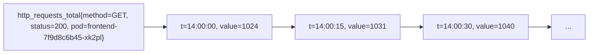
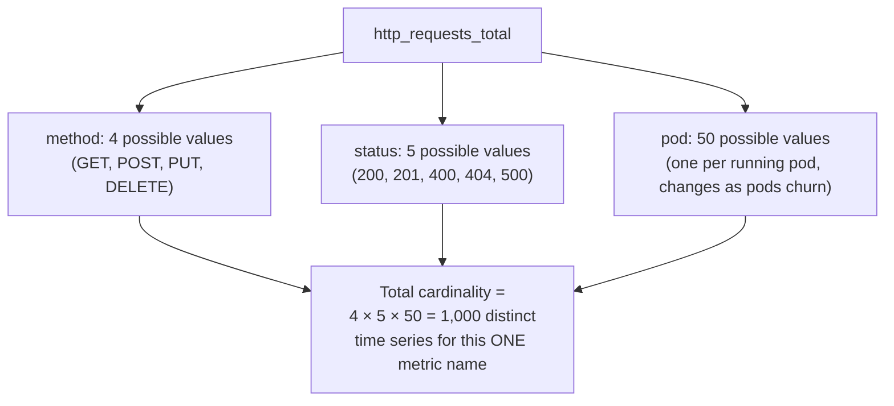
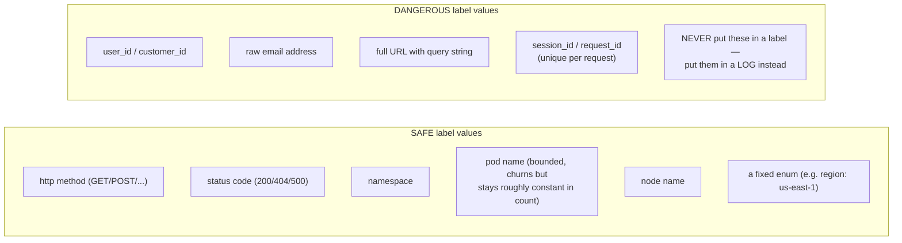
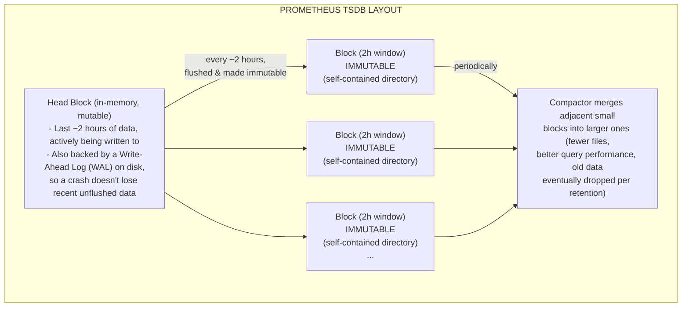
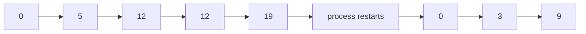
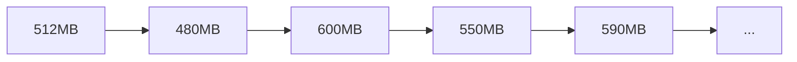
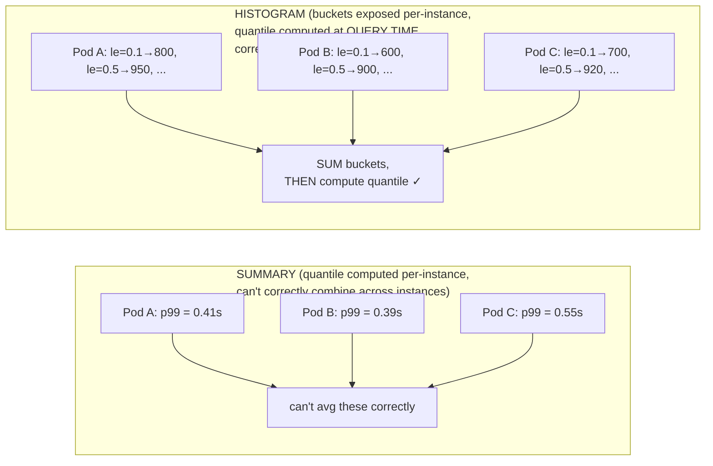
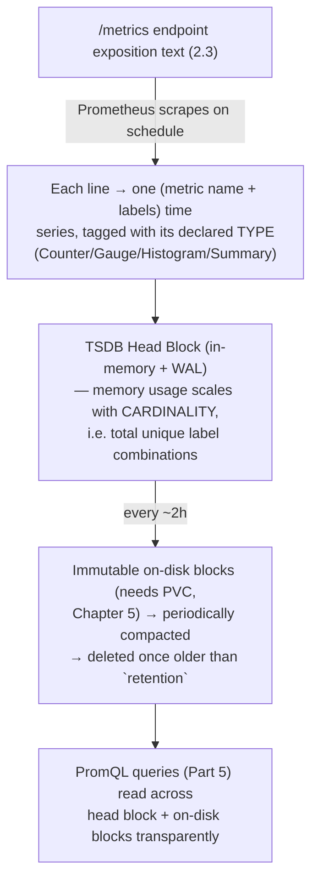

# Chapter 6: Prometheus TSDB, Labels, and Metric Types

> **Part 4 — Understanding Prometheus**

---

## 1. Objective

By the end of this chapter you will be able to:

- Explain what a **time series** is in Prometheus's data model, precisely.
- Explain **labels** and why they turn a single metric name into potentially millions of distinct time series — and what **cardinality** means and why it's the #1 operational risk in running Prometheus at scale.
- Explain how the **TSDB** physically stores data on disk (head block, WAL, immutable blocks, compaction) well enough to reason about performance and retention.
- Correctly identify and use each of the four metric types: **Counter, Gauge, Histogram, Summary** — including which one to reach for and which to avoid, in a given situation.
- Read raw Prometheus exposition-format output and understand exactly what you're looking at.

---

## 2. Concept

### 2.1 The Prometheus data model: everything is a time series

A **time series** in Prometheus is uniquely identified by a **metric name** plus a set of **key-value label pairs**, and consists of a stream of `(timestamp, float64 value)` pairs over time.



**This is the single most important fact to internalize: `http_requests_total` is not one thing — it's a *family* of many distinct time series, one per unique combination of label values.** `http_requests_total{method="GET",status="200"}` and `http_requests_total{method="POST",status="500"}` are two completely separate time series that happen to share a metric name. This is what makes Prometheus's data model "multi-dimensional" — you're not just tracking "requests," you're tracking requests sliced along every label dimension simultaneously, and PromQL (Part 5) is built entirely around selecting, filtering, and aggregating across these label dimensions.

### 2.2 Labels and cardinality — the most important operational concept in this chapter

**Cardinality** = the number of unique time series a metric produces, which is the product of the number of unique values across all of its label dimensions.



Now imagine someone adds a `user_id` label to a metric with 2 million users — cardinality explodes to millions of time series **for a single metric**, each one consuming memory in Prometheus's in-memory head block (2.4) and disk space in the TSDB, regardless of whether anyone ever queries most of them. This is universally known in the Prometheus community as a **cardinality explosion**, and it is, without exaggeration, the single most common cause of Prometheus running out of memory and crashing in real production clusters (a full incident walkthrough is in Part 19).



**The rule of thumb, and it is a hard rule in production systems:** a label's set of possible values should be small and roughly bounded (tens to low thousands), not unbounded and growing with your user base or your request volume. If you need per-request or per-user granularity, that's what **logs** (Loki, Part 15) and **traces** (Tempo, Part 16) are for — this is a direct, concrete callback to Chapter 1's "why you need all three pillars," now with a hard technical reason attached: metrics are architecturally unsuited to unbounded-cardinality data, full stop.

### 2.3 Anatomy of raw Prometheus exposition format

Every `/metrics` endpoint (kubelet, cAdvisor, Node Exporter, your own app) returns plain text in this format — worth reading raw at least once before you rely on Grafana to render it for you:

```
# HELP http_requests_total Total number of HTTP requests
# TYPE http_requests_total counter
http_requests_total{method="GET",status="200",pod="frontend-7f9d8c6b45-xk2pl"} 10432
http_requests_total{method="POST",status="500",pod="frontend-7f9d8c6b45-xk2pl"} 3

# HELP node_memory_MemAvailable_bytes Memory available for starting new applications
# TYPE node_memory_MemAvailable_bytes gauge
node_memory_MemAvailable_bytes 8589934592
```

- `# HELP` — human-readable description (this is what shows up as a tooltip in Grafana's metric picker).
- `# TYPE` — declares the metric type (2.5), which determines which PromQL functions are valid/meaningful to use on it (Part 5).
- Each subsequent line is one time series (metric name + labels) and its current value at scrape time.

You can see this raw output yourself right now against your Chapter 5 install:

```bash
kubectl -n monitoring port-forward svc/kube-prom-stack-prometheus-node-exporter 9100:9100
curl -s localhost:9100/metrics | head -50
```

### 2.4 How the TSDB physically stores data on disk

Prometheus's storage engine is purpose-built, not a general-purpose database — understanding its shape explains both its speed and its limits.



Key implications you'll rely on in later chapters:

- **Recent-data queries are fast** (they hit the in-memory head block); very-wide-time-range queries across many old blocks are comparatively more expensive — one of the reasons Recording Rules (Chapter 7) exist, and why Thanos (Part 17) adds a separate, purpose-built system for efficient long-range historical queries instead of just cranking up Prometheus's own retention indefinitely.
- **The WAL is what makes a Prometheus pod restart safe** — recent, not-yet-block-flushed data is replayed from the WAL on startup rather than lost, but this replay is exactly why a Prometheus pod can take noticeably longer to become `Ready` after a restart on a busy cluster (a real troubleshooting scenario in Part 19).
- **Blocks on disk are why `storageSpec` (Chapter 5) matters** — without a PersistentVolumeClaim backing this directory structure, every one of these blocks disappears on pod restart, exactly as the Chapter 5 real incident described.
- **Cardinality (2.2) directly determines head-block memory usage** — this is the literal mechanism by which a cardinality explosion becomes an OOM crash: each unique time series has ongoing per-series memory overhead in the head block, so millions of extra series from one badly-labeled metric can exhaust available memory regardless of how little disk space the actual sample values would otherwise need.

### 2.5 The four metric types

This is the part of Prometheus's data model most beginners get functionally wrong, because all four types ultimately expose as "just a number" in the raw text format (2.3) — the *type* determines which operations are valid and meaningful, and using the wrong PromQL function on a metric of the wrong type produces silently nonsensical results (Part 5 will drill this repeatedly).

#### Counter

**Only ever goes up** (or resets to 0 on process restart). Used for cumulative counts: total requests served, total errors, total bytes sent.



You almost never read a Counter's raw value directly — you use `rate()` or `increase()` (Part 5) to turn the ever-growing cumulative total into a meaningful **per-second rate**, which is what you actually care about (and which correctly handles the reset-to-0 case automatically). Example: `http_requests_total`, `container_cpu_usage_seconds_total`.

#### Gauge

**Can go up or down freely.** Represents a value that reflects "right now" — current memory usage, current queue depth, current number of running pods, current temperature.



You read a Gauge's value directly, or apply functions like `avg_over_time()`, `max_over_time()`, or `delta()` (Part 5) — never `rate()`, which is only meaningful for a monotonically increasing Counter. Example: `node_memory_MemAvailable_bytes`, `kube_pod_status_phase`.

#### Histogram

Samples observations (like request durations) into **configurable buckets**, and exposes several underlying time series per histogram:

```
http_request_duration_seconds_bucket{le="0.1"}   842   ← count of requests ≤ 0.1s
http_request_duration_seconds_bucket{le="0.5"}   980   ← count of requests ≤ 0.5s
http_request_duration_seconds_bucket{le="1.0"}   999   ← count of requests ≤ 1.0s
http_request_duration_seconds_bucket{le="+Inf"} 1000   ← count of ALL requests
http_request_duration_seconds_sum               312.4  ← sum of all observed durations
http_request_duration_seconds_count             1000   ← total count of observations
```

Note `le` means "less than or equal to" — buckets are **cumulative** (each bucket includes everything in the buckets below it). This specific shape is what lets you compute **any** percentile after the fact, server-side, using `histogram_quantile()` (Part 5) — critically, this calculation can be done across aggregated data from many pods/instances, because you're aggregating raw bucket counts, not pre-computed percentiles (which mathematically cannot be correctly averaged together — a common and serious mistake, expanded on next).

#### Summary

Also tracks observations, but computes **quantiles client-side**, at the instrumented application, and exposes the already-calculated quantile directly:

```
http_request_duration_seconds{quantile="0.5"}   0.043
http_request_duration_seconds{quantile="0.9"}   0.187
http_request_duration_seconds{quantile="0.99"}  0.412
http_request_duration_seconds_sum               312.4
http_request_duration_seconds_count             1000
```

**The critical limitation, and why Histograms are generally preferred:** quantiles calculated client-side by a Summary **cannot be meaningfully aggregated across instances** — you cannot average or combine "p99 = 0.412 on pod A" with "p99 = 0.390 on pod B" to get a correct cluster-wide p99; the math simply doesn't work that way for quantiles. A Histogram avoids this entirely because Prometheus aggregates the raw bucket *counts* (which sum correctly across instances) and only computes the final quantile at query time, across however many instances you've aggregated together. This is precisely why kube-prometheus-stack's own default dashboards, and virtually all modern instrumentation guidance, favor **Histogram** over Summary for anything you intend to aggregate across multiple pods — which, in a horizontally-scaled Kubernetes service, is essentially always.



### 2.6 Summary table

| Type | Direction | Read directly? | Key PromQL functions | Example |
|---|---|---|---|---|
| **Counter** | Only up (resets on restart) | No — always wrap in `rate()`/`increase()` | `rate()`, `increase()` | `http_requests_total` |
| **Gauge** | Up or down freely | Yes | `avg_over_time()`, `max_over_time()`, `delta()` | `node_memory_MemAvailable_bytes` |
| **Histogram** | Cumulative buckets + sum + count | Rarely raw; via `histogram_quantile()` | `histogram_quantile()`, `rate()` on `_bucket`/`_sum`/`_count` | `http_request_duration_seconds_bucket` |
| **Summary** | Pre-computed quantiles + sum + count | Yes, but not safely aggregable | `rate()` on `_sum`/`_count` only | `http_request_duration_seconds{quantile=...}` |

---

## 3. Why This Matters

- Getting cardinality wrong is the single most common way engineers accidentally take down their own monitoring system — this chapter's section 2.2 is not academic, it's the #1 real-world Prometheus outage cause, revisited as a full incident in Part 19 and something you must actively review during code review of any new instrumentation (a concrete best practice below).
- Every PromQL query you write starting in Part 5 depends on correctly knowing a metric's type — applying `rate()` to a Gauge, or trying to average a Summary's quantile across pods, produces output that *looks* like a valid number but is mathematically meaningless. This is one of the most common practical mistakes even experienced engineers make when they're new to Prometheus specifically (as opposed to monitoring generally).
- Understanding the TSDB's block/compaction/WAL structure is what lets you reason correctly about retention sizing, restart behavior, and when you actually need Thanos (Part 17) rather than just increasing `retention` indefinitely — a real capacity-planning decision covered in Part 18.

---

## 4. Architecture



---

## 5. Hands-on Lab

Using the Chapter 5 install:

**1. Read raw exposition format directly:**

```bash
kubectl -n monitoring port-forward svc/kube-prom-stack-kube-prome-prometheus 9090:9090
```

Open `http://localhost:9090/metrics` (Prometheus exposes its own internal metrics too) and find `prometheus_tsdb_head_series` — this Gauge tells you, live, the *current* number of unique time series in the head block, i.e. your cluster's actual current cardinality footprint.

**2. Explore metric types in the Prometheus UI:**

Go to `http://localhost:9090/graph`, type `node_memory_MemAvailable_bytes` into the query box, switch to "Table" view, and inspect the label set on the returned series. Then try `container_cpu_usage_seconds_total` (a Counter) — note the value only ever increases across successive scrapes if you watch it over time.

**3. Find a histogram in your own cluster:**

Query `apiserver_request_duration_seconds_bucket` (exposed by the Kubernetes API server itself, scraped by your Chapter 5 install's default ServiceMonitors). Switch to Table view and observe the multiple `le=` bucket series it expands into.

**4. Check current cardinality per metric (a real operational skill):**

In the Prometheus UI, go to **Status → TSDB Status** — this page shows "Head cardinality stats," including the top metrics by number of series and the top labels by number of unique values. Reviewing this page periodically is a genuine production habit for catching a cardinality problem before it causes an outage.

---

## 6. Verification

- [ ] Explain what makes two lines in `/metrics` output the "same metric" vs. "different time series."
- [ ] Define cardinality and correctly estimate it given a metric's label dimensions and their value counts (as in the section 2.2 worked example).
- [ ] Name at least 3 label values that are dangerous (unbounded cardinality) and 3 that are safe.
- [ ] Explain the difference between the TSDB head block and an immutable block, and why the WAL exists.
- [ ] Given an arbitrary metric name and its `# TYPE` line, correctly say whether you'd wrap it in `rate()`, read it directly, or use `histogram_quantile()`.
- [ ] Explain, precisely, why a Summary's quantiles can't be safely aggregated across instances but a Histogram's can.

---

## 7. Troubleshooting

| Symptom | Root Cause | Fix |
|---|---|---|
| Prometheus pod OOMKilled, or memory usage climbing steadily | Cardinality explosion — check **Status → TSDB Status → head cardinality** for the offending metric/label. | Find and fix the instrumentation adding an unbounded label (e.g. a `user_id` or `request_id` label); consider `metric_relabel_configs` to drop the offending label/series as an immediate mitigation (Part 9). |
| A `rate()` query on a metric returns wildly wrong-looking numbers | The metric is actually a Gauge, not a Counter — `rate()` on a Gauge produces meaningless output because Gauges can decrease, which `rate()` interprets as a counter reset. | Check the metric's `# TYPE` line; use `delta()` or `deriv()` for Gauges instead. |
| Cluster-wide p99 latency dashboard looks suspiciously smooth/wrong compared to per-pod graphs | Someone is averaging a **Summary's** pre-computed per-instance quantiles across pods — mathematically invalid (section 2.5). | Re-instrument using a **Histogram** and compute the aggregate quantile with `histogram_quantile()` over summed buckets instead. |
| Prometheus takes an unusually long time to become `Ready` after a restart | WAL replay on startup, proportional to how much unflushed head-block data existed at crash/restart time. | Expected behavior on a busy cluster; if excessive, investigate scrape interval/cardinality reduction, and confirm resource limits give Prometheus enough CPU to replay quickly. |
| Old data missing beyond a certain date, even though `retention` looks high enough | Disk pressure triggered early block deletion (Prometheus also enforces a `retention.size` disk-usage cap if configured, which can evict blocks before the time-based retention window is reached). | Check `--storage.tsdb.retention.size` alongside `--storage.tsdb.retention.time`; increase PVC size or reduce cardinality/scrape frequency. |

---

## 8. Production Notes

- Real organizations treat cardinality control as an ongoing governance practice, not a one-time fix — some run automated linting on instrumentation code, and mature platforms use Prometheus's `metric_relabel_configs` (Part 9) as a last-line-of-defense safety net to drop known-dangerous high-cardinality label/metric combinations before they ever reach the TSDB.
- The general industry guidance (from the Prometheus maintainers themselves) is to keep any single Prometheus instance under roughly a few million active series, and to actively watch `prometheus_tsdb_head_series` as a capacity-planning signal, not just a curiosity — this becomes a concrete recording rule / alert in Parts 12–13.
- **Histogram bucket boundaries must be chosen deliberately** at instrumentation time — too few/wrongly-placed buckets make `histogram_quantile()` inaccurate (e.g., all your real latencies cluster inside one bucket), while too many buckets directly increases cardinality (each `le` value is itself effectively an extra label dimension). This tradeoff is revisited concretely in Part 10 when Online Boutique's services are instrumented.

---

## 9. Best Practices

1. **Never put unbounded-value fields (user IDs, request IDs, raw URLs, email addresses) in a Prometheus label** — full stop. Use logs/traces for that granularity instead.
2. **Prefer Histogram over Summary** for any duration/size metric you'll ever want to aggregate across more than one instance — which, on Kubernetes, is nearly every metric.
3. **Always check a metric's declared `# TYPE`** before writing a PromQL query against it — don't guess from the metric name alone.
4. **Monitor your own monitoring system's cardinality** (`prometheus_tsdb_head_series`, TSDB Status page) as a routine operational habit, not just when something's already on fire.
5. **Choose histogram bucket boundaries based on your actual expected latency distribution**, not generic defaults, and revisit them if `histogram_quantile()` output looks suspiciously coarse.

---

## 10. Interview Questions

1. **"What uniquely identifies a Prometheus time series?"** — The combination of metric name and its full set of label key-value pairs; two series with the same name but different label values are entirely distinct series.
2. **"What is cardinality, and why is it dangerous?"** — The number of unique time series a metric produces (product of unique values across all its label dimensions); high/unbounded cardinality directly drives Prometheus's memory usage in the TSDB head block and is the most common real-world cause of Prometheus OOM crashes.
3. **"What's the difference between a Counter and a Gauge, and how do you query each correctly?"** — Counter only increases (resets on restart), queried via `rate()`/`increase()`; Gauge moves freely up and down, read directly or via `avg_over_time()`/`delta()`. Using `rate()` on a Gauge is a common, meaningless mistake.
4. **"Why is a Histogram generally preferred over a Summary?"** — A Histogram exposes raw cumulative bucket counts that can be correctly summed across instances before computing a quantile at query time (`histogram_quantile()`); a Summary computes quantiles client-side per instance, and those pre-computed quantiles cannot be mathematically combined across instances.
5. **"Describe how Prometheus's TSDB stores data on disk."** — Recent data lives in an in-memory head block backed by a Write-Ahead Log for crash safety; every ~2 hours the head block is flushed to an immutable on-disk block; a background compactor merges blocks over time; blocks older than the configured retention are eventually deleted.
6. **"How would you detect a cardinality problem before it causes an outage?"** — Regularly check `prometheus_tsdb_head_series` and the Status → TSDB Status page's top-metrics/top-labels-by-cardinality breakdown; alert on head series count trending sharply upward.

---

## 11. Real Incident

**Company type:** E-commerce platform, ~200 microservices on Kubernetes.

**What happened:** A developer added instrumentation to a new checkout-related service, including a metric intended to help debug a specific customer's issue: `checkout_attempt_total{customer_id="...", status="..."}`. It passed code review (nobody caught the label choice) and shipped to production. Within 6 hours, Prometheus's memory usage climbed from a stable ~4GB to over 30GB, and the pod was OOMKilled repeatedly, taking down cluster-wide monitoring — including the alerting that would normally have caught this kind of problem, a nasty compounding failure.

**Investigation:** Once a fresh Prometheus pod stayed alive long enough to be queried, `Status → TSDB Status` immediately showed `checkout_attempt_total` as the single largest contributor to head cardinality, by a huge margin — millions of series, one per distinct customer who'd attempted checkout that day.

**Root cause:** An unbounded-cardinality label (`customer_id`) on a Counter metric, exactly the anti-pattern in section 2.2 — a well-intentioned debugging aid that happened to violate the fundamental architectural constraint of Prometheus's data model.

**Resolution:** Removed the offending label from the metric definition (customer-specific debugging moved to structured logs instead, correctly using the "logs for high-cardinality detail" principle from Chapter 1); added a `metric_relabel_configs` rule (Part 9) as a defense-in-depth safety net to drop any future series matching a `customer_id`-shaped label pattern before ingestion; increased Prometheus's memory limit with headroom while the root cause was being found.

**Prevention:** The team added an automated cardinality-linting check to CI for any new metrics touching customer-facing services, and added a dashboard + alert on `prometheus_tsdb_head_series` trending upward — turning this chapter's "best practice" into an actual enforced gate, not just a guideline.

---

## 12. Summary

- A Prometheus time series is uniquely identified by metric name + full label set; one metric name can represent millions of distinct series.
- **Cardinality** (unique label-value combinations) directly drives memory usage and is the #1 real-world cause of Prometheus instability — never put unbounded fields (user/request IDs, raw URLs) in a label.
- The **TSDB** stores recent data in an in-memory, WAL-backed head block, flushing to immutable on-disk blocks roughly every 2 hours, compacted and eventually deleted per retention — which is why persistent storage (Chapter 5) and cardinality discipline both directly determine operational stability.
- The four metric types — **Counter** (rate/increase only), **Gauge** (read directly), **Histogram** (aggregable quantiles via `histogram_quantile()`), **Summary** (non-aggregable pre-computed quantiles) — each require different PromQL treatment, and picking the wrong one for aggregation across pods produces confidently wrong numbers.

---

## 13. Next Chapter

**Chapter 7: Recording Rules and Alert Rules** builds directly on this chapter's metric types and TSDB mechanics — you'll learn how to pre-compute expensive, frequently-used queries (like the SLI ratios from Chapter 3) into cheap new time series via Recording Rules, and how Alert Rules continuously evaluate PromQL expressions to detect the conditions that eventually reach Alertmanager (Part 12).
