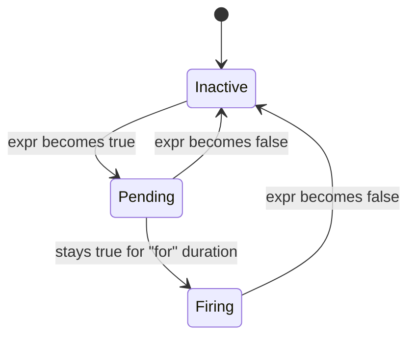
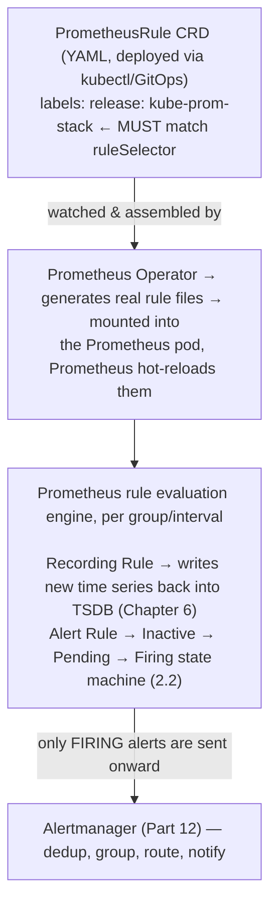

# Chapter 7: Recording Rules and Alert Rules

> **Part 4 — Understanding Prometheus**

---

## 1. Objective

By the end of this chapter you will be able to:

- Explain what a Recording Rule is, why it exists, and write one correctly.
- Explain what an Alert Rule is, how Prometheus evaluates it over time (`for` duration, pending vs. firing state), and write one correctly.
- Deploy both via the `PrometheusRule` CRD (introduced in Chapter 4) and understand exactly how the Operator turns it into real Prometheus rule config.
- Understand the relationship between this chapter and Chapter 3's SLO/error-budget content — you're about to build the actual mechanism that SLO tracking depends on.

This chapter teaches the mechanics precisely; Part 12 (Alertmanager) and Part 13 (Recording Rules in depth) return to these same concepts with full production patterns, naming conventions, and dozens of real examples. Consider this chapter the "how it works" and Parts 12–13 the "how to use it well at scale."

---

## 2. Concept

### 2.1 Recording Rules: pre-computing expensive queries

A **Recording Rule** takes a PromQL expression, evaluates it on a schedule, and saves the result as a **new time series** — permanently, in the TSDB, just like any scraped metric.

**Why this exists:** some PromQL queries are expensive to compute — aggregating across thousands of series, or nesting several layers of functions — and if that same expensive query is what powers a frequently-viewed Grafana dashboard panel (recalculated every time someone loads the page) or is evaluated repeatedly by an Alert Rule (every scrape interval, forever), you're paying that computational cost over and over for no reason, since the underlying raw data for a given time range never changes once it's written.

```
 WITHOUT a Recording Rule:
   Every dashboard load, every alert evaluation → re-run the full,
   expensive aggregation query from raw data, every single time.

 WITH a Recording Rule:
   Prometheus evaluates the expensive query ONCE per rule interval
   (e.g. every 30s) and stores the result as a new, cheap time series.
   Every dashboard load / alert evaluation after that just reads the
   pre-computed value — as fast as reading any other metric.
```

A Recording Rule looks like this:

```yaml
groups:
  - name: checkout-availability
    interval: 30s
    rules:
      - record: job:http_requests_availability:ratio_rate5m
        expr: |
          sum(rate(http_requests_total{job="checkoutservice",status!~"5.."}[5m]))
          /
          sum(rate(http_requests_total{job="checkoutservice"}[5m]))
```

Notice this is *exactly* the availability SLI you designed by hand in Chapter 3's lab — this is not a coincidence. **Recording Rules are the actual production mechanism that turns a Chapter 3 SLI definition into a real, queryable, cheap time series** — this is precisely why Chapter 3 came before this chapter, and why Part 13 revisits this exact pattern at length once you also know Alertmanager (Part 12).

**Naming convention** — note `job:http_requests_availability:ratio_rate5m`. This isn't arbitrary; it follows the community-standard convention `level:metric:operations`, where `level` is the aggregation level (`job`, `instance`, `cluster`), `metric` describes what it measures, and `operations` documents what was applied (`rate5m`, `ratio`, `sum`). Following this convention is a genuine production best practice — Part 13 covers it in full — because it lets anyone reading a metric name in Grafana immediately understand what aggregation already happened to it, without having to go find the rule definition.

### 2.2 Alert Rules: continuously evaluating conditions

An **Alert Rule** is also a PromQL expression, evaluated on a schedule — but instead of saving the result as a new time series, Prometheus checks whether the expression returns **any results at all** (any results = the condition is true for those specific label combinations), and if so, moves that alert into a state machine.

```yaml
groups:
  - name: checkout-alerts
    rules:
      - alert: CheckoutHighErrorRate
        expr: |
          job:http_requests_availability:ratio_rate5m{job="checkoutservice"} < 0.99
        for: 5m
        labels:
          severity: critical
        annotations:
          summary: "Checkout error rate is above 1% for {{ $labels.job }}"
          description: "Availability ratio is {{ $value | humanizePercentage }}, below the 99% SLO target."
```

Notice this Alert Rule's `expr` directly references the Recording Rule from 2.1 by name — this is an extremely common and deliberate pattern: Recording Rules compute the SLI, Alert Rules compare the SLI against the SLO target from Chapter 3. This is the literal mechanical implementation of Chapter 3's entire concept.

**The alert state machine — this is the part beginners get wrong:**



- **Inactive:** the expression currently returns no results for this label set — nothing wrong.
- **Pending:** the expression just started returning results (condition is true), but hasn't been true continuously for the full `for` duration yet. **No notification is sent yet.**
- **Firing:** the condition has now been continuously true for at least `for`. **Only now** does Prometheus hand this alert off to Alertmanager (Part 12) for routing/notification.

**Why `for` exists, and why it matters enormously:** without it, a single brief blip (one bad scrape, a momentary network hiccup) would immediately page someone, generating constant false-positive noise that trains your on-call team to ignore pages — the single most damaging failure mode an alerting system can have (a real incident on exactly this theme is in section 11). `for: 5m` means the condition must be *continuously* true for 5 minutes before anyone is notified, filtering out transient noise while still catching real, sustained problems in a reasonable timeframe. Choosing the right `for` duration is a genuine engineering tradeoff — too short reintroduces noise, too long delays real detection — and Part 12 covers this tradeoff (and the more sophisticated multi-window burn-rate pattern from Chapter 3) in full depth.

### 2.3 Deploying rules via the PrometheusRule CRD

Recall from Chapter 4: you don't hand-edit Prometheus's rule files directly. You declare rules as a `PrometheusRule` Kubernetes object, and the Operator assembles every matching `PrometheusRule` in the cluster into the actual rule configuration Prometheus loads.

```yaml
apiVersion: monitoring.coreos.com/v1
kind: PrometheusRule
metadata:
  name: checkout-slo-rules
  namespace: monitoring
  labels:
    release: kube-prom-stack   # must match the Prometheus CRD's ruleSelector
spec:
  groups:
    - name: checkout-availability
      interval: 30s
      rules:
        - record: job:http_requests_availability:ratio_rate5m
          expr: |
            sum(rate(http_requests_total{job="checkoutservice",status!~"5.."}[5m]))
            /
            sum(rate(http_requests_total{job="checkoutservice"}[5m]))
    - name: checkout-alerts
      rules:
        - alert: CheckoutHighErrorRate
          expr: job:http_requests_availability:ratio_rate5m{job="checkoutservice"} < 0.99
          for: 5m
          labels:
            severity: critical
          annotations:
            summary: "Checkout error rate is above 1% for {{ $labels.job }}"
```

**The `labels.release: kube-prom-stack` field is not decorative** — exactly like the `serviceMonitorSelectorNilUsesHelmValues` setting from Chapter 5, the `Prometheus` CRD has a `ruleSelector` that determines which `PrometheusRule` objects it will actually pick up. If this label doesn't match what your `Prometheus` CRD instance expects, your rule will silently be ignored — no error, it just never loads — one of the most common real-world "why isn't my alert firing" root causes (see Troubleshooting).

### 2.4 What "group" and "interval" actually control

Rules are organized into **groups**, and rules *within the same group* are evaluated **sequentially, at the same interval** — this matters because a later rule in the same group *can* reference the result of an earlier rule in that same evaluation cycle (this is exactly why the Alert Rule in 2.2 could reference the Recording Rule from 2.1 and get a fresh value, not a stale one from the previous cycle). Different groups evaluate independently and can have different intervals, which is a useful lever: cheap, frequently-needed rules can run every 15–30s, while expensive, rarely-needed ones can run every few minutes to reduce load.

---

## 3. Why This Matters

- This chapter is the literal mechanical bridge between Chapter 3's SLO theory and a real, running alert that pages someone — everything from here through Part 13 builds on understanding that Recording Rules and Alert Rules are just PromQL expressions evaluated on a schedule, deployed as YAML via a CRD.
- The Pending → Firing state machine, and specifically the `for` duration, is one of the most consequential design decisions in the entire alerting pipeline — get it wrong and you either miss real incidents (too long) or drown your on-call team in false pages until they start ignoring everything (too short), a failure mode covered as a real incident below and revisited in Part 12.
- The `PrometheusRule` label-selector gotcha (2.3) is, in practice, one of the most frequent real-world "my alert never fires" support questions — understanding it now saves you hours of confusion later.

---

## 4. Architecture



---

## 5. Hands-on Lab

Using the Chapter 5 install:

**1. Deploy a real Recording Rule + Alert Rule** as a `PrometheusRule`, targeting a metric that already exists in your cluster from the default kube-prometheus-stack install (no app instrumentation needed yet — that's Part 10):

```yaml
# node-cpu-slo-rules.yaml
apiVersion: monitoring.coreos.com/v1
kind: PrometheusRule
metadata:
  name: node-cpu-demo-rules
  namespace: monitoring
  labels:
    release: kube-prom-stack
spec:
  groups:
    - name: node-cpu-demo
      interval: 30s
      rules:
        - record: instance:node_cpu_utilisation:rate5m
          expr: |
            1 - avg by (instance) (rate(node_cpu_seconds_total{mode="idle"}[5m]))
        - alert: NodeCPUHighDemo
          expr: instance:node_cpu_utilisation:rate5m > 0.10
          for: 2m
          labels:
            severity: warning
          annotations:
            summary: "Node {{ $labels.instance }} CPU utilisation above 10% (demo threshold)"
```

*(A deliberately low 10% threshold so you can actually observe it firing on an idle lab cluster — real thresholds are covered in Part 12.)*

```bash
kubectl apply -f node-cpu-slo-rules.yaml
```

**2. Verify the Operator picked it up:**

```bash
kubectl -n monitoring port-forward svc/kube-prom-stack-kube-prome-prometheus 9090:9090
```

Open `http://localhost:9090/rules` — you should see your `node-cpu-demo` group with both the recording rule and alert rule listed.

**3. Watch the Recording Rule produce data:** query `instance:node_cpu_utilisation:rate5m` in the Prometheus graph UI — this new metric now exists exactly like any scraped one.

**4. Watch the Alert Rule transition states:** go to `http://localhost:9090/alerts` and watch `NodeCPUHighDemo` move from nothing → `Pending` (yellow) → `Firing` (red) over the `for: 2m` window, assuming your node's CPU utilization clears 10% (likely, on most lab clusters with the monitoring stack itself running).

**5. Clean up the demo rule** once you've observed the full lifecycle (you'll build real, well-tuned rules in Parts 12–13):

```bash
kubectl delete -f node-cpu-slo-rules.yaml
```

---

## 6. Verification

- [ ] Explain what a Recording Rule does and why it's more efficient than re-running the same expensive query on every dashboard load.
- [ ] Explain the three-state alert lifecycle (Inactive/Pending/Firing) and precisely what triggers each transition.
- [ ] Explain what `for` does and why removing it (or setting it to `0s`) is usually a mistake.
- [ ] Explain why the `labels.release` (or equivalent selector label) on a `PrometheusRule` matters, and what happens if it's wrong (silently ignored, no error).
- [ ] Explain why rules in the same group can reference each other's fresh output, but rules in different groups can't rely on synchronized evaluation timing.

---

## 7. Troubleshooting

| Symptom | Root Cause | Fix |
|---|---|---|
| Applied a `PrometheusRule` but it never shows up on the `/rules` page | Label selector mismatch — the `Prometheus` CRD's `ruleSelector` doesn't match this object's labels (section 2.3). | `kubectl get prometheus -n monitoring -o yaml \| grep -A5 ruleSelector` to see what's required; match your `PrometheusRule`'s labels to it. |
| Alert never transitions to Firing even though you can see the condition is clearly true in the graph | `for` duration hasn't elapsed yet, or the underlying Recording Rule it depends on hasn't evaluated yet (check its own `/rules` page state and last-evaluation time). | Wait out the `for` duration; verify the Recording Rule is producing fresh data first if the alert depends on one. |
| `PrometheusRule` applies successfully but Prometheus logs show a parse/evaluation error | Invalid PromQL syntax, or referencing a metric/label that doesn't exist (typo). | `kubectl logs -n monitoring prometheus-kube-prom-stack-kube-prome-prometheus-0 -c prometheus` and check for rule-loading errors; validate the expression directly in the Prometheus graph UI first before wrapping it in a rule. |
| Alert fires constantly, flapping between Pending and Firing every few minutes | `for` duration too short relative to natural noise in the underlying signal. | Lengthen `for`, or better, use the metric's own smoothing (e.g., a longer `rate()` window) — revisited in depth with burn-rate alerting in Part 12. |
| A Recording Rule's output metric appears in Grafana but seems delayed/stale compared to raw data | Rule group `interval` is longer than the dashboard's refresh expectation. | Shorten the group's `interval` if genuinely needed, weighing the added evaluation cost (section 2.4). |

---

## 8. Production Notes

- Real production `PrometheusRule` objects are almost always managed via GitOps (a Git repo, applied via ArgoCD/Flux, or a CI pipeline running `kubectl apply`) rather than manual `kubectl apply` — this gives you code review, change history, and rollback for something that directly controls who gets paged, which is exactly the kind of change that deserves that rigor.
- The community-maintained kube-prometheus-stack chart ships dozens of pre-built `PrometheusRule` objects for core Kubernetes health (e.g., `KubePodCrashLooping`, `KubeNodeNotReady`) — inspect these (`kubectl get prometheusrules -n monitoring`) as real-world examples of well-tuned `for` durations and severity labeling conventions before writing your own from scratch.
- Rule **evaluation errors** (bad PromQL, missing metrics) fail silently from the cluster's perspective (no pod crash) but show up in Prometheus's own logs and on the `/rules` UI page with a red error indicator — this page should be part of your routine health-check habit, not just something you check when actively debugging.

---

## 9. Best Practices

1. **Follow the `level:metric:operations` naming convention** for Recording Rules (Part 13 goes deep on this) — it makes every derived metric self-documenting.
2. **Always set a deliberate `for` duration on Alert Rules** — never `0s`/omitted, except for genuinely instantaneous conditions where any delay is unacceptable (rare, and still usually better served by a very short `for` like `1m` rather than none).
3. **Group related Recording Rules and Alert Rules together**, and let alert rules reference recording rules by name rather than duplicating complex expressions — one source of truth for the underlying calculation.
4. **Manage `PrometheusRule` objects via GitOps/CI**, not ad hoc `kubectl apply`, given they directly control paging.
5. **Check the `/rules` UI page's error state routinely**, not only when actively debugging — silent rule-evaluation failures are easy to miss otherwise.

---

## 10. Interview Questions

1. **"What is a Recording Rule and why would you use one?"** — A scheduled PromQL evaluation whose result is saved as a new time series, used to pre-compute expensive or frequently-reused queries so dashboards and alerts read a cheap, pre-aggregated value instead of recomputing it from raw data every time.
2. **"Walk me through the alert state machine."** — Inactive (condition false) → Pending (condition just became true, notification not yet sent) → Firing (condition has been continuously true for the full `for` duration, now sent to Alertmanager); either Pending or Firing return immediately to Inactive if the condition becomes false.
3. **"Why does the `for` field exist, and what happens if you set it too short or omit it?"** — It filters out brief, non-sustained blips from triggering a page; setting it too short (or to zero) reintroduces alert noise from transient conditions, training on-call engineers to distrust/ignore alerts over time.
4. **"You deployed a PrometheusRule and it's not showing up in Prometheus. What's the most likely cause?"** — A label selector mismatch between the `PrometheusRule`'s labels and the `Prometheus` CRD's `ruleSelector` — this fails silently, with no error surfaced anywhere obvious, which is exactly why it's the most common root cause to check first.
5. **"Can an alert rule reference a recording rule's output in the same evaluation cycle? Why does that matter?"** — Yes, if they're in the same rule group, since rules within a group evaluate sequentially at the same interval; this lets alert thresholds be checked against a fresh, just-computed SLI value rather than a stale one from a previous unrelated cycle.

---

## 11. Real Incident

**Company type:** Online media streaming platform.

**What happened:** A new on-call engineer, frustrated that a real incident the previous week hadn't paged anyone fast enough, unilaterally changed a critical alert's `for` duration from `5m` down to `30s` "to catch things faster," without discussing it with the team or considering why `5m` had been chosen originally. Within the next 48 hours, the same alert fired and resolved over a dozen times due to entirely normal, brief traffic blips that had always self-corrected within a minute or two — each one paging the on-call rotation at all hours.

**What went wrong:** The team's on-call engineers, after the third 3 a.m. page in one night for a condition that resolved itself before they'd even opened their laptop, began treating pages from this alert as probably-noise and started responding more slowly and less carefully — exactly the "alert fatigue" failure mode section 2.2 warns about. A few days later, a *genuine* sustained incident triggered the same alert, and the on-call engineer, primed by a week of false positives, took over 20 minutes to start investigating instead of the usual near-immediate response.

**Root cause:** An unreviewed change to a critical alert's `for` duration, made without understanding (or asking about) why the original value existed, and without any process requiring review for changes to paging-critical rules.

**Resolution:** Reverted `for` to `5m`; the team retroactively documented, in the `PrometheusRule` itself as a comment and in their runbook, *why* that specific duration was chosen (based on historical analysis of how long real incidents vs. transient blips typically lasted for this specific signal).

**Prevention:** The team instituted a rule (formalized in their GitOps review process, per this chapter's Production Notes) that any change to an existing alert's `for` duration or threshold requires review from at least one other engineer, specifically because — as this incident showed — a well-intentioned individual change to alerting sensitivity has real, immediate operational consequences for the whole on-call rotation, not just the person making the change.

---

## 12. Summary

- A **Recording Rule** pre-computes a PromQL expression on a schedule and stores the result as a new, cheap-to-query time series — the actual mechanism behind Chapter 3's SLI definitions.
- An **Alert Rule** evaluates a PromQL expression on a schedule and moves through an Inactive → Pending → Firing state machine, only notifying Alertmanager once the condition has been continuously true for the configured `for` duration — a deliberate noise filter, not a delay for its own sake.
- Both are deployed via the `PrometheusRule` CRD, and both are silently ignored if their labels don't match the `Prometheus` CRD's selector — the most common real-world "why isn't this working" root cause for this chapter's content.
- Rules within the same group evaluate sequentially at the same interval, which is what lets alert rules safely reference recording rules' freshly-computed values.

---

## 13. Next Chapter

This closes out **Part 4: Understanding Prometheus.** You now understand the complete internal mechanics of the engine at the center of this entire handbook: its data model, storage engine, metric types, and rule evaluation system.

**Part 5, Chapter 8: PromQL Fundamentals** starts the PromQL Masterclass — the query language you've been using in small doses throughout this chapter and Chapter 6 now gets a full, systematic treatment: selectors, operators, the full function library, aggregation, and the vector-matching rules that make multi-metric queries work correctly.
