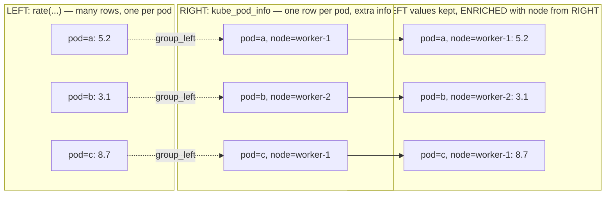
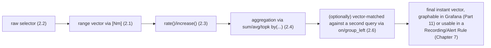

# Chapter 8: PromQL Fundamentals

> **Part 5 — PromQL Masterclass**

---

## 1. Objective

By the end of this chapter you will be able to:

- Read and write all four PromQL data types: instant vectors, range vectors, scalars, and strings.
- Select and filter time series precisely using label matchers (`=`, `!=`, `=~`, `!~`).
- Correctly use `rate()`, `irate()`, and `increase()` on Counters, and explain why they're not interchangeable.
- Use the core aggregation operators (`sum`, `avg`, `max`, `min`, `count`, `topk`, `bottomk`) with `by` and `without`.
- Compute percentiles correctly from Histograms using `histogram_quantile()`.
- Understand **vector matching** (`on`, `ignoring`, `group_left`, `group_right`) — the part of PromQL that trips up almost everyone at first, including experienced engineers new to Prometheus specifically.

This chapter is deliberately hands-on-heavy — PromQL is a skill you build by running queries against real data, not by reading about it. Every example below is runnable against your Chapter 5 install right now.

---

## 2. Concept

### 2.1 The four PromQL data types

| Type | What it is | Example |
|---|---|---|
| **Instant vector** | A set of time series, each with a single value, at one point in time | `node_memory_MemAvailable_bytes` |
| **Range vector** | A set of time series, each with a *range* of values over a time window | `node_memory_MemAvailable_bytes[5m]` |
| **Scalar** | A single, unitless numeric value | `42` or the output of `scalar(...)` |
| **String** | A literal string (rarely used directly in queries) | `"idle"` |

**The single most important rule to internalize:** a range vector (with `[5m]` etc.) **cannot be graphed directly** — it's raw material that must be passed into a function like `rate()` or `avg_over_time()`, which reduces it back down to an instant vector (one value per series) that Grafana can actually plot. If you've ever seen "expression produces a range vector, which is unsupported" in the Prometheus UI, this is exactly why — it's not a bug, it's PromQL correctly refusing to draw something that isn't a valid graphable output.

### 2.2 Selecting and filtering: label matchers

```promql
http_requests_total{job="checkoutservice"}                    # exact match
http_requests_total{job!="checkoutservice"}                   # not equal
http_requests_total{job=~"checkout.*"}                        # regex match
http_requests_total{job!~"checkout.*"}                        # regex non-match
http_requests_total{job="checkoutservice", status="500"}      # AND (comma = AND, always)
```

There is no OR between different label *keys* in a single matcher list — `{job="a", job="b"}` is not valid (a series can't have two different values for the same label key). To match *either* of two values for the *same* key, use regex: `{job=~"a|b"}`.

### 2.3 Counters: rate(), irate(), and increase()

Recall from Chapter 6: Counters only go up (or reset to 0 on restart), and you almost never read them raw.

```promql
rate(http_requests_total[5m])
```

`rate()` computes the **per-second average rate of increase**, over the given range window, automatically and correctly handling counter resets (if the counter drops, Prometheus assumes a process restart and adjusts, rather than producing a nonsensical negative rate). This is the workhorse function you'll use constantly — for RED "Rate" and "Errors" (Chapter 2), for CPU usage (which is itself exposed as a cumulative Counter — see Part 6), for everything Counter-shaped.

```promql
increase(http_requests_total[5m])
```

`increase()` is `rate()` × the number of seconds in the window — it answers "how many total requests happened in this window" rather than "what's the per-second rate." Also handles counter resets correctly. Use `increase()` when you want a raw count over a window (e.g., "how many errors in the last hour" for a report), and `rate()` when you want a normalized per-second value (e.g., for a Rate/Errors dashboard panel or an alert threshold that should behave consistently regardless of window size).

```promql
irate(http_requests_total[5m])
```

`irate()` ("instant rate") uses only the **last two data points** in the range window, rather than averaging across the whole window. This makes it more responsive to very recent, sharp spikes — but also much noisier and unsuitable for alerting (a single bad scrape can swing it wildly) or for long-range dashboards (aliasing artifacts appear when the graphed time range is much wider than the underlying scrape interval). **Production guidance, consistently:** use `rate()` for dashboards and alerts; reserve `irate()` for narrow, high-resolution, real-time debugging graphs only. This distinction is a very common interview question and an even more common thing engineers get backwards in real dashboards.

```
   rate() over [5m]:  smooths across the whole 5m window — stable,
                       good for alerting and general dashboards

   irate() over [5m]: uses ONLY the last 2 samples inside that window —
                       spiky, reactive, good only for short-range live
                       debugging, never for alerting thresholds
```

### 2.4 Aggregation operators

```promql
sum(rate(http_requests_total[5m]))                          # total request rate, all labels collapsed
sum by (job) (rate(http_requests_total[5m]))                 # total rate, grouped BY job (job label kept)
sum without (instance) (rate(http_requests_total[5m]))       # total rate, everything EXCEPT instance kept
avg(node_memory_MemAvailable_bytes)
max by (namespace) (container_memory_working_set_bytes)
min by (node) (node_filesystem_avail_bytes)
count(up == 1)                                                # how many targets are currently up
topk(5, rate(http_requests_total[5m]))                        # top 5 series by value
bottomk(3, node_filesystem_avail_bytes)                       # bottom 3 series by value
```

`by (...)` keeps only the listed labels in the output, collapsing everything else. `without (...)` does the opposite — keeps everything *except* the listed labels. Both are common; `by` is more explicit and generally preferred in production dashboards/rules because it's self-documenting about exactly which dimension you're slicing by (a Part 13 best practice).

### 2.5 histogram_quantile() — computing percentiles correctly

Recall from Chapter 6 that a Histogram exposes cumulative `_bucket{le="..."}` series. `histogram_quantile()` interpolates across these buckets to estimate any percentile:

```promql
histogram_quantile(0.99,
  sum by (le) (rate(http_request_duration_seconds_bucket{job="checkoutservice"}[5m]))
)
```

Walk through this carefully, because the structure is always the same and is one of the most-tested practical PromQL patterns in real interviews and real dashboards:

1. `rate(..._bucket[5m])` — convert each cumulative bucket Counter into a per-second rate (still per-instance, per-bucket).
2. `sum by (le) (...)` — sum across all instances/pods, **while explicitly keeping the `le` label** — this is the step beginners most often get wrong, either forgetting `by (le)` entirely (which collapses buckets together into garbage) or aggregating away `le` accidentally.
3. `histogram_quantile(0.99, ...)` — interpolate the 99th percentile from the aggregated bucket rates.

This exact three-step shape — `histogram_quantile(quantile, sum by (le) (rate(..._bucket[window])))` — is the canonical, correct way to compute any percentile in Prometheus, and you'll use it constantly from here through the rest of the handbook.

### 2.6 Vector matching — where most real confusion happens

When a PromQL expression combines **two different instant vectors** with an arithmetic or comparison operator, Prometheus needs to decide *which series on the left match which series on the right*. By default, it matches series that have **identical label sets** — which fails immediately the moment the two vectors have even one differing label.

```promql
# This FAILS if the two sides have different label sets
# (e.g., one has a "version" label the other doesn't)
node_memory_MemTotal_bytes - node_memory_MemAvailable_bytes
```

Actually the above usually works because both come from Node Exporter with identical labels — here's a case that genuinely needs help:

```promql
# kube_pod_info has many labels; a custom app metric might have fewer.
# "on(pod)" tells Prometheus: only match using the `pod` label,
# ignore every other label difference between the two sides.
sum by (pod) (rate(http_requests_total[5m]))
* on(pod) group_left(node)
kube_pod_info
```

- **`on(labels...)`** — restrict matching to only the listed labels (ignore all others when deciding what matches what).
- **`ignoring(labels...)`** — the inverse: match on all labels *except* the ones listed.
- **`group_left(labels...)` / `group_right(labels...)`** — used specifically for **many-to-one** or **one-to-many** matches (e.g., many pods on the left, one row per pod with extra info like `node` on the right from `kube_pod_info`). `group_left` means "the left side has multiple matches per right-side series"; it also lets you **pull additional labels** from the "one" side onto the output (here, adding `node` onto each pod's rate series) — an extremely common and useful pattern for enriching a raw metric with human-readable or joinable context from `kube_state_metrics` (Part 8).



Getting `on`/`ignoring`/`group_left`/`group_right` right is, in practice, the single biggest jump in PromQL fluency — nearly every "combine two different metrics into one meaningful query" real-world dashboard need runs through this exact mechanism, and Part 9's `kube_pod_info`-style label-enrichment joins (used constantly once kube-state-metrics is covered in Part 8) depend directly on it.

### 2.7 Operators reference

| Category | Operators |
|---|---|
| Arithmetic | `+  -  *  /  %  ^` |
| Comparison (filter by default!) | `==  !=  >  <  >=  <=` |
| Logical/set | `and  or  unless` |
| Aggregation | `sum avg min max count count_values stddev stdvar topk bottomk quantile` |

**Important gotcha:** comparison operators (`>`, `<`, etc.) applied to an instant vector **filter** the vector by default (keep only series matching the condition), they don't return booleans, unlike most programming languages. `up == 0` returns only the series where `up` is currently `0` — this is exactly the pattern Chapter 7's Alert Rules rely on (an Alert Rule fires for exactly the label combinations its `expr` returns).

---

## 3. Why This Matters

- PromQL is the language every dashboard panel (Part 11), every Recording Rule and Alert Rule (Chapter 7, Parts 12–13), and every SLI (Chapter 3) is ultimately written in — fluency here is the single highest-leverage skill in this entire handbook, more than any specific exporter or tool.
- The `rate()` vs `irate()` distinction and the `histogram_quantile()` pattern from this chapter are both extremely commonly gotten wrong in real production dashboards — you now know the correct pattern before you've built a single dashboard, rather than learning it the hard way from a misleading graph.
- Vector matching (2.6) is the concept most engineers describe as "the moment PromQL clicked" once they understand it — and the moment it *doesn't* click is the source of a huge fraction of "why does this query return no data" confusion, covered again in Troubleshooting.

---

## 4. Architecture

Not applicable in the usual sense — this chapter's "architecture" is the query pipeline itself:



---

## 5. Hands-on Lab

Port-forward Prometheus and work through these directly in the graph UI (`http://localhost:9090/graph`):

```bash
kubectl -n monitoring port-forward svc/kube-prom-stack-kube-prome-prometheus 9090:9090
```

1. **Instant vs range vector:** run `up` (instant vector, graphs fine) then try `up[5m]` (range vector — switch to "Table" view to see it as a set of raw samples per series, and note the Graph tab won't render it).
2. **Rate on a real counter:** `rate(node_cpu_seconds_total{mode="idle"}[5m])` then invert it into utilization: `1 - avg by (instance)(rate(node_cpu_seconds_total{mode="idle"}[5m]))`.
3. **Aggregation:** compare `sum(rate(container_cpu_usage_seconds_total[5m]))` (single number, everything collapsed) against `sum by (namespace) (rate(container_cpu_usage_seconds_total[5m]))` (one series per namespace) — note how the result shape changes.
4. **topk in practice:** `topk(5, sum by (namespace) (container_memory_working_set_bytes))` — find your cluster's 5 most memory-hungry namespaces right now.
5. **histogram_quantile on real data:** `histogram_quantile(0.99, sum by (le) (rate(apiserver_request_duration_seconds_bucket[5m])))` — the Kubernetes API server's own real p99 latency, computed the correct way.
6. **Vector matching:** `kube_pod_info` alone (many labels including `node`), then try enriching a rate query with it: `sum by (pod) (rate(container_cpu_usage_seconds_total{namespace="monitoring"}[5m])) * on(pod) group_left(node) kube_pod_info` — observe the `node` label now attached to the output.

---

## 6. Verification

- [ ] Explain why a range vector like `foo[5m]` can't be graphed directly and must be passed through a function first.
- [ ] Correctly choose between `rate()` and `irate()` for a dashboard panel vs. a short-range live-debugging graph, and explain why.
- [ ] Write a `sum by (...)` aggregation from memory for a given scenario.
- [ ] Write the full three-step `histogram_quantile(quantile, sum by (le) (rate(...)))` pattern from memory.
- [ ] Explain what `group_left` does and when you need it (many-to-one label enrichment).
- [ ] Explain why `up == 0` returns a filtered vector, not a boolean.

---

## 7. Troubleshooting

| Symptom | Root Cause | Fix |
|---|---|---|
| "expression produces a range vector, which is unsupported" in the Graph tab | Forgot to wrap a `[Nm]` range vector selector in a reducing function like `rate()`/`avg_over_time()`. | Wrap it: `rate(metric[5m])` instead of `metric[5m]` alone. |
| `rate()` graph looks unexpectedly flat/smoothed compared to what you expected | This is expected behavior — `rate()` averages across the whole window; a very short spike within a long window gets diluted. | Use a shorter range window if you need more responsiveness for dashboards, or `irate()` only for narrow live-debug views (never alerts). |
| Combining two metrics returns **no data at all** | Vector matching failed silently — the two sides don't share an identical (or `on(...)`-specified) label set, so nothing matched. | Add explicit `on(...)` / `ignoring(...)` naming exactly the shared label(s); check each side's actual labels independently first via Table view. |
| `histogram_quantile()` returns `NaN` or an obviously wrong number | Forgot `by (le)` in the inner `sum`, collapsing bucket boundaries together; or the metric isn't actually a Histogram. | Always use the full canonical pattern from section 2.5; confirm the metric's `# TYPE` is `histogram` first. |
| A "many-to-one" query errors with "multiple matches for labels" | Attempting a many-to-one match without `group_left`/`group_right`, so Prometheus can't disambiguate which right-side row goes with which left-side rows. | Add `group_left(...)` (or `group_right`, depending on which side is "many") explicitly. |

---

## 8. Production Notes

- **Always test PromQL expressions in the Prometheus UI's Table view before wrapping them in a Recording/Alert Rule or a Grafana panel** — Table view shows you the exact label set and raw values, which is the fastest way to catch a vector-matching or aggregation mistake before it becomes a silently-wrong dashboard or, worse, a silently-broken alert.
- Production dashboards almost universally standardize on `rate()`, never `irate()`, for exactly the flapping/aliasing reasons in section 2.3 — if you see `irate()` in a shared production dashboard or alert, it's worth double-checking whether that was deliberate.
- Real SRE teams keep a **PromQL query library** (often just a well-organized Markdown or wiki page) of vetted, correct expressions for common questions — precisely to avoid every engineer re-deriving (and potentially getting wrong) the same `histogram_quantile()` or vector-matching pattern independently. Part 9's 100+ query library is built in exactly this spirit.

---

## 9. Best Practices

1. **Use `rate()` for dashboards and alerts; reserve `irate()` for narrow live-debugging only.**
2. **Always use the canonical `histogram_quantile(q, sum by (le) (rate(...)))` shape** — never skip `by (le)`.
3. **Prefer explicit `on(...)`/`ignoring(...)` over relying on default identical-label matching** whenever combining two different metric families — it documents intent and avoids silent no-match failures as labels evolve over time.
4. **Test every expression in Table view first**, especially before it goes into a Recording Rule, Alert Rule, or shared dashboard.
5. **Prefer `sum by (...)` over `sum without (...)`** in shared/production queries — `by` is self-documenting about exactly which dimension survives the aggregation.

---

## 10. Interview Questions

1. **"What's the difference between an instant vector and a range vector?"** — An instant vector has one value per series at a single point in time and can be graphed directly; a range vector has a series of values over a time window (`[5m]`) and must be passed through a function like `rate()` before it can be graphed.
2. **"When would you use `rate()` vs `irate()`?"** — `rate()` averages across the full window, is stable, and is correct for dashboards and alerting; `irate()` uses only the last two samples, is spiky/reactive, and should be reserved for narrow, high-resolution live debugging only, never alerting.
3. **"Walk me through computing a correct p99 latency from a Histogram."** — `histogram_quantile(0.99, sum by (le) (rate(metric_bucket[5m])))` — rate the buckets, sum across instances while preserving `le`, then interpolate the quantile.
4. **"What does `group_left` do, and when do you need it?"** — Used for many-to-one vector matches, it lets the "many" side keep all its rows while pulling additional labels in from the matching "one" side (e.g., enriching a per-pod rate with that pod's node from `kube_pod_info`); without it, Prometheus can't disambiguate a many-to-one match and errors out.
5. **"Why does `container_cpu_usage_seconds_total` need `rate()` before you can read it as 'CPU usage'?"** — It's a Counter (cumulative seconds of CPU time consumed since container start), not directly interpretable as a percentage; `rate()` over a window converts it into CPU cores actively used per second, which is the actually meaningful, comparable value.
6. **"Why do comparison operators like `>` behave differently in PromQL than in most programming languages?"** — They filter the vector down to only the series matching the condition, rather than returning a boolean per series — this is what makes `expr > threshold` directly usable as an Alert Rule's condition (Chapter 7).

---

## 11. Real Incident

**Company type:** B2B logistics platform.

**What happened:** An engineer built a p99 latency dashboard panel using `histogram_quantile(0.99, rate(http_request_duration_seconds_bucket[5m]))` — note, missing `by (le)` in the inner aggregation. On a single-pod service it happened to produce a plausible-looking number by coincidence (there was only ever one series per `le` value in practice, since there was only one instance), and it shipped to production and was trusted for months.

**What went wrong:** When the service was later horizontally scaled to 6 replicas for a traffic increase, the same query started silently returning wildly incorrect, artificially low latency numbers — because without `by (le)`, Prometheus's default aggregation behavior combined bucket series across *both* different `le` values and different pod instances in a way that no longer represented a coherent cumulative histogram, and `histogram_quantile()` interpolated nonsense from the resulting scrambled buckets. The dashboard kept rendering a smooth, confident-looking line the entire time — it never errored, it just quietly lied.

**Investigation:** A customer complaint about slow response times didn't match what the dashboard showed at all. An engineer manually re-derived the query from first principles (following exactly the section 2.5 canonical pattern) and immediately noticed the missing `by (le)` once comparing the raw bucket data side by side with the dashboard's number.

**Resolution:** Fixed the query to the canonical `sum by (le) (rate(...))` pattern; the corrected p99 was more than 4x higher than what the dashboard had been showing, revealing a real, previously invisible performance problem that had apparently been present for weeks.

**Prevention:** The team added a lightweight internal PromQL review checklist specifically requiring the canonical histogram pattern (and the Table-view-first testing habit from this chapter's Production Notes) for any panel or rule touching a Histogram metric, and retroactively audited every existing `histogram_quantile()` usage in their dashboard library for the same missing-`by(le)` mistake — finding two more instances of it.

---

## 12. Summary

- PromQL has four data types; only instant vectors and scalars are directly graphable — range vectors must be reduced via a function like `rate()` first.
- `rate()` is the stable, correct default for Counters in dashboards/alerts; `irate()` is reserved for narrow live-debugging only.
- Aggregation operators (`sum`, `avg`, `topk`, etc.) reshape a vector's label dimensions via `by (...)` (keep) or `without (...)` (drop).
- The correct percentile pattern is always `histogram_quantile(q, sum by (le) (rate(metric_bucket[window])))` — never skip `by (le)`.
- **Vector matching** (`on`, `ignoring`, `group_left`, `group_right`) is how you correctly combine two different metric families — the concept most responsible for both PromQL's real power and most beginners' early confusion.

---

## 13. Next Chapter

**Chapter 9: PromQL Advanced — 100+ Production Queries** takes everything from this chapter and puts it to work: a large, categorized library of real, battle-tested queries covering cluster health, node resources, container resources, Kubernetes object state, application RED metrics, SLO/error-budget calculations, and query optimization techniques for keeping expensive queries fast at scale.
