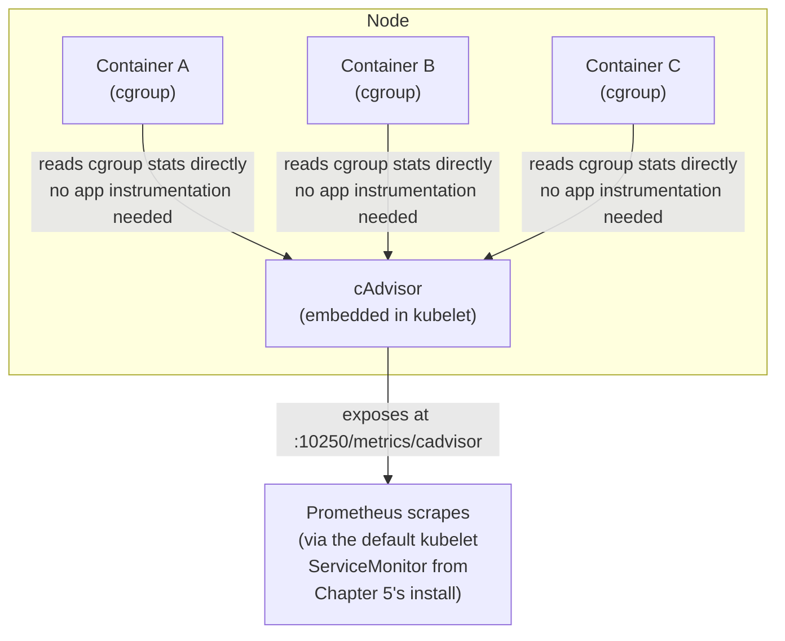
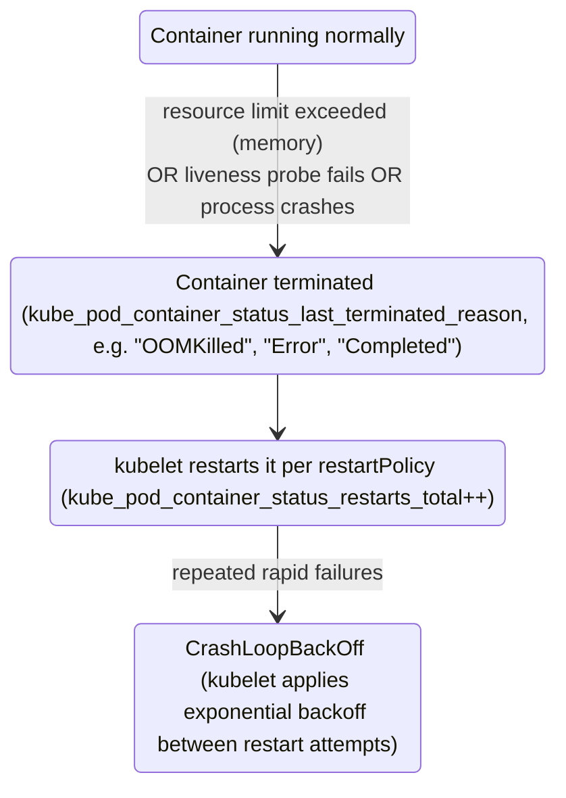
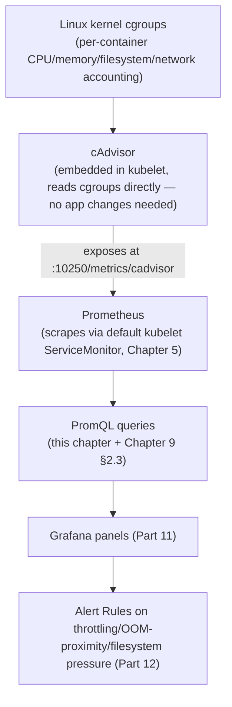

# Chapter 10: Container Metrics with cAdvisor

> **Part 6 — cAdvisor Deep Dive**

---

## 1. Objective

By the end of this chapter you will be able to:

- Explain what cAdvisor is, where it runs, and how it collects data directly from Linux cgroups — no application instrumentation involved.
- Read and explain every major `container_*` metric: CPU, memory, filesystem, network.
- Correctly diagnose CPU throttling, OOM kills, and filesystem/PVC pressure using real PromQL against real metrics.
- Understand container lifecycle metrics (restarts, last-termination-reason) and how they surface in Prometheus.
- Troubleshoot the most common real-world container resource incidents end to end, using the tools this handbook has already built.

---

## 2. Concept

### 2.1 What is cAdvisor, and where does it actually live?

**cAdvisor** ("Container Advisor") is a Google-originated component, embedded directly inside the **kubelet** on every node — you did not install it separately in Chapter 5; it came bundled with Kubernetes itself. Its job is to read resource usage statistics for every container on that node **directly from the Linux kernel's cgroups** (control groups — the kernel mechanism that actually enforces and tracks CPU/memory/etc. limits for each container) and expose them in Prometheus format.



**This is a critical distinction from application-level metrics (Part 10):** cAdvisor metrics require **zero code changes** to the application — they come entirely from the kernel's own accounting of the container's resource usage, which is why every single container in your cluster, regardless of language or whether it was ever instrumented, already has CPU/memory/network/filesystem metrics available right now, straight out of your Chapter 5 install.

### 2.2 CPU metrics

```promql
container_cpu_usage_seconds_total{container="checkoutservice"}
```

A **Counter** (Chapter 6) — cumulative CPU time (in seconds) consumed since the container started, across all cores. Always wrapped in `rate()` to get a meaningful "CPU cores currently in use" number:

```promql
rate(container_cpu_usage_seconds_total{container="checkoutservice"}[5m])
```

A result of `0.5` here means "this container used, on average, half a CPU core's worth of time per second over the last 5 minutes" — note this is **cores**, not a percentage; a value of `2.3` means it used more than 2 full cores (entirely possible for a multi-threaded process on a multi-core node, up to its CPU limit).

**CPU throttling — the metric that separates a beginner's dashboard from a production one:**

```promql
container_cpu_cfs_throttled_periods_total     # Counter: how many scheduling periods this container was throttled in
container_cpu_cfs_periods_total               # Counter: total scheduling periods observed
```

Kubernetes enforces CPU **limits** using the Linux kernel's CFS (Completely Fair Scheduler) quota mechanism: time is divided into periods (default 100ms), and if a container tries to use more CPU than its limit allows within a period, the kernel **throttles** it — pauses its execution until the next period — even if the *node itself* has spare idle CPU sitting right there unused. This is precisely the USE-method "Saturation" signal from Chapter 2 that a naive "average CPU usage looks fine" dashboard completely misses:

```promql
# Throttling ratio — the single most important CPU health query cAdvisor gives you
sum by (pod) (rate(container_cpu_cfs_throttled_periods_total[5m]))
/ sum by (pod) (rate(container_cpu_cfs_periods_total[5m]))
```

A pod can show 40% average CPU utilization against its limit (looks totally fine) while this ratio shows 60% of periods throttled, because CPU usage is bursty — short, intense spikes get throttled even though the *average* over 5 minutes looks comfortable. **This exact gap is one of the most common, and most commonly missed, real production performance problems** — application code that "should be fast" but has inexplicable latency spikes, root-caused entirely to CPU throttling that a CPU-usage-only dashboard never revealed.

### 2.3 Memory metrics

```promql
container_memory_working_set_bytes{container="checkoutservice"}
```

**This is the number the OOM killer actually watches**, and the one you should alert on — not `container_memory_usage_bytes` (which includes reclaimable page cache that the kernel would free before ever triggering an OOM kill, and so tends to overstate real memory pressure) and not `container_memory_rss` alone (which misses some accounted memory the kernel does count toward the OOM decision). This distinction is one of the most consistently-confused points in cAdvisor metrics, and worth memorizing precisely because "working set" is deliberately the metric that mirrors the kernel's own OOM-killer logic.

```promql
# Memory usage vs. limit — the direct predictor of an OOMKill
sum by (pod) (container_memory_working_set_bytes{container!=""})
/ sum by (pod) (kube_pod_container_resource_limits{resource="memory"})
```

When this ratio hits 1.0 (100%), the container's cgroup memory limit is reached and the kernel's OOM killer terminates a process inside it — visible afterward as:

```promql
kube_pod_container_status_last_terminated_reason{reason="OOMKilled"}
```

(a kube-state-metrics metric, not cAdvisor itself — a good early preview of Part 8's territory, since diagnosing an OOM fully often requires combining a cAdvisor "how much memory was it using right before death" query with a kube-state-metrics "was it actually OOMKilled" confirmation).

### 2.4 Filesystem metrics

```promql
container_fs_usage_bytes{container="checkoutservice"}         # current filesystem usage
container_fs_limit_bytes{container="checkoutservice"}          # filesystem capacity available to it
```

This tracks the container's **writable layer and any ephemeral-storage-backed volumes** — not a mounted PersistentVolumeClaim (PVC), which is tracked separately via `kubelet_volume_stats_*` metrics (queries #82–83 from Chapter 9), a distinction worth being precise about: a container can hit its *ephemeral* filesystem limit (triggering eviction) while its *PVC* still has plenty of room, and vice versa — they are two entirely different storage accounting mechanisms with two entirely different metric families.

```promql
# Ephemeral filesystem usage ratio (Kubernetes evicts pods that exceed this)
container_fs_usage_bytes{container!=""} / container_fs_limit_bytes{container!=""}
```

### 2.5 Network metrics

```promql
container_network_receive_bytes_total{pod="checkoutservice-xyz"}
container_network_transmit_bytes_total{pod="checkoutservice-xyz"}
container_network_receive_errors_total{pod="checkoutservice-xyz"}
container_network_receive_packets_dropped_total{pod="checkoutservice-xyz"}
```

**Important nuance:** container network metrics from cAdvisor are labeled by **pod**, not by individual container — because all containers within a single pod share the same network namespace (a fundamental Kubernetes networking fact: one pod = one IP = one network namespace, regardless of how many containers run inside it). If you query these with a `container=` label, you'll typically see the value attributed to the pod's "pause" container (the invisible container that actually owns the network namespace) rather than your application container specifically — a common early point of confusion.

### 2.6 Container lifecycle: restarts and termination reasons

While the *reason* a container terminated comes from kube-state-metrics (Part 8), understanding the lifecycle context here matters because it's how you correlate a cAdvisor resource spike with an actual outcome:



Correlating a CPU throttling spike or a memory-working-set climb (both from cAdvisor, this chapter) with a restart count increase (kube-state-metrics, Part 8) a few seconds later is one of the single most common real-world root-cause investigations you will do as a platform engineer — and it's exactly the kind of cross-metric-source correlation this handbook's full stack (not just Prometheus alone) makes possible.

---

## 3. Why This Matters

- cAdvisor metrics require zero application code changes, which makes them the *first* place to look in almost any container-level performance investigation — before assuming you need custom instrumentation, check what cAdvisor already tells you for free.
- The CPU-throttling-vs-usage distinction (2.2) and the working-set-vs-usage-vs-RSS distinction (2.3) are the two most consistently mis-set-up alerts in real production Kubernetes clusters — getting these right the first time, as this chapter teaches, avoids weeks of confusing "why is this slow/crashing when the dashboard looks fine" investigations.
- Every query in Chapter 9's section 2.3 (Container Resources) is fully explained by this chapter — this is the deep dive that chapter promised.

---

## 4. Architecture



---

## 5. Hands-on Lab

**1. Explore raw cAdvisor metrics directly:**

```bash
kubectl proxy &
curl -s "http://localhost:8001/api/v1/nodes/<a-node-name>/proxy/metrics/cadvisor" | grep container_memory_working_set_bytes | head -20
```

(Substitute a real node name from `kubectl get nodes`.)

**2. Deliberately generate CPU throttling** to see the metric move — deploy a small CPU-bound pod with a tight limit:

```yaml
apiVersion: v1
kind: Pod
metadata:
  name: throttle-demo
  namespace: monitoring
spec:
  containers:
    - name: stress
      image: polinux/stress
      args: ["--cpu", "2", "--timeout", "300s"]
      resources:
        limits:
          cpu: "100m"     # deliberately tiny — this pod WILL be throttled
```

```bash
kubectl apply -f throttle-demo.yaml
```

Then query, via the Prometheus UI (port-forward from Chapter 8):

```promql
rate(container_cpu_cfs_throttled_periods_total{pod="throttle-demo"}[1m])
/ rate(container_cpu_cfs_periods_total{pod="throttle-demo"}[1m])
```

You should see this ratio climb toward a high value almost immediately — direct, hands-on proof of section 2.2's core lesson. Clean up afterward: `kubectl delete pod throttle-demo -n monitoring`.

**3. Compare `container_memory_usage_bytes` vs `container_memory_working_set_bytes`** for the same pod side by side in Table view — note they're close but not identical, and working_set is what actually matters for OOM risk (section 2.3).

**4. Inspect network metrics attribution:** run `container_network_receive_bytes_total{pod=~"throttle-demo.*"}` and note the `container` label value — confirm it's attributed to the pause container, not `stress`, illustrating section 2.5's nuance (if the pod has already terminated by the time you check, redeploy it briefly).

---

## 6. Verification

- [ ] Explain where cAdvisor runs and why it needs no application instrumentation.
- [ ] Write the CPU throttling ratio query from memory and explain what "throttled period" means at the kernel level.
- [ ] Explain the difference between `container_memory_usage_bytes`, `container_memory_working_set_bytes`, and `container_memory_rss`, and state which one predicts OOM risk.
- [ ] Explain why container network metrics are attributed at the pod level, not the individual container level.
- [ ] Given a scenario ("pod looks fine on average CPU but has intermittent latency spikes"), correctly identify CPU throttling as the first thing to check.

---

## 7. Troubleshooting

| Symptom | Root Cause | Fix |
|---|---|---|
| Intermittent latency spikes despite low average CPU usage | CPU throttling (bursty usage hitting the CFS quota even though the 5-minute average looks low) | Query the throttling ratio (section 2.2); raise the CPU limit, or fix the application's burstiness (e.g., excessive GC pauses causing CPU spikes). |
| Pod OOMKilled but `container_memory_usage_bytes` graph "didn't look that high" | Usage metric includes reclaimable cache; working_set is the metric that actually matters and likely did show the real climb. | Always alert on/investigate `container_memory_working_set_bytes`, never raw `container_memory_usage_bytes`, for OOM-risk purposes. |
| Pod evicted with "Ephemeral storage usage exceeds limit" | `container_fs_usage_bytes` exceeded `container_fs_limit_bytes` — often from an application writing large temp files or logs to a non-PVC-backed path. | Query `container_fs_usage_bytes` trend for the pod; move heavy writes to a proper PVC, or set/raise `ephemeral-storage` limits deliberately. |
| Network metrics for a specific sidecar container show zero/missing | Expected — cAdvisor attributes network stats to the pod's shared network namespace (commonly the pause container), not to each individual container. | Query at the pod level (drop the `container=` filter, or explicitly match the pause/infra container) instead of expecting per-sidecar network numbers. |
| `container_cpu_cfs_throttled_periods_total` exists but the ratio calculation returns nothing | `container_cpu_cfs_periods_total` might be zero/absent if the container has no CPU limit set at all (throttling only applies when a limit exists). | Confirm the pod actually has a CPU `limit` set (Chapter 9 query #37-style check); an unlimited container cannot be throttled by definition. |

---

## 8. Production Notes

- **CPU throttling ratio deserves its own dedicated alert**, separate from a CPU-usage-vs-limit alert — they catch genuinely different problems, and relying on usage alone is one of the most common gaps in real production alerting setups.
- Real-world guidance from experienced SRE teams increasingly leans toward **setting CPU requests generously (or matching limits) and being cautious with tight CPU limits** specifically because of throttling's counterintuitive behavior — some organizations deliberately avoid CPU limits altogether for latency-sensitive workloads, accepting the node-level noisy-neighbor tradeoff instead of guaranteed throttling. This is a genuine, actively-debated production tradeoff, not a settled question — Part 18 discusses it further under capacity planning.
- `container_memory_working_set_bytes` is also the metric the **Vertical Pod Autoscaler (VPA)** and tools like **Goldilocks** (Part 18) use for rightsizing memory recommendations — understanding it here pays off directly when you get to that chapter.

---

## 9. Best Practices

1. **Always alert on CPU throttling ratio, not just CPU usage vs. limit** — they catch different failure modes and both matter.
2. **Always use `container_memory_working_set_bytes` for OOM-risk monitoring**, never `container_memory_usage_bytes` alone.
3. **Understand your workload's ephemeral-storage footprint** (`container_fs_usage_bytes`) separately from its PVC usage — they're unrelated metrics with unrelated failure modes.
4. **Query network metrics at the pod level**, not expecting meaningful per-container attribution within a multi-container pod.
5. **Correlate cAdvisor's resource metrics with kube-state-metrics' restart/termination-reason metrics** (Part 8) when root-causing — resource pressure and its downstream consequence live in two different metric sources, and real investigations need both.

---

## 10. Interview Questions

1. **"What is cAdvisor and where does it run?"** — A component embedded in the kubelet on every node that reads per-container resource usage directly from Linux cgroups and exposes it in Prometheus format, requiring no application-level instrumentation.
2. **"How does CPU throttling work at the kernel level, and how do you detect it in Prometheus?"** — The kernel's CFS quota mechanism divides time into periods (default 100ms) and pauses a container's execution for the rest of a period once it exceeds its proportional CPU limit within that period, even if the node has idle CPU available; detected via the ratio of `container_cpu_cfs_throttled_periods_total` to `container_cpu_cfs_periods_total`.
3. **"Why do you alert on `container_memory_working_set_bytes` instead of `container_memory_usage_bytes`?"** — Working set is the metric the kernel's OOM killer actually bases its decision on; usage includes reclaimable page cache the kernel would free before triggering an OOM, so it tends to overstate genuine memory pressure.
4. **"A container's average CPU usage is low, but users report intermittent latency spikes. What's the first cAdvisor metric you'd check?"** — CPU throttling ratio — bursty usage can hit the CFS quota and get throttled even when the average over a longer window looks comfortably low.
5. **"What's the difference between a container's ephemeral filesystem usage and its PVC usage, metrically?"** — Two entirely separate metric families: `container_fs_usage_bytes`/`container_fs_limit_bytes` (cAdvisor, writable layer/ephemeral storage) versus `kubelet_volume_stats_*` (a mounted PersistentVolumeClaim) — a container can be under pressure on one while having plenty of room on the other.

---

## 11. Real Incident

**Company type:** Ad-tech real-time bidding platform, extremely latency-sensitive (sub-100ms SLA on bid responses).

**What happened:** After a routine capacity-planning exercise, a well-meaning engineer tightened CPU limits across several services to "improve bin-packing efficiency" on the cluster, using average CPU usage data to size the new limits — a plausible-sounding approach that ignored burstiness entirely. Within hours, the bidding service's p99 latency SLI (Chapter 3) blew through its error budget, though average CPU usage on every affected pod still looked comfortably under its new limit the entire time.

**Investigation:** The team, having internalized exactly this chapter's lesson, went straight to the CPU throttling ratio rather than re-checking average usage (which had already been checked and looked fine, which was the whole confusing part). It showed pods throttled during upward of 30% of scheduling periods during peak bidding traffic — the tightened limits had introduced exactly the CFS-quota-vs-burstiness gap this chapter describes, invisible to any average-usage-only view.

**Resolution:** Reverted the CPU limit reduction for latency-sensitive services specifically, and — per this chapter's Production Notes — the team adopted a policy of setting generous CPU limits (or omitting them, relying on requests-based scheduling and node-level guardrails instead) for any service with a tight latency SLO, reserving aggressive limit-tightening for genuinely latency-insensitive batch workloads.

**Prevention:** CPU throttling ratio was added as a required panel on every latency-sensitive service's dashboard going forward, specifically so that "average usage looks fine" could never again be treated as sufficient evidence that CPU limits were sized correctly.

---

## 12. Summary

- **cAdvisor**, embedded in the kubelet, reads per-container resource usage directly from Linux cgroups — no application instrumentation required, making it the first stop in most container-level investigations.
- **CPU throttling** (`container_cpu_cfs_throttled_periods_total` / `container_cpu_cfs_periods_total`) is a saturation signal, independent of average usage, and one of the most commonly missed real production issues.
- **`container_memory_working_set_bytes`** is the correct metric for OOM-risk monitoring — not raw usage, which includes reclaimable cache.
- Filesystem (ephemeral storage) and network metrics both have their own nuances (ephemeral vs. PVC accounting; pod-level, not per-container, network attribution) worth knowing precisely before you build dashboards or alerts on them.

---

## 13. Next Chapter

This closes out **Part 6: cAdvisor Deep Dive.** You now understand every container-level resource metric your cluster already produces, with zero application changes.

**Part 7, Chapter 11: Node Exporter and Linux Internals** moves one layer down the stack — from per-container resource usage to the **host operating system's own vital signs**: every major Node Exporter collector, real Linux troubleshooting techniques, and the metrics that tell you about the node itself, independent of any single container running on it.
