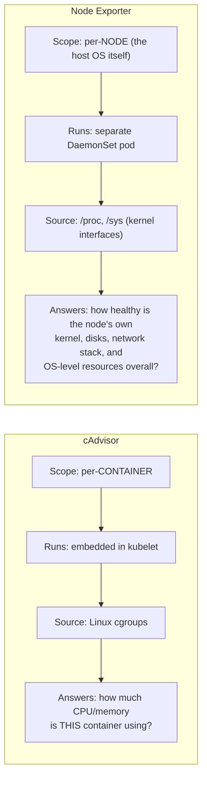
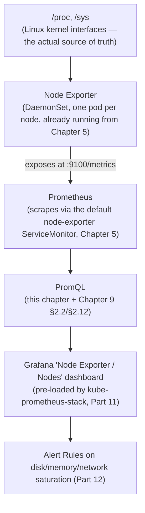

# Chapter 11: Node Exporter and Linux Internals

> **Part 7 — Node Exporter**

---

## 1. Objective

By the end of this chapter you will be able to:

- Explain what Node Exporter is, how it differs from cAdvisor (Chapter 10), and why both are needed.
- Explain and query every major Node Exporter collector: CPU, load, memory, filesystem, disk I/O, network, TCP/UDP, interrupts, systemd, hugepages, NUMA.
- Diagnose real Linux-level production problems (disk saturation, memory pressure, network drops, failed systemd units) using Node Exporter metrics and standard Linux tools side by side.
- Know which collectors are enabled by default versus opt-in, and why that matters for both cardinality and security.

---

## 2. Concept

### 2.1 Node Exporter vs. cAdvisor — a distinction worth being precise about

Chapter 10 covered cAdvisor: per-**container** resource usage, embedded in the kubelet. **Node Exporter** is a completely separate DaemonSet (one pod per node, already running from your Chapter 5 install) that exposes the **host operating system's own** metrics — things that exist at the node level regardless of which containers happen to be running on it.



A concrete example of why you need both: a node can show **healthy aggregate CPU** across all its containers (cAdvisor) while Node Exporter's `node_load1` shows a load average far exceeding the node's core count — indicating processes (possibly non-container, host-level processes, or scheduling contention itself) are queuing for CPU time that individual container metrics alone wouldn't surface. USE-method Saturation (Chapter 2) at the *node* level is a genuinely different signal from Saturation at the *container* level (throttling, Chapter 10) — both matter, for different failure modes.

### 2.2 CPU: modes, load average, and saturation

```promql
node_cpu_seconds_total{mode="idle"}
node_cpu_seconds_total{mode="user"}
node_cpu_seconds_total{mode="system"}
node_cpu_seconds_total{mode="iowait"}
node_cpu_seconds_total{mode="steal"}
```

A Counter, broken down by **mode** — how CPU time has been spent. `iowait` (time spent waiting on disk I/O) and `steal` (time a virtual machine's CPU was taken by the hypervisor for other tenants — a cloud-specific "noisy neighbor" signal) are the two modes most likely to reveal a problem that pure `user`/`system` CPU usage would hide entirely:

```promql
# High iowait = the CPU is idle-but-blocked waiting on slow disk, not truly idle/healthy
rate(node_cpu_seconds_total{mode="iowait"}[5m])

# Steal time > 0 sustained = your cloud VM is being starved by the hypervisor/neighbor tenants
rate(node_cpu_seconds_total{mode="steal"}[5m])
```

**Load average** (`node_load1`, `node_load5`, `node_load15`) is the classic Unix metric — the average number of processes either running or waiting (uninterruptible sleep, which includes waiting on disk I/O) over 1/5/15 minutes:

```promql
# Saturation: is load average outpacing available cores?
node_load1 / count by (instance) (node_cpu_seconds_total{mode="idle"})
```

A ratio consistently above 1.0 means, on average, more work is queued than the node has cores to run it concurrently — genuine CPU saturation, a different and complementary signal to per-container throttling from Chapter 10.

### 2.3 Memory: beyond simple usage percentage

```promql
node_memory_MemTotal_bytes
node_memory_MemAvailable_bytes    # the number to actually use — kernel's own "how much could I give a new process" estimate
node_memory_MemFree_bytes         # NOT the same as available — excludes reclaimable cache/buffers, usually looks alarmingly low even when healthy
node_memory_Cached_bytes
node_memory_Buffers_bytes
node_memory_SwapFree_bytes
node_memory_SwapTotal_bytes
```

**A very common beginner trap:** `node_memory_MemFree_bytes` is *not* "how much memory is actually available for use" — Linux aggressively uses free RAM for disk cache (`Cached`) and buffers, which it will happily evict the instant a process actually needs the memory. `node_memory_MemAvailable_bytes` is the kernel's own, more sophisticated estimate that already accounts for this reclaimability, and is the correct metric for a "memory usage %" dashboard (query #14 from Chapter 9):

```promql
100 * (1 - (node_memory_MemAvailable_bytes / node_memory_MemTotal_bytes))
```

Memory **saturation** (as distinct from usage) shows up as **major page faults** — pages that had to be read back in from disk/swap rather than found in RAM, a real performance-degrading event, not just a usage-level number:

```promql
rate(node_vmstat_pgmajfault[5m])
```

### 2.4 Filesystem and disk I/O

```promql
node_filesystem_avail_bytes{fstype!~"tmpfs|overlay"}
node_filesystem_size_bytes{fstype!~"tmpfs|overlay"}
node_filesystem_files_free                      # inode exhaustion — a sneaky failure mode
node_disk_io_time_weighted_seconds_total         # disk queue depth over time — the real saturation signal
node_disk_read_bytes_total
node_disk_written_bytes_total
node_disk_io_time_seconds_total                  # % of time the disk was busy at all
```

**Inode exhaustion deserves special mention** because it's a classic real-world "the disk isn't full but I still can't write files" incident: a filesystem can have plenty of free *bytes* while being completely out of free *inodes* (the kernel data structures that track individual files) — commonly caused by an application creating huge numbers of tiny files (e.g., a misbehaving log rotation or a cache gone wrong). `df -h` alone will lie to you here; `df -i` (and its metric equivalent, `node_filesystem_files_free`) is what actually reveals it.

```promql
# Disk I/O saturation (queue depth building up = real bottleneck, not just "some usage")
rate(node_disk_io_time_weighted_seconds_total[5m])
```

### 2.5 Network: throughput, errors, drops, and TCP/UDP state

```promql
node_network_receive_bytes_total{device!="lo"}
node_network_transmit_bytes_total{device!="lo"}
node_network_receive_errs_total                  # USE: Errors — physical/driver-level problems
node_network_receive_drop_total                  # buffer overflow — packets arrived but couldn't be processed in time
node_netstat_Tcp_CurrEstab                        # currently established TCP connections
node_netstat_Tcp_RetransSegs                      # TCP retransmits — a real network-quality signal
node_sockstat_TCP_tw                              # sockets in TIME_WAIT — can exhaust ephemeral ports under high churn
```

**Errors vs. drops is a meaningful distinction:** `receive_errs` typically indicates a lower-level problem (bad cabling, driver/hardware issue, checksum failures); `receive_drop` typically means packets arrived fine but the kernel's receive buffer was full when the CPU couldn't process them fast enough — a saturation signal, often correlated with high CPU usage or interrupt load (2.7) on that node, not a hardware fault. Diagnosing "which one is it" changes your remediation entirely — hardware replacement vs. capacity/tuning — so conflating them is a real, costly mistake.

**TCP retransmits and TIME_WAIT sockets** are the two most useful "is my network actually healthy, not just busy" signals — rising retransmits under otherwise-normal throughput usually means packet loss somewhere in the path (not necessarily this node's fault, but this node's metrics are often the first place you'll notice it); a growing TIME_WAIT count under high connection-churn workloads (e.g., a service making huge numbers of short-lived outbound connections) can genuinely exhaust the ephemeral port range and cause new connections to start failing — a real, specific, diagnosable Linux networking failure mode.

### 2.6 Systemd unit health

```promql
node_systemd_unit_state{state="failed"}
```

A **Gauge** (1 if that specific unit is currently in that state, 0 otherwise) covering every systemd-managed service on the host — kubelet itself, container runtime (containerd/CRI-O), and any other host-level service. On a self-managed cluster (kubeadm, bare metal, RKE2), this is genuinely important: a failed `containerd.service` or `kubelet.service` unit is a node-level emergency that container-level metrics alone would never directly surface (you'd only see the *symptom* — pods failing to schedule/start on that node — not the *cause*).

```promql
node_systemd_unit_state{state="failed"} == 1
```

### 2.7 The deeper collectors: NUMA, interrupts, hugepages, entropy

These are less commonly needed day-to-day but are exactly the kind of "real Linux troubleshooting" depth a senior platform engineer is expected to have for the hard cases:

- **NUMA (`node_memory_numa_*`):** on multi-socket servers, memory access speed differs depending on whether a process's memory is on the "local" NUMA node relative to the CPU core running it, versus a "remote" one (`node_memory_numa_MemFree`, per NUMA node). A NUMA imbalance can cause mysterious CPU-bound performance problems on large bare-metal nodes that look completely fine from a simple aggregate-CPU-usage view — a genuinely advanced but real production troubleshooting scenario, especially relevant for latency-sensitive or high-throughput workloads on large machines.
- **Interrupts (`node_intr_total`, `rate()`'d):** a high, sustained interrupt rate (especially network-driven — NIC interrupts) consumes real CPU time that doesn't show up neatly as "application CPU usage," and can be a root cause of unexplained CPU saturation on network-heavy nodes.
- **Hugepages (`node_memory_HugePages_Total` / `_Free`):** large, pre-allocated memory pages used by some high-performance workloads (databases, some ML/GPU workloads) to reduce translation-lookaside-buffer (TLB) overhead. If a workload expects hugepages and they're exhausted or misconfigured, it can fail to start or silently degrade — worth knowing this metric family exists even if you rarely touch it directly.
- **Entropy (`node_entropy_available_bits`):** the available randomness pool the kernel uses for cryptographic operations. On older kernels/configurations (much less of an issue on modern Linux with `getrandom()`), entropy starvation could cause TLS handshake stalls under load — a genuinely obscure but real historical incident cause worth recognizing by name if you ever see it referenced.

### 2.8 Default vs. opt-in collectors

Node Exporter ships with dozens of collectors, not all enabled by default — some (like detailed per-process metrics, or certain deep filesystem stat collectors) are opt-in specifically because they either add meaningful cardinality/scrape cost, or expose information with security/privacy implications on a shared/multi-tenant node. Production tuning of exactly which collectors to enable is a real decision, revisited briefly in Part 18 alongside broader capacity planning — the default set (CPU, memory, filesystem, disk, network, load, systemd, and a handful of others) covers the large majority of real operational needs described in this chapter.

---

## 3. Why This Matters

- Node Exporter metrics are what let you distinguish "my container is unhealthy" (Chapter 10) from "the node itself is unhealthy" (this chapter) — a distinction that directly determines whether the fix is "adjust this workload's limits" or "drain/replace/investigate this node."
- The `MemFree` vs. `MemAvailable` and `receive_errs` vs. `receive_drop` distinctions in this chapter are exactly the kind of precise, easy-to-get-wrong knowledge that separates someone who can read a Grafana dashboard from someone who can actually diagnose a real Linux production incident — precisely this handbook's stated goal.
- This chapter directly expands Chapter 9's section 2.2 and 2.12 query references — you now understand exactly what's behind every one of those queries, not just how to run them.

---

## 4. Architecture



---

## 5. Hands-on Lab

**1. Compare `MemFree` and `MemAvailable` on your own cluster** (port-forward Prometheus per earlier chapters) — run both side by side in Table view and note the (likely significant) difference; this alone is often an "aha" moment for engineers seeing it for the first time.

**2. Cross-reference Node Exporter with real Linux commands.** If you have node/SSH access (Kind: `docker exec -it <kind-node-container> sh`; cloud: SSH to a node), compare:

```bash
free -h           # compare against node_memory_MemAvailable_bytes
uptime            # compare load averages against node_load1/5/15
df -h && df -i     # compare against node_filesystem_avail_bytes AND node_filesystem_files_free
iostat -x 1 5      # compare against node_disk_io_time_weighted_seconds_total (if iostat is available)
```

Seeing the same numbers from both the raw Linux command and the Prometheus metric side by side builds real confidence that you understand what these metrics actually represent, not just their names.

**3. Query systemd unit health:**

```promql
node_systemd_unit_state{state="failed"}
```

On a healthy cluster this should return no results (no failed units) — a good sign that everything is nominal. If your cluster type exposes systemd units differently (fully managed clusters like GKE/EKS/AKS often restrict or don't expose node-level systemd data the same way), note that and move on — this collector is most directly useful on kubeadm/bare-metal/RKE2 self-managed nodes.

**4. Build a mental "node health checklist"** from this chapter: CPU (usage + load saturation + iowait/steal), memory (available %, major page faults), filesystem (bytes AND inodes), disk I/O (queue depth), network (throughput + errors + drops + retransmits), systemd (failed units). You'll turn this exact checklist into a real Grafana dashboard row-by-row in Part 11.

---

## 6. Verification

- [ ] Explain the difference in scope between Node Exporter and cAdvisor, with a concrete example of a problem each one would catch that the other wouldn't.
- [ ] Explain why `node_memory_MemFree_bytes` is misleading and what `node_memory_MemAvailable_bytes` corrects for.
- [ ] Explain the difference between network errors and network drops, and what each typically indicates.
- [ ] Explain why inode exhaustion can occur even when a filesystem has plenty of free bytes.
- [ ] Name at least 4 of the "deeper" collectors (NUMA, interrupts, hugepages, entropy) and what each is used to diagnose.

---

## 7. Troubleshooting

| Symptom | Root Cause | Fix |
|---|---|---|
| Node shows high load average but low aggregate container CPU usage | Processes waiting on I/O (uninterruptible sleep counts toward load average) rather than CPU-bound — check `iowait` and disk I/O saturation, not just CPU usage. | Correlate `node_load1` spikes with `node_cpu_seconds_total{mode="iowait"}` and `node_disk_io_time_weighted_seconds_total` to confirm a disk bottleneck, not a CPU one. |
| "Disk full" errors but `df -h`-equivalent metric shows plenty of free space | Inode exhaustion, not byte exhaustion. | Check `node_filesystem_files_free`; find and clean up whatever's creating excessive small files. |
| Intermittent connection failures under high outbound-connection-churn workloads | TIME_WAIT socket exhaustion on the ephemeral port range. | Check `node_sockstat_TCP_tw` trend; consider connection pooling/reuse in the application, or kernel-level tuning (`net.ipv4.tcp_tw_reuse`) as a mitigation. |
| Network throughput looks normal but application reports intermittent packet loss / retries | TCP retransmits climbing even without headline throughput or error-count anomalies. | Check `node_netstat_Tcp_RetransSegs` rate; investigate the network path (not necessarily this node — could be upstream) rather than assuming a local hardware fault. |
| Pods failing to schedule/start on one specific node, with no clear container-level cause | A host-level systemd unit (kubelet, containerd) may be failed or unstable on that node. | Check `node_systemd_unit_state{state="failed"}` for that instance; investigate the underlying service directly on the node if self-managed. |

---

## 8. Production Notes

- Real SRE teams build a single, reusable **"Node Health" Grafana dashboard**, templated across all nodes via a variable (Part 11), covering exactly the checklist from this chapter's lab step 4 — this is one of the most universally useful dashboards any Kubernetes platform team maintains, and it's built entirely from Node Exporter data.
- On managed cloud clusters (EKS/AKS/GKE), some node-level detail (systemd, certain kernel internals) is either unavailable or less relevant since the cloud provider manages the underlying host — Node Exporter still runs and still provides real value (CPU/memory/disk/network), but a few of this chapter's deeper collectors are more relevant to self-managed (kubeadm/bare-metal/RKE2) environments specifically.
- **`steal` time is one of the most valuable and least-checked cloud-specific metrics** — on any cloud VM-based cluster, a sustained non-zero steal time is worth investigating (potentially a support ticket to the cloud provider, or a signal to consider dedicated/reserved instance types) before assuming a performance problem is your application's fault.

---

## 9. Best Practices

1. **Always use `MemAvailable`, never `MemFree`, for memory usage dashboards and alerts.**
2. **Track filesystem usage by both bytes AND inodes** — either one alone can miss a real "out of space" condition.
3. **Distinguish network errors from drops in your dashboards and alerts** — they point to different root causes and different remediations.
4. **Build one templated "Node Health" dashboard covering the full checklist**, rather than scattering node-level panels ad hoc across many different dashboards.
5. **On cloud VM clusters, actively monitor `steal` time** as a standard part of node health, not an afterthought.

---

## 10. Interview Questions

1. **"What's the difference between Node Exporter and cAdvisor?"** — Node Exporter exposes host/OS-level metrics (CPU, memory, disk, network at the node level) via a separate DaemonSet reading `/proc` and `/sys`; cAdvisor, embedded in the kubelet, exposes per-container metrics from cgroups. Both are needed because a node can be unhealthy independent of any single container, and vice versa.
2. **"Why shouldn't you use `node_memory_MemFree_bytes` for a memory usage dashboard?"** — It excludes reclaimable cache and buffers that Linux is using opportunistically but would free instantly under memory pressure, making it look alarmingly low even on a perfectly healthy system; `MemAvailable` is the kernel's own corrected estimate and is the right metric to use.
3. **"How can a disk be 'full' in terms of errors even though `df -h` shows free space?"** — Inode exhaustion — the filesystem has run out of the kernel data structures needed to track individual files, typically from an application creating huge numbers of small files, even while raw byte capacity remains available.
4. **"What's the practical difference between network 'errors' and network 'drops' in Node Exporter?"** — Errors typically indicate lower-level hardware/driver problems (bad cabling, checksum failures); drops typically indicate the kernel's receive buffer overflowed because the CPU couldn't keep up processing incoming packets fast enough — a saturation signal, not necessarily a hardware fault.
5. **"What is CPU steal time and why does it matter on cloud infrastructure?"** — Time your VM's virtual CPU wanted to run but the hypervisor gave the physical CPU to another tenant instead; sustained non-zero steal time indicates your workload is being starved by "noisy neighbors" at the infrastructure level, invisible to any metric collected purely inside your own VM's `user`/`system` CPU accounting.

---

## 11. Real Incident

**Company type:** Financial data provider running a self-managed kubeadm cluster on bare metal.

**What happened:** A specific node began exhibiting seemingly random pod scheduling failures and container startup delays, while every container-level metric (cAdvisor) on that node looked entirely normal — no throttling, no memory pressure, nothing unusual. The team spent nearly two hours investigating at the container/application layer before anyone thought to check node-level health directly.

**Investigation:** Eventually, someone queried `node_systemd_unit_state{state="failed"}` across the cluster (a query they hadn't previously had as a standing dashboard panel) and immediately found that `containerd.service` on the affected node had entered a failed state hours earlier, following an unrelated disk-pressure event that had briefly filled the node's root filesystem and caused the container runtime to crash — it had not automatically recovered.

**Root cause:** A host-level service failure (containerd) that was completely invisible to container-level (cAdvisor) monitoring, because a failed container runtime doesn't produce cAdvisor metrics at all — there was simply an absence of new container activity on that node, which look identical to "this node is just quiet" rather than "this node is broken," unless you're specifically watching for it.

**Resolution:** Restarted the `containerd` service on the affected node (root cause of the underlying disk pressure that triggered the crash was separately addressed); node returned to normal scheduling immediately.

**Prevention:** Added `node_systemd_unit_state{state="failed"}` as a cluster-wide, always-visible alert (Part 12) — specifically because this incident exposed a real blind spot in a monitoring setup that, until then, had been almost entirely container/application-focused, exactly the kind of gap this chapter's "watch the host, not just the containers" thesis addresses directly.

---

## 12. Summary

- **Node Exporter** exposes host-level Linux metrics — a fundamentally different scope from cAdvisor's per-container metrics — and both are necessary for complete visibility.
- Memory: use `MemAvailable`, not `MemFree`, and watch major page faults for real saturation, not just usage percentage.
- Filesystem: track both bytes and inodes; disk I/O saturation is best seen via queue-depth-style metrics, not just throughput.
- Network: distinguish errors (hardware/driver) from drops (buffer/CPU saturation), and watch TCP retransmits/TIME_WAIT for connection-quality issues invisible to raw throughput.
- Systemd unit health (`node_systemd_unit_state`) catches host-level service failures (like a crashed container runtime) that are completely invisible to container-level monitoring alone — a real, demonstrated blind spot without it.

---

## 13. Next Chapter

This closes out **Part 7: Node Exporter.** Combined with Chapter 10, you now have full visibility into both the container layer and the host layer of every node in your cluster.

**Part 8, Chapter 12: kube-state-metrics — Every Kubernetes Object Metric** moves up a level of abstraction entirely — from "how are the container and the host performing" to "does the actual state of my Kubernetes objects match what I declared." You'll cover every major object type: Pods, Deployments, StatefulSets, DaemonSets, PVCs, HPAs, CronJobs, and more — the metric source that answers "is Kubernetes itself doing what I told it to do," a question neither cAdvisor nor Node Exporter can answer.
