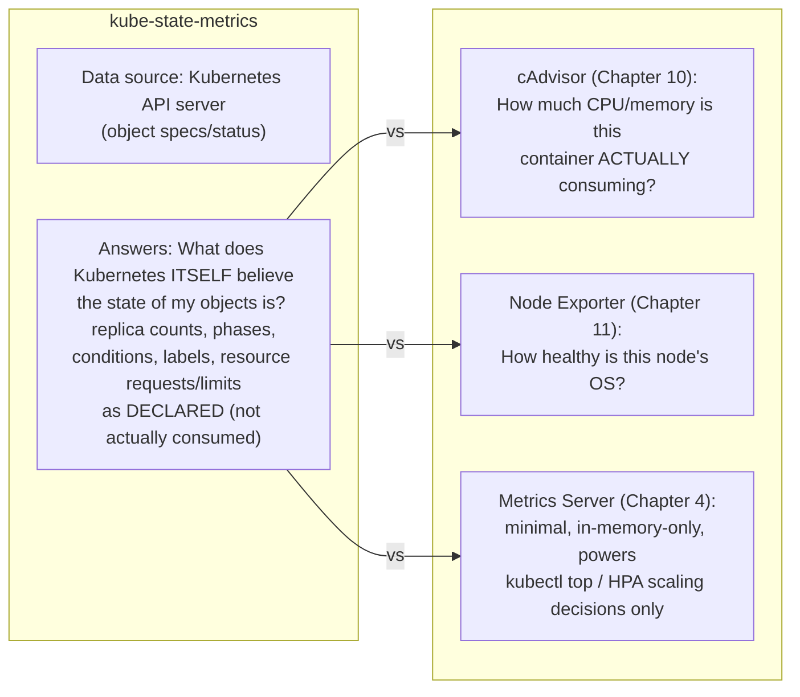
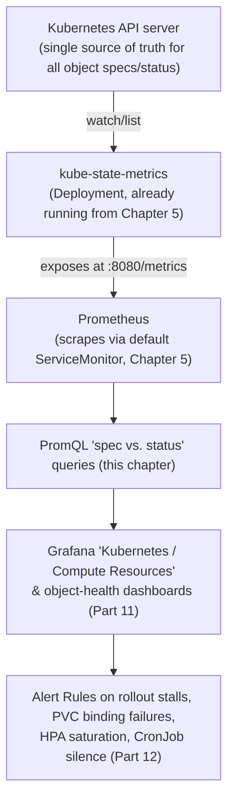

# Chapter 12: kube-state-metrics — Every Kubernetes Object Metric

> **Part 8 — kube-state-metrics**

---

## 1. Objective

By the end of this chapter you will be able to:

- Explain precisely what kube-state-metrics (KSM) does and how it differs from cAdvisor, Node Exporter, and Metrics Server.
- Query object-state metrics for every major Kubernetes resource: Pods, Deployments, ReplicaSets, StatefulSets, DaemonSets, Namespaces, PVCs, PVs, StorageClasses, CronJobs/Jobs, Secrets, ConfigMaps, and HPAs.
- Explain the "desired state vs. actual state" model and why it's the foundation of Kubernetes-native alerting.
- Understand KSM's labeling model, including the powerful (and cardinality-risky) `kube_pod_labels`/`kube_pod_annotations` metrics.

---

## 2. Concept

### 2.1 What kube-state-metrics actually is — and isn't

**kube-state-metrics** is a standalone Deployment (already running from your Chapter 5 install) that does exactly one thing: it **watches the Kubernetes API server** and converts the *state* of Kubernetes objects into Prometheus metrics. It does not talk to nodes, containers, or cgroups at all — its only data source is the API server itself.



This is a critical distinction worth internalizing precisely: **KSM never tells you resource *usage*** — it tells you resource *requests/limits as declared in the pod spec*, and object *status* as reported by controllers. "Is this Deployment's desired replica count actually satisfied right now" is a KSM question; "how much CPU is this pod actually using" is a cAdvisor question. Real investigations, as Chapter 10 already showed with OOMKilled correlation, constantly combine both.

### 2.2 The core mental model: desired state vs. actual state

Kubernetes itself is built around **reconciliation loops**: you declare desired state (e.g., "5 replicas of checkout"), and controllers continuously work to make actual state match it. KSM is, almost entirely, a Prometheus-shaped window into exactly this gap:

```promql
kube_deployment_spec_replicas{deployment="checkoutservice"}              # DESIRED
kube_deployment_status_replicas_available{deployment="checkoutservice"}  # ACTUAL

# The single most useful KSM pattern in this entire chapter:
kube_deployment_status_replicas_available != kube_deployment_spec_replicas
```

Almost every KSM-based alert you'll write in Part 12 follows this exact `spec vs. status` shape — this is the pattern to internalize, not a list of metric names to memorize.

### 2.3 Pods

```promql
kube_pod_status_phase{phase="Running"}          # one series per pod per phase, value 1 for its current phase
kube_pod_status_ready{condition="true"}          # readiness probe passing
kube_pod_container_status_waiting_reason{reason="CrashLoopBackOff"}
kube_pod_container_status_restarts_total          # Counter
kube_pod_container_resource_requests{resource="cpu"}
kube_pod_container_resource_limits{resource="memory"}
kube_pod_info                                     # rich label-only metric: node, pod_ip, created_by_kind, etc.
```

`kube_pod_info` deserves special mention — its *value* is always `1`; its entire purpose is to carry a rich set of **labels** (which node the pod runs on, what created it, its IP) so you can `group_left` (Chapter 8, section 2.6) it onto other metrics that don't naturally carry that context, e.g., enriching a cAdvisor CPU query with the node it ran on. This "info metric" pattern (value always `1`, purpose is purely to carry joinable labels) recurs throughout KSM — `kube_node_info`, `kube_namespace_labels`, etc. — and is a deliberate, common Prometheus design idiom worth recognizing by name.

### 2.4 Deployments, ReplicaSets, StatefulSets, DaemonSets

```promql
# Deployments
kube_deployment_spec_replicas
kube_deployment_status_replicas_available
kube_deployment_status_replicas_unavailable
kube_deployment_status_condition{condition="Available", status="true"}

# ReplicaSets (usually only interesting when investigating a rollout)
kube_replicaset_spec_replicas
kube_replicaset_status_ready_replicas
kube_replicaset_owner    # which Deployment owns this ReplicaSet — a join key

# StatefulSets — note "current" vs "updated" replicas matters during rollouts
kube_statefulset_replicas
kube_statefulset_status_replicas_ready
kube_statefulset_status_current_replicas
kube_statefulset_status_update_revision

# DaemonSets — "should this run on every eligible node"
kube_daemonset_status_desired_number_scheduled
kube_daemonset_status_current_number_scheduled
kube_daemonset_status_number_misscheduled
```

**StatefulSets specifically need extra care during rollouts**, because unlike a Deployment (which typically just needs `available == desired`), a StatefulSet rollout updates pods one at a time in order, so `current_replicas` vs. `updated_replicas` diverging is *expected and normal* mid-rollout, not necessarily a problem — alerting logic here needs to account for rollout duration, a nuance worth remembering when you build StatefulSet-specific alerts in Part 12 (directly relevant once you deploy the Postgres StatefulSet in Part 10).

### 2.5 Namespaces, ResourceQuotas, LimitRanges

```promql
kube_namespace_status_phase{phase="Terminating"}   # namespaces stuck terminating (a real, annoying failure mode)
kube_resourcequota{type="used", resource="requests.cpu"}
kube_resourcequota{type="hard", resource="requests.cpu"}
kube_limitrange{type="Container", resource="memory", constraint="max"}
```

A namespace stuck in `Terminating` (usually due to a finalizer that never completes — often from a custom resource or webhook that can't clean up) is a specific, recognizable, and surprisingly common real production annoyance that KSM surfaces directly and that would otherwise require manually noticing `kubectl get ns` output looking wrong.

### 2.6 PersistentVolumeClaims, PersistentVolumes, StorageClasses

```promql
kube_persistentvolumeclaim_status_phase{phase="Pending"}    # PVC stuck, not yet Bound
kube_persistentvolumeclaim_resource_requests_storage_bytes
kube_persistentvolume_status_phase{phase="Failed"}
kube_persistentvolume_capacity_bytes
kube_storageclass_info                                       # info metric, join key for storage-class-level analysis
```

Note KSM tells you **claim status and requested capacity** — it does not tell you *actual bytes used* inside that volume (that's `kubelet_volume_stats_used_bytes`, a kubelet-sourced metric, not KSM). Yet another example of this chapter's core theme: KSM answers "what does the Kubernetes control plane believe," a different and complementary question from "what's actually happening physically."

### 2.7 CronJobs and Jobs

```promql
kube_cronjob_status_last_schedule_time
kube_cronjob_spec_suspend                        # is this CronJob paused?
kube_job_status_active
kube_job_status_succeeded
kube_job_status_failed
kube_job_spec_completions
kube_job_status_completion_time
```

```promql
# A CronJob that hasn't run in longer than its schedule implies (Chapter 9, query #47)
time() - kube_cronjob_status_last_schedule_time > 3600

# A Job that failed and needs investigation
kube_job_status_failed > 0
```

This is directly relevant once Part 10 extends Online Boutique with a real CronJob (per this handbook's stated goal of covering every workload type) — this is precisely the metric family you'll alert on for that workload.

### 2.8 Secrets and ConfigMaps

```promql
kube_secret_info                        # info metric — existence + metadata, NEVER the secret's actual contents
kube_secret_type                        # e.g. "kubernetes.io/tls", "Opaque"
kube_configmap_info
kube_secret_metadata_resource_version
```

**Important, and a common early worry:** KSM exposes *metadata about* Secrets (name, namespace, type, existence, last-modified) — it never exposes secret *contents*. This is a deliberate security design choice, not an oversight, and worth being able to state confidently if it ever comes up (it's a genuinely common question from security-conscious teams evaluating whether to enable this collector).

```promql
# A practically useful pattern: certificates nearing expiry, IF you're also tracking
# expiry as a label/annotation (commonly paired with cert-manager's own metrics
# rather than raw kube_secret_info, in real production setups)
```

### 2.9 HorizontalPodAutoscaler (HPA)

```promql
kube_horizontalpodautoscaler_status_current_replicas
kube_horizontalpodautoscaler_status_desired_replicas
kube_horizontalpodautoscaler_spec_max_replicas
kube_horizontalpodautoscaler_spec_min_replicas
kube_horizontalpodautoscaler_status_condition{condition="ScalingLimited", status="true"}
```

```promql
# An HPA pinned at max replicas — it WANTS to scale further but can't (capacity ceiling reached)
kube_horizontalpodautoscaler_status_current_replicas
  == kube_horizontalpodautoscaler_spec_max_replicas
```

This is a genuinely important production signal (Chapter 9's query #45) — an HPA silently maxed out means your autoscaling safety net has stopped protecting you, and the service is now effectively running at a fixed, possibly-insufficient capacity during a real traffic spike, with no automatic alarm unless you specifically watch for this condition.

### 2.10 Nodes and StorageClasses (cluster-level object state)

```promql
kube_node_info
kube_node_status_condition{condition="Ready", status="true"}
kube_node_status_allocatable{resource="cpu"}
kube_node_spec_unschedulable                     # cordoned nodes
kube_node_labels
```

`kube_node_spec_unschedulable == 1` finds cordoned nodes — useful during maintenance windows to confirm a drain actually took effect, and equally useful as an "oops, someone forgot to uncordon this node after maintenance" detector weeks later.

### 2.11 Labels and annotations metrics — powerful, but a cardinality trap

```promql
kube_pod_labels
kube_namespace_labels
kube_deployment_labels
```

These "info-style" metrics expose **every label** on the object as a Prometheus label on the metric itself — extremely powerful for slicing dashboards by arbitrary business labels (team, cost-center, environment) without needing custom instrumentation. But recall Chapter 6's cardinality warning directly applies here: if your organization's labeling convention includes anything unbounded (a label containing a build ID, a timestamp, a per-deployment unique hash), enabling this metric can reproduce the exact cardinality explosion incident from Chapter 6, except now sourced from Kubernetes object labels rather than application instrumentation. kube-prometheus-stack's default configuration deliberately **allow-lists** which label keys get exposed this way for exactly this reason — worth checking (`--metric-labels-allowlist` in the KSM deployment args) before assuming "just add a label to everything" is free.

---

## 3. Why This Matters

- KSM is the metric source for essentially every "is Kubernetes itself doing what I asked" alert — deployment rollout stuck, PVC not binding, HPA maxed out, CronJob silently not running — none of which cAdvisor or Node Exporter could ever tell you, since neither one has any concept of Kubernetes objects at all, only containers and hosts respectively.
- The "spec vs. status" pattern (2.2) is the single most reusable mental model in this chapter — once you see it, you'll recognize it in nearly every KSM-based alert you ever write, rather than needing to memorize dozens of individually different metric names.
- The labels/cardinality warning (2.11) is a direct, practical continuation of Chapter 6's core lesson, now applied to a source (Kubernetes object labels) that many teams don't initially think of as a cardinality risk the way they do custom application metrics.

---

## 4. Architecture



---

## 5. Hands-on Lab

**1. Watch a live spec-vs-status gap.** Scale a Deployment in a way that temporarily can't be satisfied (e.g., request more replicas than your cluster has capacity for), and watch the gap appear in real time:

```bash
kubectl create deployment ksm-demo --image=nginx --replicas=1 -n monitoring
kubectl scale deployment ksm-demo --replicas=50 -n monitoring
```

Query (port-forward Prometheus as in earlier chapters):

```promql
kube_deployment_spec_replicas{deployment="ksm-demo"}
kube_deployment_status_replicas_available{deployment="ksm-demo"}
```

Watch `spec_replicas` sit at 50 while `status_replicas_available` climbs slower or plateaus below it (depending on your cluster's actual capacity) — direct, hands-on proof of section 2.2's core pattern. Clean up: `kubectl delete deployment ksm-demo -n monitoring`.

**2. Explore `kube_pod_info` as a join key.** Run it alone in Table view, note the label set (`node`, `pod_ip`, `created_by_kind`, `created_by_name`), then try enriching a cAdvisor query with it using `group_left` (Chapter 8):

```promql
sum by (pod) (rate(container_cpu_usage_seconds_total{namespace="monitoring", container!=""}[5m]))
* on(pod) group_left(node) kube_pod_info{namespace="monitoring"}
```

**3. Find any currently-maxed HPAs, cordoned nodes, or non-Bound PVCs in your own cluster** using the queries from sections 2.6/2.9/2.10 — on a fresh lab cluster you likely won't find any, which is itself useful confirmation that you understand what "nothing wrong" looks like in these metrics.

---

## 6. Verification

- [ ] Explain, precisely, what data source KSM reads from and what it explicitly does *not* have access to (container-level actual usage, secret contents).
- [ ] Explain the "spec vs. status" pattern and apply it to write a from-scratch query for a resource type not explicitly given as an example in this chapter (e.g., DaemonSets).
- [ ] Explain what an "info metric" is (value always 1, purpose is to carry joinable labels) and name two examples.
- [ ] Explain why `kube_pod_labels`/similar metrics carry real cardinality risk and how kube-prometheus-stack mitigates it by default.
- [ ] Explain why a StatefulSet's `current_replicas` vs `updated_replicas` diverging mid-rollout is not automatically a problem, unlike the equivalent situation for a Deployment.

---

## 7. Troubleshooting

| Symptom | Root Cause | Fix |
|---|---|---|
| A Deployment rollout appears stuck (some pods old, some new, for a long time) | `kube_deployment_status_replicas_unavailable` staying non-zero — likely a failing readiness probe or resource constraint on the new ReplicaSet's pods. | Cross-reference with `kube_pod_container_status_waiting_reason` and cAdvisor resource metrics (Chapter 10) for the new pods specifically. |
| A namespace won't delete, `kubectl delete ns` hangs | `kube_namespace_status_phase{phase="Terminating"}` stuck — almost always a finalizer that never completes. | Investigate what's blocking the finalizer (`kubectl get ns <name> -o yaml`, check `status.conditions`); this is a Kubernetes-level, not Prometheus-level, fix, but KSM is how you'd notice/alert on it happening. |
| HPA isn't scaling even though the service is clearly under load | Check `kube_horizontalpodautoscaler_status_current_replicas == spec_max_replicas` — it may already be at its ceiling. | If maxed out, raise `spec.maxReplicas` (after confirming cluster capacity) — the HPA isn't broken, its ceiling is just too low. |
| `kube_pod_labels`/`kube_namespace_labels` missing an expected label | The label key isn't in KSM's configured allow-list (a deliberate, default cardinality safeguard, section 2.11). | Add the specific label key to KSM's `--metric-labels-allowlist` argument deliberately, rather than exposing all labels unconditionally. |
| A CronJob "isn't running" per a user report, but KSM shows no obvious failure | `kube_cronjob_spec_suspend == 1` — it may simply be paused. | Check the suspend flag before assuming a scheduling/execution bug. |

---

## 8. Production Notes

- KSM is deliberately **stateless and read-only** relative to the cluster — it only watches and reports; it cannot make changes to any object. This means it's safe to restart, scale, or even lose entirely for a period (you'd lose object-state visibility, but nothing about the cluster's actual operation depends on it) — a useful fact when reasoning about its own blast radius during an incident.
- Because KSM's metric volume scales with the number of objects in your cluster (a pod-labels metric alone is one series per pod per label key, easily multiplying into tens of thousands of series on a large cluster), **KSM itself is a common cardinality contributor worth watching**, exactly like Chapter 6 warned about application metrics — check `prometheus_tsdb_head_series` broken down by KSM's own job name periodically on large clusters.
- The "spec vs. status" pattern generalizes far beyond the specific examples in this chapter — any KSM metric pair following `..._spec_*` / `..._status_*` naming is almost always intended to be compared this way, which means you can often correctly guess the right query for a resource type this chapter didn't explicitly cover.

---

## 9. Best Practices

1. **Alert on spec-vs-status divergence, not just absolute thresholds**, wherever KSM exposes both — it's the most direct, Kubernetes-native signal of "something isn't reconciling correctly."
2. **Use info metrics (`kube_pod_info`, `kube_node_info`, etc.) deliberately as join keys** via `group_left`, rather than trying to instrument your own applications to carry infrastructure context they don't naturally have.
3. **Keep the label/annotation allow-list intentional and reviewed** — don't blanket-enable exposing every label on every object without considering cardinality impact.
4. **Remember KSM tells you declared/requested state, never actual usage** — always pair it with cAdvisor/Node Exporter/kubelet-volume-stats data for a complete picture, exactly as Chapter 10's OOM investigation pattern demonstrated.
5. **Watch HPA-at-max-replicas as a standing alert**, not just something you check reactively during an incident — it's a silent autoscaling-safety-net failure otherwise.

---

## 10. Interview Questions

1. **"What does kube-state-metrics actually measure, and what's its data source?"** — It watches the Kubernetes API server and converts object spec/status into Prometheus metrics; it has no visibility into actual container resource usage or node OS health, only what Kubernetes itself declares/reports about object state.
2. **"What's the difference between kube-state-metrics and Metrics Server?"** — KSM exposes rich, persistent, PromQL-queryable object-state metrics for dashboards/alerting/history; Metrics Server is a minimal, in-memory-only pipeline with no history, existing solely to power `kubectl top` and HPA scaling decisions.
3. **"How would you detect that a Deployment's rollout is stuck, using kube-state-metrics?"** — Compare `kube_deployment_spec_replicas` against `kube_deployment_status_replicas_available` (or check `replicas_unavailable > 0`) — a sustained gap indicates the actual state isn't converging to the desired state.
4. **"What is an 'info metric' in the kube-state-metrics data model, and why does it exist?"** — A metric whose value is always 1, whose sole purpose is to carry a rich label set (e.g., `kube_pod_info` carrying `node`, `pod_ip`) so it can be joined onto other metrics via `group_left`, enriching them with context they don't natively carry.
5. **"Why doesn't kube-state-metrics expose Secret contents, and what does it expose instead?"** — A deliberate security design choice; it exposes only metadata (name, namespace, type, existence, last-modified) via `kube_secret_info` and related metrics, never the actual secret values.
6. **"How would you detect that your Horizontal Pod Autoscaler has hit its ceiling and can no longer help under load?"** — `kube_horizontalpodautoscaler_status_current_replicas == kube_horizontalpodautoscaler_spec_max_replicas`, ideally as a standing alert rather than something checked only reactively during an incident.

---

## 11. Real Incident

**Company type:** SaaS analytics company running a customer-facing API with autoscaling configured.

**What happened:** During a major customer's data-import event (predictable, calendar-driven, high traffic), the API service's latency degraded badly and stayed degraded for over 40 minutes despite the team's confidence that HPA-based autoscaling would "just handle it," since it always had before at smaller scale.

**Investigation:** Once escalated, an engineer checked the HPA directly and found `kube_horizontalpodautoscaler_status_current_replicas` pinned at exactly `kube_horizontalpodautoscaler_spec_max_replicas` — the autoscaler had scaled up correctly and immediately, exactly as designed, but hit a `maxReplicas` ceiling that had been set months earlier based on much lower traffic expectations and never revisited as the customer base (and their data-import event sizes) grew.

**Root cause:** A static, stale `maxReplicas` configuration value that nobody was actively monitoring for "currently at ceiling" — the team had built the autoscaling safety net but never instrumented visibility into whether that net's own limits were being exceeded, so the first time it happened during a real, high-stakes event, there was no advance warning.

**Resolution:** Manually raised `maxReplicas` on the fly (after quickly confirming cluster capacity headroom via Node Exporter, Chapter 11) and latency recovered within minutes.

**Prevention:** Added `kube_horizontalpodautoscaler_status_current_replicas == kube_horizontalpodautoscaler_spec_max_replicas` as a standing, proactively-monitored alert (Part 12) across every HPA-managed service, and added a recurring quarterly review of `maxReplicas` values against actual observed peak traffic trends (a capacity-planning practice formalized further in Part 18) — turning a reactive, mid-incident discovery into a routine, boring, proactive check.

---

## 12. Summary

- **kube-state-metrics** converts Kubernetes API server object state into Prometheus metrics — declared/requested state and controller-reported status, never actual resource usage or secret contents.
- The **"spec vs. status"** naming/query pattern is the single most reusable concept in this chapter, applicable across Deployments, StatefulSets, DaemonSets, PVCs, and more.
- **"Info metrics"** (value always 1, purpose is carrying joinable labels) are a deliberate, recurring Prometheus design idiom, used heavily via `group_left` to enrich other metric sources with Kubernetes object context.
- Label/annotation-exposing metrics (`kube_pod_labels`, etc.) are powerful but carry real cardinality risk, mitigated in kube-prometheus-stack's defaults via a deliberate allow-list — an extension of Chapter 6's cardinality discipline to a source many teams don't initially think to watch.

---

## 13. Next Chapter

This closes out **Part 8: kube-state-metrics.** You now have complete visibility across all three metric sources this handbook's architecture is built on: cAdvisor (container), Node Exporter (host), and kube-state-metrics (Kubernetes object state).

**Part 9, Chapter 13: Service Discovery, ServiceMonitor, PodMonitor, and Relabeling** returns to a promise made back in Chapter 4 — now that you deeply understand *what* gets scraped (this and the last two chapters), this chapter finally explains precisely *how* Prometheus decides *what to scrape in the first place*: raw Kubernetes service discovery, the full relabeling mechanism, and exactly how `ServiceMonitor`/`PodMonitor` objects translate into real scrape configuration under the hood.
