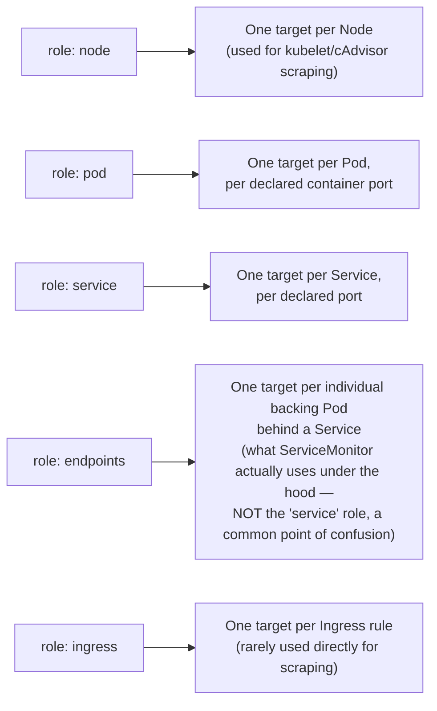
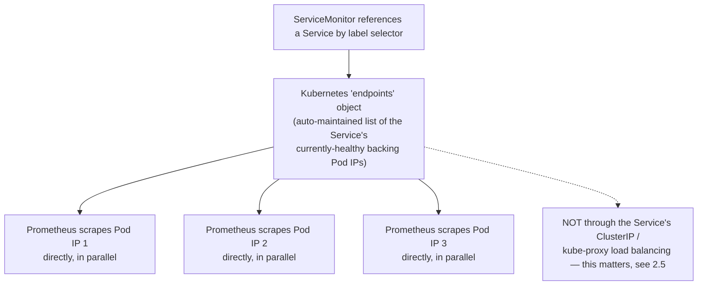
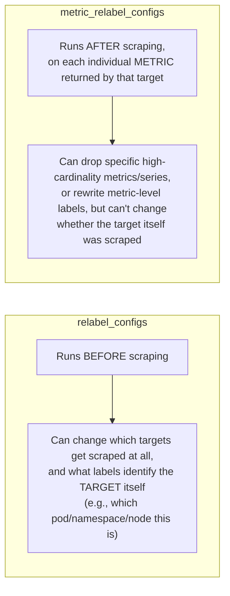
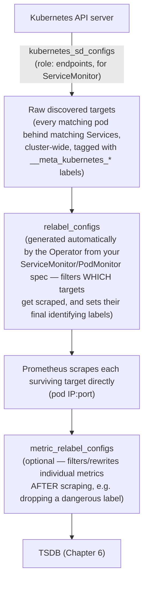

# Chapter 13: Service Discovery, ServiceMonitor, PodMonitor, and Relabeling

> **Part 9 — Service Discovery**

---

## 1. Objective

By the end of this chapter you will be able to:

- Explain exactly how Prometheus's Kubernetes service discovery (`kubernetes_sd_configs`) works at the mechanical level.
- Explain **relabeling** — the single most powerful and most misunderstood feature in Prometheus configuration — including the difference between discovery-time (`relabel_configs`) and post-scrape (`metric_relabel_configs`) relabeling.
- Write a correct `ServiceMonitor` and `PodMonitor` from scratch, and explain exactly what real Prometheus scrape config the Operator generates from each.
- Debug "why isn't Prometheus scraping my service" systematically, using the Prometheus UI's own discovery/target pages.
- Use a `Probe` + Blackbox Exporter for synthetic/external endpoint checks.

---

## 2. Concept

### 2.1 Raw Kubernetes service discovery: what Prometheus actually sees

Recall from Chapter 4: Prometheus continuously asks the Kubernetes API "what exists right now" via `kubernetes_sd_configs`, rather than relying on a static target list. There are several discovery **roles**, each surfacing a different Kubernetes object type as potential scrape targets:



**Critical, frequently-misunderstood fact:** a `ServiceMonitor` does not scrape "the Service" as a single target — it uses the `endpoints` role, which resolves a Service down to its individual backing Pods and scrapes **each Pod directly**, in parallel. This is precisely why Prometheus can show you per-pod metrics (like `up{pod="checkout-xyz"}`) even when you only ever wrote a `ServiceMonitor` that references a Service by name — the Service is just how you *found* the pods; Prometheus talks to each pod individually.



Raw discovery, on its own, surfaces **everything** matching the role — every pod, every service, in every namespace, whether or not you want it scraped. This raw firehose needs to be filtered and shaped, which is exactly what relabeling does.

### 2.2 Relabeling: the mechanism, explained precisely

**Relabeling** is a pipeline of rules applied to each discovered target's label set, run **before Prometheus decides whether to scrape it, and before it decides what the target's final labels will be.** Each rule can inspect existing labels (including special `__meta_*` labels that service discovery attaches, like `__meta_kubernetes_pod_label_app` or `__meta_kubernetes_namespace`) and `keep`, `drop`, rewrite, or synthesize labels.

```yaml
relabel_configs:
  - source_labels: [__meta_kubernetes_pod_annotation_prometheus_io_scrape]
    action: keep
    regex: "true"
  - source_labels: [__meta_kubernetes_namespace]
    target_label: namespace
  - source_labels: [__meta_kubernetes_pod_name]
    target_label: pod
```

Read this literally: rule 1 says "only keep targets where the pod has the annotation `prometheus.io/scrape: true`" (everything else is dropped before ever being scraped — this is the classic "opt-in via annotation" pattern that predates the Operator/ServiceMonitor model, and you'll still see it referenced in older Prometheus tutorials). Rules 2 and 3 copy Kubernetes metadata (`__meta_kubernetes_namespace`, a value service discovery already knows) into real, permanent labels (`namespace`, `pod`) that will actually be attached to every metric this target produces.

**The critical distinction that trips up almost everyone:**



This is precisely the mechanism referenced back in Chapter 6 as "a last-line-of-defense safety net" for cardinality problems — `metric_relabel_configs` with a `drop` action is exactly how you'd surgically remove a specific dangerous label or metric *after* it's already been emitted by a target, without needing to change the target's own instrumentation.

```yaml
metric_relabel_configs:
  - source_labels: [customer_id]
    action: drop
    regex: ".+"          # drop any series that has a non-empty customer_id label at all
```

### 2.3 How ServiceMonitor becomes real scrape config

Recall the `ServiceMonitor` CRD from Chapter 4/5. Here's a concrete one:

```yaml
apiVersion: monitoring.coreos.com/v1
kind: ServiceMonitor
metadata:
  name: checkoutservice
  namespace: monitoring
  labels:
    release: kube-prom-stack        # must match Prometheus CRD's serviceMonitorSelector
spec:
  selector:
    matchLabels:
      app: checkoutservice           # finds the Service with this label
  namespaceSelector:
    matchNames:
      - ecommerce                    # which namespace to look for that Service in
  endpoints:
    - port: metrics                  # must match a named port on the Service
      interval: 30s
      path: /metrics
```

The Prometheus Operator reads this and generates the equivalent of hand-written `kubernetes_sd_configs` (using the `endpoints` role, per 2.1) plus a full `relabel_configs` chain — automatically including rules that:

1. Filter down to only endpoints belonging to Services matching `spec.selector` in the specified namespace(s).
2. Match only the named port `metrics` (from the Service's port definitions, not an arbitrary number).
3. Attach standard labels: `namespace`, `pod`, `service`, `job` (job defaults to the Service name, though the ServiceMonitor's own name/labels can influence this).

**This is the entire value proposition of the Operator, made concrete:** instead of hand-writing 15+ lines of `kubernetes_sd_configs` and `relabel_configs` YAML correctly (easy to get subtly wrong), you write a ~15-line declarative `ServiceMonitor` and the Operator handles the translation reliably, every time, the same way, across every team.

### 2.4 PodMonitor — when there's no Service in the way

A `PodMonitor` is nearly identical but uses the `pod` discovery role directly, bypassing Services and Endpoints entirely:

```yaml
apiVersion: monitoring.coreos.com/v1
kind: PodMonitor
metadata:
  name: checkoutservice-pods
  namespace: monitoring
  labels:
    release: kube-prom-stack
spec:
  selector:
    matchLabels:
      app: checkoutservice
  podMetricsEndpoints:
    - port: metrics
      interval: 30s
```

**When you actually need PodMonitor over ServiceMonitor:** when pods don't sit behind a stable Service at all (some batch/Job-style workloads), or when you specifically need per-pod scraping without any dependency on Service/Endpoints object churn (occasionally relevant for very large, high-churn workloads where you want to minimize the Endpoints-object overhead). For the overwhelming majority of standard microservices (including virtually all of Online Boutique in Part 10), `ServiceMonitor` is the right default, precisely because a Service already exists for normal traffic routing anyway.

### 2.5 A subtlety worth knowing: Prometheus bypasses the Service's load balancing

As noted in 2.1's diagram: Prometheus, via the `endpoints` role, scrapes each backing pod's IP **directly** — it does not send scrape requests through the Service's ClusterIP (which would be load-balanced by kube-proxy to a single, effectively random pod each time). This is deliberate and essential: if Prometheus scraped through the Service ClusterIP, it would only ever see one arbitrary pod's metrics per scrape, with no way to reliably collect from every replica — direct per-pod scraping is what makes per-pod metrics (and therefore per-pod alerting, per-pod dashboards, and the entire "how many replicas are actually healthy" mental model from Chapter 12) possible at all.

### 2.6 Probe and Blackbox Exporter — a different kind of discovery entirely

Everything above assumes you're scraping a `/metrics` endpoint that a workload exposes about *itself* (white-box monitoring). Sometimes you need **black-box** monitoring instead: "is this URL reachable and responding correctly, from the outside, the way a real user or external service would experience it" — without any cooperation from the target at all (useful for third-party dependencies, public-facing endpoints, or simply validating your own ingress path end-to-end).

```yaml
apiVersion: monitoring.coreos.com/v1
kind: Probe
metadata:
  name: checkout-external-healthcheck
  namespace: monitoring
  labels:
    release: kube-prom-stack
spec:
  jobName: blackbox-checkout
  interval: 30s
  module: http_2xx                                 # a module defined in Blackbox Exporter's config
  prober:
    url: blackbox-exporter.monitoring.svc:9115       # the Blackbox Exporter DOES the probing
  targets:
    staticConfig:
      static:
        - https://shop.example.com/healthz           # the actual URL being tested
```

Here, Prometheus doesn't scrape `shop.example.com` directly at all — it scrapes the **Blackbox Exporter**, and passes the real target URL as a query parameter; Blackbox Exporter does the actual HTTP request (or TCP/ICMP/DNS probe, depending on the module) and reports success/failure/latency back as Prometheus metrics (`probe_success`, `probe_duration_seconds`). This is the mechanism behind synthetic uptime monitoring and is worth remembering as architecturally distinct from every other discovery mechanism in this chapter — it inverts the usual "target exposes its own metrics" model entirely.

---

## 3. Why This Matters

- This chapter answers the single most common real-world Prometheus support question: **"why isn't my service being scraped."** Every piece — discovery role, relabeling, label-selector matching between `ServiceMonitor` and `Prometheus` CRD (Chapter 5's `serviceMonitorSelectorNilUsesHelmValues`) — is a place this can silently fail, and now you know the entire chain well enough to debug it systematically rather than guessing.
- Understanding that `ServiceMonitor` scrapes pods directly (2.5), not through the Service's load-balanced ClusterIP, is what explains why Prometheus can produce true per-pod metrics — a fact that underlies essentially every per-pod dashboard and alert in this handbook.
- `metric_relabel_configs` is your actual, concrete tool for fixing a live cardinality problem (Chapter 6) without waiting for an application code change — a genuinely important operational lever, not just a config curiosity.

---

## 4. Architecture



---

## 5. Hands-on Lab

**1. Inspect what the Operator generated, for real, from your Chapter 5 install's default ServiceMonitors:**

```bash
kubectl -n monitoring get secret prometheus-kube-prom-stack-kube-prome-prometheus -o jsonpath='{.data.prometheus\.yaml\.gz}' | base64 -d | gunzip | less
```

(The exact secret name may vary slightly by chart version — `kubectl get secrets -n monitoring | grep prometheus` to find it.) Search this generated config for a `job_name` matching one of your default ServiceMonitors (e.g., `node-exporter`) and read the real `relabel_configs` the Operator produced — this is the exact mechanism from section 2.3, made concrete.

**2. Deploy a real ServiceMonitor** for a simple test workload:

```bash
kubectl create namespace sd-demo
kubectl create deployment sd-demo --image=nginx -n sd-demo
kubectl expose deployment sd-demo --port=80 --name=sd-demo-svc -n sd-demo
kubectl label service sd-demo-svc app=sd-demo -n sd-demo
```

```yaml
# sd-demo-servicemonitor.yaml
apiVersion: monitoring.coreos.com/v1
kind: ServiceMonitor
metadata:
  name: sd-demo
  namespace: monitoring
  labels:
    release: kube-prom-stack
spec:
  selector:
    matchLabels:
      app: sd-demo
  namespaceSelector:
    matchNames: ["sd-demo"]
  endpoints:
    - port: "80"          # nginx doesn't expose Prometheus metrics, so scrapes will show up but fail — that's fine for this exercise
      interval: 30s
```

*(Note: since the Service was created via `kubectl expose`, its port is likely named numerically or unnamed — adjust `port:` to match `kubectl get svc sd-demo-svc -n sd-demo -o yaml`'s actual port name/number.)*

```bash
kubectl apply -f sd-demo-servicemonitor.yaml
```

**3. Verify via the Prometheus UI**, port-forwarded per earlier chapters: go to **Status → Service Discovery** — find your `sd-demo` job and inspect the "Discovered Labels" vs. "Target Labels" columns side by side; this view exists specifically to show you relabeling's before/after effect. Then go to **Status → Targets** and confirm the target appears (likely `DOWN`, since nginx doesn't serve `/metrics` — that's expected and fine; the point of this exercise is proving discovery and relabeling worked, not achieving a healthy scrape).

**4. Clean up:** `kubectl delete -f sd-demo-servicemonitor.yaml && kubectl delete namespace sd-demo`.

---

## 6. Verification

- [ ] Explain why `ServiceMonitor` uses the `endpoints` discovery role rather than the `service` role, and why that distinction matters for per-pod metrics.
- [ ] Explain the difference between `relabel_configs` and `metric_relabel_configs` — what each runs on and when.
- [ ] Given a target that isn't being scraped, list the chain of things to check in order (label selector match on `Prometheus` CRD, namespace selector, port name match, network reachability).
- [ ] Explain what a `Probe` + Blackbox Exporter setup is for, and how it differs architecturally from a normal `ServiceMonitor`.
- [ ] Explain why Prometheus scraping pods directly (not via the Service ClusterIP) is essential for per-pod visibility.

---

## 7. Troubleshooting

| Symptom | Root Cause | Fix |
|---|---|---|
| ServiceMonitor applied but target never appears at all in Status → Service Discovery | Label selector mismatch between the `Prometheus` CRD's `serviceMonitorSelector` and this object's own labels (the `release: kube-prom-stack`-style label, Chapter 5). | `kubectl get prometheus -n monitoring -o yaml \| grep -A5 serviceMonitorSelector`; match labels exactly. |
| Target appears in Service Discovery but not in Targets | The `namespaceSelector` or the Service's `matchLabels` selector didn't actually match anything — discovery-level `relabel_configs` dropped it before scraping. | Compare "Discovered Labels" vs "Target Labels" in the Service Discovery UI page directly — a target with no Target Labels was dropped by relabeling. |
| Target appears and is scraped, but shows `DOWN` with a connection error | Port name/number mismatch, NetworkPolicy blocking the connection, or the app genuinely isn't listening/serving `/metrics` on that port. | Verify the Service's actual port name matches `endpoints[].port` exactly; `kubectl exec` into a debug pod and `curl` the target pod IP:port directly to isolate network vs. application-level failure. |
| One specific dangerous metric/label is still showing up in Prometheus despite an attempted fix | `metric_relabel_configs` drop rule regex doesn't actually match the label/metric as written (a very common practical mistake), or was added to the wrong ServiceMonitor/PodMonitor (the one for a *different* target than intended). | Test the regex carefully against real label values from Service Discovery's raw output; confirm which specific ServiceMonitor/PodMonitor is actually responsible for the offending target. |
| Blackbox Exporter `Probe` shows `probe_success == 0` | The exporter itself may be unreachable, the module (`http_2xx` etc.) may not match the target's actual response (e.g., a redirect not configured as expected), or the target is genuinely down. | Check Blackbox Exporter's own logs/metrics first (is *it* healthy) before assuming the probed target is the problem. |

---

## 8. Production Notes

- The **Service Discovery UI page** (`Status → Service Discovery`) showing "Discovered Labels" next to "Target Labels" is, in practice, the single most useful debugging tool for anything in this chapter — experienced Prometheus operators reach for it before anything else when a target isn't behaving as expected.
- Real multi-tenant clusters commonly use **`namespaceSelector`** deliberately (rather than `matchNames: []` meaning "any namespace") to prevent one team's `ServiceMonitor` from accidentally matching another team's identically-labeled Service in a different namespace — a genuine, occasionally surprising failure mode without explicit namespace scoping.
- `metric_relabel_configs` drop rules are a legitimate, common **incident-response tool** — when Chapter 6's cardinality-explosion incident happens for real, the fastest mitigation is almost always a `metric_relabel_configs` drop rule added to the relevant ServiceMonitor/PodMonitor, not waiting for an application code fix and redeploy.

---

## 9. Best Practices

1. **Prefer `ServiceMonitor` over `PodMonitor`** for any workload that already has a stable Service — it's the more common, better-understood pattern, and matches how the workload is already exposed for normal traffic.
2. **Always set an explicit `namespaceSelector`** in multi-tenant clusters rather than relying on defaults, to avoid unintended cross-namespace matches.
3. **Use the Service Discovery UI page as your first debugging step**, before checking logs or guessing at YAML mistakes.
4. **Keep `metric_relabel_configs` drop rules well-commented and tracked in version control**, since they represent a deliberate, sometimes emergency, data-shaping decision that a future engineer needs to understand the "why" behind.
5. **Test relabeling regex changes against real observed label values**, not assumed/hypothetical ones — copy actual values from the Service Discovery page rather than guessing at the format.

---

## 10. Interview Questions

1. **"How does a ServiceMonitor actually result in Prometheus scraping targets? Walk through the mechanism."** — The Operator translates the `ServiceMonitor` spec into `kubernetes_sd_configs` using the `endpoints` discovery role (resolving the target Service down to its individual backing pod IPs) plus a generated `relabel_configs` chain that filters to matching selectors/namespaces/ports and sets standard identifying labels; Prometheus then scrapes each backing pod directly.
2. **"What's the difference between `relabel_configs` and `metric_relabel_configs`?"** — `relabel_configs` runs before scraping and can affect which targets get scraped at all and how they're identified; `metric_relabel_configs` runs after scraping, per returned metric, and can drop/rewrite individual series but can't change whether the target itself was scraped.
3. **"Why does Prometheus scrape each pod behind a Service directly instead of going through the Service's ClusterIP?"** — Going through the ClusterIP would be load-balanced to one arbitrary pod per request by kube-proxy, making it impossible to reliably collect metrics from every replica; direct per-pod scraping via the `endpoints` role is what makes true per-pod visibility possible.
4. **"A ServiceMonitor is deployed correctly but Prometheus never picks it up. What's the most likely first thing to check?"** — Whether the `ServiceMonitor`'s labels match the `Prometheus` CRD's `serviceMonitorSelector` — a silent, no-error failure mode that's the most common real-world root cause for exactly this symptom.
5. **"How would you use relabeling to mitigate an active cardinality problem without an application code change?"** — Add a `metric_relabel_configs` drop rule targeting the offending metric name or label pattern on the relevant `ServiceMonitor`/`PodMonitor` — an immediate, config-only mitigation while a proper instrumentation fix is developed.
6. **"What is a `Probe` + Blackbox Exporter used for, and how does its discovery model differ from a normal ServiceMonitor?"** — Black-box, external-facing reachability/latency checks against arbitrary URLs (including third-party endpoints); architecturally inverted from normal scraping — Prometheus scrapes the Blackbox Exporter itself, which performs the actual probe against the real target and reports the result back as metrics.

---

## 11. Real Incident

**Company type:** Multi-tenant internal developer platform serving ~30 teams on a shared Kubernetes cluster.

**What happened:** Team A deployed a `ServiceMonitor` without an explicit `namespaceSelector` (relying on a permissive default), intending to scrape their own `payments` Service in the `team-a` namespace. Team B, in a completely different namespace, happened to also label one of their internal Services `app: payments` for unrelated naming reasons. Team A's ServiceMonitor began also scraping Team B's service — mostly harmless, except Team B's service occasionally returned large error payloads on a debug endpoint that happened to also be exposed on the same port, which Prometheus dutifully scraped as if it were metrics text, causing intermittent scrape parsing errors and noisy `up == 0` flapping that both teams' on-call engineers investigated independently, each confused about a target neither of them recognized as fully "theirs."

**Investigation:** Comparing `Status → Service Discovery`'s "Discovered Labels" between the two teams revealed two different Services, in two different namespaces, both matching Team A's ServiceMonitor's label selector — because the selector had no namespace scoping at all, exactly the gap section 2.1/Production Notes describes.

**Resolution:** Added an explicit `namespaceSelector: { matchNames: ["team-a"] }` to Team A's `ServiceMonitor`, immediately resolving the unintended cross-namespace match.

**Prevention:** The platform team introduced a policy (enforced via an admission policy/OPA-style check, foreshadowing Part 18's security content) requiring every `ServiceMonitor` and `PodMonitor` cluster-wide to declare an explicit `namespaceSelector` — turning this chapter's "best practice" into an actually enforced platform guardrail after a real, if relatively low-severity, incident revealed the gap.

---

## 12. Summary

- Prometheus's Kubernetes service discovery continuously surfaces targets by **role** (`node`, `pod`, `service`, `endpoints`, `ingress`); `ServiceMonitor` specifically uses the `endpoints` role to scrape each backing pod directly, not the Service's load-balanced ClusterIP.
- **Relabeling** is a two-stage mechanism: `relabel_configs` (pre-scrape, controls which targets get scraped and how they're identified) and `metric_relabel_configs` (post-scrape, filters/rewrites individual returned metrics) — and it's the actual mechanism the Operator uses under the hood to implement `ServiceMonitor`/`PodMonitor`.
- The **Service Discovery UI page** is the single best debugging tool for "why isn't my target being scraped" — always check it before anything else.
- `Probe` + Blackbox Exporter inverts the normal model for black-box/synthetic external reachability checks, with Prometheus scraping the exporter rather than the real target directly.

---

## 13. Next Chapter

This closes out **Part 9: Service Discovery.** Combined with Parts 4, 6, 7, and 8, you now understand the complete Prometheus data pipeline end to end — from raw Kubernetes API discovery, through relabeling, scraping, storage, and rule evaluation, across every metric source this handbook covers.

**Part 10, Chapter 14: Deploying and Instrumenting Online Boutique** is where theory becomes a real application: you'll deploy Google's Online Boutique microservices demo, extend it with a Postgres StatefulSet, a CronJob, and a Job (rounding out every Kubernetes workload type), instrument it properly, wire up real `ServiceMonitor`s using exactly the patterns from this chapter, and build the RED dashboards this handbook has been previewing since Chapter 2 — against real, live application traffic for the first time.
