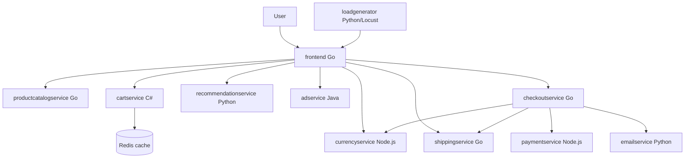
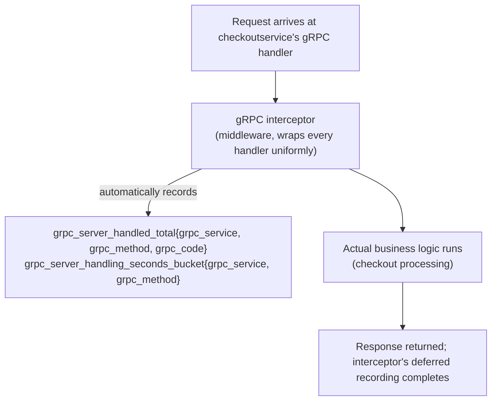
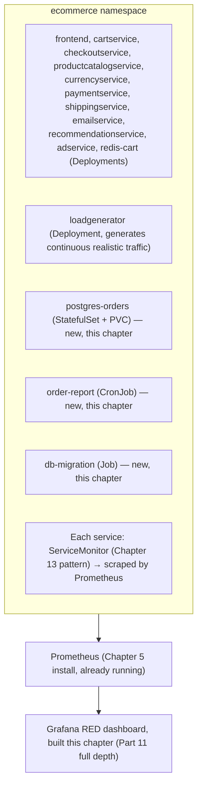

# Chapter 14: Deploying and Instrumenting Online Boutique

> **Part 10 — Monitoring Applications**

---

## 1. Objective

By the end of this chapter you will be able to:

- Deploy **Online Boutique** (Google's real, production-shaped 11-service polyglot microservices demo) to your cluster.
- Extend it with a **Postgres StatefulSet**, a **CronJob**, and a **Job** so your lab environment covers every major Kubernetes workload type this handbook promised.
- Understand Online Boutique's architecture well enough to reason about what "monitoring it properly" means service by service.
- Write real `ServiceMonitor`s for these services using exactly the patterns from Chapter 13.
- Build your first real RED dashboard (Chapter 2's framework, finally applied to live traffic) against genuine application data.

This is the chapter where the whole handbook stops being abstract — everything from Chapters 1–13 gets pointed at a real, running, multi-service application for the first time.

---

## 2. Concept

### 2.1 Why Online Boutique, specifically

Chapter 1 promised a real application, not toy examples, because monitoring concepts (cardinality, RED signals, service discovery, cross-service tracing) only become concrete against something with genuine service-to-service complexity. **Online Boutique** (`GoogleCloudPlatform/microservices-demo` on GitHub) is Google's own reference e-commerce demo, built specifically to exercise realistic cloud-native patterns:



**Why this specific app is genuinely useful for a monitoring handbook, not just a convenient choice:** 11 services across 5 languages (Go, C#, Python, Java, Node.js) means you'll see real-world polyglot instrumentation differences; gRPC-heavy internal traffic (rather than everything being simple HTTP/REST) exercises the RED-for-gRPC patterns from Chapter 9's query #56; a built-in **load generator** means you get continuous, realistic traffic without hand-crafting `curl` loops; and the checkout flow's multi-hop fan-out (`checkoutservice` calling four other services) is exactly the shape of request that makes distributed tracing (Part 16) genuinely necessary to understand, not just theoretically interesting.

### 2.2 Rounding out the workload types

Online Boutique, as shipped upstream, is Deployments + a Service + Redis (also a Deployment in the default manifests). Per this handbook's stated goal of exercising every Kubernetes workload type realistically, we extend it with three additions in this chapter's lab:

| Addition | Workload type | Why |
|---|---|---|
| **Postgres for orders** | StatefulSet + PVC | Gives you a real stateful workload alongside Online Boutique's stateless services — exercises PVC monitoring (Chapter 9 §2.10) and StatefulSet-specific KSM metrics (Chapter 12 §2.4) against something real, not just a demo. |
| **Nightly order-report Job trigger** | CronJob | Exercises Chapter 12 §2.7's CronJob monitoring patterns against a real, scheduled task. |
| **One-off DB migration** | Job | A single-run workload — exercises Job completion/failure metrics distinct from a CronJob's repeated execution. |

This gives your lab cluster, by the end of this chapter, every workload type named in this handbook's original scope: Deployments, a DaemonSet (Node Exporter, already running), StatefulSets, Jobs, CronJobs — plus Secrets, ConfigMaps, and PersistentVolumes throughout.

### 2.3 Instrumentation: what "monitoring it properly" means here

Online Boutique's services already emit some telemetry, but for this handbook's purposes, "instrumented properly" means every service exposes RED-shaped metrics (Chapter 2) on a `/metrics` (or equivalent) endpoint in Prometheus format:

```
 job:http_requests_total / grpc_server_handled_total     ← Rate + Errors
 job:http_request_duration_seconds_bucket                 ← Duration (Histogram, per Chapter 6 §2.5)
```

For gRPC services specifically (most of Online Boutique's internal traffic), the standard approach is the **grpc-ecosystem/go-grpc-prometheus** interceptor (for Go services) or equivalent per-language gRPC interceptor libraries — middleware that wraps every gRPC handler and automatically emits Rate/Errors/Duration metrics without touching individual business logic, exactly the "consistent instrumentation via shared middleware" pattern Chapter 2's Production Notes recommended.



This is precisely why RED instrumentation, done via shared middleware rather than hand-rolled per service, is a best practice worth internalizing here: you get consistent, comparable Rate/Errors/Duration metrics across all 11 services (5 different languages!) without every team reinventing metric naming and bucket boundaries independently — a real, common source of inconsistent dashboards in organizations that skip this step.

### 2.4 Histogram bucket boundaries — a deliberate choice, not a default

Recall Chapter 6's warning: histogram bucket boundaries must match your actual expected latency distribution, or `histogram_quantile()` produces inaccurate results. For Online Boutique's services, reasonable buckets differ meaningfully by service:

```
 productcatalogservice (fast, in-memory lookups):
   buckets: [0.001, 0.005, 0.01, 0.025, 0.05, 0.1, 0.25, 0.5]   # sub-second resolution matters

 checkoutservice (multi-hop fan-out, inherently slower):
   buckets: [0.05, 0.1, 0.25, 0.5, 1, 2.5, 5, 10]                # wider range needed
```

Using `productcatalogservice`'s tight buckets for `checkoutservice` would bucket nearly everything into the top `+Inf` bucket, making `histogram_quantile()` essentially useless for it — a concrete, worked illustration of Chapter 6's abstract warning, now applied to real services with genuinely different latency characteristics.

---

## 3. Why This Matters

- Every remaining application-facing chapter in this handbook (Grafana dashboards in Part 11, alerting in Part 12, tracing in Part 16) uses Online Boutique as its running example — this chapter is the dependency all of them share.
- Seeing RED instrumentation applied consistently across 5 different languages via shared middleware, rather than 5 different bespoke implementations, is a direct, concrete demonstration of why Chapter 2's "instrument via shared middleware" production note matters in practice, not just in theory.
- The Postgres StatefulSet, CronJob, and Job additions mean every workload-type-specific monitoring pattern from Parts 6–9 now has something real to point at, rather than remaining abstract.

---

## 4. Architecture



---

## 5. Hands-on Lab

**1. Deploy Online Boutique:**

```bash
kubectl create namespace ecommerce
git clone --depth 1 https://github.com/GoogleCloudPlatform/microservices-demo.git
kubectl apply -n ecommerce -f microservices-demo/release/kubernetes-manifests.yaml
kubectl get pods -n ecommerce -w
```

Wait until all pods are `Running`. Expose the frontend via NodePort (per this handbook's consistent NodePort-only approach):

```bash
kubectl patch svc frontend -n ecommerce -p '{"spec": {"type": "NodePort", "ports": [{"port": 80, "targetPort": 8080, "nodePort": 30080}]}}'
```

Browse to `http://<node-ip>:30080` (or port-forward on Kind, per Chapter 5's note) and confirm the storefront loads.

**2. Add the Postgres StatefulSet:**

```yaml
# postgres-orders.yaml
apiVersion: apps/v1
kind: StatefulSet
metadata:
  name: postgres-orders
  namespace: ecommerce
spec:
  serviceName: postgres-orders
  replicas: 1
  selector:
    matchLabels: { app: postgres-orders }
  template:
    metadata:
      labels: { app: postgres-orders }
    spec:
      containers:
        - name: postgres
          image: postgres:16
          env:
            - name: POSTGRES_PASSWORD
              valueFrom:
                secretKeyRef: { name: postgres-orders-secret, key: password }
          ports: [{ containerPort: 5432 }]
          volumeMounts:
            - name: data
              mountPath: /var/lib/postgresql/data
  volumeClaimTemplates:
    - metadata: { name: data }
      spec:
        accessModes: ["ReadWriteOnce"]
        resources: { requests: { storage: 2Gi } }
---
apiVersion: v1
kind: Secret
metadata: { name: postgres-orders-secret, namespace: ecommerce }
stringData: { password: "labpassword" }
```

```bash
kubectl apply -f postgres-orders.yaml
kubectl get statefulset,pvc -n ecommerce
```

**3. Add the CronJob and Job:**

```yaml
# order-report-cronjob.yaml
apiVersion: batch/v1
kind: CronJob
metadata: { name: order-report, namespace: ecommerce }
spec:
  schedule: "0 2 * * *"
  jobTemplate:
    spec:
      template:
        spec:
          restartPolicy: OnFailure
          containers:
            - name: report
              image: busybox
              command: ["sh", "-c", "echo 'Generating nightly order report...'; sleep 5"]
---
apiVersion: batch/v1
kind: Job
metadata: { name: db-migration, namespace: ecommerce }
spec:
  template:
    spec:
      restartPolicy: Never
      containers:
        - name: migrate
          image: busybox
          command: ["sh", "-c", "echo 'Running one-off DB migration...'; sleep 5"]
```

```bash
kubectl apply -f order-report-cronjob.yaml
kubectl get cronjob,job -n ecommerce
```

**4. Write a real ServiceMonitor** for `checkoutservice`, using exactly Chapter 13's pattern:

```yaml
apiVersion: monitoring.coreos.com/v1
kind: ServiceMonitor
metadata:
  name: checkoutservice
  namespace: monitoring
  labels: { release: kube-prom-stack }
spec:
  selector:
    matchLabels: { app: checkoutservice }
  namespaceSelector:
    matchNames: ["ecommerce"]
  endpoints:
    - port: grpc
      interval: 15s
```

*(Note: upstream Online Boutique's default manifests may not name a metrics port or expose Prometheus-format metrics out of the box on every service — treat adding the interceptor middleware from section 2.3 and a named `metrics`/`grpc` port on each Deployment/Service as the concrete "instrumentation" exercise for this lab; the upstream repo's issues/docs and the interceptor library's own README are the right place to wire this in per-language.)*

**5. Verify via Prometheus's Targets/Service Discovery pages** (Chapter 13's debugging workflow) that `checkoutservice` is being scraped, then repeat for at least 2 more services.

**6. Confirm KSM sees your new workloads:**

```promql
kube_statefulset_status_replicas_ready{namespace="ecommerce"}
kube_cronjob_status_last_schedule_time{namespace="ecommerce"}
kube_job_status_succeeded{namespace="ecommerce"}
```

---

## 6. Verification

- [ ] Online Boutique's storefront is reachable via NodePort and functions end to end (browse products, add to cart, checkout).
- [ ] `kubectl get pods -n ecommerce` shows all 11+ services `Running`.
- [ ] The Postgres StatefulSet has a `Bound` PVC and is `Running`.
- [ ] The CronJob has produced at least one successful Job run (`kubectl get jobs -n ecommerce`, or trigger manually with `kubectl create job --from=cronjob/order-report manual-test -n ecommerce`).
- [ ] At least one real `ServiceMonitor` is deployed and its target shows `UP` in the Prometheus UI.
- [ ] You can explain, in your own words, why gRPC interceptor-based instrumentation gives consistent RED metrics across 5 different languages without per-service bespoke code.

---

## 7. Troubleshooting

| Symptom | Root Cause | Fix |
|---|---|---|
| Some Online Boutique pods stuck `Pending` | Insufficient cluster resources — the full demo (11 services + loadgenerator) needs meaningfully more CPU/memory than a bare-minimum lab cluster. | Increase Kind/Minikube resource allocation, or scale down `loadgenerator`/non-essential services temporarily. |
| `frontend` loads but shows errors on specific pages (e.g., recommendations) | A dependent service (e.g., `recommendationservice`) isn't ready yet, or crashed — check `kubectl logs`. | `kubectl get pods -n ecommerce` for restart counts; `kubectl logs <pod> -n ecommerce` for the specific failing service. |
| Postgres StatefulSet pod stuck `Pending` | No default StorageClass, or insufficient PVC capacity available (same class of issue as Chapter 5's storage troubleshooting). | `kubectl get storageclass`; `kubectl describe pvc -n ecommerce` for the specific binding failure reason. |
| ServiceMonitor deployed but target never appears | Exactly Chapter 13's troubleshooting table applies here — check label selector match on the `Prometheus` CRD first, then namespace selector, then port name. | Revisit Chapter 13 section 7 systematically. |
| CronJob never runs / `last_schedule_time` never updates | `spec.suspend: true` set accidentally, or the schedule syntax is wrong (5-field cron: minute hour day month weekday). | `kubectl get cronjob order-report -n ecommerce -o yaml` and check both `spec.suspend` and `spec.schedule`. |

---

## 8. Production Notes

- Real organizations deploying a demo/reference app for internal training purposes commonly namespace-isolate it clearly (as done here, `ecommerce`) and tag it obviously as non-production (labels, a banner in the frontend if practical) — avoiding the surprisingly common real mistake of a demo app accidentally being treated as load-bearing months later because nobody remembered it was "just a demo."
- **Consistent instrumentation via shared interceptor/middleware libraries** (section 2.3) is exactly how large real organizations avoid the "every team's dashboards look different and use different metric names" problem — this is worth treating as a genuine platform-team responsibility (providing and mandating the shared library), not something left to individual service teams to reinvent.
- Histogram bucket boundaries tuned per-service (section 2.4) is a real production discipline — many organizations get this wrong once (generic default buckets copy-pasted everywhere) and only fix it after noticing `histogram_quantile()` output looks suspiciously coarse or flat for a particular service, exactly as warned about back in Chapters 6 and 8.

---

## 9. Best Practices

1. **Isolate demo/reference applications in their own clearly-labeled namespace**, never mixed into a production-equivalent namespace.
2. **Standardize RED instrumentation via shared middleware/interceptors per language**, provided and maintained centrally, rather than leaving each service team to hand-roll it.
3. **Tune histogram bucket boundaries per service based on real expected latency**, not a single generic default copied everywhere.
4. **Verify new ServiceMonitors via the Prometheus UI immediately after deploying them** (Chapter 13's workflow), rather than assuming they're working and finding out much later when a dashboard is empty.
5. **Exercise every Kubernetes workload type in your lab environment deliberately** (as this chapter does with the StatefulSet/CronJob/Job additions) so every later chapter's patterns have something concrete to validate against.

---

## 10. Interview Questions

1. **"Why is a real, multi-service demo application more useful for learning monitoring than a single toy service?"** — It exercises genuine cross-service complexity (fan-out requests, polyglot instrumentation, realistic failure correlation) that a single-service toy example can't demonstrate, and is what makes concepts like distributed tracing and service-dependency-aware alerting concretely necessary rather than abstractly interesting.
2. **"Why use a shared gRPC interceptor for instrumentation instead of having each service add its own metrics code?"** — It guarantees consistent metric names, label conventions, and semantics across every service and language, which is what makes cross-service dashboards and alerts comparable and avoids the common real-world problem of every team's telemetry looking subtly different.
3. **"Why might two different services in the same application need different histogram bucket boundaries?"** — Because their real latency distributions differ meaningfully (a fast in-memory lookup vs. a multi-hop fan-out call); using the same tight buckets for both would bucket the slower service's requests almost entirely into the `+Inf` bucket, making `histogram_quantile()` inaccurate for it.
4. **"What Kubernetes workload types would you want represented in a realistic lab/staging environment, and why?"** — At minimum Deployments (stateless services), a DaemonSet (node-level agents), StatefulSets (stateful data stores), Jobs (one-off tasks), and CronJobs (scheduled tasks) — each has genuinely different monitoring patterns (Chapters 6–9, 12) that can't be fully validated without a real instance of that workload type present.

---

## 11. Real Incident

**Company type:** Enterprise platform team running an internal training environment based on a public microservices demo, similar in spirit to Online Boutique.

**What happened:** The demo application, originally deployed purely for onboarding new engineers to practice on, was deployed into a namespace that wasn't clearly distinguished from other internal tooling namespaces. Over a year, several internal tools began quietly depending on data or endpoints from the "demo" deployment (engineers found it convenient and just pointed real internal scripts at it), without anyone formally approving this as production usage. When the platform team went to decommission the demo during a cluster migration, several unrelated internal workflows broke unexpectedly.

**Root cause:** No clear labeling, documentation, or lifecycle ownership marking the demo application as explicitly non-production and subject to removal at any time — exactly the failure mode this chapter's Production Notes warns about.

**Resolution:** Restored the demo temporarily to unblock the dependent workflows, then worked with each dependent team to either migrate to a proper, owned service or explicitly accept and document the dependency with a real support commitment.

**Prevention:** All demo/training deployments going forward were required to carry a standard `purpose: demo-do-not-depend-on` label, be namespace-isolated, and be automatically torn down and redeployed on a rolling schedule specifically to make silent unauthorized dependencies fail fast and visibly, rather than accumulating unnoticed for a year.

---

## 12. Summary

- **Online Boutique** — 11 services, 5 languages, gRPC-heavy, with a built-in load generator — is the real reference application this handbook uses from here forward, deployed and exposed via NodePort exactly like the monitoring stack itself.
- A **Postgres StatefulSet, CronJob, and Job** were added specifically to exercise every Kubernetes workload type this handbook's monitoring patterns need something real to validate against.
- **Consistent RED instrumentation via shared gRPC interceptor middleware** across all services/languages avoids the common real-world problem of inconsistent, incomparable telemetry across teams.
- **Histogram bucket boundaries should be tuned per service** based on real expected latency — a direct, concrete application of Chapters 6 and 8's earlier warnings.

---

## 13. Next Chapter

This closes out **Part 10: Monitoring Applications.** You now have a real, running, realistically complex application generating genuine telemetry across every Kubernetes workload type.

**Part 11, Chapter 15: Grafana Mastery** finally builds the dashboards this handbook has been promising since Chapter 2 — variables, folders, permissions, annotations, transformations, heatmaps, and dashboard-as-code provisioning — all built against Online Boutique's real, live traffic for the first time.
