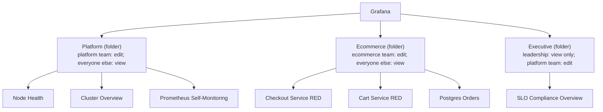
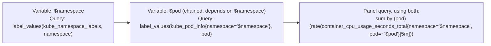
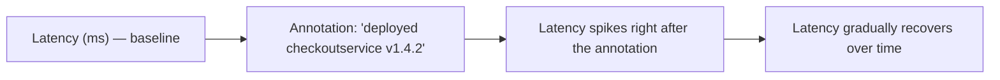
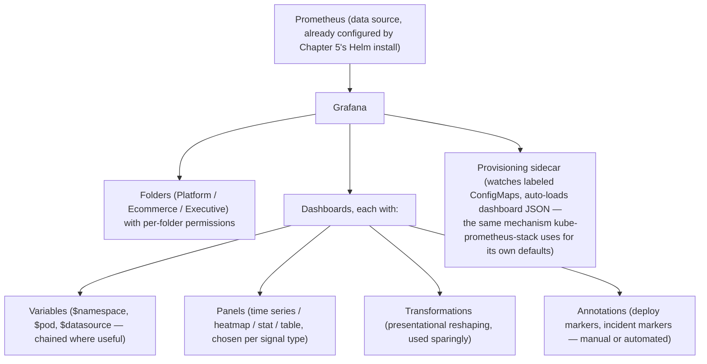

# Chapter 15: Grafana Mastery

> **Part 11 — Grafana**

---

## 1. Objective

By the end of this chapter you will be able to:

- Organize dashboards using **folders** and **permissions** appropriately for a multi-team organization.
- Build dashboards driven by **variables** (templating) so one dashboard works across every namespace/service/pod without duplication.
- Use **annotations** to correlate deploys and incidents directly onto graphs.
- Apply **transformations** to reshape query results without changing the underlying PromQL.
- Choose the right **panel type** (time series, heatmap, histogram, stat, table) for a given signal.
- **Provision dashboards as code** (JSON models + ConfigMaps) instead of manually clicking through the UI — the production-correct approach.
- Build a real, working RED dashboard for Online Boutique's `checkoutservice`, end to end.

---

## 2. Concept

### 2.1 Folders and permissions

Grafana organizes dashboards into **folders**, and permissions (view/edit/admin) can be set per-folder, not just per-dashboard — the practical unit of access control in any real multi-team Grafana instance.



**Why folder-level permissions matter in practice:** without them, every dashboard edit is either "anyone can edit anything" (chaos — dashboards get silently broken by well-meaning but uninformed changes) or "only admins can edit anything" (a bottleneck that recreates exactly the centralization problem Chapter 4 solved for scrape config with the Operator). Folder-scoped permissions let each team own their own dashboards fully, while platform/leadership-facing dashboards stay protected from accidental edits — mirroring the same self-service-with-guardrails philosophy as `ServiceMonitor`s.

### 2.2 Variables (templating) — one dashboard, every service

A **variable** is a dashboard-level dropdown that gets substituted into every panel's PromQL query, turning one dashboard definition into an effectively unlimited number of views.



This is precisely how kube-prometheus-stack's own default "Node Exporter / Nodes" dashboard (which you've been looking at since Chapter 5) works — one dashboard definition, a `$node` variable, and it renders correctly for any node in your cluster without anyone building 20 near-duplicate dashboards. **Chained variables** (where `$pod`'s query depends on `$namespace`'s current selection, as above) are what makes drill-down navigation feel natural rather than requiring the user to manually filter a giant unfiltered list.

A `$datasource` variable is also common — letting the same dashboard JSON run against different Prometheus instances (e.g., staging vs. production, or per-cluster in a multi-cluster setup, foreshadowing Part 17's Thanos multi-cluster federation) without duplicating the dashboard definition per environment.

### 2.3 Annotations — correlating deploys with graphs

An **annotation** is a vertical marker line drawn on time-series panels at a specific timestamp, typically representing an event: a deploy, an incident start/end, a config change.



**Why this matters enormously in real incident response:** the single most common root-cause question during an incident is "did something change right before this started?" — an annotation showing "deploy happened at 14:02" sitting directly on top of a latency graph that started spiking at 14:03 turns a 20-minute "let's check the deploy log" investigation into an instant visual correlation. Annotations can be added manually (a human clicking on the graph during an incident, or via the API), or automatically — a common, high-value production pattern is having your CI/CD pipeline call Grafana's annotation API automatically on every deploy, so this correlation is available by default without anyone remembering to add it manually mid-incident.

### 2.4 Transformations — reshaping data without touching PromQL

**Transformations** operate on query *results*, after Prometheus has already returned them, letting you reshape, merge, or calculate on the data without changing the underlying query — useful when the reshaping is presentational rather than a genuine change to what's being measured.

Common transformations:
- **Merge** — combine multiple queries' results into a single table (e.g., showing CPU and memory usage for the same pods side by side).
- **Organize fields** — rename/reorder/hide columns for a cleaner table view, without needing a different query.
- **Add field from calculation** — derive a new column (e.g., a percentage) from two existing query results, when doing so in PromQL itself would be awkward or when you specifically want the raw values visible alongside the calculated one.
- **Filter by value** — client-side filtering of already-returned results (a lighter-weight alternative to adding another PromQL label matcher, useful for quick, ad hoc dashboard exploration).

The general guidance: **prefer solving a data-shaping problem in PromQL first** (it's more efficient — Prometheus does the work once, server-side) and reach for a transformation when the reshaping is genuinely presentational (renaming a column for readability) or when combining genuinely separate queries into one visual (which PromQL alone can't do across unrelated metric families without an artificial join).

### 2.5 Choosing the right panel type

| Panel type | Best for | Example from this handbook |
|---|---|---|
| **Time series** | Trends over time — the default, most common choice | Request rate, error rate, latency percentiles (RED) |
| **Stat** | A single current number, optionally with a sparkline and threshold coloring | Current error budget remaining (%), current node count |
| **Gauge** | A single number against a clear min/max range, visually | PVC usage %, CPU utilization % |
| **Table** | Multi-dimensional comparison across many series at once | Top 10 pods by memory, per-service error rate breakdown |
| **Heatmap** | Distribution over time — how a value's *spread* changes, not just its average | Latency Histogram bucket distribution over time (see 2.6) |
| **Histogram** | A single-point-in-time distribution snapshot | Current latency distribution across all requests in the selected window |
| **Bar gauge** | Ranked comparison across a moderate number of series | Per-namespace CPU usage ranking |

**A common beginner mistake worth calling out directly:** using a plain time-series panel with three separate lines for p50/p90/p99 is fine and common, but it hides *how the full distribution is shaped* — a **heatmap** built directly from a Histogram metric's raw buckets shows you the complete, evolving distribution shape over time (e.g., "is there a growing second cluster of slow requests separate from the main fast cluster?") in a way three percentile lines alone cannot reveal. This is a genuinely underused, high-value panel type once engineers learn to read it.

### 2.6 Building a heatmap from a Histogram (a concrete walkthrough)

```promql
sum by (le) (rate(http_request_duration_seconds_bucket{job="checkoutservice"}[5m]))
```

Fed into Grafana's **Heatmap** panel type (with "Format" set to "Heatmap" so Grafana understands the `le` buckets represent histogram buckets, not arbitrary series), this renders time on the X-axis, latency bucket on the Y-axis, and color intensity representing request volume in that bucket at that time — visually, you can immediately spot bimodal latency distributions, a slowly widening tail, or a sudden shift in the bulk of traffic's typical latency, all of which are difficult or impossible to see in a simple averaged or percentile-line time-series panel.

### 2.7 Dashboard provisioning — dashboards as code

Building dashboards by clicking through the Grafana UI is fine for prototyping, but **production dashboards should be version-controlled, code-reviewed, and deployed automatically** — exactly the same GitOps principle Chapter 7 applied to `PrometheusRule`. Grafana supports this via **provisioning**: dashboard JSON files, mounted into Grafana (commonly via a ConfigMap in Kubernetes) and a provisioning config pointing at that directory.

```yaml
apiVersion: v1
kind: ConfigMap
metadata:
  name: checkout-red-dashboard
  namespace: monitoring
  labels:
    grafana_dashboard: "1"    # kube-prometheus-stack's sidecar watches for this label
data:
  checkout-red.json: |
    { "title": "Checkout Service - RED", "panels": [ ... ] }
```

kube-prometheus-stack (your Chapter 5 install) already ships a **Grafana sidecar container** that watches for ConfigMaps carrying this specific label and automatically loads/reloads them into Grafana — this is precisely how its own default dashboards ("Node Exporter / Nodes," "Kubernetes / Compute Resources," etc.) get into your Grafana instance without anyone manually importing them; you're using the exact same mechanism for your own custom dashboards.

**Why the JSON model matters:** every dashboard, panel, variable, and transformation described conceptually in this chapter ultimately serializes to a single JSON document — this is what makes "dashboards as code" possible at all, and it's also exactly what a `Get JSON Model` export (available in Grafana's UI for any dashboard, including community-shared ones) gives you: a portable, git-committable artifact.

---

## 3. Why This Matters

- Every alert this handbook builds in Part 12 exists because a human first noticed (or would have noticed) a pattern on a dashboard — Grafana is the primary human interface to everything Parts 1–10 built, and getting it right (folders, variables, provisioning) is what makes the difference between a monitoring platform people actually use daily versus one that gets ignored after the first week.
- Dashboard-as-code provisioning (2.7) is the direct Grafana-side counterpart to Chapter 7's `PrometheusRule` GitOps principle — treating dashboards with the same rigor as any other production configuration, not as UI-only artifacts nobody reviews.
- Annotations (2.3) are one of the highest-leverage, most underused Grafana features in real incident response — automating deploy annotations is a small investment with an outsized payoff during your very next incident.

---

## 4. Architecture



---

## 5. Hands-on Lab

**1. Explore an existing default dashboard's variable structure.** Open "Kubernetes / Compute Resources / Namespace (Pods)" in your Grafana (from Chapter 5's install) — inspect its `$namespace` variable definition (Dashboard Settings → Variables) and note how every panel's query references `$namespace`.

**2. Build a real RED dashboard for `checkoutservice`** from Chapter 14's deployment. Create a new dashboard with:
   - A `$namespace` variable (default `ecommerce`).
   - Panel 1 (time series, "Rate"): `sum(rate(grpc_server_handled_total{namespace="$namespace", grpc_service=~".*Checkout.*"}[5m]))`
   - Panel 2 (time series, "Errors"): `sum(rate(grpc_server_handled_total{namespace="$namespace", grpc_service=~".*Checkout.*", grpc_code!="OK"}[5m]))`
   - Panel 3 (time series, "Duration p50/p90/p99"): three queries using `histogram_quantile()` per Chapter 8's canonical pattern.
   - Panel 4 (heatmap, "Latency Distribution"): `sum by (le) (rate(grpc_server_handling_seconds_bucket{namespace="$namespace"}[5m]))`, Format set to Heatmap.

**3. Add a manual annotation.** On any panel, Ctrl+click (or Cmd+click on Mac) a point on the graph, add a note like "manually testing annotations," and observe the marker appear across all panels in the dashboard simultaneously (annotations are dashboard-scoped by default).

**4. Export and provision it as code.** Use Grafana's dashboard settings → JSON Model to export your new dashboard, save it as `checkout-red.json`, wrap it in a labeled ConfigMap (per section 2.7), and `kubectl apply` it — then delete your manually-created dashboard from the UI and confirm it reappears automatically via the sidecar within a minute or two, proving the provisioning mechanism works end to end.

**5. Set up folder permissions.** Create an "Ecommerce" folder, move your dashboard into it, and (if using Grafana's built-in auth) restrict edit access to a specific team/role — even in a single-user lab setup, walk through the permissions UI to understand the model for when you operate this for real multiple teams.

---

## 6. Verification

- [ ] You have a working RED dashboard for `checkoutservice` with Rate, Errors, and Duration (p50/p90/p99) panels, all driven by a `$namespace` variable.
- [ ] You've built at least one heatmap panel from raw Histogram bucket data and can explain what it shows that a percentile-lines panel doesn't.
- [ ] Your dashboard is provisioned via a labeled ConfigMap, not manually created and left un-versioned in the UI.
- [ ] You can explain the difference between solving a data-shaping need in PromQL versus in a Grafana transformation, and when each is appropriate.
- [ ] You understand folder-level permissions well enough to describe how you'd structure Grafana for a 5-team organization.

---

## 7. Troubleshooting

| Symptom | Root Cause | Fix |
|---|---|---|
| Panel shows "No Data" despite the underlying PromQL working fine in the Prometheus UI | Wrong Grafana data source selected on the panel, or a variable substitution producing an empty/invalid label value. | Check the panel's data source dropdown; use the query inspector (panel edit → Query Inspector) to see the exact request Grafana sent and the exact response. |
| A dashboard variable dropdown is empty | The `label_values()` query backing the variable doesn't match any real data yet (e.g., `$namespace` querying a metric that doesn't exist in your cluster). | Test the variable's underlying query directly in the Prometheus UI first; confirm the referenced metric actually has data. |
| Provisioned dashboard ConfigMap applied but never appears in Grafana | Missing or incorrect `grafana_dashboard: "1"` label (kube-prometheus-stack's sidecar watches for this specific label by default — verify against your actual Helm values, as it's configurable). | `kubectl get configmap <name> -n monitoring --show-labels`; check the Grafana sidecar container's own logs (`kubectl logs <grafana-pod> -c grafana-sc-dashboard -n monitoring`) for pickup errors. |
| Heatmap panel renders but looks like meaningless colored blocks, not a smooth distribution | "Format" not set to "Heatmap" (Grafana is treating each `le` bucket as an unrelated series instead of a histogram), or bucket boundaries are too sparse for the actual data (Chapter 14 §2.4's warning). | Explicitly set panel Format to Heatmap; revisit the underlying metric's bucket boundaries if the shape still looks too coarse. |
| Editing a dashboard in the UI, but changes disappear after a Grafana pod restart | The dashboard was provisioned from a ConfigMap (file-based provisioning is typically read-only from the UI's perspective by design) — UI edits to a provisioned dashboard don't persist back to the source file. | This is expected, correct behavior for GitOps-managed dashboards; make the change in the JSON/ConfigMap source and re-apply, not via the UI, for anything meant to be permanent. |

---

## 8. Production Notes

- The "UI edits don't persist on a provisioned dashboard" behavior (last Troubleshooting row) is a **deliberate design property**, not a bug — it's what guarantees the ConfigMap (and therefore Git, if you're managing ConfigMaps via GitOps) remains the actual source of truth, exactly mirroring Chapter 7's `PrometheusRule` GitOps philosophy applied to dashboards.
- Real organizations commonly maintain a small internal library of **dashboard JSON templates/generators** (sometimes using tools like Grafonnet/Jsonnet, or simple templating scripts) specifically so a new microservice can get a consistent, correctly-structured RED dashboard automatically at creation time, rather than every team hand-building slightly different panels from scratch — directly extending this chapter's "dashboards as code" principle into "dashboards as code, generated consistently."
- **Automated deploy annotations** (section 2.3) are consistently rated by real SRE teams as one of the highest-value-per-effort Grafana features — a single CI/CD pipeline step calling Grafana's annotation API pays for itself the first time it saves someone 15 minutes of "did we just deploy something" guessing during an active incident.

---

## 9. Best Practices

1. **Provision production dashboards as code**, version-controlled and code-reviewed, never left as UI-only, un-backed-up artifacts.
2. **Use chained variables** so dashboards support natural drill-down (cluster → namespace → pod) rather than requiring separate dashboards per drill-down level.
3. **Automate deploy/incident annotations** via CI/CD and incident-tooling API calls — don't rely on humans remembering to add them manually mid-incident.
4. **Reach for heatmaps when the distribution's shape matters**, not just its percentiles — especially for latency, where bimodal or shifting distributions are common and important.
5. **Structure folders and permissions around team ownership**, mirroring the same self-service-with-guardrails philosophy used for `ServiceMonitor`s and `PrometheusRule`s.
6. **Prefer PromQL over Grafana transformations for genuine data-shaping**; reserve transformations for presentational reshaping or combining otherwise-unrelated queries.

---

## 10. Interview Questions

1. **"How do Grafana dashboard variables work, and why are chained variables useful?"** — A variable is a dashboard-level dropdown substituted into panel queries via `label_values()` or similar; chaining (one variable's query depending on another's current selection, e.g. `$pod` depending on `$namespace`) enables natural drill-down navigation without needing separate dashboards per level.
2. **"Why would you provision Grafana dashboards as code instead of building them in the UI?"** — Version control, code review, reproducibility across environments, and preventing silent, unreviewed, un-backed-up changes — the same GitOps rationale applied to `PrometheusRule`s in Chapter 7, now applied to dashboards.
3. **"What does a heatmap panel show that three percentile lines (p50/p90/p99) don't?"** — The full, evolving shape of the underlying distribution — e.g., a bimodal latency pattern (two distinct clusters of fast and slow requests) that percentile lines alone would obscure, since percentiles only summarize the distribution at single fixed points.
4. **"When would you use a Grafana transformation instead of just changing the PromQL query?"** — When the reshaping is purely presentational (renaming/reordering columns) or when combining results from genuinely separate queries into a single visual that PromQL alone can't join — prefer solving it in PromQL first whenever the reshaping is a real change to what's being measured, since that's more efficient and keeps the transformation layer simple.
5. **"How would you structure Grafana folders and permissions for an organization with 5 independent teams and one platform team?"** — One folder per team (edit access for that team, view-only for others), plus a shared "Platform" folder for cluster-wide dashboards and an "Executive" folder with tightly restricted edit access for leadership-facing SLO/summary dashboards — mirroring the same self-service-with-guardrails model as CRD-based scrape/rule configuration.

---

## 11. Real Incident

**Company type:** Retail e-commerce company, previously discussed patterns applied to Online-Boutique-style architecture.

**What happened:** During a major incident (checkout latency spike), the on-call engineer spent the first 12 minutes manually asking in Slack "did anyone deploy anything recently?" and cross-referencing CI/CD logs by hand, before finally confirming a deploy 90 seconds before the spike began — a deploy that, in hindsight, was the obvious first suspect the entire time.

**Root cause:** No automated deploy annotations existed on the team's Grafana dashboards; correlating "did a deploy cause this" required manual, cross-tool detective work under time pressure instead of a single glance at the graph.

**Resolution:** Once identified, the offending deploy was rolled back and latency recovered within 2 minutes of the rollback — the actual technical fix was fast; the 12 minutes lost were entirely attributable to the missing correlation tooling, not investigation complexity.

**Prevention:** The team added a mandatory CI/CD pipeline step that calls Grafana's annotation API on every production deploy, tagging the annotation with the service name, version, and a link back to the deploy pipeline run — turning "did anyone deploy anything recently" from a multi-minute Slack archaeology exercise into an instant visual check on any dashboard.

**Postmortem quote (paraphrased):** "We had all the data to answer this question in under 10 seconds. We just hadn't wired it into the one place anyone actually looks during an incident." — precisely the argument for section 2.3 and this chapter's Best Practice #3.

---

## 12. Summary

- **Folders and permissions** give teams self-service ownership of their own dashboards while protecting shared/leadership-facing ones — the same philosophy as CRD-based scrape/rule config, applied to Grafana.
- **Variables** (especially chained ones) turn one dashboard definition into a drill-down-capable view across every namespace/pod/cluster, avoiding dashboard duplication.
- **Annotations**, especially automated deploy annotations, are a high-leverage, underused feature that directly accelerates real incident correlation.
- **Transformations** reshape query results presentationally; prefer solving genuine data-shaping needs in PromQL itself.
- **Heatmaps** reveal distribution shape in ways percentile-line panels can't, and are built directly from raw Histogram bucket data.
- **Dashboard provisioning** (labeled ConfigMaps + the Grafana sidecar) is the production-correct, GitOps-compatible way to manage dashboards — exactly the mechanism kube-prometheus-stack already uses for its own defaults.

---

## 13. Next Chapter

This closes out **Part 11: Grafana.** You now have real, code-managed dashboards giving humans visibility into everything this handbook's stack collects.

**Part 12, Chapter 16: Alertmanager — Routing, Grouping, Silencing, Integrations** turns visibility into action: how firing alerts (Chapter 7) get deduplicated, grouped, routed to the right team via Slack/Teams/Email/PagerDuty/webhooks, escalated when unacknowledged, and silenced during planned maintenance — plus the full, production implementation of Chapter 3's multi-window burn-rate SLO alerting, finally built end to end.
