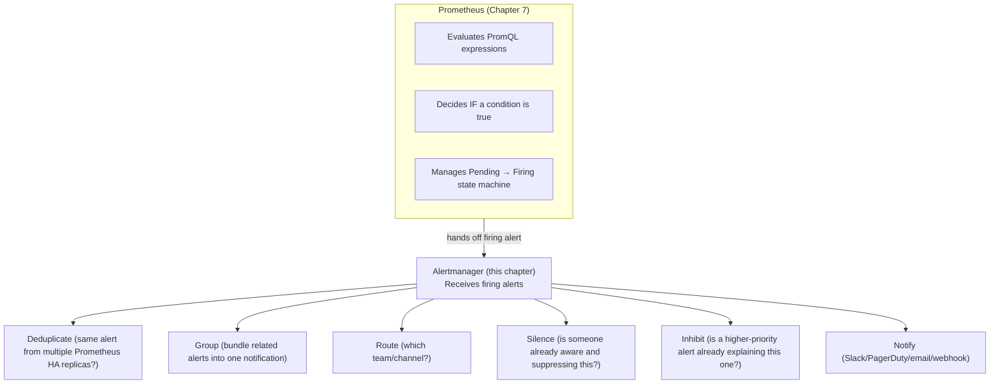
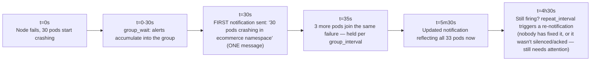
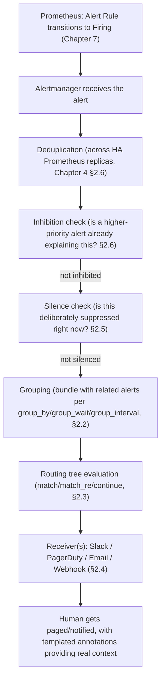

# Chapter 16: Alertmanager — Routing, Grouping, Silencing, Integrations

> **Part 12 — Alerting**

---

## 1. Objective

By the end of this chapter you will be able to:

- Explain exactly what Alertmanager does with a firing alert from the moment Prometheus hands it off.
- Write a correct routing tree using `route`, `match`/`match_re`, and `continue`.
- Explain and configure **grouping** (`group_by`, `group_wait`, `group_interval`, `repeat_interval`) and why each parameter exists.
- Configure real receivers: Slack, email, PagerDuty, and generic webhooks.
- Use **silences** and **inhibition rules** correctly, including via the `AlertmanagerConfig` CRD.
- Implement full **multi-window, multi-burn-rate SLO alerting** — the production version of Chapter 3's theory.

---

## 2. Concept

### 2.1 What Alertmanager actually does (and doesn't)

Recall from Chapter 7: Prometheus only hands an alert to Alertmanager once it's **Firing** (condition true continuously for the `for` duration). Alertmanager's job starts there — it never evaluates PromQL itself, never decides *if* something is wrong; it only decides **what to do** with alerts it's told are already firing.



This division of responsibility is deliberate and important: it's what lets **multiple Prometheus HA replicas** (Chapter 4, section 2.6) send the same firing alert to a shared Alertmanager cluster, which deduplicates them into a single notification — without this separation, HA Prometheus would mean HA-duplicated pages, defeating the entire purpose of redundancy.

### 2.2 Grouping — why you don't get 50 separate pages for one outage

Imagine a node fails and 30 pods across 10 different services suddenly start firing alerts simultaneously. Without grouping, that's 30 separate, simultaneous pages — a textbook alert-fatigue disaster, and exactly the "too many pages during a real incident" failure mode Chapter 3 warned about from a different angle.

```yaml
route:
  group_by: ['alertname', 'cluster', 'namespace']
  group_wait: 30s
  group_interval: 5m
  repeat_interval: 4h
```

- **`group_by`** — alerts sharing these label values get bundled into a single notification. `['alertname', 'cluster', 'namespace']` means "all currently-firing `PodCrashLooping` alerts in the `ecommerce` namespace arrive as one Slack message listing all affected pods," not 30 separate messages.
- **`group_wait`** — when the *first* alert in a new group fires, wait this long before sending the initial notification, specifically to let other related alerts that are about to fire (like the other 29 pods failing over the next few seconds) catch up and get included in the same first notification, rather than trickling in as separate messages.
- **`group_interval`** — once a group's first notification has been sent, how long to wait before sending an *updated* notification reflecting new alerts that joined the same group afterward.
- **`repeat_interval`** — how often to **re-send** a notification for an alert that's still firing and hasn't been resolved or silenced — this is what makes sure a genuinely unresolved critical issue doesn't go silent after the first page just because nobody's re-checking the dashboard.



### 2.3 Routing — getting the right alert to the right team

The `route` tree matches alerts (by label) to a specific **receiver**, with child routes for more specific matching, and `continue: true` when an alert should match multiple routes rather than stopping at the first match:

```yaml
route:
  receiver: default-slack
  group_by: ['alertname', 'namespace']
  routes:
    - match:
        severity: critical
        team: ecommerce
      receiver: ecommerce-pagerduty
      continue: false          # stop here — don't also send to default-slack

    - match_re:
        namespace: "ecommerce|payments"
      receiver: ecommerce-slack
      continue: true           # ALSO evaluate later sibling routes

    - match:
        severity: warning
      receiver: warnings-slack
```

**The critical, easy-to-get-wrong detail:** routes are evaluated top-to-bottom, and by default **the first match wins and stops evaluation** — `continue: true` is what you need when an alert should trigger *multiple* receivers (e.g., a critical alert that should page the on-call *and* post to a general team Slack channel). Forgetting `continue: true` when you actually needed multi-receiver delivery is one of the most common real-world Alertmanager misconfigurations, and it fails silently (the alert just quietly doesn't reach the second intended destination, with no error anywhere) — very much in the same spirit as Chapter 13's label-selector gotchas.

### 2.4 Receivers: Slack, Email, PagerDuty, Webhook

```yaml
receivers:
  - name: ecommerce-slack
    slack_configs:
      - api_url: "https://hooks.slack.com/services/XXX/YYY/ZZZ"
        channel: "#ecommerce-alerts"
        title: '{{ .GroupLabels.alertname }}'
        text: '{{ range .Alerts }}{{ .Annotations.summary }}{{ end }}'

  - name: ecommerce-pagerduty
    pagerduty_configs:
      - service_key: "<pagerduty-integration-key>"
        severity: '{{ .CommonLabels.severity }}'

  - name: default-email
    email_configs:
      - to: "platform-team@example.com"
        from: "alertmanager@example.com"
        smarthost: "smtp.example.com:587"

  - name: generic-webhook
    webhook_configs:
      - url: "http://internal-incident-tool.example.com/webhook"
```

Each receiver type has its own templating context (`.GroupLabels`, `.CommonLabels`, `.Alerts` — an array, since a receiver may get a *group* of alerts, not just one) — this is exactly why the annotations you write in a `PrometheusRule` (Chapter 7, `summary`/`description`) matter so much: they're the human-readable text that actually shows up in the Slack message or PagerDuty incident, not just internal metadata. A well-written annotation, with `{{ $labels.pod }}` and `{{ $value }}` templated in, is the difference between a page that says "AlertX firing" (useless at 3 a.m.) and one that says "checkoutservice p99 latency is 4.2s, above the 500ms SLO threshold, on pod checkoutservice-7f9d" (immediately actionable).

**Generic webhooks deserve special mention:** they're the universal escape hatch — any tool with an HTTP endpoint (a custom incident management system, a ChatOps bot, Microsoft Teams via an incoming webhook connector, an internal automation trigger) can receive Alertmanager notifications this way, which is why "webhook" support effectively means Alertmanager can integrate with almost anything, even tools without official first-class support.

### 2.5 Silences — deliberate, temporary suppression

A **silence** matches a label set and suppresses matching notifications for a defined time window — used for planned maintenance, known issues already being worked, or a noisy alert pending a proper fix.

```bash
amtool silence add alertname="NodeCPUHigh" instance="worker-3" \
  --duration="2h" --comment="Planned maintenance, JIRA-1234"
```

**Silences are not the same as fixing or acknowledging an alert** — they're a deliberate, time-boxed, auditable "I know about this, stop notifying me about it for now" action, and every silence should ideally carry a comment linking to *why* (a ticket, a maintenance window) for anyone else who looks at the Alertmanager UI later and wonders why an alert that should be firing isn't notifying anyone.

### 2.6 Inhibition — suppressing alerts that a bigger alert already explains

**Inhibition** automatically suppresses a lower-priority alert when a related higher-priority alert is already firing — a systematic version of "if the whole node is down, don't also separately page for every individual pod on it being down."

```yaml
inhibit_rules:
  - source_match:
      alertname: NodeDown
    target_match:
      alertname: PodNotReady
    equal: ['node']
```

This says: "if `NodeDown` is firing for a given `node` label value, suppress any `PodNotReady` alert sharing the same `node` value" — because once you know the node is down, every individual pod-not-ready alert on that node is a *symptom*, not new information, and paging separately for each one adds noise without adding insight. This is the systematic, config-driven version of what a good on-call engineer does mentally during a cascading failure ("oh, that's just because the node is down, ignore the individual pod alerts") — codified so it happens automatically and consistently, every time, regardless of who's on call.

### 2.7 AlertmanagerConfig CRD — the Operator pattern, applied to Alertmanager

Exactly like `ServiceMonitor`/`PrometheusRule` let teams self-serve scrape/rule config (Chapters 4, 7, 13), the **`AlertmanagerConfig`** CRD lets teams self-serve their own routing/receiver config without editing one shared, centrally-owned `alertmanager.yml`:

```yaml
apiVersion: monitoring.coreos.com/v1alpha1
kind: AlertmanagerConfig
metadata:
  name: ecommerce-routing
  namespace: ecommerce
  labels:
    alertmanagerConfig: ecommerce
spec:
  route:
    receiver: ecommerce-slack
    groupBy: ['alertname']
  receivers:
    - name: ecommerce-slack
      slackConfigs:
        - apiURL:
            name: ecommerce-slack-webhook
            key: url
          channel: '#ecommerce-alerts'
```

Same rationale as Chapter 4's Operator discussion: application teams own their own alert routing, the platform team retains the top-level `Alertmanager` CRD (global settings, default receiver, inhibition rules that need to apply cluster-wide) — self-service with guardrails, once again.

### 2.8 Multi-window, multi-burn-rate alerting — Chapter 3's theory, fully implemented

Recall Chapter 3's burn-rate concept and Chapter 9's queries #62/#63. Here's the complete, production-grade `PrometheusRule` implementing it, combining a short window (fast detection) and a long window (noise reduction) — the pattern Google's SRE Workbook popularized specifically to balance speed against false positives:

```yaml
apiVersion: monitoring.coreos.com/v1
kind: PrometheusRule
metadata:
  name: checkout-slo-burn-rate
  namespace: monitoring
  labels: { release: kube-prom-stack }
spec:
  groups:
    - name: checkout-burn-rate
      rules:
        - alert: CheckoutErrorBudgetFastBurn
          expr: |
            (
              sum(rate(http_requests_total{job="checkoutservice", status=~"5.."}[1h]))
              / sum(rate(http_requests_total{job="checkoutservice"}[1h]))
            ) > (14.4 * (1 - 0.999))
            and
            (
              sum(rate(http_requests_total{job="checkoutservice", status=~"5.."}[5m]))
              / sum(rate(http_requests_total{job="checkoutservice"}[5m]))
            ) > (14.4 * (1 - 0.999))
          for: 2m
          labels: { severity: critical }
          annotations:
            summary: "Checkout burning error budget FAST (14.4x) — will exhaust 28d budget in ~2 days if sustained"

        - alert: CheckoutErrorBudgetSlowBurn
          expr: |
            (
              sum(rate(http_requests_total{job="checkoutservice", status=~"5.."}[6h]))
              / sum(rate(http_requests_total{job="checkoutservice"}[6h]))
            ) > (6 * (1 - 0.999))
            and
            (
              sum(rate(http_requests_total{job="checkoutservice", status=~"5.."}[30m]))
              / sum(rate(http_requests_total{job="checkoutservice"}[30m]))
            ) > (6 * (1 - 0.999))
          for: 15m
          labels: { severity: warning }
          annotations:
            summary: "Checkout burning error budget at 6x — will exhaust 28d budget in ~5 days if sustained"
```

Walk through why this specific shape, since it's not obvious on first read:

- **Two thresholds (14.4x and 6x)** correspond to burn rates that would exhaust a 28-day budget in roughly 2 days and roughly 5 days respectively — these specific multipliers come directly from Google's published SRE Workbook guidance and are widely reused as-is in the industry, not arbitrary numbers.
- **Each alert requires BOTH a short window AND a long window to agree** (the `and` combining a `[1h]`/`[5m]` pair, or `[6h]`/`[30m]` pair) — this is the actual "multi-window" part: the long window confirms the burn is sustained (not just a 5-minute blip), while the short window confirms it's still happening *right now* (not a burn that already ended 50 minutes into a 1-hour window but has since recovered). Requiring both prevents both false positives (a brief blip) and stale positives (an old burn that's already resolved but still shows in the longer window's average).
- **Severity differs** (`critical` pages immediately via `for: 2m`; `warning` is a slower, `for: 15m` ticket-worthy signal) — directly implementing Chapter 3's error-budget-policy concept: fast, severe burns page a human now; slower burns get a ticket, not a 3 a.m. wake-up.

This is, concretely, the single most production-realistic alerting pattern in this entire handbook — everything from Chapter 3's theory through Chapter 7's mechanics through this chapter's routing/grouping culminates in exactly this kind of rule.

### 2.9 Maintenance windows

A **maintenance window** is really just a **scheduled silence** — either created manually before planned work (`amtool silence add` with a duration matching the maintenance window), or, in more mature setups, automated via CI/CD (a deploy pipeline automatically creating a short silence for the specific service being deployed, for the duration expected to include any expected brief availability blips, then letting it expire automatically) — directly complementing Chapter 15's automated deploy-annotation pattern with an automated deploy-silence pattern, both solving the same underlying "deploys are expected, temporary disruptions, don't treat them as surprises" problem from two different angles (visibility vs. noise suppression).

---

## 3. Why This Matters

- This chapter is the literal endpoint of the entire alerting pipeline built across Chapters 3, 7, and now this chapter — SLO theory → Recording/Alert Rule mechanics → routing/grouping/notification. Understanding the full chain end to end is what lets you actually debug "why didn't anyone get paged" systematically instead of guessing.
- The `continue: true` routing gotcha (2.3) and the grouping parameters (2.2) are both extremely common sources of real production alerting misconfiguration — silent failures that only surface during an actual incident, which is the worst possible time to discover them.
- The multi-window burn-rate pattern (2.8) is one of the most consistently-tested practical/design topics in senior SRE interviews — being able to explain *why* it needs two windows, not just recite the config, is a genuine signal of depth.

---

## 4. Architecture



---

## 5. Hands-on Lab

**1. Inspect your Chapter 5 install's current Alertmanager config:**

```bash
kubectl -n monitoring get secret alertmanager-kube-prom-stack-kube-prome-alertmanager -o jsonpath='{.data.alertmanager\.yaml}' | base64 -d
```

Identify the default `route` and `receivers` kube-prometheus-stack ships out of the box.

**2. Deploy the full multi-window burn-rate `PrometheusRule`** from section 2.8 (adjust the metric names to match whatever RED instrumentation you wired up in Chapter 14):

```bash
kubectl apply -f checkout-slo-burn-rate.yaml
```

Verify it loaded via `http://localhost:9090/rules` (port-forward per earlier chapters).

**3. Create a real Slack receiver** (or a webhook receiver pointed at a free tool like `webhook.site` if you don't have Slack access, purely to observe delivery) via an `AlertmanagerConfig`:

```yaml
apiVersion: monitoring.coreos.com/v1alpha1
kind: AlertmanagerConfig
metadata:
  name: lab-routing
  namespace: monitoring
  labels: { alertmanagerConfig: lab }
spec:
  route:
    receiver: lab-webhook
    groupBy: ['alertname']
    groupWait: 10s
    groupInterval: 1m
    repeatInterval: 1h
  receivers:
    - name: lab-webhook
      webhookConfigs:
        - url: "https://webhook.site/<your-unique-id>"
```

*(Confirm your `Alertmanager` CRD's `alertmanagerConfigSelector` picks this up — the same label-matching gotcha pattern from Chapters 5, 7, and 13 applies here too.)*

**4. Trigger a real alert and watch it flow end to end.** Reuse Chapter 10's `throttle-demo` pod (deliberately CPU-throttled) alongside a quick alert rule targeting it, or manually scale a Deployment to an unsatisfiable replica count (Chapter 12's lab) paired with a `KubeDeploymentReplicasMismatch`-style rule, and watch the alert progress: Prometheus `/alerts` page (Pending → Firing) → Alertmanager UI (`http://localhost:9093` per Chapter 5) showing it grouped and routed → your webhook/Slack receiving the actual notification.

**5. Create and then expire a silence:**

```bash
kubectl -n monitoring port-forward svc/kube-prom-stack-kube-prome-alertmanager 9093:9093
amtool --alertmanager.url=http://localhost:9093 silence add alertname="<your-test-alert>" --duration="10m" --comment="lab exercise"
amtool --alertmanager.url=http://localhost:9093 silence query
```

Confirm the notification stops arriving while the silence is active, and resumes once you expire it early (`amtool silence expire <id>`) if the underlying condition is still true.

---

## 6. Verification

- [ ] Explain the full alert lifecycle from Prometheus Firing through deduplication, inhibition, silencing, grouping, routing, to notification.
- [ ] Explain `group_wait` vs `group_interval` vs `repeat_interval` and what real-world problem each solves.
- [ ] Explain the `continue: true` routing gotcha and why it fails silently if forgotten.
- [ ] Explain, precisely, why the multi-window burn-rate pattern needs both a short and a long window, not just one.
- [ ] Successfully route a real test alert through an `AlertmanagerConfig` to an actual external receiver (webhook or Slack) end to end.
- [ ] Create, verify, and expire a silence using `amtool`.

---

## 7. Troubleshooting

| Symptom | Root Cause | Fix |
|---|---|---|
| Alert is Firing in Prometheus but never reaches Alertmanager at all | Prometheus's `alerting.alertmanagers` config doesn't point at the right Alertmanager service, or a network/RBAC issue between them (rare with the default Helm install, more common with custom setups). | Check Prometheus's Status → Runtime & Build Information / Alertmanagers page for connectivity; confirm the Alertmanager service name/port. |
| Alert reaches Alertmanager but no notification is sent | Routing tree didn't match as expected (wrong labels, or an earlier route matched and stopped without `continue: true`), or it's covered by an active silence/inhibition. | Check the Alertmanager UI's alert detail view — it shows exactly which route/receiver matched, and any active silences/inhibitions affecting it. |
| Getting way more notifications than expected for a single incident | `group_by` too granular (e.g., grouping by `pod` instead of `alertname`+`namespace` means every pod gets its own group/notification instead of one bundled message). | Broaden `group_by` to the labels that actually represent "the same incident," per section 2.2. |
| Notification sent once but never repeats for a still-firing, unresolved alert | `repeat_interval` set very long (or default), giving the impression the alert "went silent" when it's actually still tracked, just not re-notifying yet. | Check the alert's actual current state in the Alertmanager UI directly rather than relying on notification history alone; adjust `repeat_interval` if it's inappropriate for the severity. |
| `AlertmanagerConfig` applied but its routing rules never take effect | Label selector mismatch between the object's labels and the `Alertmanager` CRD's `alertmanagerConfigSelector`/`alertmanagerConfigNamespaceSelector` — the exact same class of silent failure as Chapters 5, 7, and 13. | Check the `Alertmanager` CRD's selector fields; match labels exactly. |

---

## 8. Production Notes

- The multi-window burn-rate multipliers (14.4x, 6x, and commonly a third slower tier at 1x) from section 2.8 are **directly sourced from Google's SRE Workbook** and are widely reused verbatim across the industry rather than derived independently per organization — a good example of a well-established pattern worth adopting rather than reinventing.
- Real organizations almost universally route `critical` severity to a paging system (PagerDuty/Opsgenie) and `warning` severity to a non-paging channel (Slack/email/ticket queue) — codifying Chapter 3's error-budget-policy distinction directly into the routing tree's structure, not as a separate manual process.
- **Inhibition rules require careful, deliberate design** — an overly broad inhibition rule can accidentally suppress genuinely important, independent alerts that merely share a label with something already firing; treat inhibition rule changes with the same review rigor as any other paging-critical configuration change (Chapter 7's real incident about unreviewed `for` changes applies equally here).

---

## 9. Best Practices

1. **Route by severity into distinct paging vs. non-paging channels**, matching Chapter 3's error-budget policy directly into the routing tree.
2. **Always double-check `continue: true` when an alert genuinely needs multiple receivers** — verify via the Alertmanager UI's route-matching view, don't just assume the config is correct.
3. **Implement full multi-window burn-rate alerting for every SLO-backed service**, using the industry-standard multipliers rather than inventing your own from scratch.
4. **Always comment silences with a reason/ticket link** — an uncommented silence is a future mystery for whoever finds it.
5. **Let application teams own their own `AlertmanagerConfig`**, with the platform team retaining only cluster-wide inhibition rules and default/fallback receivers.
6. **Review inhibition rule changes with the same rigor as alert threshold changes** — both directly affect who gets paged and when.

---

## 10. Interview Questions

1. **"What does Alertmanager do that Prometheus itself doesn't?"** — Prometheus decides *if* a condition is true and manages the Pending→Firing state machine; Alertmanager takes already-firing alerts and handles deduplication (across HA replicas), inhibition, silencing, grouping, routing, and notification delivery — it never evaluates PromQL itself.
2. **"Explain `group_wait`, `group_interval`, and `repeat_interval` and the real-world problem each solves."** — `group_wait` delays the first notification for a new alert group briefly so related alerts can be bundled together rather than arriving as separate messages; `group_interval` controls how often an already-notified group's notification is updated with newly-joined alerts; `repeat_interval` controls how often a still-firing, unresolved alert is re-notified so it doesn't go silent after the first page.
3. **"What does `continue: true` do in a routing tree, and what happens if you forget it?"** — By default, the first matching route stops evaluation; `continue: true` lets evaluation proceed to later sibling routes so an alert can be delivered to multiple receivers. Forgetting it when multi-receiver delivery is actually needed causes a silent, no-error failure where the alert simply never reaches the second intended destination.
4. **"What's the difference between a silence and an inhibition rule?"** — A silence is a manually (or pipeline-) created, time-boxed, commented suppression a human deliberately sets up; an inhibition rule is automatic, config-driven suppression of a lower-priority alert whenever a related higher-priority alert is already firing, based on shared label values.
5. **"Why does multi-window burn-rate alerting require both a short window and a long window to agree, rather than just one?"** — The long window confirms the burn is genuinely sustained rather than a brief blip; the short window confirms the burn is still happening right now, not an older burn that already recovered but is still reflected in the longer window's average. Requiring both prevents both false positives and stale positives.
6. **"How would you prevent Prometheus HA replicas from causing duplicate pages?"** — Point both Prometheus replicas at the same Alertmanager (or Alertmanager cluster); Alertmanager deduplicates identical firing alerts from multiple sources before any grouping/routing/notification happens, so redundancy doesn't turn into redundant paging.

---

## 11. Real Incident

**Company type:** Payments infrastructure provider.

**What happened:** A platform team added an inhibition rule intended to suppress noisy per-pod alerts whenever the parent Deployment already had a "rollout stuck" alert firing — a reasonable-sounding idea, implemented with an overly broad `target_match` that ended up matching alerts across unrelated Deployments sharing a common, coincidental label value (`team: payments`) rather than being scoped to the same specific Deployment. During a genuinely serious, unrelated incident in a different service that happened to share that team label, the relevant critical alert was silently inhibited and never paged anyone — the on-call engineer only found out about the incident 25 minutes later, from a customer-reported ticket.

**Investigation:** Post-incident review of Alertmanager's own alert history showed the critical alert had, in fact, fired correctly at the expected time — but the Alertmanager UI's own alert detail view showed it as inhibited, with the source alert clearly visible once someone thought to check.

**Root cause:** An inhibition rule whose `equal` matching fields (section 2.6) were too loose — matching on `team` rather than a more specific, genuinely-correlated identifier like the exact Deployment or service name — causing two unrelated incidents to be incorrectly treated as "the same root cause."

**Resolution:** Tightened the inhibition rule's `equal` fields to match on the specific service/Deployment name, not the broader team label; conducted a full audit of every other inhibition rule in the cluster for the same overly-broad-matching risk.

**Prevention:** Instituted a policy (directly extending this chapter's Best Practice #6) requiring any new or modified inhibition rule to include a documented test case demonstrating it does *not* incorrectly suppress unrelated alerts, reviewed by a second engineer before merging — treating inhibition rules as being just as capable of causing a "why didn't anyone get paged" incident as a broken alert rule itself, because, as this incident showed, that's exactly what happened.

---

## 12. Summary

- **Alertmanager** doesn't evaluate conditions — it takes already-firing alerts from Prometheus and handles deduplication, inhibition, silencing, grouping, routing, and notification delivery.
- **Grouping** (`group_by`/`group_wait`/`group_interval`/`repeat_interval`) prevents both notification storms during large correlated failures and silent staleness for genuinely unresolved issues.
- **Routing** (`match`/`match_re`/`continue`) directs alerts to the right receiver; forgetting `continue: true` for multi-receiver needs is a common, silent misconfiguration.
- **Silences** are deliberate, time-boxed, commented suppressions; **inhibition** is automatic, rule-driven suppression of alerts a higher-priority alert already explains — and both need careful, reviewed scoping to avoid accidentally hiding a genuinely important, unrelated alert.
- **Multi-window, multi-burn-rate alerting** is the complete, production-grade implementation of Chapter 3's SLO/error-budget theory, using industry-standard multipliers and requiring agreement between a short and a long window to balance fast detection against false positives.

---

## 13. Next Chapter

This closes out **Part 12: Alerting.** The full pipeline from raw metric to a correctly-routed, correctly-templated human notification is now complete and understood end to end.

**Part 13, Chapter 17: Recording Rules in Depth** returns to a topic introduced in Chapter 7, now with full production patterns: the `level:metric:operations` naming convention in practice, performance-driven design decisions, and a large set of real, reusable recording rule examples that every dashboard and alert in Parts 11–12 could be (and in production, should be) backed by.
