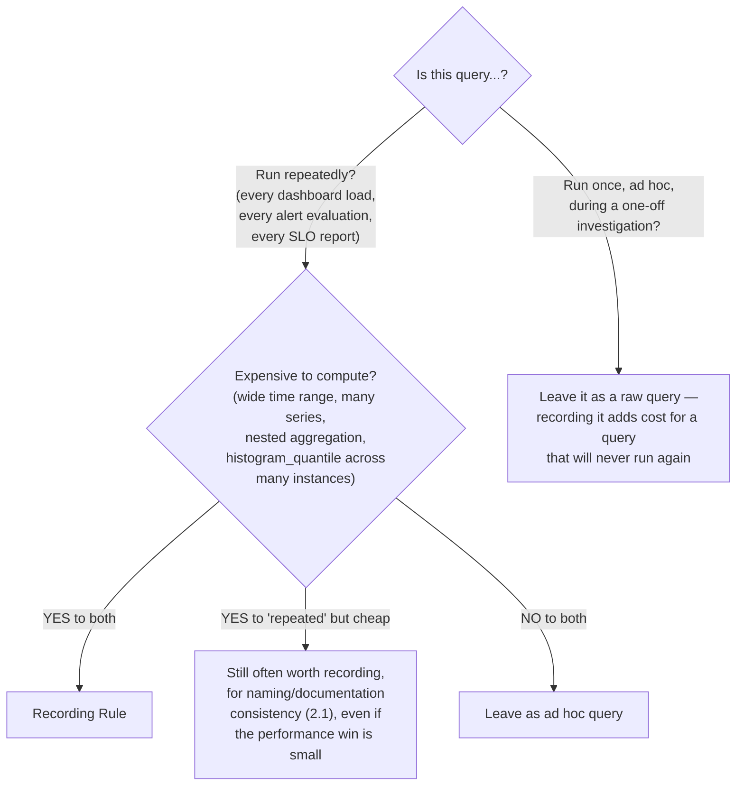
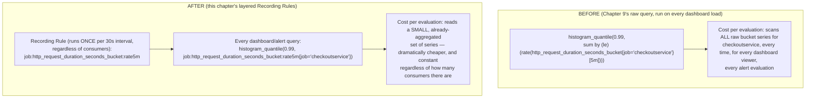
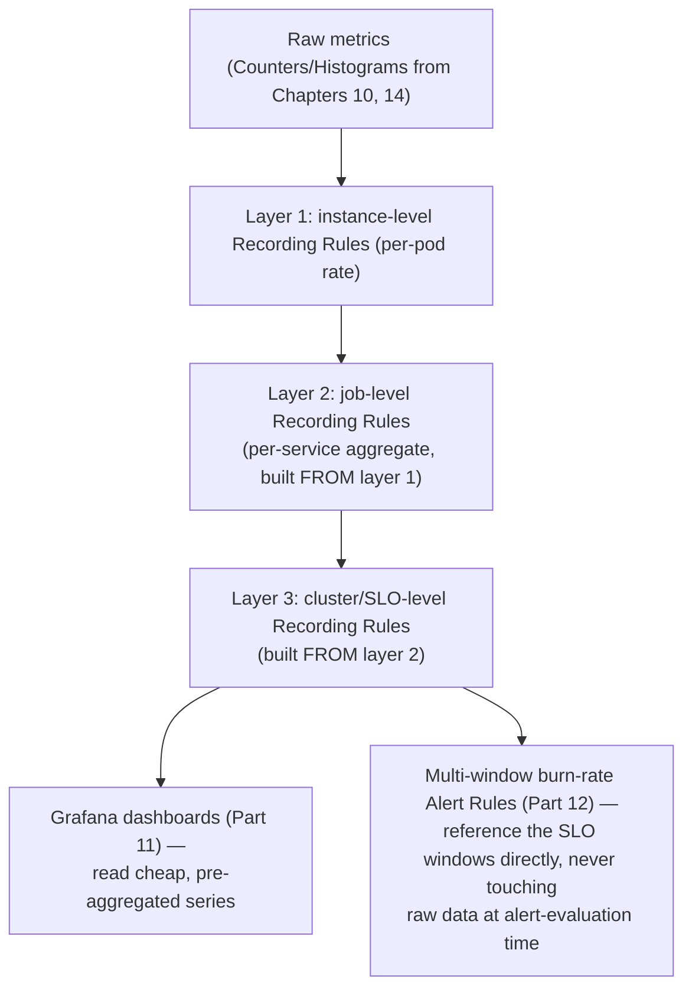

# Chapter 17: Recording Rules in Depth

> **Part 13 — Recording Rules**

---

## 1. Objective

By the end of this chapter you will be able to:

- Apply the `level:metric:operations` naming convention correctly and consistently.
- Decide, systematically, when a query deserves to become a Recording Rule versus when it's fine to leave as an ad hoc dashboard query.
- Structure a layered set of Recording Rules (raw → per-service → cluster-wide) the way real platform teams do.
- Measure the actual performance impact of a Recording Rule using Prometheus's own self-monitoring metrics.
- Build the complete, production-grade Recording Rule set backing Online Boutique's RED dashboards and SLOs.

---

## 2. Concept

### 2.1 The naming convention, precisely

Chapter 7 introduced `level:metric:operations` in passing. Here's the full, precise convention, as used by the Prometheus community and encoded in kube-prometheus-stack's own default rules (worth inspecting directly: `kubectl get prometheusrules -n monitoring -o yaml`):

```
 <aggregation level> : <original metric name> : <operations applied, innermost-first>

 Examples:
   instance:node_cpu_utilisation:rate5m
     level = instance (per-node)
     metric = node_cpu_utilisation (a derived concept, not a literal raw metric name)
     operations = rate5m (a rate() over a 5m window was applied)

   job:http_requests_total:rate5m
     level = job (aggregated across all instances of a job)
     metric = http_requests_total
     operations = rate5m

   cluster:node_cpu_utilisation:avg
     level = cluster-wide
     metric = node_cpu_utilisation
     operations = avg (averaged across all instance-level values)
```

**Why this convention specifically, and why it's worth following exactly rather than inventing your own:** the name alone tells any engineer — without opening the rule definition — what aggregation level the data is already at (so they don't accidentally re-aggregate something already aggregated, a subtle correctness bug) and what operations already happened to it (so they know whether it's already rate-converted, don't need to re-wrap it in `rate()` again). This self-documentation property is the entire value of the convention; a recording rule named `checkout_p99` tells you nothing about these things, while `job:http_request_duration_seconds:p99` (or more precisely, the underlying rule producing the buckets consumed by a later `histogram_quantile()`) tells you immediately.

### 2.2 Deciding what deserves a Recording Rule

Not everything should become a Recording Rule — over-recording adds write load and TSDB series (Chapter 6's cardinality concern applies to recording rule *output* series too, since they're just more time series). Use this decision framework:



This mirrors exactly the real incident from Chapter 9 (the Executive Overview dashboard problem) — the failure there wasn't running an expensive query *once*; it was running it repeatedly, unrecorded, from multiple simultaneous dashboard viewers, multiplying the cost.

### 2.3 Layered Recording Rules — building up, not just flat

Real production rule sets are commonly **layered**: a rule at one aggregation level is itself built from a lower-level rule, rather than every rule re-deriving everything from raw metrics independently.

```yaml
groups:
  - name: checkout-red-layered
    interval: 30s
    rules:
      # Layer 1: per-instance (pod) rate, from raw counters
      - record: instance:http_requests:rate5m
        expr: |
          sum by (instance, status) (rate(http_requests_total{job="checkoutservice"}[5m]))

      # Layer 2: per-job (service-wide) rate, built FROM layer 1, not raw data again
      - record: job:http_requests:rate5m
        expr: |
          sum by (job, status) (instance:http_requests:rate5m{job="checkoutservice"})

      # Layer 3: cluster-wide error ratio, built from layer 2
      - record: cluster:http_requests_error_ratio:rate5m
        expr: |
          sum(job:http_requests:rate5m{status=~"5.."})
          / sum(job:http_requests:rate5m)
```

**Why layering matters beyond just naming tidiness:** each layer is computed once and reused by the layer above it, rather than the cluster-wide query re-scanning every raw instance-level series from scratch — on a cluster with thousands of pods, the difference between "aggregate raw data cluster-wide directly" and "aggregate already-pre-aggregated per-job data cluster-wide" is a substantial, measurable difference in query cost, precisely because the expensive part (touching every raw series) only happens once, at the bottom layer.

### 2.4 SLI/SLO Recording Rules — the production version of Chapter 3 and Chapter 9 §2.6

```yaml
groups:
  - name: checkout-slo-recording
    interval: 30s
    rules:
      - record: slo:checkout_availability:ratio_rate5m
        expr: |
          sum(rate(http_requests_total{job="checkoutservice", status!~"5.."}[5m]))
          / sum(rate(http_requests_total{job="checkoutservice"}[5m]))

      - record: slo:checkout_availability:ratio_rate1h
        expr: |
          sum(rate(http_requests_total{job="checkoutservice", status!~"5.."}[1h]))
          / sum(rate(http_requests_total{job="checkoutservice"}[1h]))

      - record: slo:checkout_availability:ratio_rate6h
        expr: |
          sum(rate(http_requests_total{job="checkoutservice", status!~"5.."}[6h]))
          / sum(rate(http_requests_total{job="checkoutservice"}[6h]))

      - record: slo:checkout_availability:ratio_rate30m
        expr: |
          sum(rate(http_requests_total{job="checkoutservice", status!~"5.."}[30m]))
          / sum(rate(http_requests_total{job="checkoutservice"}[30m]))
```

Notice this directly pre-computes **every window the multi-window burn-rate alert from Chapter 16 needs** (`1h`+`5m` pair, `6h`+`30m` pair) — in a real production system, Chapter 16's burn-rate `PrometheusRule` would reference these recorded series (`slo:checkout_availability:ratio_rate1h`, etc.) rather than the raw `rate(http_requests_total[1h])` expressions shown there for teaching clarity. This is the concrete link this chapter promised: **Recording Rules are the actual production backing for every burn-rate alert threshold**, computed once per interval regardless of how many alert rules or dashboards consume them.

### 2.5 Histogram Recording Rules — pre-aggregating buckets

```yaml
- record: job:http_request_duration_seconds_bucket:rate5m
  expr: |
    sum by (job, le) (rate(http_request_duration_seconds_bucket{job="checkoutservice"}[5m]))
```

Then every dashboard panel or alert needing a percentile uses:

```promql
histogram_quantile(0.99, job:http_request_duration_seconds_bucket:rate5m{job="checkoutservice"})
```

— skipping the `sum by (le) (rate(...))` inner work entirely, since it's already been done once by the Recording Rule. This is precisely the "canonical `histogram_quantile()` pattern" from Chapter 8, now split so the expensive first half runs once (Recording Rule) and the cheap second half (`histogram_quantile()` itself, which is comparatively fast even at query time) runs on demand per dashboard load.

### 2.6 Measuring the actual performance impact

Don't take this chapter's efficiency claims on faith — verify them against Prometheus's own self-monitoring metrics:

```promql
# Query duration for the raw, unrecorded expensive query
prometheus_engine_query_duration_seconds{slice="inner_eval"}

# Rule evaluation duration for your recording rule group specifically
prometheus_rule_group_last_duration_seconds{rule_group="checkout-red-layered"}

# Is any rule group falling behind its own interval? (a capacity warning)
prometheus_rule_group_last_duration_seconds > prometheus_rule_group_interval_seconds
```

That last query is a genuinely important production health check: if a rule group's actual evaluation duration exceeds its configured `interval`, Prometheus is falling behind on that group — a real operational problem (Part 19 covers it as a full incident), and one that's easy to introduce accidentally by piling too many expensive, unrecorded expressions into rule groups that also need to serve as inputs to time-sensitive alerts.

### 2.7 A worked before/after comparison



---

## 3. Why This Matters

- This chapter is where Chapter 3's SLO theory, Chapter 9's query library, and Chapter 16's burn-rate alerts all converge into their actual, efficient, production-grade implementation — everything from here is what a real platform team would actually deploy, not the teaching-clarity raw versions shown earlier for pedagogical purposes.
- The layering pattern (2.3) and the decision framework (2.2) are reusable skills that generalize far beyond the specific examples given — you'll apply this same thinking to every new service Online Boutique-style application you ever monitor.
- Measuring actual rule-group evaluation duration (2.6) rather than assuming Recording Rules are "free" is a genuine production discipline — even Recording Rules themselves have a cost, and a rule group falling behind its own interval is a real, alertable problem in its own right.

---

## 4. Architecture



---

## 5. Hands-on Lab

**1. Build the full layered rule set from section 2.3–2.5** as a single `PrometheusRule`, targeting your actual Online Boutique instrumentation from Chapter 14:

```bash
kubectl apply -f checkout-recording-rules.yaml
```

**2. Confirm each layer produces data**, querying each recorded series name directly in the Prometheus UI (Table view) — verify layer 2 actually depends correctly on layer 1's output by temporarily breaking layer 1's expression and observing layer 2 also going stale/empty (then fix it back).

**3. Rewire your Chapter 15 Grafana dashboard and Chapter 16 burn-rate alert to use the recorded series** instead of the raw expressions — replace `histogram_quantile(0.99, sum by (le) (rate(...)))` with `histogram_quantile(0.99, job:http_request_duration_seconds_bucket:rate5m{...})`, and replace the burn-rate alert's raw `rate(http_requests_total{...}[1h])`-style expressions with references to `slo:checkout_availability:ratio_rate1h` etc.

**4. Measure the before/after**, using section 2.6's self-monitoring queries — compare `prometheus_rule_group_last_duration_seconds` for your recording rule group against how long the equivalent raw query took when you ran it ad hoc in earlier chapters (informally, via the Prometheus UI's query timer shown in the graph view).

---

## 6. Verification

- [ ] Correctly name a Recording Rule using the `level:metric:operations` convention for a new scenario not given as an example in this chapter.
- [ ] Apply the decision framework (2.2) to correctly classify 3 different hypothetical queries as "should be recorded" or "fine as ad hoc."
- [ ] Build a 3-layer Recording Rule set where layer 3 depends on layer 2, which depends on layer 1 — and explain why this is more efficient than 3 independent rules each re-deriving from raw data.
- [ ] Explain what `prometheus_rule_group_last_duration_seconds > prometheus_rule_group_interval_seconds` indicates and why it's a real operational concern.
- [ ] Successfully rewire at least one Grafana panel and one alert rule to consume a Recording Rule's output instead of a raw expression.

---

## 7. Troubleshooting

| Symptom | Root Cause | Fix |
|---|---|---|
| A layered Recording Rule (layer 2) shows no data | Layer 1 (the rule it depends on) hasn't evaluated yet, is in a different rule group with a different/offset schedule, or has a typo in the series name being referenced. | Confirm layer 1's exact recorded metric name and label set match what layer 2's expression queries; keeping dependent layers in the *same* rule group (Chapter 7 §2.4) guarantees they evaluate in the right order within the same cycle. |
| Rule group evaluation duration exceeds its interval | Too many expensive, unrecorded expressions in one group, or the group's `interval` was set too aggressively for what it actually computes. | Split the group, lengthen the interval for genuinely expensive/low-urgency rules, or push more of the expensive work into a lower, shared layer per section 2.3. |
| Recording Rule output series have unexpectedly high cardinality | The `by (...)` clause in the rule's expression kept a higher-cardinality label than intended (e.g., `pod` instead of `job`), defeating the purpose of aggregating for efficiency. | Review the `by (...)` clause deliberately — a Recording Rule should almost always reduce cardinality relative to its input, not preserve or increase it. |
| Dashboard/alert still slow after "recording" the query | The dashboard/alert wasn't actually updated to reference the new recorded series — it's still running the original raw expression. | Explicitly verify (Query Inspector in Grafana, or the alert's `expr` field) that the consumer was actually rewired, not just that the Recording Rule exists alongside the untouched original query. |

---

## 8. Production Notes

- Real platform teams maintain their Recording Rules in the **same version-controlled repository as their PromQL query library** (Chapter 9's Production Notes) — the two are meant to evolve together, with the query library documenting the raw/teaching version and the Recording Rules being the actual production-deployed, efficient version.
- **Over-recording is a real, if less common, mistake** — recording every conceivable aggregation "just in case" adds real TSDB write load and series count for rules that may never actually be queried; the decision framework in section 2.2 exists specifically to prevent this over-engineering, not just to justify recording everything.
- Following the naming convention (2.1) **consistently across an entire organization** is what makes it valuable — a convention followed by one team and ignored by nine others provides little of the "read the name, understand the data" benefit it's meant to provide; this is worth treating as a platform-team-enforced standard, not a personal preference.

---

## 9. Best Practices

1. **Follow the `level:metric:operations` naming convention consistently**, organization-wide, not just within one team's rules.
2. **Layer Recording Rules deliberately** (instance → job → cluster/SLO), keeping dependent layers in the same rule group so evaluation ordering within a cycle is guaranteed.
3. **Apply the decision framework before recording anything** — repeated AND expensive is the bar, not "might be useful someday."
4. **Verify actual performance impact** using `prometheus_rule_group_last_duration_seconds`, don't just assume Recording Rules are automatically free or automatically worth it.
5. **Always rewire consumers (dashboards, alerts) to actually use the new recorded series** — a Recording Rule that exists but isn't referenced anywhere provides zero benefit while still costing write/storage overhead.
6. **Ensure Recording Rules reduce cardinality relative to their input** — if a rule's output has as many or more series than its input, something about the `by (...)` clause is probably wrong.

---

## 10. Interview Questions

1. **"Explain the `level:metric:operations` Recording Rule naming convention and why it's useful."** — `level` identifies the aggregation scope (instance/job/cluster), `metric` describes what's measured, `operations` documents what was already applied (e.g., `rate5m`); it lets any engineer understand a recorded series's aggregation state from its name alone, preventing accidental re-aggregation or redundant `rate()` wrapping.
2. **"How do you decide whether a query deserves to become a Recording Rule?"** — Whether it's run repeatedly (dashboards, alerts, SLO reports) AND is expensive to compute (wide time ranges, many series, nested aggregation); a query that's cheap or run only once ad hoc generally doesn't need to be recorded.
3. **"What's the benefit of layering Recording Rules (instance → job → cluster) instead of having each level independently query raw data?"** — Each layer is computed once and reused by the layer above, so the expensive part (scanning raw, high-cardinality data) happens only at the bottom layer; higher layers work with already-reduced data, substantially cutting total query cost at scale.
4. **"How would you verify that a Recording Rule is actually improving performance, rather than just assuming it is?"** — Compare `prometheus_rule_group_last_duration_seconds` for the rule group against the informal cost of running the equivalent raw query ad hoc, and confirm downstream consumers (dashboards/alerts) were actually rewired to use the new recorded series rather than continuing to run the original raw expression.
5. **"What does it mean if a rule group's evaluation duration exceeds its configured interval, and why does that matter?"** — Prometheus is falling behind on evaluating that group — it can't keep up with its own schedule, which for an SLO/alerting-critical group means alert evaluations and recorded data could lag reality; it's a real capacity/design problem worth its own alert, not just a curiosity.
6. **"Can a Recording Rule reference the output of another Recording Rule? What's required for that to work reliably within a single evaluation cycle?"** — Yes, this is the layering pattern; for the dependent rule to see a fresh value from the same evaluation cycle (rather than a stale one from the previous cycle), both rules need to be in the same rule group, since rules within a group evaluate sequentially at the same interval (Chapter 7 §2.4).

---

## 11. Real Incident

**Company type:** Mid-size SaaS platform with ~50 microservices, actively growing.

**What happened:** As the platform scaled from 10 to 50 services over 18 months, dozens of engineers independently added their own ad hoc `histogram_quantile()` dashboard panels and alert rules, each re-deriving the same kind of per-service latency percentile from raw bucket data, with no shared Recording Rule layer underneath any of it. Query load on the shared Prometheus instance grew roughly in proportion to (number of services) × (number of dashboards/alerts per service) rather than just (number of services) — a multiplicative, not additive, growth pattern that eventually pushed Prometheus's own query evaluation latency high enough to start delaying real alert evaluations across the whole cluster, a serious, cluster-wide reliability risk hiding behind what looked like normal organic growth.

**Investigation:** A capacity review (prompted by rising `prometheus_engine_query_duration_seconds`, exactly the self-monitoring metric this chapter recommends watching) traced the growth to the complete absence of any shared Recording Rule layer — every team's dashboards and alerts were independently re-computing the same category of expensive aggregation from raw data.

**Resolution:** The platform team introduced a standard, shared layered Recording Rule template (instance → job → SLO, exactly this chapter's section 2.3–2.4 pattern) that every new service was required to adopt as part of onboarding, and retroactively migrated the highest-traffic existing dashboards/alerts to consume the new recorded series instead of raw expressions — query load dropped substantially, and remained roughly flat as additional services were onboarded afterward (each new service's dashboards now reading cheap, pre-aggregated data rather than adding to raw-query load).

**Prevention:** "Does this service have its standard layered Recording Rule set deployed" became a required checklist item in the platform's service-onboarding process — turning this chapter's best practices into an actual organizational gate, directly motivated by having watched unmanaged, ad hoc query growth nearly cause a cluster-wide alerting reliability incident.

---

## 12. Summary

- The **`level:metric:operations`** naming convention makes a Recording Rule's aggregation state and applied operations self-evident from its name alone — a real, consistently-valuable discipline when followed organization-wide.
- **Layering** Recording Rules (instance → job → cluster/SLO) means expensive raw-data aggregation happens once, at the bottom layer, and every higher layer reuses that work — a substantial, measurable efficiency gain at scale.
- **SLO Recording Rules pre-compute every window a multi-window burn-rate alert needs**, making Chapter 16's alerting pattern efficient in production rather than expensive-per-evaluation.
- **Not everything should be recorded** — apply the repeated-AND-expensive decision framework, and verify actual performance impact via `prometheus_rule_group_last_duration_seconds` rather than assuming.

---

## 13. Next Chapter

This closes out **Part 13: Recording Rules**, and with it, the complete Prometheus-and-Grafana-centered core of this handbook (Parts 1–13). Every concept from "what is monitoring" through efficient, production-grade SLO alerting is now fully built, deployed, and understood end to end against a real application.

**Part 14, Chapter 18: OpenTelemetry Collector — Metrics, Logs, Traces** begins the handbook's second major arc: extending beyond Prometheus-only metrics into the full three-pillars observability story from Chapter 1 — OTLP, the Collector's receiver/processor/exporter pipeline architecture, and how OpenTelemetry unifies metrics, logs, and traces under one instrumentation and collection standard, setting up Parts 15 (Loki) and 16 (Tempo) that follow.
