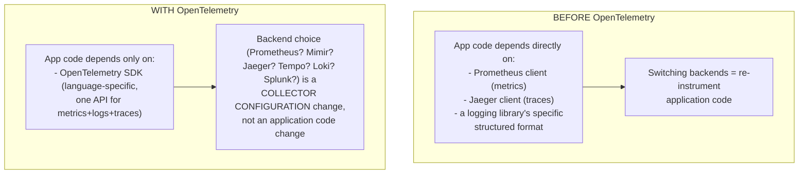
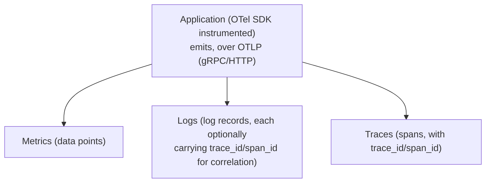
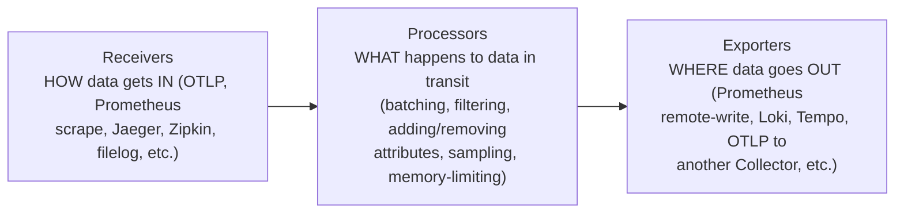
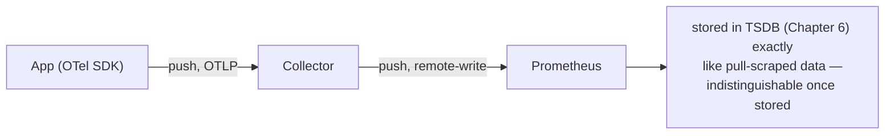
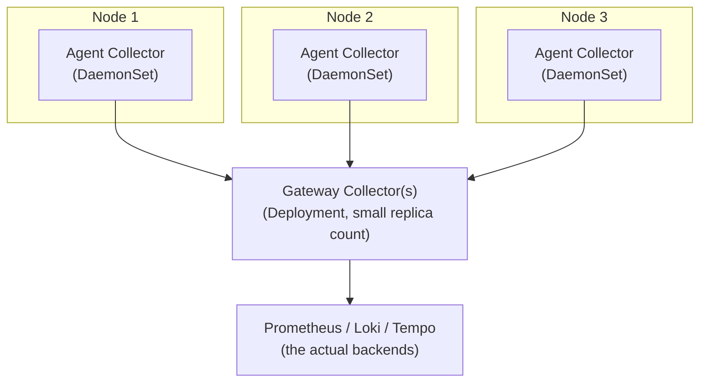
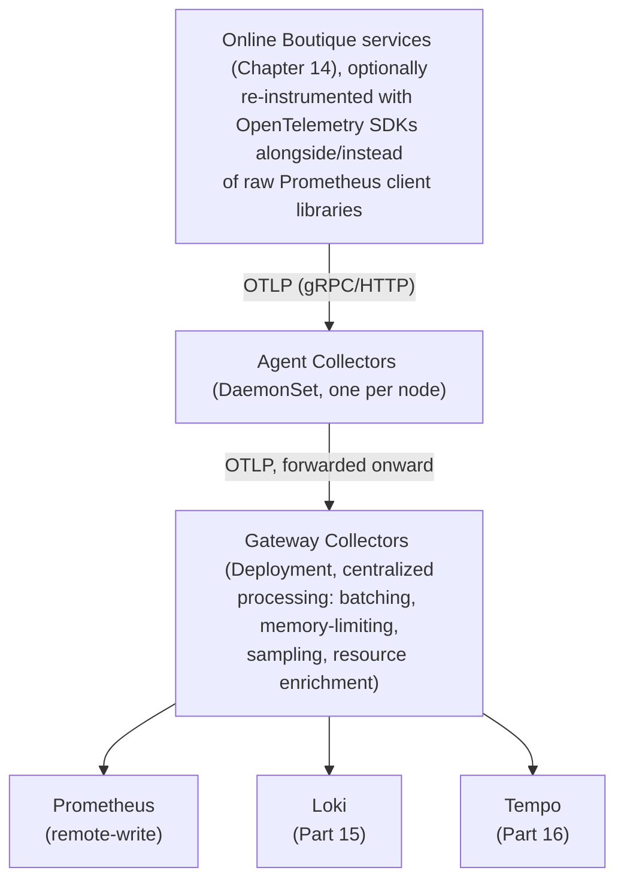

# Chapter 18: OpenTelemetry Collector — Metrics, Logs, Traces

> **Part 14 — OpenTelemetry**

---

## 1. Objective

By the end of this chapter you will be able to:

- Explain what OpenTelemetry (OTel) is, what problem it solves, and how it relates to (not replaces) everything built in Parts 1–13.
- Explain **OTLP**, the protocol that unifies metrics, logs, and traces into one wire format.
- Explain the OpenTelemetry Collector's **receiver → processor → exporter** pipeline architecture.
- Deploy a Collector in Kubernetes using both common deployment patterns (Agent/DaemonSet and Gateway/Deployment) and know when to use each.
- Configure a Collector to receive OTLP data and export metrics to Prometheus, preparing the ground for Loki (Part 15) and Tempo (Part 16).

---

## 2. Concept

### 2.1 What problem OpenTelemetry actually solves

Before OpenTelemetry, instrumenting an application for observability meant picking a vendor-specific SDK — one library for metrics (maybe Prometheus's own client library, which you've already used implicitly since Chapter 14), a different, often incompatible library for traces (Jaeger's client, Zipkin's client), and yet another for structured logging, each with its own conventions for naming, context propagation, and export format. Switching backends (e.g., moving from Jaeger to Tempo) meant re-instrumenting application code, not just reconfiguring infrastructure.

**OpenTelemetry (OTel)** is a CNCF project providing a **single, vendor-neutral standard** for instrumenting applications to emit metrics, logs, and traces — one set of SDKs (per language), one wire protocol (OTLP), and one collector architecture, decoupling *how you instrument code* from *which backend you send data to*.



**Important, and directly relevant to everything built so far:** OpenTelemetry does not replace Prometheus, Loki, or Tempo — it's the **instrumentation and transport layer** that sits in front of them. Your Chapter 14 RED metrics, exposed in Prometheus format and scraped by Prometheus directly, remain entirely valid; OTel becomes relevant specifically when you want a *single* instrumentation approach that can simultaneously feed metrics to Prometheus, logs to Loki, and traces to Tempo, through one unified pipeline, rather than three separately-instrumented paths.

### 2.2 OTLP — the unifying protocol

**OTLP (OpenTelemetry Protocol)** is the wire format used to transmit all three signal types — metrics, logs, and traces — using the same underlying protocol (gRPC or HTTP, both commonly supported), the same general data model shape, and critically, **shared context** that lets a log line, a metric data point, and a trace span all be correlated back to the same originating request via common identifiers (trace ID, span ID) attached consistently across all three.



This shared-context property is precisely what makes Chapter 1's "metric shows a spike → trace shows which service → log shows the exact error" investigation workflow *fast* rather than requiring manual timestamp-based guesswork to line up three unrelated data sources — the trace ID is the actual, explicit join key, not an inferred correlation.

### 2.3 The Collector: receiver → processor → exporter

The **OpenTelemetry Collector** is a standalone, vendor-neutral service (deployed as a pod/Deployment/DaemonSet in Kubernetes) that receives telemetry data, optionally transforms it, and exports it to one or more backends. Its configuration is built from exactly three pipeline stages:



A real, minimal configuration, showing metrics flowing from OTLP receipt through to Prometheus:

```yaml
receivers:
  otlp:
    protocols:
      grpc:
        endpoint: 0.0.0.0:4317
      http:
        endpoint: 0.0.0.0:4318

processors:
  batch: {}                          # batches data before export — reduces network overhead
  memory_limiter:                    # protects the Collector itself from OOM under load spikes
    check_interval: 1s
    limit_mib: 512
  resource:
    attributes:
      - key: k8s.namespace.name
        action: insert
        value: "ecommerce"           # tag every signal with useful, consistent context

exporters:
  prometheusremotewrite:
    endpoint: "http://kube-prom-stack-kube-prome-prometheus.monitoring:9090/api/v1/write"
  loki:
    endpoint: "http://loki-gateway.monitoring/loki/api/v1/push"          # Part 15
  otlp/tempo:
    endpoint: "tempo.monitoring:4317"                                     # Part 16

service:
  pipelines:
    metrics:
      receivers: [otlp]
      processors: [memory_limiter, batch, resource]
      exporters: [prometheusremotewrite]
    logs:
      receivers: [otlp]
      processors: [memory_limiter, batch, resource]
      exporters: [loki]
    traces:
      receivers: [otlp]
      processors: [memory_limiter, batch, resource]
      exporters: [otlp/tempo]
```

Note the `service.pipelines` block: **three entirely independent pipelines** (metrics, logs, traces), each with its own receivers/processors/exporters list, all defined in one Collector config — this is the concrete architectural expression of "OpenTelemetry unifies instrumentation and transport, while backends remain specialized" from section 2.1: one Collector, one config file, but metrics still end up in Prometheus, logs in Loki, and traces in Tempo, each system continuing to do what it's specifically good at (exactly Chapter 1's "you need all three pillars, each for different reasons" argument, now with concrete infrastructure wiring it all together).

### 2.4 Prometheus remote-write — how OTel metrics reach Prometheus

Recall Chapter 4, section 2.2: Prometheus is fundamentally a **pull**-based system. OTLP-emitted metrics arrive at the Collector via push (applications push to the Collector over OTLP). Reconciling this requires **Prometheus remote-write** — an API that lets an external system *push* samples directly into Prometheus's storage, bypassing the normal scrape-based pull model entirely, used specifically for exactly this kind of push-originated data.



This is worth being precise about in an interview context: Prometheus's *storage and query* model doesn't care how data arrived (pull-scraped or remote-write-pushed) — both end up as ordinary time series in the same TSDB, queryable with the same PromQL from Chapter 8 — but the *ingestion* model genuinely differs, and remote-write is the deliberate, supported bridge for push-originated sources like an OTel Collector, not a hack.

### 2.5 Deployment patterns: Agent vs. Gateway

Two common Collector deployment topologies in Kubernetes, often used together:

```
 AGENT pattern (DaemonSet — one Collector per node):
   - Receives telemetry from workloads on the SAME node (low latency, local)
   - Often does initial processing (resource attribute enrichment with node/pod
     context, since it's running right there)
   - Forwards onward to a Gateway, rather than exporting directly to backends itself

 GATEWAY pattern (Deployment — a small, centralized pool of Collectors):
   - Receives from all Agent Collectors cluster-wide
   - Centralizes expensive/global processing (tail-based sampling for traces,
     cluster-wide rate limiting, centralized export credential management)
   - Exports to the actual backends (Prometheus remote-write, Loki, Tempo)
```



**Why bother with two layers instead of one Collector talking directly to backends everywhere:** the Agent layer keeps node-local enrichment fast and cheap (no network hop needed to attach "which node/pod did this come from" context); the Gateway layer centralizes anything that genuinely needs a global view or shared, sensitive configuration (export credentials, cluster-wide sampling decisions) into a small, easier-to-secure and easier-to-scale pool, rather than distributing that responsibility (and those credentials) across every single node. Smaller/simpler clusters can reasonably run Gateway-only (skip the DaemonSet layer) — this two-tier pattern is a scaling response, not a mandatory minimum.

---

## 3. Why This Matters

- OpenTelemetry is what lets the rest of this handbook's second arc (Loki in Part 15, Tempo in Part 16) share one consistent instrumentation and collection story with the metrics pipeline already built in Parts 1–13, rather than being three completely disconnected systems each requiring separate application instrumentation.
- Understanding that OTel is an instrumentation/transport standard, not a replacement backend, prevents a common and consequential misunderstanding — teams sometimes assume adopting OpenTelemetry means ripping out Prometheus, when in reality it typically means *feeding* Prometheus (via remote-write) more consistently, alongside Loki and Tempo, from a shared pipeline.
- The receiver/processor/exporter pipeline model, and the Agent/Gateway deployment pattern, are both concepts that generalize directly to real production OpenTelemetry deployments at any scale — this chapter's config isn't a simplified teaching toy, it's structurally identical to what a real production Collector config looks like, just smaller.

---

## 4. Architecture



---

## 5. Hands-on Lab

**1. Install the OpenTelemetry Collector via its own Helm chart**, configured with the pipeline from section 2.3 (Gateway-only pattern is sufficient for this lab-scale exercise):

```bash
helm repo add open-telemetry https://open-telemetry.github.io/opentelemetry-helm-charts
helm repo update
```

Save the section 2.3 config as `otel-collector-values.yaml` (adjusted: remove the `loki`/`tempo` exporters and their pipeline references for now, since those backends don't exist yet until Parts 15–16 — leave only the `metrics` pipeline exporting via `prometheusremotewrite`), then:

```bash
helm install otel-collector open-telemetry/opentelemetry-collector \
  --namespace monitoring \
  -f otel-collector-values.yaml
```

**2. Enable remote-write receiving on Prometheus** — recall this isn't on by default; add to your Chapter 5 `values.yaml` and `helm upgrade`:

```yaml
prometheus:
  prometheusSpec:
    enableRemoteWriteReceiver: true
```

**3. Send a test metric via OTLP** using a quick one-off tool (e.g., `telemetrygen`, a standard OTel testing utility, run as a temporary pod) or, more concretely, point one Online Boutique service's OTel SDK configuration (if you extended its instrumentation) at `otel-collector.monitoring:4317`.

**4. Verify the metric reaches Prometheus**, exactly as any other metric would, in the Prometheus UI — confirming it's fully indistinguishable from pull-scraped data once stored, per section 2.4.

**5. Inspect the Collector's own self-monitoring** (Collectors expose their own Prometheus metrics about pipeline health):

```promql
otelcol_receiver_accepted_metric_points_total
otelcol_exporter_sent_metric_points_total
otelcol_processor_dropped_metric_points_total   # should be near-zero on a healthy pipeline
```

---

## 6. Verification

- [ ] Explain what OpenTelemetry actually replaces (per-vendor SDKs) versus what it doesn't replace (Prometheus/Loki/Tempo as backends).
- [ ] Explain OTLP's role and why shared trace-ID-based context across metrics/logs/traces matters for investigation speed.
- [ ] Draw the receiver → processor → exporter pipeline shape from memory and correctly place `batch`, `memory_limiter`, and a backend exporter into it.
- [ ] Explain why Prometheus remote-write is necessary for OTel-originated metrics to reach Prometheus, given Prometheus's pull-based design (Chapter 4).
- [ ] Explain the Agent vs. Gateway deployment pattern and why a real production deployment often uses both layered together.

---

## 7. Troubleshooting

| Symptom | Root Cause | Fix |
|---|---|---|
| Application sends OTLP data but nothing arrives at the Collector | Wrong endpoint/port (4317 for gRPC, 4318 for HTTP — easy to confuse), or a NetworkPolicy blocking the connection. | Verify the exact endpoint/protocol the SDK is configured with matches the Collector's receiver config precisely; test connectivity with a debug pod first. |
| Metrics reach the Collector (visible in `otelcol_receiver_accepted_metric_points_total`) but never appear in Prometheus | `enableRemoteWriteReceiver` not set on the Prometheus CRD, or the exporter's `endpoint` URL is wrong/missing the `/api/v1/write` path. | Confirm `prometheusSpec.enableRemoteWriteReceiver: true` is actually applied (`helm get values`); verify the exact remote-write endpoint URL. |
| `otelcol_processor_dropped_metric_points_total` climbing | `memory_limiter` processor is actively shedding load because the Collector is under memory pressure — a real capacity signal, not a bug. | Increase the Collector's memory limit/resources, or reduce the volume/cardinality of data being sent through it (the same cardinality discipline from Chapter 6 applies to OTel pipelines too). |
| Traces/logs work but metrics don't (or vice versa) | Each signal type has its own independent pipeline in `service.pipelines` — one can be misconfigured while others work fine. | Check each pipeline's receivers/processors/exporters list independently; a shared receiver doesn't guarantee all three pipelines are correctly wired. |
| Gateway Collector becomes a bottleneck under load | Under-provisioned Gateway replica count/resources relative to cluster-wide telemetry volume — a real, common scaling issue as adoption grows. | Scale Gateway replica count; ensure Agent-layer batching is configured to reduce per-request overhead reaching the Gateway. |

---

## 8. Production Notes

- Real enterprise OpenTelemetry adoption is almost always **incremental**, not a big-bang migration — teams typically keep existing Prometheus-format scraping (Chapters 5–13) running unchanged for already-instrumented services, and adopt OTel SDKs specifically for *new* services or when a service genuinely needs unified metrics+logs+traces correlation that its current instrumentation can't provide. This chapter's "OTel complements, doesn't replace" framing (2.1) is a deliberate, accurate reflection of how this actually plays out in practice, not just a simplification for teaching purposes.
- The **`memory_limiter` processor is not optional in any serious production Collector deployment** — an unbounded Collector under a telemetry volume spike (a common trigger: a logging bug causing a sudden burst, or a traffic spike) can OOM exactly like an unprotected Prometheus instance (Chapter 5's real incident), taking down the observability pipeline at precisely the moment it's needed most.
- Collector configuration, like `PrometheusRule` and Grafana dashboards before it, is a strong candidate for **GitOps management** — it's genuinely critical infrastructure (a broken Collector config can silently drop all telemetry from every instrumented service) and deserves the same review rigor.

---

## 9. Best Practices

1. **Treat OpenTelemetry adoption as incremental**, layering it alongside existing Prometheus scraping rather than a forced, all-at-once migration.
2. **Always include `memory_limiter` in production Collector pipelines** — an unprotected Collector is a real, demonstrated OOM/outage risk under load spikes.
3. **Use the Agent + Gateway two-tier pattern once scale genuinely warrants it**; don't over-engineer a small cluster with unnecessary topology complexity before it's needed.
4. **Monitor the Collector's own self-monitoring metrics** (`otelcol_*`) as seriously as you monitor Prometheus itself — it's now a critical part of the pipeline, not a black box.
5. **Manage Collector configuration via GitOps**, with the same review rigor as `PrometheusRule` and Alertmanager routing changes.

---

## 10. Interview Questions

1. **"What problem does OpenTelemetry actually solve, and what does it NOT replace?"** — It solves vendor-specific, fragmented instrumentation (separate SDKs per signal type, per backend) by providing one standard SDK and wire protocol (OTLP) across metrics, logs, and traces; it does not replace specialized backends like Prometheus, Loki, or Tempo — those remain the storage/query systems the Collector exports into.
2. **"What are the three stages of an OpenTelemetry Collector pipeline, and what does each do?"** — Receivers (how data gets in — OTLP, Prometheus scrape, etc.), processors (what happens to data in transit — batching, filtering, memory-limiting, enrichment), exporters (where data goes out — Prometheus remote-write, Loki, Tempo, another Collector).
3. **"How does OTLP-originated metric data reach a fundamentally pull-based system like Prometheus?"** — Via Prometheus remote-write, an API that accepts pushed samples directly into Prometheus's storage, bypassing the normal scrape model; once stored, the data is indistinguishable from pull-scraped metrics in the TSDB and equally queryable via PromQL.
4. **"What's the difference between the Agent and Gateway Collector deployment patterns, and why use both?"** — Agent (DaemonSet, one per node) handles low-latency local receipt and node-context enrichment; Gateway (Deployment, centralized) handles global/expensive processing like sampling and centralizes export credentials; using both keeps node-local work cheap while consolidating sensitive/global concerns into a smaller, more manageable, more securable layer.
5. **"Why is trace-ID-based correlation across metrics, logs, and traces valuable, and how does OpenTelemetry enable it?"** — It turns an investigation that would otherwise require manually correlating three separate data sources by approximate timestamp into a direct, explicit join via a shared identifier attached consistently by the OTel SDK across all three signal types — directly accelerating the Chapter 1 "metric → trace → log" incident workflow from guesswork to a precise lookup.

---

## 11. Real Incident

**Company type:** Mobile app backend platform, mid-migration from legacy per-vendor instrumentation to OpenTelemetry.

**What happened:** During a partial OTel rollout, a new service was instrumented with the OTel SDK and configured to send metrics to a newly-deployed Gateway Collector — but the team forgot to add `memory_limiter` to the Collector's processor chain, assuming default resource limits on the pod alone would be sufficient protection. During an unrelated traffic spike, telemetry volume from the (still-growing) set of OTel-instrumented services briefly surged, and the Collector — with no internal backpressure/shedding mechanism — was OOMKilled repeatedly, silently dropping all telemetry (metrics, and eventually logs and traces once those pipelines were added in later phases) from every service routed through it, for the duration of the crash-loop.

**Investigation:** The team initially believed the *originating services* had stopped emitting telemetry (dashboards for those services simply went blank), and spent time investigating application-level causes before checking the Collector's own pod status and discovering the crash loop and OOM events directly via `kubectl describe pod`.

**Root cause:** Missing `memory_limiter` processor — exactly this chapter's Production Notes warning, discovered the hard way rather than proactively.

**Resolution:** Added `memory_limiter` with an appropriate `limit_mib` well under the pod's actual memory limit (leaving headroom for the processor to actually shed load *before* the kernel OOM-kills the whole process); Collector stability returned immediately even during subsequent, similar traffic spikes — the pipeline now gracefully drops excess data under pressure rather than crashing entirely.

**Prevention:** Made `memory_limiter` a mandatory, linted requirement in the team's Collector config templates going forward (their GitOps review tooling now rejects any Collector config missing it) — turning a real, disruptive incident directly into an enforced platform guardrail.

---

## 12. Summary

- **OpenTelemetry** provides one vendor-neutral instrumentation standard and wire protocol (**OTLP**) across metrics, logs, and traces — it complements, rather than replaces, the Prometheus/Loki/Tempo backends built throughout this handbook.
- The **Collector**'s receiver → processor → exporter pipeline architecture handles ingestion, transformation, and multi-backend export, with entirely independent pipelines per signal type possible within one config.
- **Prometheus remote-write** is the deliberate, supported bridge letting push-originated OTel metrics land in Prometheus's normally pull-based storage, indistinguishable from scraped data once stored.
- The **Agent (DaemonSet) + Gateway (Deployment)** two-tier deployment pattern balances low-latency local processing against centralized, secure, scalable global processing as adoption grows.
- **`memory_limiter` is not optional** in any serious production Collector deployment — an unprotected Collector is a genuine, demonstrated outage risk.

---

## 13. Next Chapter

This closes out **Part 14: OpenTelemetry.** You now have the unifying instrumentation and transport layer that Parts 15 and 16 build directly on top of.

**Part 15, Chapter 19: Loki and Promtail — Logging** returns to Chapter 1's second pillar in full depth: why Loki's label-only indexing is dramatically cheaper than traditional full-text-indexed logging at Kubernetes scale, how Promtail (and the OTel Collector's `filelog` receiver, connecting directly back to this chapter) collects logs, LogQL as a query language, and how to correlate a log line directly back to the metrics and traces you've already built.
