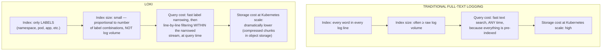
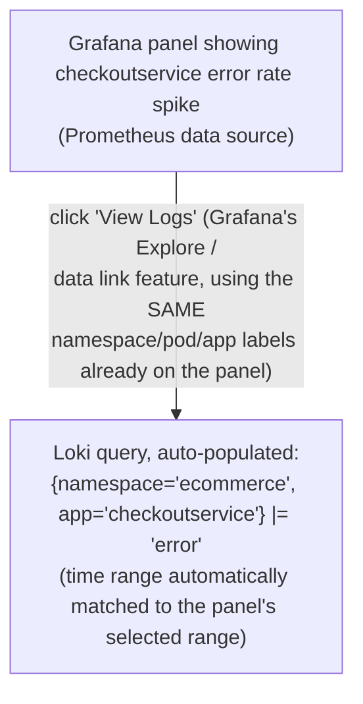
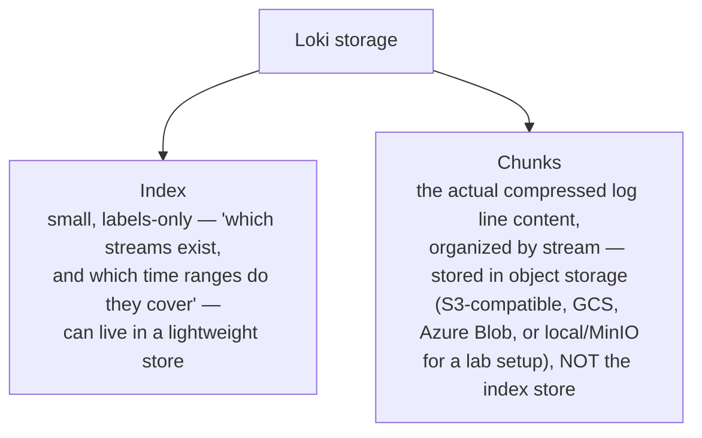
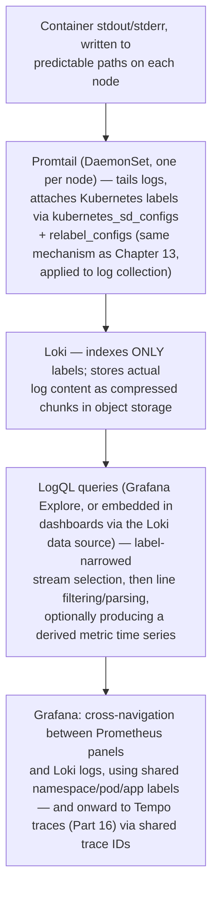

# Chapter 19: Loki and Promtail — Logging

> **Part 15 — Loki**

---

## 1. Objective

By the end of this chapter you will be able to:

- Explain Loki's core architectural idea — indexing only labels, not full log text — and why that makes it dramatically cheaper than traditional logging systems at Kubernetes scale.
- Deploy Loki and Promtail (or the OTel Collector's `filelog` receiver) to collect every container's logs cluster-wide, automatically.
- Write LogQL queries: log stream selection, line filtering, parsing, and metric queries derived from logs.
- Correlate a log line directly with the metrics and (once Part 16 lands) traces you've already built, using shared labels and trace IDs.
- Explain Loki's storage architecture (chunks + index) well enough to reason about retention and cost.

---

## 2. Concept

### 2.1 Why Loki, specifically — the core architectural bet

Traditional log aggregation systems (the Elasticsearch/ELK-style approach) **index the full text of every log line** — every word becomes searchable, which is powerful but expensive: the index itself often grows to be as large as, or larger than, the raw log data it indexes, and that cost scales with log volume, which in a Kubernetes cluster with dozens of chatty services can be enormous.

**Loki's bet, deliberately different:** index **only the labels** attached to each log stream (`namespace`, `pod`, `container`, `app` — the same kind of labels you already know from Prometheus), and store the actual log line content as compressed, unindexed chunks. Finding logs means: use labels to narrow down to the right *stream* (cheap, small index lookup — exactly like a Prometheus label query), then grep/filter through that stream's actual line content at query time (more expensive per-query, but only ever paid for the specific narrow slice of data you actually asked about, not amortized into a permanently-large index).



**Why this tradeoff is specifically well-suited to Kubernetes:** Prometheus already established (Chapters 6, 12, 13) that labels — namespace, pod, container, app — are the natural, already-adopted way to organize and query everything in a Kubernetes cluster. Loki's design leans directly into this: **if you already know how to write a Prometheus label selector, you already know most of how to write a Loki stream selector** — this is a deliberate design choice by Loki's creators (Grafana Labs), explicitly described as "like Prometheus, but for logs," and it's why Loki fits so naturally alongside everything built in Parts 1–13 rather than feeling like a bolted-on, unrelated system.

### 2.2 Promtail — the log collection agent

**Promtail** is Loki's purpose-built collection agent — a DaemonSet (one per node, architecturally identical in placement to Node Exporter from Chapter 11) that tails container log files directly from the node's filesystem (Kubernetes writes every container's stdout/stderr to a predictable path on the node) and ships them to Loki, attaching Kubernetes metadata as labels along the way — the same service-discovery-driven labeling philosophy as Prometheus's own scrape config (Chapter 13), applied to log collection instead.

```yaml
scrape_configs:
  - job_name: kubernetes-pods
    kubernetes_sd_configs:
      - role: pod                     # same discovery ROLE concept from Chapter 13
    pipeline_stages:
      - docker: {}                    # parse the container runtime's log line format
    relabel_configs:                  # same relabeling MECHANISM from Chapter 13,
      - source_labels: [__meta_kubernetes_pod_label_app]   # applied to log streams
        target_label: app                                    # instead of metric targets
      - source_labels: [__meta_kubernetes_namespace]
        target_label: namespace
      - source_labels: [__meta_kubernetes_pod_name]
        target_label: pod
```

**This should look immediately, deliberately familiar** — Promtail's configuration reuses Prometheus's own `kubernetes_sd_configs` and `relabel_configs` mechanisms nearly verbatim (Chapter 13), because Grafana Labs designed it that way on purpose: anyone who already understands Chapter 13's service discovery and relabeling already understands most of how Promtail decides what to collect and how to label it.

**A modern alternative worth naming:** the OpenTelemetry Collector's `filelog` receiver (Chapter 18) can perform the same job — tailing container logs and forwarding them (via the `loki` exporter from Chapter 18's pipeline config) — and many new deployments are converging on using the OTel Collector for log collection instead of a separate Promtail DaemonSet, specifically to consolidate metrics/logs/traces collection into one agent. Both are valid, current, production approaches; this chapter covers Promtail in depth as the historically dominant and still extremely common choice, while noting the OTel path is increasingly standard for new, greenfield deployments (directly connecting back to Chapter 18's pipeline architecture).

### 2.3 LogQL: Loki's query language

LogQL deliberately mirrors PromQL's structure, in two layers:

**Log queries** — select a stream, then filter lines:

```logql
{namespace="ecommerce", app="checkoutservice"}                          # stream selector (like a PromQL label matcher)
{namespace="ecommerce", app="checkoutservice"} |= "error"                # line contains "error"
{namespace="ecommerce", app="checkoutservice"} != "healthcheck"          # line does NOT contain "healthcheck"
{namespace="ecommerce", app="checkoutservice"} |~ "timeout|deadline"     # regex match
{namespace="ecommerce", app="checkoutservice"} | json                    # parse line as JSON, extract fields
{namespace="ecommerce", app="checkoutservice"} | json | duration > 1s    # parse THEN filter on an extracted field
```

**Metric queries** — derive a numeric time series *from* logs (this is the part that most surprises people coming from a pure "logs are just for reading" mental model):

```logql
rate({namespace="ecommerce", app="checkoutservice"} |= "error" [5m])

sum by (app) (rate({namespace="ecommerce"} |= "error" [5m]))

sum by (status) (count_over_time({namespace="ecommerce", app="checkoutservice"}
  | json | __error__="" [5m]))
```

**This is a genuinely important, easy-to-miss capability:** LogQL's `rate()` and `count_over_time()` let you produce a real, graphable time series *directly from log content* — for example, an error rate for a service that never got proper metric instrumentation, computed on the fly from its log lines. This isn't meant to replace proper metrics instrumentation (Chapters 6–9's guidance about Counters/Histograms/cardinality still fully applies and is still the *better* long-term answer for anything you'll query often) — but it's a genuinely powerful capability for exactly the kind of ad hoc, "we didn't instrument this specific thing, but we need an answer right now" investigation that comes up constantly in real incident response.

### 2.4 Correlating logs with metrics and traces

This is where Chapter 1's "you need all three pillars, correlated" argument becomes concrete infrastructure. Because Promtail (or the OTel Collector) attaches the **same labels** Prometheus uses (`namespace`, `pod`, `app`), Grafana can offer **"View Logs" / "View Traces" buttons directly from a metrics dashboard panel** — jumping from a spike in a Prometheus-backed graph straight to the exact log lines from the exact same pod, in the exact same time window, with zero manual re-typing of filters.



Once trace IDs are attached to log lines (via structured logging that includes the OTel trace context, per Chapter 18's shared-context design), Grafana can go one step further: **click a log line, jump directly to its exact trace** in Tempo (Part 16) — completing the full metric → log → trace (or any order) correlation loop this handbook has been building toward since Chapter 1's very first diagram.

### 2.5 Storage architecture: chunks and the index

Loki's storage splits into two parts, mirroring the labels-vs-content design principle from 2.1:



This split is directly analogous to (and, not coincidentally, pairs naturally with) Thanos's approach to long-term Prometheus storage (Part 17) — both systems separate a small, fast "what exists and where" index from bulk, cheap object-storage-backed content, because object storage is dramatically cheaper per gigabyte than the kind of storage a full-text search index needs, and log volume at real Kubernetes scale is large enough that this cost difference matters enormously over any meaningful retention period.

---

## 3. Why This Matters

- Loki completes the second of Chapter 1's three pillars in this handbook's actual running stack — you now have real, queryable logs alongside real metrics, both scoped by the same Kubernetes labels.
- The deliberate design mirroring between LogQL/PromQL and between Promtail's relabeling and Prometheus's relabeling (Chapter 13) means the skills you already built in Parts 5, 8, and 9 transfer directly here — this isn't a new mental model, it's the same one, applied to a different signal type.
- Label-correlated cross-navigation between metrics and logs (2.4) is the concrete infrastructure that makes Chapter 1's abstract "you need all three pillars, correlated" argument into something you actually click through during a real 3 a.m. incident.

---

## 4. Architecture



---

## 5. Hands-on Lab

**1. Install Loki and Promtail via Helm:**

```bash
helm repo add grafana https://grafana.github.io/helm-charts
helm repo update
helm install loki grafana/loki-stack \
  --namespace monitoring \
  --set promtail.enabled=true \
  --set loki.persistence.enabled=true \
  --set loki.persistence.size=10Gi
```

**2. Add Loki as a Grafana data source** (kube-prometheus-stack's Grafana sidecar can auto-provision this via a labeled ConfigMap, exactly like Chapter 15's dashboard provisioning pattern):

```yaml
apiVersion: v1
kind: ConfigMap
metadata:
  name: loki-datasource
  namespace: monitoring
  labels:
    grafana_datasource: "1"
data:
  loki-datasource.yaml: |
    apiVersion: 1
    datasources:
      - name: Loki
        type: loki
        url: http://loki.monitoring:3100
        access: proxy
```

**3. Explore real logs from Online Boutique** (Chapter 14) via Grafana's **Explore** view, selecting the Loki data source:

```logql
{namespace="ecommerce", app="checkoutservice"}
```

Then narrow it:

```logql
{namespace="ecommerce", app="checkoutservice"} |= "error"
```

**4. Build a log-derived metric query and graph it:**

```logql
sum by (app) (rate({namespace="ecommerce"} |= "error" [5m]))
```

Confirm this renders as a real, graphable time series in Grafana's Explore, exactly like a PromQL query would.

**5. Wire up cross-navigation.** On your Chapter 15 `checkoutservice` RED dashboard, add a data link (panel edit → data links) that jumps from the Errors panel to a Loki Explore query pre-filtered to the same `namespace`/`app` labels — click through it during a moment of (simulated) high error rate and confirm you land on the right log lines.

---

## 6. Verification

- [ ] Explain, precisely, what Loki indexes versus what it stores as unindexed chunks, and why this makes it cheaper than full-text-indexed logging at scale.
- [ ] Write a LogQL stream selector and line filter from memory for a given scenario.
- [ ] Write a LogQL metric query (`rate()`/`count_over_time()`) and explain when this is a reasonable substitute for proper metric instrumentation and when it isn't.
- [ ] Explain why Promtail's configuration deliberately mirrors Prometheus's `kubernetes_sd_configs`/`relabel_configs`.
- [ ] Successfully navigate from a Grafana metrics panel to the correlated Loki logs for the same pod/time window.

---

## 7. Troubleshooting

| Symptom | Root Cause | Fix |
|---|---|---|
| No logs appearing in Loki for a known-running pod | Promtail isn't running on that node (`kubectl get pods -n monitoring -o wide \| grep promtail`), or its relabeling dropped the target before collection. | Verify the Promtail pod exists on the same node as the target pod; check Promtail's own logs for scrape/relabel errors. |
| LogQL query returns "too many outstanding requests" or times out | Stream selector too broad (matching too many streams/too much data) for the given time range — the classic "narrow with labels first" principle violated. | Add more specific label matchers to the stream selector before applying line filters; avoid extremely wide time ranges on loosely-scoped queries. |
| `\| json` parsing stage produces no extracted fields | Log lines aren't actually valid JSON, or are JSON-wrapped inside another format (e.g., a Docker log line wrapping a JSON app log as a string field) requiring an extra parsing stage. | Inspect raw log lines first (before adding `\| json`) to confirm the actual on-the-wire format; add an intermediate parsing stage if needed. |
| Data link from a Grafana metrics panel to Loki shows no logs, even though logs clearly exist | Label mismatch between the Prometheus panel's labels and Loki's stream labels (e.g., Prometheus uses `pod` while Promtail relabeled to a different key name). | Ensure consistent label naming between your metrics and logs pipelines — deliberately align relabeling target names across both Chapter 13's Prometheus config and this chapter's Promtail config. |
| Loki pod OOMKilled or extremely slow ingestion | High-cardinality labels applied to log streams (the exact same Chapter 6 cardinality warning, now applied to Loki's index) — e.g., accidentally labeling by a per-request ID instead of keeping request IDs in the log line content only. | Review Promtail's relabeling config for any unbounded label source; move high-cardinality detail into log line content (searchable via line filters) rather than labels (which go into the index). |

---

## 8. Production Notes

- **The single most important operational discipline for Loki is the same cardinality discipline from Chapter 6, applied to log stream labels** — Loki's entire cost advantage depends on the index staying small (bounded label combinations), and putting unbounded values (request IDs, user IDs, raw timestamps) into labels instead of log content defeats the architecture's core efficiency assumption just as thoroughly as it did for Prometheus.
- Real production Loki deployments almost universally run with **object storage** (S3, GCS, Azure Blob, or an S3-compatible on-prem system like MinIO) for chunks, not local disk — this is what actually realizes the cost advantage described in section 2.1 at real retention periods (weeks to months of logs), and mirrors exactly the same object-storage pattern Thanos uses for Prometheus (Part 17).
- Many organizations are actively migrating log collection from Promtail to the **OpenTelemetry Collector's `filelog` receiver** (Chapter 18) specifically to consolidate their collection-agent footprint to one DaemonSet instead of running separate Node Exporter/Promtail/OTel-Collector agents side by side — worth being aware this consolidation trend exists, even though this handbook teaches Promtail directly as the still-extremely-common, historically foundational choice.

---

## 9. Best Practices

1. **Never put unbounded-value fields into Loki stream labels** — exactly Chapter 6's Prometheus cardinality rule, applied identically here; keep high-cardinality detail in log line content, searchable via line filters instead.
2. **Always narrow with label selectors before applying line filters** — a LogQL query's performance depends heavily on how much data the label selector alone excludes before any line-by-line filtering begins.
3. **Use object storage for Loki's chunk store in any real deployment**, not local/ephemeral disk.
4. **Keep label naming consistent between your Prometheus and Loki pipelines** — deliberately aligning `namespace`/`pod`/`app` naming is what makes Grafana's cross-navigation (2.4) actually work seamlessly.
5. **Treat LogQL metric queries as a debugging/investigation tool, not a substitute for proper instrumentation** — they're excellent for "we need an answer right now from unstructured data," but a real Counter/Histogram (Chapter 6) is still the better long-term answer for anything queried repeatedly.

---

## 10. Interview Questions

1. **"Why is Loki cheaper to operate than a traditional full-text-indexed logging system at Kubernetes scale?"** — It indexes only labels (a small, bounded index, proportional to label combinations, not log volume), storing actual log content as compressed, unindexed chunks in cheap object storage; traditional systems index full text, producing an index that scales with total log volume and is often as large as or larger than the raw data itself.
2. **"How does Promtail decide what to collect and how to label it, and why does that design choice matter?"** — It reuses Prometheus's own `kubernetes_sd_configs` and `relabel_configs` mechanisms nearly verbatim; this is a deliberate design choice so that anyone who already understands Prometheus's service discovery and relabeling (Chapter 13) already understands most of Promtail's configuration model too.
3. **"Can LogQL produce a numeric time series from log data, and when would you use that versus proper metrics instrumentation?"** — Yes, via `rate()`/`count_over_time()` on filtered/parsed log streams; useful for ad hoc investigation of something that was never properly instrumented, but not a long-term substitute for a real Counter/Histogram metric for anything queried repeatedly, given the cardinality and efficiency considerations from Chapters 6 and 17.
4. **"How does Grafana correlate a metrics panel with the corresponding logs for an investigation?"** — Via shared, consistently-named Kubernetes labels (namespace/pod/app) across both the Prometheus and Loki data sources, exposed as clickable data links that carry the same label filters and time range from the metrics panel directly into a pre-filtered Loki query.
5. **"What's the most important operational discipline to maintain when running Loki at scale?"** — Cardinality discipline on stream labels — never putting unbounded-value fields (request IDs, user IDs) into labels, since Loki's entire cost advantage depends on the index staying small and bounded, exactly mirroring Prometheus's own cardinality constraints from Chapter 6.

---

## 11. Real Incident

**Company type:** Consumer mobile app backend, high log volume (hundreds of GB/day across all services).

**What happened:** A team, trying to make debugging "easier," added a Promtail relabeling rule that promoted a per-request correlation ID (already present in every JSON log line's content) into a Loki **stream label** — reasoning that it would make searching for a specific request's logs faster. Within a day, Loki's ingestion latency degraded sharply and the index store's resource usage spiked dramatically, exactly the Chapter 6-style cardinality explosion, now hitting Loki's index instead of Prometheus's TSDB.

**Investigation:** The team initially suspected a genuine log-volume spike (a plausible, more mundane explanation), until someone reviewed the Promtail relabeling config changes from the previous day's deploy and immediately recognized the unbounded label promotion — a request ID, by definition, produces a new unique value on essentially every request, exploding the number of distinct label combinations (and therefore distinct indexed streams) far beyond what the architecture was designed to handle efficiently.

**Root cause:** Treating a Loki stream label exactly like a "make it searchable" convenience, without applying the same cardinality discipline the team already, correctly, applied to their Prometheus metric labels — a knowledge gap specifically about *transferring* Chapter 6's lesson to a new but architecturally-similar system, rather than a lack of the underlying principle.

**Resolution:** Reverted the relabeling change — the request ID remained fully searchable via a LogQL line filter (`|= "request_id=abc123"`) against log content, which was the correct approach all along, without ever needing to be a label; ingestion performance recovered immediately.

**Prevention:** The team added an explicit line to their Promtail/Loki onboarding documentation directly cross-referencing this exact mistake, and added the same kind of "does this label have unbounded cardinality" review question (from Chapter 6's real incident's prevention measure) to their Loki relabeling change review checklist — deliberately generalizing a lesson they'd already learned once, for a different but structurally identical system.

---

## 12. Summary

- **Loki** indexes only labels, storing actual log content as compressed chunks — a deliberately cheaper alternative to full-text indexing, purpose-built for the label-rich, high-volume world of Kubernetes logging.
- **Promtail** collects logs via a DaemonSet, deliberately reusing Prometheus's own service discovery and relabeling mechanisms (Chapter 13) — the same mental model, applied to a different signal type; the OpenTelemetry Collector's `filelog` receiver (Chapter 18) is an increasingly common modern alternative.
- **LogQL** mirrors PromQL's structure: stream selectors (label-based, cheap) narrow the search, then line filters/parsers operate on content, and metric queries (`rate()`, `count_over_time()`) can derive real graphable time series directly from logs.
- **Cardinality discipline on stream labels is exactly as critical for Loki as it is for Prometheus** — the most common, most damaging real-world Loki misconfiguration is putting unbounded-value fields into labels instead of log content.
- Shared, consistently-named labels across Prometheus and Loki are what make Grafana's metric-to-log cross-navigation actually work — completing Chapter 1's "correlate the three pillars" argument as real, clickable infrastructure.

---

## 13. Next Chapter

This closes out **Part 15: Loki.** Two of Chapter 1's three pillars — metrics and logs — are now fully built, correlated, and queryable in your running stack.

**Part 16, Chapter 20: Tempo — Distributed Tracing** completes the third pillar: deploying Tempo, understanding how OpenTelemetry-instrumented spans (Chapter 18) flow into it, writing trace queries (TraceQL), and finally, concretely walking through Chapter 1's full "metric spike → trace shows which service → log shows the exact error" investigation, end to end, against Online Boutique's real multi-hop checkout flow.
