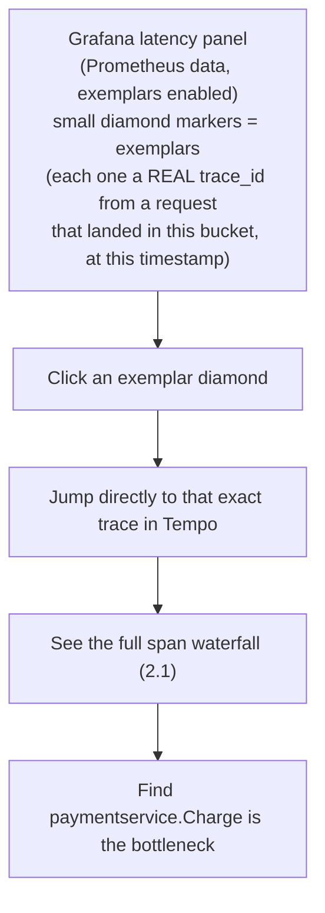
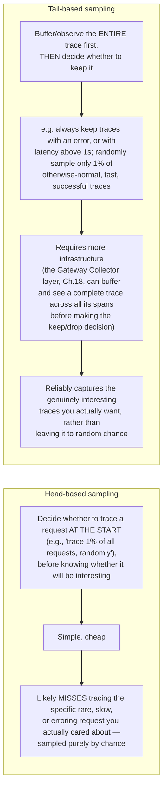
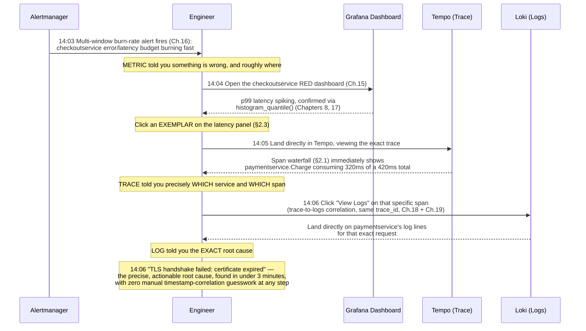
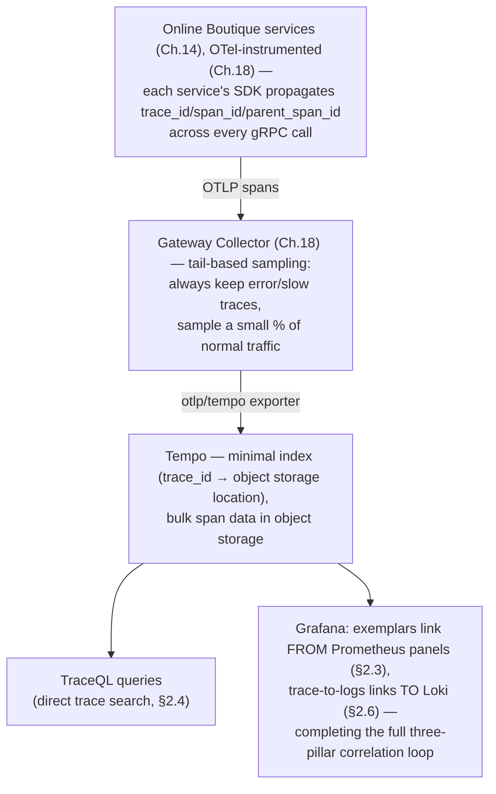

# Chapter 20: Tempo — Distributed Tracing

> **Part 16 — Tempo**

---

## 1. Objective

By the end of this chapter you will be able to:

- Explain what a trace, span, and span context are, precisely, and how spans form a tree/DAG representing one request's journey.
- Explain how Tempo differs architecturally from Loki/Prometheus, and why it (like Loki) deliberately avoids full indexing.
- Deploy Tempo and wire Online Boutique's OpenTelemetry instrumentation (Chapter 18) to send spans to it.
- Write TraceQL queries and read a trace waterfall view correctly.
- Understand sampling: why you can't (and shouldn't) trace 100% of requests at scale, and the tradeoffs of different sampling strategies.
- Complete, end to end, the full "metric spike → trace → log" investigation this handbook has been building toward since Chapter 1.

---

## 2. Concept

### 2.1 Traces, spans, and context propagation

Recall Chapter 1's definition: a **trace** represents one request's full journey through a distributed system, made up of **spans** — each span representing one unit of work (typically one service handling one operation), with a start time, duration, and metadata (attributes/tags).

```mermaid
gantt
    dateFormat X
    axisFormat %Lms
    title Trace: a single checkout request (trace_id: abc123)
    section frontend
    HandleCheckout (420ms) :0, 420
    section checkoutservice
    PlaceOrder (400ms) :10, 410
    section cartservice
    GetCart (15ms) :20, 35
    section productcatalogservice
    GetProduct x3 parallel (20ms) :40, 60
    section shippingservice
    GetQuote (30ms) :65, 95
    section paymentservice
    Charge (320ms, the slow one) :100, 420
    section emailservice
    SendConfirmation (10ms) :410, 420
    section currencyservice
    Convert (5ms) :415, 420
```



This tree structure — a **span waterfall** — is the canonical trace visualization, and it's precisely what makes tracing uniquely good at answering "which specific service, in a multi-hop request, is the bottleneck" (Chapter 1's original motivating example, now made completely concrete): a single glance at this waterfall instantly shows `paymentservice.Charge` consuming the overwhelming majority of the total request time, something no aggregate metric (even a perfect per-service p99 dashboard) can show for *one specific individual request* the way a trace can.

**Span context propagation** is the mechanism that makes this tree possible across process/network boundaries: each span carries a `trace_id` (shared by every span in the same trace) and a `span_id` (unique per span) plus a `parent_span_id` (linking it to its caller). When `checkoutservice` calls `paymentservice` over gRPC, it passes this context along in the request metadata (headers), and `paymentservice`'s own OTel SDK instrumentation picks it up automatically, creating its own span as a child of the one it received — this is exactly the "shared context across metrics/logs/traces" property Chapter 18 introduced, now specifically applied to linking spans across service boundaries into one coherent tree.

### 2.2 Tempo's architecture — object-storage-first, minimal indexing

Just as Loki deliberately avoids full-text indexing (Chapter 19), **Tempo deliberately avoids indexing span content at all**, beyond the `trace_id` itself. Tempo is, at its architectural core, essentially a **key-value store keyed by trace ID**, backed by object storage.

```
                TRADITIONAL TRACING BACKENDS           TEMPO
                (e.g., older Jaeger deployments
                 with Elasticsearch/Cassandra)
 ──────────────────────────────────────────  ──────────────────────────
 Index: span attributes, service names,        Index: essentially just
   operation names — broadly searchable          trace_id → object storage
                                                   location
 Storage backend: a full search/database        Storage backend: object
   system (Elasticsearch, Cassandra)              storage (S3/GCS/Azure/MinIO),
                                                   same pattern as Loki (Part 15)
                                                   and Thanos (Part 17)
 Query model: rich search across many           Query model: primarily "give
   dimensions, at real infrastructure cost        me the trace for this specific
                                                   trace_id" (cheap), PLUS newer
                                                   TraceQL search capability
                                                   (more infrastructure-light
                                                   than traditional approaches,
                                                   still evolving)
```

**Why this matters practically:** because a `trace_id` is a genuinely unique, high-cardinality identifier by design (Chapter 6's "never put unbounded values in a Prometheus label" warning — a trace ID is exactly the kind of value that warning was about, and it's precisely why traces are their own separate pillar rather than being folded into metrics), any tracing backend that tried to fully index every span attribute at Prometheus-style cardinality discipline would face the same cost explosion Chapters 6 and 19 already warned about, twice over now. Tempo's answer is architecturally similar to Loki's: keep the index minimal (essentially trace-ID lookup), push bulk storage to cheap object storage, and rely on **how you got the trace ID in the first place** (a metric-driven exemplar, a log line, a user bug report) rather than broad, expensive, ad hoc full-attribute search as the primary discovery path — though TraceQL (2.4) does add real search capability on top of this minimal-index foundation.

### 2.3 Getting from a metric to a trace: exemplars

Recall Chapter 8's histogram discussion. Modern Prometheus (and OpenTelemetry) supports **exemplars** — a mechanism for attaching a specific, real trace ID directly to a histogram bucket observation, so that when you're looking at a latency graph and see a spike, Grafana can show you one or more *actual example trace IDs* from requests that landed in that specific slow bucket, at that specific time — turning "here's an aggregate latency spike" directly into "here's one specific real request that was part of it, click here to see its full trace."



This is the concrete mechanism completing Chapter 1's "metric → trace" step of the investigation loop — not a manual timestamp-based guess at which trace might be relevant, but a direct, exact link from a specific aggregate data point to a specific real trace that contributed to it.

### 2.4 TraceQL — querying traces directly

Beyond trace-ID lookup and metric-driven exemplars, Tempo supports **TraceQL**, a query language purpose-built for searching traces by their structural and attribute properties:

```traceql
{ span.service.name = "paymentservice" && duration > 300ms }

{ resource.service.name = "checkoutservice" && span.http.status_code = 500 }

{ span.service.name = "cartservice" } | count() > 5
```

The first example finds any span from `paymentservice` taking longer than 300ms — directly useful for "show me examples of the exact slow-payment problem I suspect is happening" without needing to already have a specific trace ID in hand, closing the gap left by Tempo's minimal-index design with a genuinely capable, purpose-built search layer on top of it.

### 2.5 Sampling — why you can't (and shouldn't) trace everything

At real production request volumes, capturing a full trace for every single request is often prohibitively expensive (network overhead from context propagation, storage volume, and processing cost all scale with 100% sampling) — this is a genuine, deliberate tradeoff, not an oversight:



**This is precisely why Chapter 18 introduced the Gateway Collector pattern** as more than just "a place to centralize export credentials" — tail-based sampling is a canonical, high-value reason a Gateway layer exists at all: only a component that can see all of a trace's spans together (which individual Agent-layer collectors, seeing only their own node's spans, generally cannot do reliably alone) can make a genuinely informed "was this trace interesting" decision. Real production tracing deployments overwhelmingly favor tail-based sampling with an "always keep errors and slow requests" policy specifically because it guarantees you never lose visibility into exactly the requests most worth investigating, while still controlling total volume/cost for the overwhelming majority of normal, uninteresting traffic.

### 2.6 The complete, end-to-end investigation — Chapter 1's promise, fulfilled



This is, verbatim, the walkthrough Chapter 1 presented as an *aspiration* in section 2.3, back before a single piece of this stack existed. Every step is now real, concrete infrastructure you've built across Parts 3–16: the alert (Part 12), the dashboard and exemplar (Part 11, this chapter), the trace (this chapter), and the correlated log (Part 15) — this is the payoff of the entire handbook's architecture, not a new concept.

---

## 3. Why This Matters

- Tracing is the pillar that makes multi-hop, cross-service investigations tractable — without it, "which of these 11 services is actually slow" reverts to guesswork or exhaustively checking each service's own metrics one at a time, exactly the problem Chapter 1 opened with.
- Understanding sampling tradeoffs (2.5) is a genuine production engineering decision every team adopting tracing has to make — naive 100% head-based sampling is both expensive and, counterintuitively, not even the best way to guarantee you capture the traces you actually care about; tail-based sampling with an error/latency-aware retention policy is the mature answer.
- Section 2.6 is the payoff of this entire handbook's architecture — being able to walk an interviewer through this exact, concrete, cross-tool investigation (not just naming the three pillars abstractly, as Chapter 1 first asked you to do) is a genuine signal of practical, hands-on observability maturity.

---

## 4. Architecture



---

## 5. Hands-on Lab

**1. Install Tempo via Helm:**

```bash
helm install tempo grafana/tempo \
  --namespace monitoring \
  --set tempo.storage.trace.backend=local \
  --set persistence.enabled=true
```

*(Production deployments use `s3`/`gcs`/`azure` backends per section 2.2's object storage principle; `local` is acceptable for this lab.)*

**2. Point your Gateway OTel Collector at Tempo** — re-add the `otlp/tempo` exporter and `traces` pipeline from Chapter 18's full config example (section 2.3 of that chapter), now that Tempo actually exists to receive it:

```bash
helm upgrade otel-collector open-telemetry/opentelemetry-collector \
  --namespace monitoring \
  -f otel-collector-values.yaml   # updated with the traces pipeline re-enabled
```

**3. Add Tempo as a Grafana data source**, and — critically — configure Prometheus's data source settings in Grafana to **enable exemplars**, pointing them at your Tempo data source (Grafana's Prometheus data source config has an explicit "Exemplars" section for exactly this linkage).

**4. Generate real trace traffic.** Online Boutique's built-in `loadgenerator` (Chapter 14) is already producing continuous checkout traffic — confirm real traces are landing in Tempo by searching in Grafana's Explore view (Tempo data source) for `{ resource.service.name = "checkoutservice" }`.

**5. Walk through section 2.6's full investigation, for real.** Open your `checkoutservice` latency panel (Chapter 15), confirm exemplar diamonds are visible on it, click one, follow it into Tempo's trace waterfall, identify the slowest span, then use Grafana's trace-to-logs link to jump to that span's correlated log lines in Loki.

**6. Experiment with TraceQL:**

```traceql
{ span.service.name = "paymentservice" && duration > 100ms }
```

---

## 6. Verification

- [ ] Explain what a span, trace, and trace/span/parent-span ID are, and how they form a tree across service boundaries.
- [ ] Explain why Tempo, like Loki, deliberately avoids broad indexing, and what it indexes instead.
- [ ] Explain what an exemplar is and how it links a specific Prometheus histogram bucket observation to a specific real trace.
- [ ] Explain the difference between head-based and tail-based sampling, and why tail-based sampling requires a Gateway-style collector layer.
- [ ] Successfully complete, end to end, the full metric → exemplar → trace → log investigation from section 2.6 against your own running cluster.

---

## 7. Troubleshooting

| Symptom | Root Cause | Fix |
|---|---|---|
| No traces appearing in Tempo at all | The Gateway Collector's `traces` pipeline isn't configured/enabled, or services aren't actually emitting OTLP spans (instrumentation gap from Chapter 14/18). | Check `otelcol_receiver_accepted_spans_total` and `otelcol_exporter_sent_spans_total` on the Collector (Chapter 18's self-monitoring pattern); confirm service-side OTel SDK trace export is actually configured, not just metrics. |
| Traces appear but exemplars don't show on Prometheus panels | Exemplars not enabled on the Prometheus data source in Grafana, or the application's metrics library isn't attaching exemplars to histogram observations (not all client libraries do this by default — it's an explicit opt-in feature). | Check Grafana's Prometheus data source "Exemplars" configuration; confirm the specific metrics library/version in use actually supports exemplar attachment. |
| A trace's waterfall has "gaps" — a service's spans are missing entirely from an otherwise-complete trace | Context propagation broke somewhere in the call chain — often a missed header/metadata pass-through in a non-instrumented hop (e.g., a manual HTTP client call that doesn't use the OTel-instrumented client wrapper). | Audit the specific service-to-service call for correct OTel context propagation; this is a common gap specifically at boundaries where instrumentation was added incrementally rather than everywhere at once. |
| TraceQL query returns nothing despite matching traces existing | Attribute name/casing mismatch (`span.service.name` vs `resource.service.name` — Tempo distinguishes span-level from resource-level attributes, a common point of confusion), or time range too narrow. | Double check whether the attribute is resource-level or span-level; widen the search time range. |
| Trace volume/storage growing faster than expected | Sampling isn't actually configured as intended — e.g., still running with an effective 100% head-based sample rate rather than the intended tail-based policy. | Review the Gateway Collector's sampling processor configuration explicitly; confirm the actual sampled percentage matches the intended policy. |

---

## 8. Production Notes

- **Tail-based sampling with an "always keep errors and high latency" policy is, in practice, the dominant real production pattern** for exactly the reason section 2.5 describes — it directly guarantees the traces most likely to matter during an investigation are never lost to random chance, which naive head-based sampling cannot guarantee.
- **Exemplars are a genuinely underused feature** even among teams that have adopted all of Prometheus, Loki, and Tempo — enabling them (a small, one-time Grafana data source configuration change) is a very high-leverage improvement to real incident investigation speed, directly shortening exactly the kind of manual correlation work Chapter 1 identified as the core problem tracing solves.
- Trace data volume, even with tail-based sampling, still typically dwarfs metrics data volume at scale — real production Tempo deployments budget for this explicitly (object storage costs, retention windows shorter than metrics/logs is common, since traces are primarily useful for near-term investigation rather than long-term trend analysis, unlike metrics).

---

## 9. Best Practices

1. **Use tail-based sampling with an error/latency-aware retention policy**, not naive head-based random sampling, for any production tracing deployment.
2. **Enable exemplars** as a standard part of your Grafana/Prometheus data source configuration — it's a small effort with an outsized payoff for real investigation speed.
3. **Ensure OTel context propagation is complete across every service-to-service call**, including non-obvious hops (manual HTTP clients, message queue producers/consumers) — a broken propagation link creates a genuinely confusing "missing spans" gap in an otherwise-complete trace.
4. **Set trace retention shorter than metrics/logs retention by default**, reflecting traces' primary value as a near-term investigation tool rather than a long-term trend-analysis source.
5. **Practice the full metric → exemplar → trace → log investigation loop deliberately, before you need it in a real incident** — muscle memory here directly translates into faster real-world mean-time-to-resolution.

---

## 10. Interview Questions

1. **"What is a span, and how do spans from different services combine into one trace?"** — A span represents one unit of work (typically one service handling one operation) with a start time and duration; spans combine into a trace via shared `trace_id` and parent/child `span_id` relationships, propagated across service boundaries in request metadata by the OTel SDK, forming a tree that represents the full request's journey.
2. **"Why does Tempo avoid indexing full span content, similar to how Loki avoids full-text log indexing?"** — Because trace IDs and span attributes are inherently high-cardinality (each trace ID is unique by design), fully indexing them at the volume real production tracing generates would reproduce the same cost explosion Prometheus and Loki avoid via label/cardinality discipline; Tempo instead keeps a minimal index (essentially trace-ID lookup) backed by cheap object storage, with TraceQL providing structured search on top.
3. **"What is an exemplar, and what problem does it solve?"** — A specific real trace ID attached to a histogram bucket observation, letting you jump directly from an aggregate metric spike (e.g., a p99 latency graph) to one specific real trace that contributed to it — replacing manual timestamp-based guessing with a direct, exact link.
4. **"What's the difference between head-based and tail-based sampling, and why does tail-based sampling typically require a centralized Gateway collector?"** — Head-based sampling decides whether to trace a request at the start, before knowing if it'll be interesting, risking missing the specific rare/slow/erroring requests you actually care about; tail-based sampling observes the complete trace first and then decides to keep or drop it based on its actual characteristics (errors, high latency) — this requires a component that can see all of a trace's spans together, which is exactly the role a centralized Gateway Collector plays.
5. **"Walk me through a full investigation using metrics, traces, and logs together."** — Recite section 2.6: a burn-rate alert fires → the RED dashboard confirms a latency spike → an exemplar on that panel links directly to a real trace → the trace's span waterfall identifies the specific slow service/span → a trace-to-logs link surfaces the exact log line explaining the root cause — all without manual timestamp correlation at any step.

---

## 11. Real Incident

**Company type:** Travel booking platform, complex multi-service checkout flow (similar in shape to Online Boutique's).

**What happened:** A customer-reported "booking sometimes takes forever" complaint couldn't be reproduced or diagnosed for over a week using metrics alone — aggregate p99 latency for the booking service looked normal most of the time, with only a very small, inconsistent fraction of requests affected, invisible against the noise of overall traffic in any dashboard.

**What changed the investigation:** The team had Tempo deployed but had never enabled exemplars (viewed at the time as a "nice to have" they hadn't gotten around to) and was running naive 1% head-based sampling — meaning even when a slow request *did* happen to be traced, there was only a 1% chance any given occurrence of the elusive bug was actually captured at all. After enabling exemplars and switching to tail-based sampling with an explicit "always keep requests over 2 seconds" rule (directly per this chapter's section 2.5 guidance), the team reliably began capturing full traces of the specific slow requests within hours.

**Root cause, once finally visible:** A specific downstream fraud-check service occasionally made a synchronous call to a third-party API that had its own rare, multi-second timeout under specific conditions — a dependency invisible in the booking service's own metrics (it wasn't the one being slow; it was waiting on someone else) and essentially undiscoverable without a complete, reliably-captured trace showing the actual span breakdown.

**Resolution:** Added an explicit, shorter timeout and a circuit breaker around the fraud-check service's third-party call; customer-reported slow-booking complaints dropped to zero within the next release cycle.

**Prevention:** Tail-based sampling with an error/high-latency retention policy, and exemplars, were both immediately elevated from "nice to have, someday" to a standard, required part of the team's Tempo deployment checklist — a direct, costly (a week of unresolved customer complaints) lesson in exactly the gap this chapter's Best Practices #1 and #2 warn about.

---

## 12. Summary

- A **trace** is a tree of **spans**, connected via shared `trace_id` and parent/child `span_id` relationships propagated across service boundaries — the structure that uniquely lets you see which specific service, in a multi-hop request, is the bottleneck.
- **Tempo**, like Loki, deliberately avoids broad indexing (given trace IDs' inherently high cardinality), relying on minimal trace-ID-based lookup backed by object storage, with **TraceQL** providing structured search on top.
- **Exemplars** link a specific aggregate metric observation directly to a specific real trace — the concrete mechanism completing the "metric → trace" step of a real investigation.
- **Tail-based sampling**, requiring a centralized Gateway collector to see complete traces before deciding what to keep, reliably captures the genuinely interesting (erroring, slow) traces — superior to naive head-based random sampling for exactly the requests you actually care about.
- Section 2.6's full metric → exemplar → trace → log walkthrough is this handbook's complete realization of Chapter 1's opening promise — all three pillars, fully correlated, in one real investigation.

---

## 13. Next Chapter

This closes out **Part 16: Tempo**, and with it, the complete three-pillars observability story from Chapter 1 — metrics (Parts 1–14), logs (Part 15), and traces (this chapter), all correlated and queryable together in one real, running stack.

**Part 17, Chapter 21: Thanos — HA, Long-Term Storage, Federation** turns to a different axis entirely: not new signal types, but making the metrics pipeline itself production-hardened at scale — true Prometheus high availability, long-term retention beyond local disk via object storage, downsampling for efficient long-range historical queries, and federating multiple Prometheus instances/clusters into one global query view.
