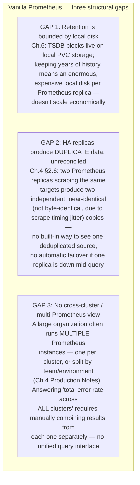
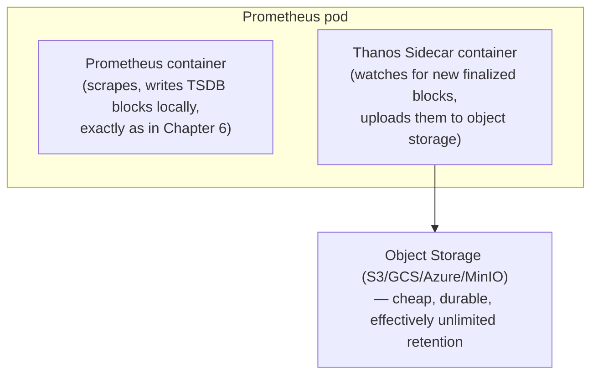
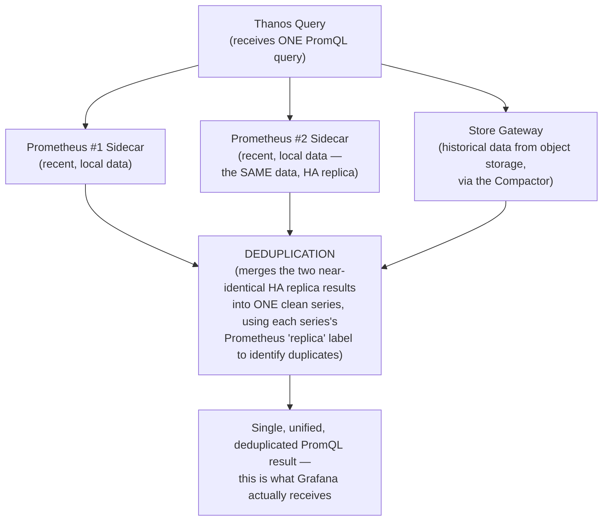
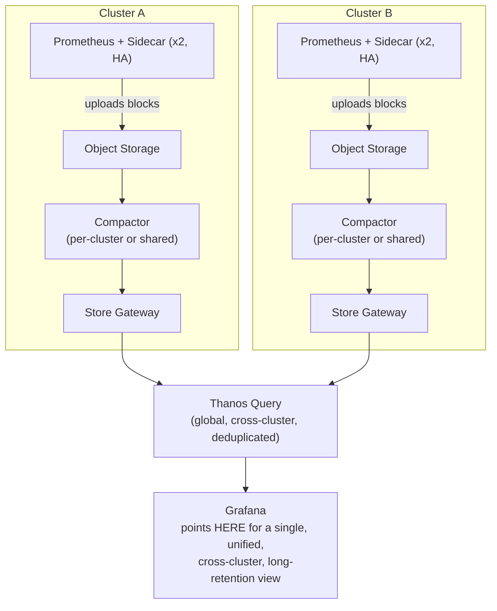

# Chapter 21: Thanos — HA, Long-Term Storage, Federation

> **Part 17 — Thanos**

---

## 1. Objective

By the end of this chapter you will be able to:

- Explain exactly what problem Thanos solves that vanilla Prometheus (even with HA replicas, per Chapter 4) cannot solve alone.
- Explain each core Thanos component: Sidecar, Store Gateway, Compactor, Query (Querier), and Ruler.
- Explain **deduplication** at query time across HA Prometheus replicas — the concrete mechanism previewed back in Chapter 4.
- Explain **downsampling** and why it's essential for efficient long-range historical queries.
- Explain **federation** — querying across multiple Prometheus instances/clusters as if they were one.
- Deploy a minimal Thanos setup on top of your Chapter 5 install.

---

## 2. Concept

### 2.1 What Thanos solves — the three gaps in vanilla Prometheus

Recall Chapter 4's HA discussion and Chapter 6's retention/TSDB mechanics. Vanilla Prometheus, even done correctly (multiple HA replicas, persistent storage, sensible retention), still has three structural gaps:



**Thanos solves all three**, without modifying Prometheus itself — it works entirely by *sitting alongside* Prometheus (a sidecar container) and adding a set of complementary components around it, which is precisely why Thanos integrates so cleanly with the kube-prometheus-stack install from Chapter 5 rather than requiring you to rip anything out.

### 2.2 The Sidecar — the bridge to object storage

The **Thanos Sidecar** runs as an additional container in the same Prometheus pod (a genuine Kubernetes sidecar pattern) and does two things: it exposes Prometheus's local data for remote querying (2.4), and — the piece that solves Gap 1 — it **uploads each completed TSDB block** (recall Chapter 6: Prometheus flushes the head block to an immutable on-disk block roughly every 2 hours) to **object storage** (S3, GCS, Azure Blob, or MinIO for a lab setup), as soon as each block is finalized.



**Local Prometheus retention can now be kept short** (e.g., the recent, hot 24–48 hours needed for fast alert evaluation and recent-data dashboards, per Chapter 6's "recent queries hit the fast head block" point) while **effectively unlimited historical data** lives cheaply in object storage — directly solving Gap 1 without requiring an enormous local PVC.

### 2.3 The Compactor and downsampling

Raw metric data at its original scrape resolution (e.g., every 30 seconds) is far more detail than anyone needs when looking at a graph spanning 6 months — at that zoom level, a single pixel on screen might represent thousands of raw data points anyway. The **Thanos Compactor** runs against object storage and performs two jobs: it **compacts** small blocks into larger ones (the same idea as Prometheus's own local compaction, Chapter 6, just operating on the object-storage-resident blocks instead), and it **downsamples** older data into lower-resolution aggregates.

```
 Data age          Resolution kept
 ────────          ────────────────
 0 - 40h            raw (original scrape resolution, e.g. 30s)
 40h - 10d           downsampled to 5m resolution
 10d+                downsampled to 1h resolution
```

**Why this matters for both cost and query speed:** a query spanning 6 months against raw 30-second-resolution data would need to scan an enormous number of samples for comparatively little visual benefit; querying the same 6-month range against 1-hour-downsampled data scans dramatically fewer points, renders faster, and costs less, while remaining visually indistinguishable on a graph rendered at typical screen resolution. Thanos Query (2.4) automatically selects the appropriate resolution tier based on the query's time range — you don't have to manually choose; this happens transparently.

### 2.4 Thanos Query (Querier) — the unified query layer, and deduplication

**Thanos Query** is the component your Grafana data source actually points at (instead of, or alongside, Prometheus directly) — it fans a single incoming PromQL query out to every configured data source (each Prometheus's Sidecar for recent data, the Store Gateway for historical object-storage data, and any other clusters' Thanos Query instances for federation) and **merges the results into one unified response**.



This is the **exact mechanism Chapter 4 promised** back in section 2.6, when it said "deduplication happens at query time, typically via Thanos Query, not inside Prometheus itself" — now you know precisely how: Thanos Query recognizes that two results came from HA replicas of the same underlying Prometheus (via a configured `replica` label distinguishing them) and merges them into one clean series, presenting a single source of truth to Grafana regardless of how many redundant replicas are actually running underneath. This directly solves Gap 2, and — because Thanos Query can also query *other clusters'* Thanos Query instances — it directly solves Gap 3 (federation) using the exact same fan-out-and-merge mechanism, just one layer further out.

### 2.5 Store Gateway — making object storage queryable

The **Store Gateway** is what makes historical data sitting in object storage actually queryable via PromQL at all — it exposes the same gRPC API that Thanos Query expects from a Prometheus Sidecar, but backed by object storage blocks instead of a live Prometheus's local disk. From Thanos Query's perspective, a Store Gateway and a Sidecar look like the same kind of data source — it doesn't need to know or care that one is "live Prometheus" and the other is "historical object storage data" — which is precisely what makes the whole system compose cleanly: Thanos Query just fans out to every registered source and merges whatever comes back.

### 2.6 The Ruler — evaluating rules against the unified view

Recall Chapters 7, 12, and 17: Recording Rules and Alert Rules normally run *inside* Prometheus itself, evaluated only against that Prometheus's own local data. The **Thanos Ruler** is a separate component that instead evaluates rules against the **unified, deduplicated, cross-source Thanos Query view** — necessary specifically for rules that need to see data spanning multiple Prometheus instances/clusters (federation, Gap 3) rather than just one instance's local scope, which a normal in-Prometheus `PrometheusRule` cannot do.

### 2.7 Putting it together — the full Thanos architecture



---

## 3. Why This Matters

- Thanos is what makes everything built in Parts 3–13 actually **scale to a real, multi-cluster enterprise organization** — the gap between "a working lab/single-cluster setup" and "a production platform serving 50+ teams across multiple clusters" is largely exactly the three gaps this chapter closes.
- Understanding deduplication (2.4) completes a promise made all the way back in Chapter 4 — this is genuinely satisfying to trace through as a learner, and is a strong signal of depth in an interview: being able to explain not just *that* Thanos deduplicates HA replicas, but precisely *how* (the `replica` label mechanism).
- Downsampling (2.3) is a direct, practical extension of Chapter 6's TSDB mechanics — understanding both together is what lets you reason correctly about long-range query performance and storage cost tradeoffs at real scale, a genuine capacity-planning skill covered further in Part 18.

---

## 4. Architecture

*(See section 2.7's full diagram above — this chapter's architecture section and concept section are unified given how tightly coupled Thanos's components are to explain independently of their topology.)*

---

## 5. Hands-on Lab

**1. Enable the Thanos Sidecar on your Chapter 5 Prometheus**, pointing at object storage (MinIO is a reasonable lab-friendly S3-compatible choice if you don't have real cloud object storage available):

```bash
helm install minio bitnami/minio --namespace monitoring \
  --set auth.rootUser=admin,auth.rootPassword=labpassword123
```

```yaml
# values.yaml addition to your Chapter 5 install
prometheus:
  prometheusSpec:
    thanos:
      objectStorageConfig:
        secret:
          type: S3
          config:
            bucket: "thanos"
            endpoint: "minio.monitoring.svc:9000"
            access_key: "admin"
            secret_key: "labpassword123"
            insecure: true
    retention: 2d    # now safe to shorten — Thanos handles long-term retention
```

```bash
helm upgrade kube-prom-stack prometheus-community/kube-prometheus-stack \
  --namespace monitoring -f values.yaml
```

**2. Confirm the Sidecar is uploading blocks** — check its logs and confirm objects are appearing in the MinIO bucket via MinIO's own console (port-forward its Service).

**3. Deploy Thanos Query and Store Gateway** (via the standalone `thanos` Helm chart or kube-prometheus-stack's Thanos integration, depending on your chart version's support):

```bash
helm repo add bitnami https://charts.bitnami.com/bitnami
helm install thanos bitnami/thanos --namespace monitoring \
  --set query.enabled=true \
  --set storegateway.enabled=true \
  --set compactor.enabled=true \
  --set objstoreConfig="$(cat objstore.yaml)"   # same S3 config as above, YAML format
```

**4. Point Grafana's Prometheus data source at Thanos Query instead of Prometheus directly**, and confirm your existing dashboards (Chapter 15) continue working unchanged — this is an important, deliberate property: Thanos Query speaks the same PromQL/HTTP API Prometheus does, so nothing downstream needs to know it's now talking to Thanos instead of Prometheus directly.

**5. Verify deduplication conceptually** — if you're running single-replica Prometheus in your lab (likely, for resource reasons), you won't see real deduplication in action, but confirm you understand the mechanism by inspecting the `replica` external label configured on your Prometheus (`kubectl get prometheus -n monitoring -o yaml | grep -A3 externalLabels`) — this is the exact label Thanos Query would use to identify and merge duplicate HA replica data if you scaled to 2+ replicas.

---

## 6. Verification

- [ ] Name the three structural gaps in vanilla Prometheus (bounded local retention, unreconciled HA duplication, no cross-cluster view) and which Thanos component addresses each.
- [ ] Explain the Sidecar's role precisely — what it uploads, and when.
- [ ] Explain downsampling and why a 6-month query benefits from it without sacrificing meaningful visual accuracy.
- [ ] Explain exactly how Thanos Query deduplicates HA replica data — the mechanism, not just the fact that it happens.
- [ ] Explain why Grafana doesn't need any configuration changes to its actual dashboards/queries when its data source is switched from Prometheus directly to Thanos Query.

---

## 7. Troubleshooting

| Symptom | Root Cause | Fix |
|---|---|---|
| Sidecar running but no blocks appearing in object storage | Blocks only upload once they're finalized (roughly every 2h, per Chapter 6) — a freshly-started Prometheus may not have any finalized blocks yet, or object storage credentials/bucket config are wrong. | Wait for at least one 2-hour block cycle in a real (non-lab-shortened) scenario; check Sidecar logs for upload errors and verify object storage connectivity/credentials directly. |
| Thanos Query returns no data at all | Not registered correctly with its store endpoints (Sidecars/Store Gateway), or a gRPC connectivity/NetworkPolicy issue between components. | Check Thanos Query's own `/stores` status page (its web UI) — it lists every configured store endpoint and their health; a store missing or shown unhealthy here is the direct cause. |
| Query for a wide, old time range is slow despite downsampling being configured | The Compactor hasn't processed those blocks into downsampled form yet (a backlog, or insufficient Compactor resources), or downsampling was only recently enabled and older data predates it. | Check Compactor logs/metrics for processing backlog; downsampling is applied going forward from when it's enabled, not retroactively instant for all existing historical data. |
| Seeing duplicate/doubled values instead of clean deduplicated data | HA replicas don't have a distinguishing `replica` external label configured correctly, so Thanos Query can't tell they're duplicates of the same logical series rather than genuinely different data. | Verify each Prometheus replica's `externalLabels` includes a unique `replica` value (e.g., `replica: "0"` vs `replica: "1"`) and that Thanos Query's dedup configuration references that exact label name. |
| Thanos Ruler alerts behave unexpectedly compared to normal Prometheus alerts | Thanos Ruler evaluates against the unified Thanos Query view, which may include downsampled/aggregated historical data behavior differences at query boundaries not present in a normal single-Prometheus `PrometheusRule` evaluation. | Reserve Thanos Ruler specifically for genuinely cross-cluster/federated rules; keep single-cluster rules as normal `PrometheusRule`s evaluated directly in Prometheus, per Chapter 7, to avoid unnecessary complexity. |

---

## 8. Production Notes

- Real large-scale deployments almost universally run the Sidecar pattern from day one, even before genuinely needing long-term retention or federation, specifically because **retrofitting Thanos onto an already-running fleet of Prometheus instances is more disruptive than building it in from the start** — worth treating as a default architectural choice for any Prometheus deployment expected to grow, rather than something bolted on reactively later.
- **Object storage cost, while dramatically cheaper than equivalent local block storage, is not free** — real organizations apply lifecycle policies (e.g., auto-deleting or moving to cheaper storage tiers data beyond a certain age) on top of Thanos's own downsampling, treating long-term retention as a deliberate, budgeted cost decision, not an unlimited default.
- The **Compactor should run as a single instance** (or with careful leader-election if scaled) — unlike most components in this handbook, running multiple uncoordinated Compactor instances against the same object storage bucket can cause data corruption from concurrent, conflicting compaction operations; this is a specific, well-documented Thanos operational gotcha worth knowing explicitly before deploying it for real.

---

## 9. Best Practices

1. **Deploy the Thanos Sidecar from the start** on any Prometheus expected to grow, rather than retrofitting it reactively later.
2. **Shorten local Prometheus retention once the Sidecar is uploading reliably** — there's no need to keep redundant long-term data on expensive local PVC storage once object storage has it.
3. **Set a distinguishing `replica` external label on every HA Prometheus instance** — without it, Thanos Query's deduplication cannot function correctly.
4. **Run exactly one Compactor instance per object storage bucket** (or use proper leader election) — concurrent, uncoordinated compaction is a genuine data-corruption risk, not just an inefficiency.
5. **Apply object storage lifecycle policies deliberately** rather than treating long-term retention as unlimited-by-default; budget it like any other real infrastructure cost.

---

## 10. Interview Questions

1. **"What three problems does Thanos solve that vanilla Prometheus, even with HA replicas, cannot solve alone?"** — Local-disk-bounded retention (solved by the Sidecar uploading to object storage), unreconciled duplicate data from HA replicas (solved by Thanos Query's deduplication), and no unified cross-cluster/multi-Prometheus query view (solved by Thanos Query's fan-out-and-merge federation).
2. **"How does Thanos Query deduplicate data from HA Prometheus replicas?"** — Each HA replica is configured with a distinguishing `replica` external label; Thanos Query recognizes series that are identical except for that label as duplicates of the same logical data and merges them into a single clean series in its response.
3. **"What is downsampling, and why does it matter for long-range queries?"** — Progressively reducing stored resolution for older data (e.g., raw → 5m → 1h aggregates over time via the Compactor); it dramatically reduces the data volume a wide-time-range query needs to scan, improving speed and cost with negligible visual impact at typical graph rendering resolutions.
4. **"What does the Thanos Sidecar actually do, concretely?"** — Runs alongside Prometheus in the same pod; exposes Prometheus's local data for remote querying via Thanos Query, and uploads each finalized local TSDB block to object storage as soon as it's completed.
5. **"Why is it important to run only one Compactor instance (or properly leader-elected) per object storage bucket?"** — Concurrent, uncoordinated compaction operations against the same bucket by multiple Compactor instances can corrupt the underlying block data — this is a specific, documented operational hazard unique to how Thanos's Compactor mutates object storage state.
6. **"Why doesn't Grafana need reconfiguration when switching its data source from Prometheus directly to Thanos Query?"** — Thanos Query implements the same PromQL/HTTP query API Prometheus does, acting as a drop-in-compatible unified query layer — existing dashboards and queries work unchanged regardless of how many underlying Prometheus instances or object-storage-backed historical sources are actually being fanned out to behind it.

---

## 11. Real Incident

**Company type:** Large enterprise SaaS platform running Prometheus per-cluster across 12 Kubernetes clusters globally, pre-Thanos.

**What happened:** Leadership requested a single, unified "global error rate across all regions" dashboard for a board-level reliability review. With 12 independent Prometheus instances and no federation layer, the platform team's only option was manually querying each cluster's Prometheus separately and combining the results by hand in a spreadsheet — a genuinely embarrassing, days-long manual effort for what should have been a single dashboard, and one that couldn't be kept live/current afterward without repeating the entire manual process.

**Root cause:** No cross-cluster query layer existed — precisely Gap 3 from section 2.1, experienced directly rather than abstractly, at a moment (a board-level ask) where the cost of not having it was maximally visible and painful.

**Resolution:** The team fast-tracked a Thanos deployment across all 12 clusters (Sidecar + Store Gateway + a centralized Thanos Query), and had a genuinely live, auto-updating, unified global dashboard within two weeks — a dramatic contrast to the days-long manual spreadsheet exercise it replaced, and one that has stayed current automatically ever since.

**Prevention / lesson:** The team's retrospective explicitly noted that Thanos should have been part of the platform's architecture from the very first cluster, not bolted on reactively under leadership pressure at cluster #12 — directly reinforcing this chapter's Production Notes recommendation to deploy the Sidecar from day one on any Prometheus expected to grow into a multi-cluster reality, since by the time the *need* becomes obvious, the retrofit cost has already grown substantially.

---

## 12. Summary

- **Thanos** solves three structural gaps in vanilla Prometheus: local-disk-bounded retention, unreconciled HA replica duplication, and no cross-cluster query view — without requiring any changes to Prometheus itself.
- The **Sidecar** uploads finalized TSDB blocks to object storage, letting local retention shrink safely; the **Compactor** compacts and **downsamples** that historical data for efficient long-range queries; the **Store Gateway** makes object-storage-resident data queryable; **Thanos Query** fans a single PromQL query out across all sources (live and historical, single-cluster or federated) and merges the results, including **deduplicating** HA replica data via a `replica` label.
- Grafana requires no dashboard/query changes when switching from Prometheus directly to Thanos Query — it's a drop-in-compatible unified query layer.
- Real organizations deploy the Sidecar from day one rather than retrofitting it reactively, given how much more disruptive a later migration is once an organization is already running at multi-cluster scale.

---

## 13. Next Chapter

This closes out **Part 17: Thanos**, and with it, the complete technical architecture of this handbook — every signal type (metrics, logs, traces) and every scaling dimension (HA, long-term storage, federation) is now built and understood.

**Part 18, Chapter 22: Backup, Restore, Upgrade, Scaling, Capacity Planning** begins the handbook's operations arc — keeping everything you've built running reliably over time: backup/restore procedures, safe upgrade practices, scaling decisions, and real capacity planning methodology, setting up Chapters 23 (Security) and 24 (Beyond NodePort) to complete Part 18.
