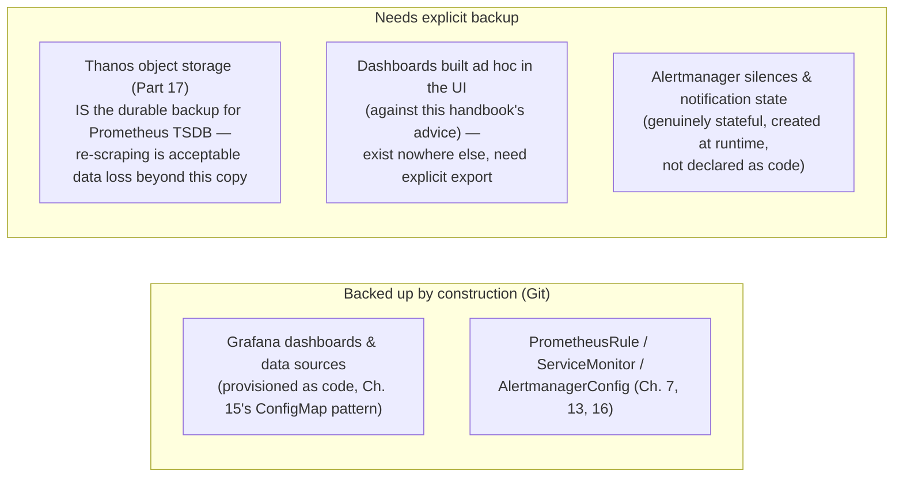
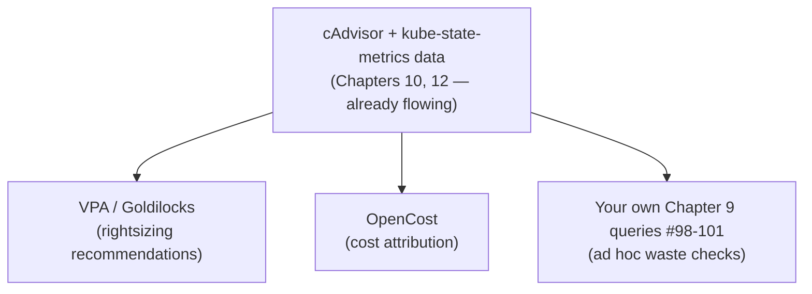
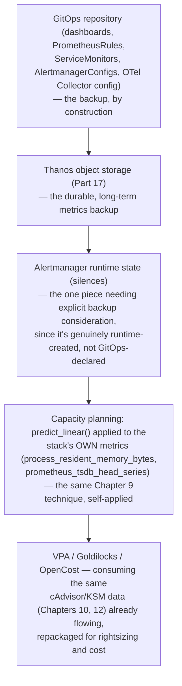

# Chapter 22: Backup, Restore, Upgrade, Scaling, Capacity Planning

> **Part 18 — Production Operations**

---

## 1. Objective

By the end of this chapter you will be able to:

- Back up and restore Prometheus, Grafana, and Alertmanager state correctly.
- Perform a safe kube-prometheus-stack version upgrade without losing data or alerting coverage.
- Make informed vertical and horizontal scaling decisions for every component in this handbook's stack.
- Apply a real capacity planning methodology, using the cluster's own metrics about itself.
- Use VPA/Goldilocks and OpenCost to rightsize workloads and understand cost, closing the loop on Chapter 9's efficiency queries.

---

## 2. Concept

### 2.1 What actually needs backing up, and why each piece differs

Not everything in this stack is equally important to back up, and each piece has a genuinely different backup story:



**The single biggest insight of this section:** because this handbook has consistently pushed everything toward GitOps (Chapters 7, 15, 16, 18), **most of what would traditionally need backing up is already backed up, by construction, in version control** — the actual backup surface area that needs dedicated attention is much smaller than a beginner might assume: primarily Thanos's object storage (which has its own durability guarantees from the cloud/object storage provider) and Alertmanager's runtime silence state.

### 2.2 Prometheus snapshot API — for the cases that do need it

For scenarios where a genuine point-in-time Prometheus data backup is still warranted (e.g., regulatory requirements, or a cluster without Thanos yet):

```bash
curl -XPOST http://localhost:9090/api/v1/admin/tsdb/snapshot
```

This creates a consistent snapshot of the current TSDB state in Prometheus's data directory (`snapshots/<timestamp>/`), which can then be copied out (e.g., via `kubectl cp`, or more robustly via a Job that mounts the same PVC and pushes to object storage) — conceptually identical to what the Thanos Sidecar already does automatically for finalized blocks (Part 17), just manually triggered and covering the current, not-yet-finalized head block as well.

### 2.3 Safe upgrade procedure for kube-prometheus-stack

Recall Chapter 5's Production Notes: always pin chart versions, upgrade deliberately. Here is the actual deliberate procedure:

```
 1. Read the chart's CHANGELOG/release notes for the version jump,
    specifically looking for CRD changes (a common source of breaking
    upgrades — new CRD versions sometimes require manual migration
    steps the Helm upgrade itself won't perform automatically).

 2. Upgrade CRDs FIRST, explicitly, if the chart's docs call for it —
    many charts (including kube-prometheus-stack) intentionally do
    NOT auto-upgrade CRDs via `helm upgrade` alone, requiring a
    separate `kubectl apply` step against the new CRD definitions.

 3. Run `helm upgrade --dry-run` first, and diff the output against
    the current running config — catch unexpected changes BEFORE
    they apply, not after.

 4. Upgrade in a non-production cluster/environment first, if one
    exists, and let it run for a meaningful burn-in period.

 5. During the actual production upgrade, watch:
      - kubectl get pods -n monitoring -w   (rollout health)
      - Prometheus Targets page (did scraping continue working?)
      - Alertmanager UI (did routing config survive intact?)
      - A known-good Grafana dashboard (did the datasource/queries
        still render correctly?)

 6. Have a rollback plan ready BEFORE starting: `helm rollback
    kube-prom-stack <previous-revision>` — know the previous
    revision number in advance (`helm history kube-prom-stack -n
    monitoring`), don't look it up under pressure mid-incident.
```

**The CRD-upgrade gotcha (step 2) deserves special emphasis** because it's a genuinely common, real-world source of broken upgrades specific to Operator-pattern tools like this entire stack (Chapter 4) — Helm's default behavior around CRDs (installed once, not automatically updated on subsequent `helm upgrade` runs, by deliberate Helm design to avoid accidentally destructive schema changes) means a chart upgrade that *assumes* a newer CRD schema can fail in confusing ways if you skip this explicit step.

### 2.4 Scaling decisions — vertical vs. horizontal, per component

| Component | Scaling approach | Why |
|---|---|---|
| **Prometheus** | Primarily **vertical** (more CPU/memory per instance), with **horizontal sharding** (splitting scrape targets across multiple Prometheus instances by label, Chapter 4's Production Notes) once a single instance's cardinality/query load genuinely exceeds practical vertical limits | Prometheus's own querying isn't natively distributed across instances — Thanos Query (Part 17) is what lets you present multiple sharded/HA instances as one logical view, making horizontal scaling practical rather than a fragmented mess. |
| **Grafana** | **Horizontal** (multiple stateless replicas behind a Service), given dashboards/data sources are provisioned as code (Chapter 15) rather than stored on any single pod's local state | Grafana itself holds little unique state when provisioned via ConfigMap/GitOps — scaling replicas is straightforward. |
| **Alertmanager** | **Horizontal**, natively — Alertmanager has built-in clustering/gossip specifically designed for running multiple replicas that coordinate on deduplication/silencing state directly (a different, native mechanism from Prometheus's "dumb replication, dedup elsewhere" HA model, Chapter 4 §2.6) | Alertmanager was explicitly designed for HA from the start, unlike Prometheus. |
| **Node Exporter / kube-state-metrics** | Effectively fixed to node count (DaemonSet) / doesn't typically need scaling (single Deployment handles most cluster sizes; sharding KSM by resource type is possible at extreme scale but rarely needed) | Their resource usage scales with cluster object count, not query load — a different scaling driver than Prometheus/Grafana. |
| **OTel Collector (Part 14)** | **Horizontal** at the Gateway layer specifically (Chapter 18 §2.5) | The Agent layer is already effectively "scaled" via DaemonSet placement; Gateway replica count is the actual scaling lever for centralized processing throughput. |

### 2.5 Capacity planning methodology — using the stack to plan the stack

The most mature real-world approach is deliberately **self-referential**: use this handbook's own Chapter 9 queries, applied to the monitoring stack's own components, to plan its own growth.

```promql
# Prometheus's own memory growth trend (predictive capacity signal)
predict_linear(process_resident_memory_bytes{job="prometheus"}[7d], 30 * 24 * 3600)

# Prometheus's own cardinality growth trend (Chapter 6's core concern, tracked over time)
predict_linear(prometheus_tsdb_head_series[7d], 30 * 24 * 3600)

# Ingestion rate trend (samples/sec) — a leading indicator of both storage AND CPU needs
predict_linear(rate(prometheus_tsdb_head_samples_appended_total[7d])[7d:1h], 30 * 24 * 3600)
```

This is a direct, deliberate reapplication of Chapter 9's `predict_linear()`-based queries (originally shown for node disk/memory) — the exact same capacity-planning technique, now pointed at the monitoring stack's own resource consumption, closing a genuinely elegant loop: the platform you built to help other teams do capacity planning is itself subject to the same discipline.

### 2.6 VPA, Goldilocks, and OpenCost — rightsizing and cost visibility

Recall Chapter 9's query #98–101 (requested vs. actual usage, waste signals). Three tools operationalize this at scale:

- **Vertical Pod Autoscaler (VPA)** — observes a workload's actual historical resource usage (via Metrics Server/cAdvisor data, Chapters 4, 10) and recommends (or, in a more aggressive mode, automatically applies) revised CPU/memory requests/limits — directly addressing the "requests far above actual usage" over-provisioning pattern from Chapter 9's query #100.
- **Goldilocks** (Fairwind's open-source tool) — runs VPA in recommendation-only mode across an entire namespace/cluster and presents the results in a simple web dashboard, making VPA's raw recommendations actually consumable by a human reviewing many services at once, rather than requiring you to query each VPA object individually.
- **OpenCost** — attributes actual infrastructure cost (based on node pricing and each workload's actual resource consumption) down to the namespace/deployment/label level, turning Chapter 9's abstract "waste" queries into concrete dollar figures — the same underlying cAdvisor/kube-state-metrics data this entire handbook has been teaching you to read, now translated into a business-legible cost dashboard.



**The connecting insight for this entire section:** VPA, Goldilocks, and OpenCost aren't separate monitoring systems requiring new instrumentation — they're **consumers of exactly the same cAdvisor and kube-state-metrics data** this handbook has been building since Parts 6 and 8, repackaged into rightsizing-specific and cost-specific views. Understanding the underlying metrics (as you now do) means these tools' outputs are never a black box — you can always verify a VPA recommendation or an OpenCost dollar figure by going back to the raw PromQL yourself.

---

## 3. Why This Matters

- Backup/restore and upgrade discipline is what separates "we have a monitoring stack" from "we have a monitoring stack we can trust to survive real operational events" — Chapter 5's real incident (lost metric history from missing persistent storage) is exactly the class of problem this chapter's discipline prevents.
- Scaling decisions made *before* they're urgently needed (per-component, informed by each component's actual architecture, per section 2.4) avoid the reactive, under-pressure scrambling that characterizes most real production capacity incidents.
- Applying the stack's own tools to plan its own growth (2.5) is a genuinely mature, self-consistent practice — and closes the loop on this entire handbook's teaching philosophy: everything you've learned to query about *other* workloads applies equally to the monitoring platform itself.

---

## 4. Architecture



---

## 5. Hands-on Lab

**1. Trigger a manual Prometheus snapshot and inspect it:**

```bash
kubectl -n monitoring port-forward svc/kube-prom-stack-kube-prome-prometheus 9090:9090
curl -XPOST http://localhost:9090/api/v1/admin/tsdb/snapshot
kubectl -n monitoring exec -it prometheus-kube-prom-stack-kube-prome-prometheus-0 -- ls /prometheus/snapshots/
```

**2. Practice a safe upgrade dry-run:**

```bash
helm repo update
helm upgrade kube-prom-stack prometheus-community/kube-prometheus-stack \
  --namespace monitoring -f values.yaml \
  --version <a-newer-pinned-version> \
  --dry-run > upgrade-diff.yaml
diff <(helm get manifest kube-prom-stack -n monitoring) upgrade-diff.yaml | less
```

**3. Record your current revision, for rollback readiness, before any real upgrade:**

```bash
helm history kube-prom-stack -n monitoring
```

**4. Apply the capacity-planning queries from section 2.5** against your own cluster's live Prometheus data (even a few days of lab history is enough to see the mechanism work, if not to trust the actual 30-day projection numerically).

**5. Install Goldilocks and review its recommendations for Online Boutique** (Chapter 14):

```bash
helm repo add fairwinds-stable https://charts.fairwinds.com/stable
helm install goldilocks fairwinds-stable/goldilocks --namespace monitoring
kubectl annotate namespace ecommerce goldilocks.fairwinds.com/enabled=true
kubectl -n monitoring port-forward svc/goldilocks-dashboard 8080:80
```

Browse to `localhost:8080` and compare its recommendations against the resource requests/limits you deployed in Chapter 14 — note any services significantly over- or under-provisioned.

---

## 6. Verification

- [ ] Explain why most of this stack's configuration is "backed up by construction" once managed via GitOps, and name the specific pieces that still need explicit backup attention.
- [ ] Correctly describe the CRD-upgrade gotcha and why `helm upgrade` alone can be insufficient for a chart version jump.
- [ ] Explain why Prometheus scales primarily vertically/via sharding while Alertmanager scales natively horizontally, and the architectural reason for the difference.
- [ ] Apply a `predict_linear()`-based capacity query to the monitoring stack's own resource usage, not just application/node metrics.
- [ ] Explain what VPA, Goldilocks, and OpenCost each add on top of data this handbook's stack already collects, without requiring new instrumentation.

---

## 7. Troubleshooting

| Symptom | Root Cause | Fix |
|---|---|---|
| Helm upgrade fails with a CRD-related error | Chart requires a newer CRD schema than what's currently installed, and `helm upgrade` didn't auto-apply it (deliberate Helm behavior, section 2.3). | Manually apply the new CRD definitions first (per the chart's upgrade documentation), then retry the Helm upgrade. |
| Post-upgrade, some ServiceMonitors/PrometheusRules stop being picked up | A label selector default changed between chart versions (rare, but possible), or the Operator itself needs a moment to reconcile after its own upgrade. | Compare `serviceMonitorSelector`/`ruleSelector` on the `Prometheus` CRD before/after upgrade; give the Operator a few minutes post-upgrade before investigating further. |
| Rollback via `helm rollback` doesn't fully restore previous behavior | CRDs themselves are not rolled back by `helm rollback` (same asymmetry as the upgrade gotcha, in reverse) — only the Helm-templated resources are. | Be aware CRD schema changes may need manual reversion too in a genuine rollback scenario; this is a real, sometimes underappreciated limitation worth testing in a non-production environment first. |
| VPA/Goldilocks recommendations look wildly different from what you'd expect | Insufficient historical data yet (VPA needs a meaningful observation window to produce reliable recommendations), or the workload's usage pattern is genuinely bursty in a way a simple recommendation doesn't capture well. | Allow more observation time before trusting recommendations; cross-check against the raw cAdvisor throttling/usage queries from Chapter 10 directly. |
| `predict_linear()`-based capacity projections seem wildly inaccurate | Same caveat as Chapter 9's original warning — it's a linear approximation; a genuinely non-linear growth trend (e.g., accelerating, not steady) will be poorly captured. | Treat it as an early-warning heuristic, and revisit projections regularly rather than trusting a single old projection indefinitely. |

---

## 8. Production Notes

- **GitOps-driven "backup by construction" is a genuinely powerful simplification**, but it's only as good as your Git repository's own backup/durability — real organizations still need to ensure their Git hosting itself is backed up/durable (often already true for any hosted Git provider, but worth confirming explicitly rather than assuming).
- The CRD-upgrade gotcha (2.3) is, in practice, one of the most common real-world sources of Operator-pattern tool upgrade incidents across the Kubernetes ecosystem generally, not just kube-prometheus-stack specifically — this is a transferable lesson applicable to any Operator-based tool you'll work with in your career.
- **OpenCost's dollar figures are frequently the single most effective tool for getting organizational buy-in on rightsizing work** — engineers who might not prioritize a "your CPU request is 3x your actual usage" ticket often respond very differently to "this over-provisioning costs $4,200/month" — worth deploying specifically for this communication/prioritization value, not just its technical accuracy.

---

## 9. Best Practices

1. **Rely on GitOps for configuration backup**, and explicitly identify and separately handle the small remaining surface area that isn't GitOps-covered (Alertmanager silence state, Thanos object storage's own durability).
2. **Always check for a CRD upgrade step explicitly** before running `helm upgrade` on any Operator-pattern chart, not just this one.
3. **Know your rollback revision number in advance**, before starting any production upgrade — don't look it up under incident pressure.
4. **Scale each component according to its own architecture** (Prometheus vertically/sharded, Alertmanager natively horizontal, Grafana horizontally-stateless) rather than applying one generic scaling approach to everything.
5. **Apply capacity-planning queries to the monitoring stack's own resource usage**, not just to the workloads it monitors — practice genuine self-consistency.
6. **Use OpenCost's dollar-denominated output deliberately for organizational prioritization conversations**, alongside (not instead of) the underlying technical waste metrics from Chapter 9.

---

## 10. Interview Questions

1. **"What actually needs to be backed up in a GitOps-managed Kubernetes monitoring stack, and what doesn't?"** — Dashboards, alert rules, scrape config, and routing config are effectively backed up by being version-controlled in Git; the genuine remaining backup surface is Thanos's object storage (for long-term metrics durability) and Alertmanager's runtime silence state, which is created at runtime and not declared as code.
2. **"Why can a Helm chart upgrade fail even when the Helm command itself succeeds?"** — Helm deliberately doesn't auto-upgrade CRDs on `helm upgrade` by default, to avoid unintentionally destructive schema changes; a chart version jump requiring a newer CRD schema needs that CRD applied explicitly and separately, or the upgrade can fail or behave unexpectedly.
3. **"Why does Prometheus scale differently than Alertmanager?"** — Prometheus has no native clustering/redundancy coordination built in — HA means independent replicas with deduplication happening externally (Thanos Query, Part 17), while sharding by label is the horizontal-scale answer for very large cardinality; Alertmanager, by contrast, has native gossip-based clustering purpose-built for coordinated multi-replica operation from the start.
4. **"How would you apply capacity planning to the monitoring stack itself, not just the workloads it monitors?"** — Use the same `predict_linear()`-based trend queries from the application/node capacity-planning toolkit, applied to Prometheus's own `process_resident_memory_bytes` and `prometheus_tsdb_head_series`, to forecast the monitoring platform's own resource needs before they become urgent.
5. **"What do VPA, Goldilocks, and OpenCost add on top of data you're already collecting?"** — They're consumers of the same cAdvisor and kube-state-metrics data already flowing through the stack (Chapters 10, 12), repackaged into rightsizing recommendations (VPA/Goldilocks) and cost attribution (OpenCost) — no new instrumentation is required, and their outputs can always be independently verified against the raw PromQL underneath.

---

## 11. Real Incident

**Company type:** Enterprise SaaS platform, mid-size Kubernetes footprint.

**What happened:** During a routine kube-prometheus-stack version upgrade (jumping several minor versions after deferring upgrades for too long — itself a contributing factor), the new chart version required an updated `PrometheusRule` CRD schema that `helm upgrade` did not apply automatically. The upgrade command reported success, but several existing `PrometheusRule` objects — including the team's multi-window burn-rate SLO alerts (Chapter 16) — silently failed to be recognized by the newly-running Prometheus Operator version, effectively disabling a meaningful portion of the team's critical alerting coverage without any explicit error surfaced anywhere obvious.

**Investigation:** The gap was only discovered nearly a week later, during an unrelated real incident, when the team realized a burn-rate alert that should have fired never did — investigation traced it back to the CRD schema mismatch from the earlier "successful" upgrade.

**Root cause:** Exactly this chapter's CRD-upgrade gotcha (2.3), compounded by deferring upgrades for a long period (making the eventual jump larger and more likely to cross a CRD-schema-changing boundary) and by not following a dry-run-and-verify procedure before applying the upgrade to the production cluster.

**Resolution:** Manually applied the correct, current CRD definitions; confirmed all `PrometheusRule` objects were re-recognized and functioning; conducted a full audit of every alert rule's actual firing status against expected behavior to confirm no other gaps existed from the same incident.

**Prevention:** Instituted a mandatory, documented pre-upgrade checklist directly matching this chapter's section 2.3 procedure (changelog review, explicit CRD check, dry-run diff, non-production burn-in, verified rollback plan) as a required gate for any future kube-prometheus-stack version change — and committed to upgrading on a regular, shorter cadence going forward specifically to avoid the compounding risk of large, infrequent version jumps.

---

## 12. Summary

- Most of this stack's configuration is **backed up by construction** via GitOps (Chapters 7, 15, 16, 18); the real remaining backup surface is Thanos object storage and Alertmanager's runtime silence state.
- Safe upgrades require an explicit, deliberate procedure — critically, **checking for CRD schema changes separately**, since `helm upgrade` doesn't auto-apply them by default, a common and consequential real-world gotcha.
- **Each component scales differently** based on its own architecture: Prometheus vertically/sharded with Thanos-mediated federation, Alertmanager natively horizontally via built-in clustering, Grafana horizontally as stateless replicas.
- **Capacity planning should be self-applied** to the monitoring stack's own resource usage, using the exact same `predict_linear()` technique taught for application/node capacity planning in Chapter 9.
- **VPA, Goldilocks, and OpenCost** are consumers of data this handbook's stack already collects (cAdvisor, kube-state-metrics), repackaged for rightsizing and cost visibility — never a black box, always verifiable against the underlying PromQL.

---

## 13. Next Chapter

**Chapter 23: Security — RBAC, TLS, NetworkPolicy** continues Part 18's operations focus, turning to securing everything this handbook has built: least-privilege RBAC for every component (Chapter 4's brief mention, now fully explained), TLS between components, NetworkPolicy scoping (directly closing the multi-tenant gap from Chapter 13's real incident), and secrets handling done correctly (replacing Chapter 5's lab-only plaintext admin password with the production-correct pattern).
