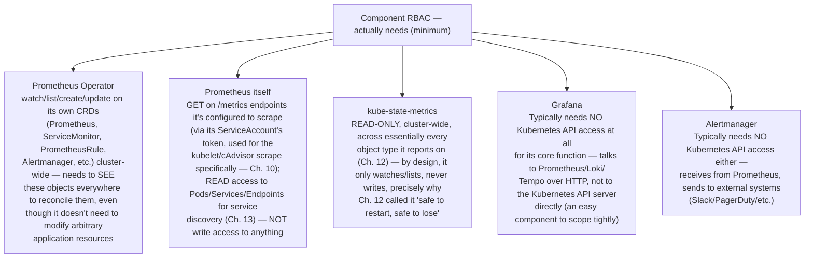
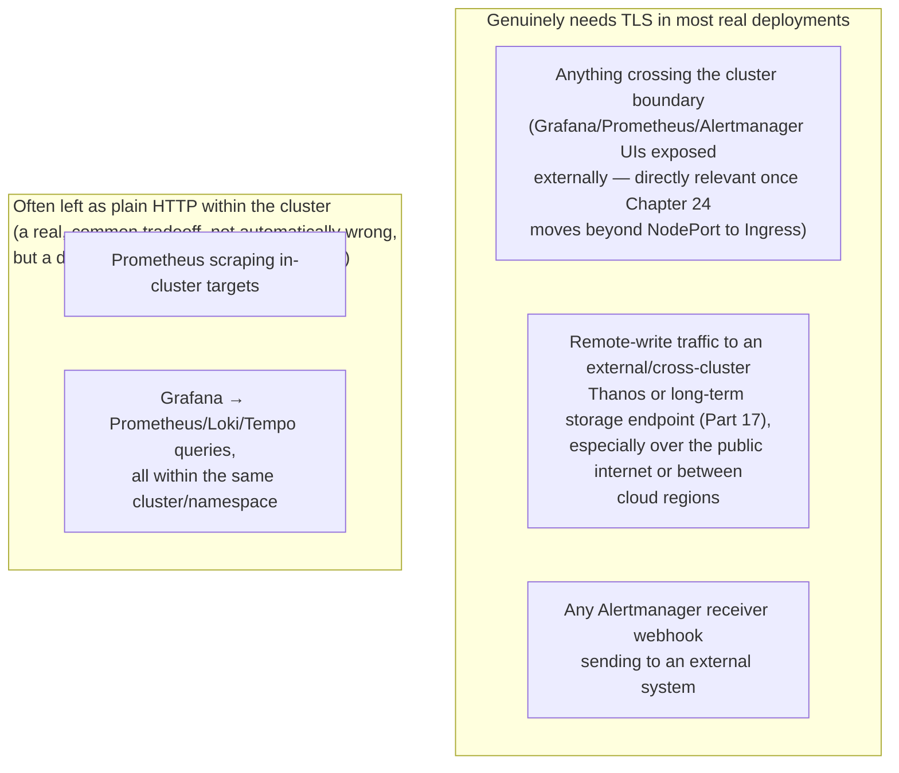
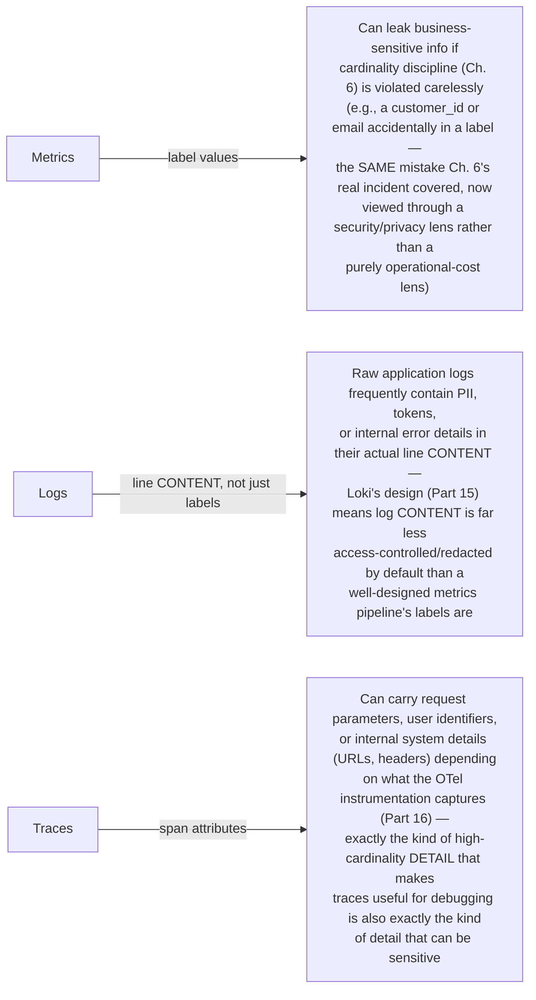

# Chapter 23: Security — RBAC, TLS, NetworkPolicy

> **Part 18 — Production Operations**

---

## 1. Objective

By the end of this chapter you will be able to:

- Apply least-privilege RBAC to every component in this stack, understanding exactly what each one actually needs to function.
- Explain why Grafana's lab-only plaintext admin password (Chapter 5) is wrong for production, and implement the correct Secret-based pattern.
- Configure TLS between components where it matters, and understand where this stack's defaults leave gaps.
- Write NetworkPolicies that scope monitoring traffic correctly — directly closing the multi-tenant `ServiceMonitor` gap from Chapter 13's real incident.
- Explain what data this stack can expose if misconfigured, and why that matters (metrics/logs/traces routinely contain sensitive operational, and sometimes business, information).

---

## 2. Concept

### 2.1 RBAC — what each component actually needs, and why

Recall Chapter 4: every component in this stack runs as a Kubernetes workload with its own ServiceAccount, and the Operator pattern means several components need real API server permissions to function — but "needs some permissions" is not the same as "needs cluster-admin," and understanding the actual minimum requirement per component is the foundation of least-privilege RBAC here.



**The practical takeaway:** kube-prometheus-stack's default-installed `ClusterRole`s are already reasonably scoped for this handbook's purposes (they're not handing out cluster-admin), but a real security review should still explicitly verify each one against exactly this kind of "what does this component's actual job require" reasoning — `kubectl get clusterrole <name> -o yaml` and cross-referencing against the table above is a concrete, doable exercise, not an abstract security platitude.

### 2.2 Grafana authentication and secrets, done correctly

Recall Chapter 5's `adminPassword: "ChangeMe123!"` set directly in `values.yaml` — explicitly flagged there as lab-only. The production-correct pattern:

```bash
kubectl create secret generic grafana-admin-credentials \
  --namespace monitoring \
  --from-literal=admin-user=admin \
  --from-literal=admin-password="$(openssl rand -base64 24)"
```

```yaml
grafana:
  admin:
    existingSecret: "grafana-admin-credentials"
    userKey: admin-user
    passwordKey: admin-password
```

This is a direct, concrete resolution of Chapter 5's explicit deferral — the password is now generated randomly, stored as a Kubernetes Secret (not committed to Git in plaintext `values.yaml`), and referenced rather than declared inline.

**Beyond the initial admin password, real production Grafana deployments almost universally integrate with an existing identity provider** (OIDC/SAML against the organization's SSO, or LDAP) rather than relying on locally-managed Grafana accounts at all — the local admin account becomes a break-glass fallback, not the primary day-to-day authentication path, and per-user/per-team access maps onto Grafana's folder permissions model from Chapter 15 via SSO group membership rather than manually-managed local users.

### 2.3 TLS — where this stack's defaults leave gaps, and how to close them

By default, much of the in-cluster traffic in this handbook's install (Prometheus scraping targets, Grafana querying Prometheus, Alertmanager receiving from Prometheus) happens **over plain HTTP within the cluster network** — relying on the cluster's network boundary itself (and NetworkPolicy, 2.4) as the primary security control, rather than encrypting every internal hop. This is a common, often deliberate real-world tradeoff (internal cluster traffic is frequently treated as a lower-trust-boundary concern than external traffic), but it's a tradeoff worth understanding explicitly rather than assuming.



For organizations with a stricter internal-traffic-encryption requirement (common in regulated industries, or as part of a broader service-mesh adoption), a **service mesh** (Istio, Linkerd) can transparently encrypt all in-cluster traffic, including this stack's internal communication, without requiring each component to be individually reconfigured for TLS — worth naming as the standard answer to "how do we encrypt everything internally" at organizations where that's a hard requirement, though implementing a full service mesh is a significant architectural decision well beyond this chapter's scope.

### 2.4 NetworkPolicy — closing the multi-tenant gap from Chapter 13

Recall Chapter 13's real incident: a `ServiceMonitor` without an explicit `namespaceSelector` accidentally scraped an unintended service in a different namespace. That incident was resolved at the **Prometheus configuration layer** (adding `namespaceSelector`); **NetworkPolicy** provides a complementary, defense-in-depth layer at the **network layer** — even if a scrape config mistake happened again, NetworkPolicy can prevent Prometheus from ever reaching a target it genuinely shouldn't.

```yaml
apiVersion: networking.k8s.io/v1
kind: NetworkPolicy
metadata:
  name: allow-prometheus-scrape
  namespace: ecommerce
spec:
  podSelector: {}                    # applies to all pods in this namespace
  policyTypes: ["Ingress"]
  ingress:
    - from:
        - namespaceSelector:
            matchLabels:
              kubernetes.io/metadata.name: monitoring
          podSelector:
            matchLabels:
              app.kubernetes.io/name: prometheus
      ports:
        - protocol: TCP
          port: 9090     # or whatever port your services expose metrics on
```

This says: "pods in the `ecommerce` namespace only accept inbound connections on the metrics port from pods specifically labeled as Prometheus, in the `monitoring` namespace" — a real network-layer boundary, not just a configuration-layer intention. Combined with a default-deny baseline policy (common security practice, independent of monitoring specifically):

```yaml
apiVersion: networking.k8s.io/v1
kind: NetworkPolicy
metadata:
  name: default-deny-ingress
  namespace: ecommerce
spec:
  podSelector: {}
  policyTypes: ["Ingress"]
  # no `ingress` rules specified = deny all inbound by default,
  # requiring explicit allow rules (like the one above) for anything
  # that needs to reach these pods
```

**This directly closes the exact gap Chapter 13's real incident exposed** — with both a correct `namespaceSelector` on the `ServiceMonitor` (application-layer intent) and a NetworkPolicy like the one above (network-layer enforcement), an accidental cross-namespace label collision can no longer result in unintended scraping, even if the configuration-layer mistake happens again — genuine defense in depth, not relying on getting the config right once and hoping.

### 2.5 What sensitive data can actually leak through this stack, if misconfigured

A security-conscious final consideration, worth naming explicitly: **metrics, logs, and traces routinely contain sensitive information**, even though none of them are "the database" in the traditional sense:



**The practical implication:** access to Grafana (and therefore to Prometheus/Loki/Tempo through it) is access to potentially sensitive operational and business data, not just "boring infrastructure numbers" — this is precisely why Chapter 15's folder-permission model and this chapter's RBAC/authentication discussion aren't just about preventing accidental dashboard edits; they're a genuine data-access-control boundary, and should be treated with the same seriousness as access to any other internal data system.

---

## 3. Why This Matters

- Every component this handbook has deployed since Chapter 5 has been running with whatever default permissions the Helm chart provides — this chapter is where you finally verify those defaults are actually appropriate, rather than assuming they are.
- The Grafana Secret pattern (2.2) and the NetworkPolicy pattern (2.4) are both direct, concrete resolutions of gaps explicitly flagged earlier in this handbook (Chapter 5's lab-only password, Chapter 13's real incident) — this chapter is where those deferred loose ends get properly closed.
- Recognizing that metrics/logs/traces themselves can carry sensitive data (2.5) is a genuinely mature security perspective that goes beyond "lock down the infrastructure" to "understand what's actually flowing through it" — a distinction that matters enormously in regulated industries and is a common, real interview differentiator for senior platform/security-adjacent roles.

---

## 4. Architecture

```
 RBAC: each component's ServiceAccount scoped to its actual minimum need
 (2.1) — verified against kube-prometheus-stack's default ClusterRoles

 Secrets: Grafana admin credentials (and any Alertmanager receiver
 credentials — Slack webhooks, PagerDuty keys) as Kubernetes Secrets,
 never inline in values.yaml or Git-committed plaintext

 TLS: deliberate boundary — encrypted for anything crossing the cluster
 edge or going to external systems; plain HTTP internally is a real,
 named tradeoff, not an oversight, with a service mesh as the answer
 for organizations requiring universal internal encryption

 NetworkPolicy: default-deny-ingress baseline per namespace, plus
 explicit allow rules for legitimate monitoring traffic (Prometheus
 scraping, Grafana querying) — defense in depth alongside, not instead
 of, correct ServiceMonitor namespaceSelector scoping (Chapter 13)

 Data sensitivity: treat Grafana/Prometheus/Loki/Tempo access as real
 data access control, given what labels/log content/span attributes
 can actually carry
```

---

## 5. Hands-on Lab

**1. Audit the actual RBAC your Chapter 5 install created:**

```bash
kubectl get clusterrole | grep kube-prom-stack
kubectl describe clusterrole kube-prom-stack-kube-prome-prometheus
```

Cross-reference the listed permissions against section 2.1's table — confirm Prometheus's ClusterRole is read-only (`get`, `list`, `watch` — no `create`/`update`/`delete` on application resources).

**2. Migrate to the Secret-based Grafana admin pattern** from section 2.2:

```bash
kubectl create secret generic grafana-admin-credentials -n monitoring \
  --from-literal=admin-user=admin \
  --from-literal=admin-password="$(openssl rand -base64 24)"
```

Update your `values.yaml` per section 2.2 and `helm upgrade`; confirm you can still log in (retrieve the generated password: `kubectl get secret grafana-admin-credentials -n monitoring -o jsonpath='{.data.admin-password}' | base64 -d`).

**3. Deploy the default-deny + explicit-allow NetworkPolicy pair** from section 2.4 into your `ecommerce` namespace (Chapter 14):

```bash
kubectl apply -f default-deny-ingress.yaml
kubectl apply -f allow-prometheus-scrape.yaml
```

**4. Verify scraping still works** (Prometheus Targets page, per Chapter 13's debugging workflow) — confirming the allow rule is correctly scoped — then **deliberately break it** (temporarily delete the allow rule) and confirm targets go `DOWN`, proving the policy is actually enforcing something real, not just present but inert. Reapply the allow rule afterward.

**5. Audit your own labels for sensitive data**, applying section 2.5's lens: review your Chapter 14 Online Boutique instrumentation and Chapter 19 Loki queries for anything that might carry customer/business-sensitive detail in a label or unredacted log line, and consider what a `metric_relabel_configs` drop rule (Chapter 13) or Loki-side redaction would look like for it, even if you don't apply it in your lab environment.

---

## 6. Verification

- [ ] Correctly state the minimum RBAC requirement for at least 3 components in this stack, and explain why Grafana/Alertmanager typically need no Kubernetes API access at all.
- [ ] Explain why Chapter 5's plaintext `adminPassword` value was explicitly flagged as lab-only, and implement the Secret-based replacement.
- [ ] Explain the deliberate internal-TLS tradeoff this stack's defaults make, and name the standard answer (service mesh) for organizations requiring universal internal encryption.
- [ ] Write a working default-deny + explicit-allow NetworkPolicy pair and demonstrate it actually blocks/allows traffic as intended.
- [ ] Explain, with a concrete example each, how metrics labels, log content, and trace span attributes can each independently leak sensitive data.

---

## 7. Troubleshooting

| Symptom | Root Cause | Fix |
|---|---|---|
| After migrating to Secret-based Grafana admin, login fails | Wrong secret key names referenced in `values.yaml` (`userKey`/`passwordKey` must exactly match the Secret's actual data keys), or the Secret wasn't created in the same namespace as the Grafana deployment. | Verify `kubectl get secret grafana-admin-credentials -n monitoring -o yaml` shows the exact expected keys; confirm namespace match. |
| NetworkPolicy applied but Prometheus scraping breaks entirely, even for intentional targets | The allow rule's `podSelector`/`namespaceSelector` for the *Prometheus source* doesn't actually match Prometheus's real pod labels (a common mismatch — verify against `kubectl get pods -n monitoring --show-labels`). | Correct the `from.podSelector`/`from.namespaceSelector` to match Prometheus's actual labels precisely; a NetworkPolicy silently blocks anything not exactly matching, with no error message pointing at the mismatch. |
| A component that previously worked fine now can't reach an external endpoint (e.g., a Slack webhook from Alertmanager) after adding NetworkPolicies | Default-deny commonly applies to Ingress only by default in simple examples (as shown in 2.4) but real hardening often adds Egress restrictions too — an overly strict Egress default-deny without a corresponding allow rule for legitimate external calls breaks exactly this kind of traffic. | If applying Egress policies, explicitly allow required external destinations (DNS, the specific webhook endpoints) rather than default-denying Egress without exceptions. |
| RBAC audit reveals a component with broader permissions than section 2.1 suggests it needs | Chart defaults sometimes err toward broader-than-strictly-necessary permissions for operational simplicity/compatibility across many possible configurations, not malice or carelessness. | Consider a custom, tightened `ClusterRole`/`Role` for your specific, known configuration if your organization's security posture requires it — weigh the maintenance burden of custom RBAC against the chart's reasonably-scoped (if not maximally-minimal) defaults. |

---

## 8. Production Notes

- **Real production RBAC audits treat "what does the chart's default ClusterRole actually grant" as a required, recurring review item**, not a one-time check — chart upgrades (Chapter 22) can change RBAC requirements, and periodic re-verification against section 2.1's reasoning is a genuine, ongoing security practice, not a checkbox exercise done once at initial install.
- **SSO/OIDC integration for Grafana is close to universal in real enterprise deployments** — a locally-managed admin account, even Secret-backed, is treated as a break-glass fallback specifically because centralized identity (with its own MFA, offboarding process, and audit trail) is a substantially stronger security posture than any number of individually-managed local accounts.
- **NetworkPolicy support depends on your CNI plugin** — not every Kubernetes networking implementation enforces NetworkPolicy by default (a genuinely important, sometimes-overlooked fact); verify your specific cluster's CNI (Calico, Cilium, and most major cloud providers' CNIs support it; some minimal/default setups on certain distributions historically did not) actually enforces the policies you write, rather than assuming they're silently effective.

---

## 9. Best Practices

1. **Verify each component's actual RBAC against its actual functional need** (section 2.1's table), as a recurring practice, not a one-time check.
2. **Never store credentials inline in `values.yaml` or commit them to Git in plaintext** — always Secret-based, generated with real entropy (`openssl rand`, not a memorable/guessable string).
3. **Treat internal TLS as a deliberate decision, not a default to assume** — know explicitly whether your organization's requirements call for it, and reach for a service mesh if universal internal encryption is genuinely required.
4. **Apply NetworkPolicy as defense-in-depth alongside correct application-layer scoping** (like Chapter 13's `namespaceSelector`), never as a substitute for getting the application-layer configuration right in the first place.
5. **Treat Grafana/Prometheus/Loki/Tempo access as real data access control**, given what can flow through labels, log content, and span attributes — apply the same access rigor you'd apply to any other system holding potentially sensitive operational or business data.
6. **Confirm your CNI actually enforces NetworkPolicy** before relying on it as a real security boundary — don't assume.

---

## 10. Interview Questions

1. **"What's the minimum RBAC that Prometheus itself actually needs to function, and why doesn't it need write access to anything?"** — Read-only (`get`/`list`/`watch`) access to Pods/Services/Endpoints for service discovery (Chapter 13), and scrape-level access to `/metrics` endpoints; Prometheus's entire job is observing and storing data, never modifying cluster state, so write permissions would violate least-privilege without providing any functional benefit.
2. **"Why is a locally-managed Grafana admin account, even Secret-backed, considered a weaker security posture than SSO integration?"** — Centralized identity (OIDC/SAML/LDAP) provides organization-wide MFA enforcement, a unified offboarding process, and centralized audit trails that individually-managed local accounts can't match; the local admin becomes a break-glass fallback rather than the primary authentication path in mature deployments.
3. **"What's the tradeoff this handbook's default install makes around internal TLS, and what's the standard answer for organizations that need universal internal encryption?"** — Internal cluster traffic (scraping, Grafana-to-Prometheus queries) runs over plain HTTP by default, relying on cluster network boundaries and NetworkPolicy as the primary internal security control; a service mesh (Istio/Linkerd) is the standard answer for transparently encrypting all internal traffic without individually reconfiguring every component.
4. **"How does NetworkPolicy provide defense-in-depth on top of a correctly-scoped ServiceMonitor?"** — Even if a `ServiceMonitor`'s `namespaceSelector` were misconfigured again (as in Chapter 13's real incident), a NetworkPolicy restricting which pods/namespaces can actually reach a given metrics port at the network layer would still prevent unintended access — two independent layers, so a mistake in one doesn't automatically become an actual security/operational incident.
5. **"Give three concrete examples of how sensitive data can leak through a monitoring stack even without a traditional data breach."** — An unbounded metric label accidentally containing a customer ID (Chapter 6's cardinality mistake, viewed as a privacy issue); raw application log content containing PII or tokens, given Loki's label-only indexing doesn't redact log line content; a trace span attribute capturing a request parameter or header containing sensitive user or system detail.

---

## 11. Real Incident

**Company type:** Healthcare technology company, subject to strict regulatory data-handling requirements.

**What happened:** During a routine internal security review (unrelated to any active incident), an auditor discovered that several application services' structured JSON logs — flowing through exactly the Loki pipeline built in Part 15 — included raw patient-adjacent identifiers in log line content, logged originally for debugging convenience early in the services' development and never revisited. Because Loki's design (correctly, per its architecture) does not redact or restrict log line *content* the way it does labels, and because the team's Grafana access model at the time was broader than it should have been (many engineers had blanket log access across all services, not scoped per team/need), this represented a genuine, if not yet exploited, compliance exposure.

**Root cause:** A combination of two separate gaps this chapter directly addresses: insufficiently careful application-level logging practices (logging sensitive content that should never have been logged in the first place — a discipline outside Loki's own architecture to enforce, but one the team should have had as policy) and overly broad Grafana access (not scoped per this chapter's folder-permission and RBAC guidance), compounding a logging mistake into a broader exposure than it needed to be.

**Resolution:** Immediately restricted Grafana folder/data-source access to a much narrower, need-based set of engineers for any logs containing potentially regulated data; conducted an application-level audit and remediation of logging statements across affected services to remove sensitive content from log lines entirely (the correct, durable fix, rather than relying on access restriction alone); implemented automated log-content scanning (a compliance tool, external to this handbook's stack) to catch similar future logging mistakes before they reached production.

**Prevention:** Instituted a mandatory "does this log line contain data that shouldn't be logged" review as part of standard code review for any new logging statement, and formally adopted the principle from this chapter's section 2.5 — that Grafana/Loki access is real data access control — into the company's broader data governance policy, with regular access reviews going forward rather than a one-time initial grant.

---

## 12. Summary

- **RBAC** for this stack should reflect each component's actual minimum need — Prometheus and kube-state-metrics need broad read-only access; Grafana and Alertmanager typically need none at all to the Kubernetes API.
- **Credentials belong in Kubernetes Secrets**, never inline in `values.yaml` or committed plaintext to Git — directly resolving Chapter 5's explicitly-flagged lab-only shortcut.
- **Internal TLS is a deliberate tradeoff**, not automatically wrong to skip for in-cluster traffic, but should be a conscious decision — a service mesh is the standard answer when universal internal encryption is genuinely required.
- **NetworkPolicy provides real, network-layer defense-in-depth** on top of correct application-layer scoping (like Chapter 13's `namespaceSelector`) — directly closing that earlier chapter's real incident with a second, independent layer of protection.
- **Metrics labels, log content, and trace attributes can all independently carry sensitive data** — treating access to this entire stack as genuine data access control, not just "boring infrastructure," is a mature and necessary security perspective.

---

## 13. Next Chapter

**Chapter 24: Beyond NodePort — LoadBalancer, Ingress, and Gateway API** closes out Part 18 by finally revisiting the NodePort decision made all the way back in Chapter 5 — now that security (this chapter) has been addressed, you'll see exactly how and when to move Grafana, Prometheus, and Alertmanager's exposure to a LoadBalancer, an Ingress controller (NGINX, Traefik), or the newer Gateway API, and understand precisely why this handbook deliberately deferred that decision until every underlying concept was already solid.
