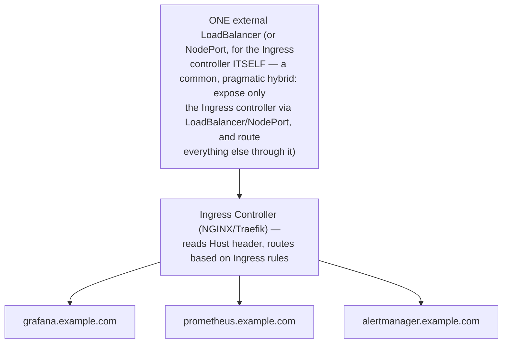
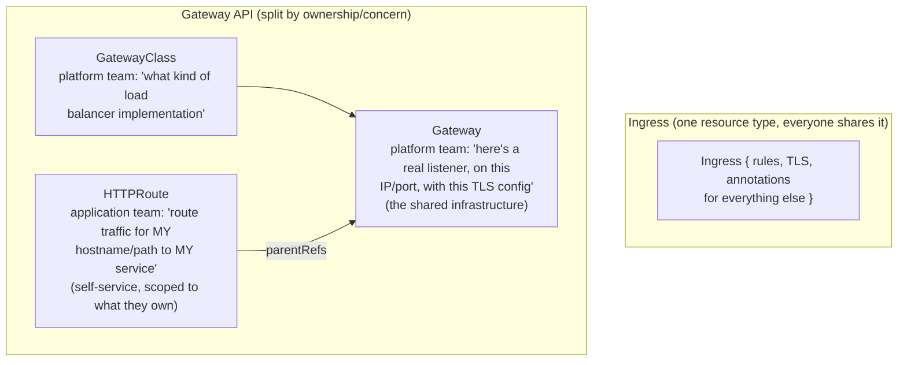
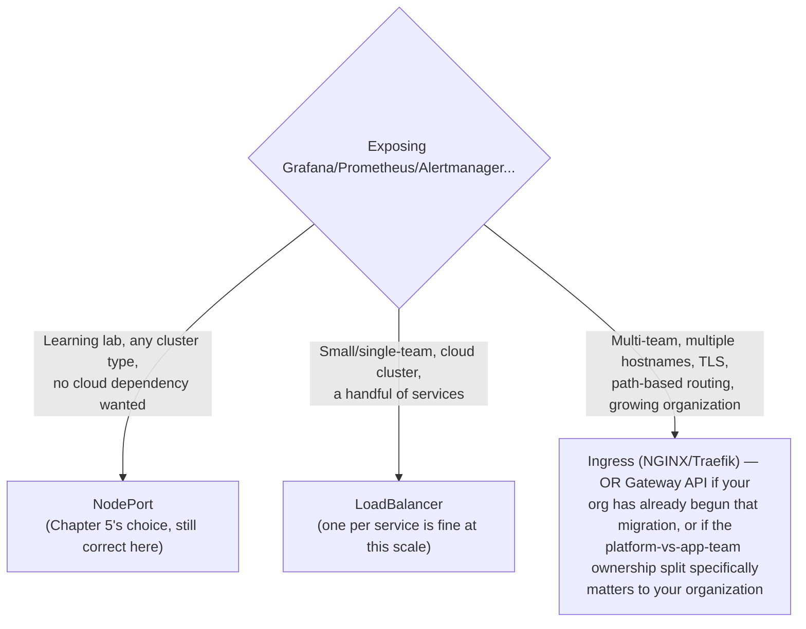
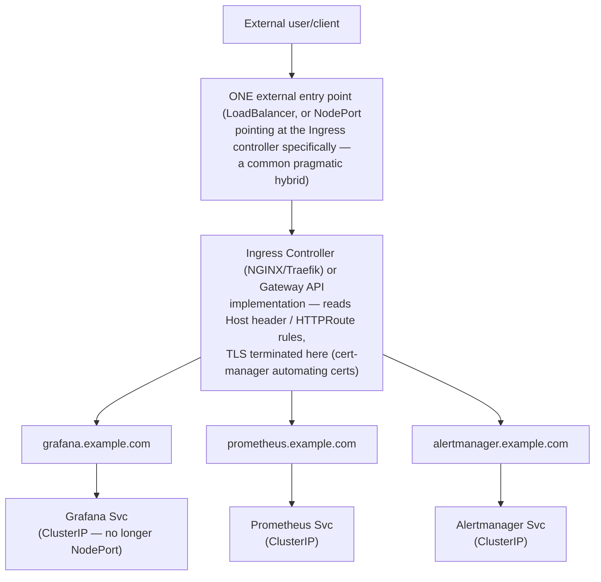

# Chapter 24: Beyond NodePort — LoadBalancer, Ingress, and Gateway API

> **Part 18 — Production Operations**

---

## 1. Objective

By the end of this chapter you will be able to:

- Explain precisely what problems NodePort has at real production scale, that this handbook deliberately deferred addressing until now.
- Explain `LoadBalancer` Services and how they differ from NodePort.
- Deploy and configure an Ingress controller (NGINX) to expose Grafana/Prometheus/Alertmanager with proper hostnames and TLS.
- Explain the Gateway API and why it's positioned as Ingress's eventual successor.
- Make an informed decision about which exposure method fits a given real-world scenario.

---

## 2. Concept

### 2.1 Why NodePort was the right choice for this handbook, and its real limits

Chapter 5 was explicit: NodePort was chosen for learning because it requires no cloud provider integration, no extra controller, and works identically everywhere. Now that every underlying concept (Parts 1–17) and security posture (Chapter 23) is solid, it's worth being equally explicit about NodePort's real production limitations:

```
 NodePort limitations at real scale:
 ─────────────────────────────────────
 1. Port management: every service needs a manually-tracked, unique
    port in the 30000-32767 range — doesn't scale past a handful of
    services without becoming an operational spreadsheet exercise.

 2. No built-in TLS termination: NodePort is a raw TCP/UDP port
    forward — HTTPS requires the application itself to handle TLS,
    or a separate mechanism in front of it (this chapter's whole
    point).

 3. No hostname-based routing: one NodePort = one Service. You can't
    expose grafana.example.com AND prometheus.example.com on the
    same port 443 the way a real production domain setup needs —
    NodePort has no concept of the HTTP Host header at all.

 4. Exposes every node directly: traffic can arrive at ANY node's
    IP on that port, requiring every node to be reachable from
    wherever your users/clients are — a much larger network attack
    surface than routing through one dedicated ingress point.

 5. No path-based routing, rate limiting, or other L7 (application-
    layer) features — it's purely L4 (TCP/UDP), so anything requiring
    HTTP-aware behavior needs to be built by hand or layered on top.
```

**None of this makes NodePort "wrong"** — it remains genuinely appropriate for exactly the use case this handbook used it for (learning, small/single-team clusters, environments where simplicity trumps the features above) — but a growing, multi-team, externally-facing production deployment runs into these limits quickly, which is precisely why this chapter exists as the natural next step.

### 2.2 LoadBalancer Services — the cloud-native middle ground

A `LoadBalancer` Service asks the cloud provider (AWS, GCP, Azure) to provision a real, managed external load balancer (an AWS NLB/ALB, a GCP Load Balancer, an Azure Load Balancer) pointing at your Service — solving NodePort's "exposes every node directly" and port-management problems, at the cost of a genuine per-load-balancer cloud bill and cloud-provider lock-in (this exact mechanism doesn't exist identically on Kind/Minikube/bare-metal — hence this handbook's consistent avoidance of it for the labs, per the original instructions).

```
 kind: Service
 spec:
   type: LoadBalancer      # cloud provider provisions a real external LB
   ports:
     - port: 443
       targetPort: 3000
```

Each `LoadBalancer` Service typically gets its **own** dedicated cloud load balancer — meaning if you have 3 services to expose (Grafana, Prometheus, Alertmanager), you'd provision 3 separate cloud load balancers, each with its own cost and its own IP — workable at small scale, but this is exactly the problem **Ingress** (2.3) solves more efficiently once you have more than a couple of services to expose.

On bare-metal/on-prem clusters without a cloud provider, **MetalLB** provides `LoadBalancer`-type Services by managing a pool of IP addresses on your own network — explicitly named in this handbook's original scope as something to *understand exists*, without using it in the labs, precisely because it requires network-level configuration (ARP/BGP) beyond what a portable, learning-focused lab setup should assume.

### 2.3 Ingress — one entry point, many services, hostname/path routing

An **Ingress** resource, backed by an **Ingress controller** (a real running workload — commonly **NGINX Ingress Controller** or **Traefik** — that watches Ingress objects and configures itself accordingly, the same controller-watches-CRD-ish pattern you've seen throughout this handbook, Chapter 4), solves NodePort/LoadBalancer's per-service overhead by routing **one** external IP/load balancer's traffic to **many** backend Services, based on HTTP hostname and/or path.

```yaml
apiVersion: networking.k8s.io/v1
kind: Ingress
metadata:
  name: monitoring-ingress
  namespace: monitoring
  annotations:
    cert-manager.io/cluster-issuer: "letsencrypt-prod"    # automated TLS, see below
spec:
  ingressClassName: nginx
  tls:
    - hosts: ["grafana.example.com", "prometheus.example.com"]
      secretName: monitoring-tls
  rules:
    - host: grafana.example.com
      http:
        paths:
          - path: /
            pathType: Prefix
            backend:
              service:
                name: kube-prom-stack-grafana
                port: { number: 80 }
    - host: prometheus.example.com
      http:
        paths:
          - path: /
            pathType: Prefix
            backend:
              service:
                name: kube-prom-stack-kube-prome-prometheus
                port: { number: 9090 }
```



This directly solves NodePort's port-management and hostname-routing gaps (2.1) — one external entry point, clean hostnames instead of memorized port numbers, and centralized TLS termination.

**TLS via cert-manager** (referenced in the annotation above) deserves a specific mention: **cert-manager** is the standard Kubernetes-native tool for automatically provisioning and renewing TLS certificates (commonly via Let's Encrypt), watching `Ingress` (or its own `Certificate` CRD — yet another instance of the CRD-and-controller pattern from Chapter 4) and handling the entire certificate lifecycle automatically — directly closing Chapter 23's "anything crossing the cluster boundary genuinely needs TLS" recommendation with a concrete, automated implementation, rather than manual certificate management.

### 2.4 Gateway API — Ingress's eventual successor

The **Gateway API** is a newer, more expressive, role-oriented Kubernetes API for traffic routing, designed by the Kubernetes community specifically to address Ingress's known limitations: Ingress's single resource type conflates concerns that different teams typically own in a real organization (a platform team managing the actual load balancer/listener configuration vs. an application team managing routing rules for their own service), and Ingress's annotation-heavy extension model (note the `cert-manager.io/...` and `ingressClassName` mechanisms above — both are ways of bolting extra behavior onto Ingress via annotations/fields not originally part of a clean core spec) has become sprawling and inconsistent across different Ingress controller implementations.



This split mirrors, almost exactly, the same self-service-with-guardrails philosophy this entire handbook has repeatedly returned to — `ServiceMonitor`/`PrometheusRule` letting application teams self-serve monitoring config while the platform team owns the `Prometheus` CRD (Chapters 4, 7, 13); `AlertmanagerConfig` letting teams self-serve alert routing while the platform team owns top-level `Alertmanager` config (Chapter 16) — **Gateway API applies this exact pattern to ingress traffic routing**, which is precisely why it's worth understanding even briefly here: it's not a new idea, it's a familiar one, applied to a part of the stack that historically lacked it.

```yaml
apiVersion: gateway.networking.k8s.io/v1
kind: HTTPRoute
metadata:
  name: grafana-route
  namespace: monitoring
spec:
  parentRefs:
    - name: shared-gateway     # references a Gateway the platform team owns
  hostnames: ["grafana.example.com"]
  rules:
    - backendRefs:
        - name: kube-prom-stack-grafana
          port: 80
```

**Where things stand practically, as of this handbook:** Ingress remains extremely widely deployed and well-supported (NGINX Ingress Controller in particular is a mature, extremely common default), and Gateway API adoption is real but still growing — most Ingress controllers (including NGINX and Traefik) now support both APIs, letting organizations migrate incrementally rather than requiring an all-or-nothing switch. Understanding both, and the specific gap Gateway API closes, is the practically useful takeaway, rather than treating one as simply obsolete.

### 2.5 Decision framework — which one, when



---

## 3. Why This Matters

- This chapter is where Chapter 5's original, explicitly-flagged deferral ("we'll cover LoadBalancer/Ingress/Gateway API once NodePort has served its learning purpose") finally gets paid off — you now understand not just *how* to use Ingress, but precisely *why* NodePort was the right pedagogical choice and exactly where its real limits are.
- The self-service-with-guardrails pattern, appearing for the fourth time in this handbook (ServiceMonitor/PrometheusRule, AlertmanagerConfig, and now GatewayClass/Gateway/HTTPRoute), is worth recognizing as a genuinely recurring Kubernetes platform design philosophy, not a coincidence — seeing it repeat across four unrelated subsystems is itself a valuable, transferable insight.
- Understanding cert-manager's role directly closes Chapter 23's TLS discussion with a concrete, automatable implementation, rather than leaving "you should use TLS at the cluster boundary" as an abstract recommendation.

---

## 4. Architecture



---

## 5. Hands-on Lab

**1. Install an Ingress controller** (NGINX, the most common default choice):

```bash
helm repo add ingress-nginx https://kubernetes.github.io/ingress-nginx
helm install ingress-nginx ingress-nginx/ingress-nginx --namespace ingress-nginx --create-namespace
```

**2. Install cert-manager** (for real TLS automation — skip the `ClusterIssuer` step below if you don't have a real public DNS domain available for this lab; self-signed/no-TLS is fine for demonstrating the routing mechanics alone):

```bash
helm repo add jetstack https://charts.jetstack.io
helm install cert-manager jetstack/cert-manager --namespace cert-manager --create-namespace --set installCRDs=true
```

**3. Change Grafana, Prometheus, and Alertmanager's Service type back to `ClusterIP`** (no longer need NodePort once traffic routes through Ingress) and deploy the `Ingress` resource from section 2.3, adjusted to your own domain/DNS setup (or `/etc/hosts` entries pointing at your Ingress controller's IP for a fully local lab exercise without real DNS):

```yaml
prometheus:
  service:
    type: ClusterIP
grafana:
  service:
    type: ClusterIP
alertmanager:
  service:
    type: ClusterIP
```

```bash
helm upgrade kube-prom-stack prometheus-community/kube-prometheus-stack -n monitoring -f values.yaml
kubectl apply -f monitoring-ingress.yaml
```

**4. Verify hostname-based routing works** — confirm `grafana.example.com` and `prometheus.example.com` (or your local equivalents) each correctly route to their respective backend, through the single Ingress controller entry point.

**5. (Optional, if you have real DNS available) Try a minimal Gateway API setup** alongside/instead of the Ingress resource, using the `HTTPRoute` example from section 2.4, to directly compare the two models' resource shapes side by side.

---

## 6. Verification

- [ ] List NodePort's 5 real production limitations from section 2.1, and explain why none of them made it the wrong choice for this handbook's labs specifically.
- [ ] Explain the difference between LoadBalancer and Ingress, and specifically why "one LoadBalancer per service" doesn't scale as well as Ingress once you have more than a couple of services.
- [ ] Successfully deploy an Ingress controller and route two different hostnames to two different backend Services.
- [ ] Explain cert-manager's role and how it automates what would otherwise be manual TLS certificate management.
- [ ] Explain the specific ownership-split problem Gateway API solves that Ingress's single-resource-type model doesn't cleanly address, and name the parallel to at least one other CRD pattern from earlier in this handbook.

---

## 7. Troubleshooting

| Symptom | Root Cause | Fix |
|---|---|---|
| Ingress applied but `curl`/browser gets no response at all | Ingress controller not actually installed/running, or the Ingress's `ingressClassName` doesn't match the installed controller's class name. | `kubectl get pods -n ingress-nginx`; `kubectl get ingressclass` to confirm the exact class name expected. |
| Ingress routes to the wrong backend, or "default backend" 404 page | Host header mismatch (DNS/`/etc/hosts` not actually pointing where you think), or a typo in the Ingress rule's `host`/`path`/`backend.service.name`. | Verify DNS/hosts file resolution first, independently of Kubernetes; double-check exact Service name and port match the real Service object. |
| TLS certificate not issuing via cert-manager | No real, publicly-resolvable DNS record for the domain (Let's Encrypt's HTTP-01/DNS-01 challenge requires this), or `ClusterIssuer` misconfigured. | `kubectl describe certificate -n monitoring`; `kubectl describe challenge -n monitoring` for the specific validation failure reason — this is genuinely hard to fully exercise without real public DNS, which is fine to note and defer in a pure lab environment. |
| Gateway API `HTTPRoute` has no effect | No `Gateway` object exists for it to attach to (`parentRefs` pointing at a Gateway that was never created), or the cluster's Ingress controller doesn't yet support Gateway API (check specific controller version/feature support). | Confirm a working `Gateway` object exists first; verify your specific Ingress controller's Gateway API support status and version requirements. |
| Switching Services from NodePort to ClusterIP broke something that depended on the old NodePort directly | Some external tooling/dashboard/bookmark was pointing at the old `<node-ip>:<nodeport>` URL directly, bypassing the new Ingress path entirely. | Update all external references to the new hostname-based URLs; this is an expected, one-time migration cost when moving off NodePort. |

---

## 8. Production Notes

- **The "single NodePort/LoadBalancer for the Ingress controller itself, Ingress for everything behind it" hybrid pattern** (shown in this chapter's architecture diagram) is extremely common in real production clusters — it's not "NodePort vs. Ingress" as a binary choice; NodePort or LoadBalancer often still appears exactly once, specifically to expose the Ingress controller itself, with genuinely everything else routed through it.
- **cert-manager is close to a universal default** in any real Kubernetes cluster with externally-facing services — manual TLS certificate management (tracking expiry dates, manual renewal) is both a real operational burden and a well-known source of real incidents (an expired certificate silently breaking an externally-facing service — a scenario worth cross-referencing directly with Part 19's incident library).
- **Gateway API adoption is genuinely still in progress industry-wide** as of this handbook — worth understanding deeply enough to make an informed choice, but not assuming every organization has already migrated; Ingress remains a completely valid, well-supported, production-correct choice for the foreseeable future, and the two can coexist during any gradual migration.

---

## 9. Best Practices

1. **Use NodePort only for learning/small/single-team scenarios**, exactly as this handbook did — recognize its real limitations (section 2.1) once you're operating past that scale.
2. **Prefer the single-entry-point-plus-Ingress hybrid pattern** over provisioning a separate LoadBalancer per service once you have more than a couple of externally-facing services.
3. **Automate TLS certificate management via cert-manager** rather than manual certificate handling — the operational and incident-prevention payoff is substantial for minimal setup effort.
4. **Evaluate Gateway API deliberately, based on whether its specific ownership-split benefit matters to your organization** — not simply because it's newer; Ingress remains a completely valid choice.
5. **Plan for the one-time migration cost** (updating bookmarks, external tooling, hardcoded URLs) explicitly when moving any service off NodePort/direct-IP access to hostname-based Ingress routing.

---

## 10. Interview Questions

1. **"What are NodePort's real limitations at production scale, and why might a team still choose it anyway for certain scenarios?"** — Manual port management, no TLS termination or hostname-based routing, direct multi-node exposure, and no L7 features; still a reasonable choice for learning environments, small/single-team clusters, or anywhere simplicity and zero external dependencies matter more than these missing features.
2. **"How does Ingress solve a problem that provisioning a LoadBalancer Service per application doesn't solve well?"** — Ingress routes traffic for many backend Services through one shared external entry point/load balancer based on HTTP hostname/path, avoiding the cost and IP-management overhead of provisioning a separate cloud load balancer for every single service.
3. **"What role does cert-manager play in a real Ingress-based deployment?"** — It automates the full TLS certificate lifecycle (issuance and renewal, typically via Let's Encrypt), watching Ingress resources or its own Certificate CRD, removing manual certificate management as an operational burden and a common real-world source of expiry-related incidents.
4. **"What specific problem does the Gateway API solve that Ingress's single-resource-type model doesn't address well?"** — It splits ownership between platform-managed shared infrastructure (GatewayClass, Gateway — the actual listener/load balancer configuration) and application-team-managed routing (HTTPRoute), addressing a real organizational ownership mismatch that Ingress's single, shared resource type and annotation-heavy extension model handles less cleanly.
5. **"Where else in a typical Kubernetes monitoring stack have you seen the same 'platform owns shared infrastructure, application teams self-serve their own piece' pattern that Gateway API implements?"** — `ServiceMonitor`/`PrometheusRule` (Chapters 4, 7, 13, application teams self-serve scrape/rule config while the platform team owns the top-level `Prometheus` CRD) and `AlertmanagerConfig` (Chapter 16, teams self-serve alert routing while the platform team owns global Alertmanager settings) — a recurring, deliberate Kubernetes platform design philosophy, not a one-off.

---

## 11. Real Incident

**Company type:** B2B SaaS company that had grown from a single small product team to a multi-team platform over several years, monitoring stack included.

**What happened:** The company's monitoring stack had been exposed via NodePort since its earliest days (a reasonable original choice at small scale, mirroring exactly this handbook's own Chapter 5 reasoning). As the company grew to a dozen teams, each wanting to expose their own internal tools alongside the growing monitoring stack, the NodePort range became a genuinely unmanageable, undocumented mess — several engineers reported spending real time just trying to remember or rediscover "which port was Grafana on again" across different environments, and at least one incident occurred when two unrelated services were accidentally assigned overlapping NodePort values during a busy deploy week, causing intermittent, confusing cross-traffic between two completely unrelated tools.

**Root cause:** NodePort's manual port-management limitation (section 2.1, point 1), never revisited as the organization scaled well past the point where it remained a reasonable tradeoff — nobody had made an explicit decision to move on; it simply hadn't been prioritized until the accumulated friction and a real (if minor) incident forced the conversation.

**Resolution:** Migrated to an NGINX Ingress Controller with cert-manager-automated TLS, consolidating every previously NodePort-exposed internal tool (including the monitoring stack) behind clean, memorable hostnames (`grafana.internal.example.com`, etc.) — the port-collision class of incident became structurally impossible afterward, since Ingress routing is hostname-based, not port-number-based.

**Prevention/lesson:** The team's retrospective explicitly noted that NodePort's tradeoffs should be **revisited deliberately at defined organizational growth milestones** (e.g., "when we cross N teams" or "when we cross N externally-exposed services"), rather than left as an unexamined historical default that quietly becomes wrong over time — a genuinely useful, transferable operational practice: exposure method, like several other early architectural decisions, deserves periodic, deliberate re-evaluation rather than permanent inertia.

---

## 12. Summary

- **NodePort** — this handbook's deliberate choice throughout — has real limitations at production scale (manual port management, no TLS/hostname routing, full-node exposure, no L7 features) that are worth understanding precisely now that the underlying monitoring concepts are solid.
- **LoadBalancer** Services provide cloud-managed external load balancing per Service — a reasonable step up for a handful of services, though it doesn't solve per-service overhead the way Ingress does.
- **Ingress**, backed by a real controller (NGINX/Traefik) and commonly paired with **cert-manager** for automated TLS, routes many services through one shared entry point using hostname/path rules — the standard production answer for this handbook's exposure needs at real scale.
- **Gateway API** is Ingress's community-designed successor, splitting platform-owned shared infrastructure from application-team-owned routing rules — the same self-service-with-guardrails philosophy that recurs throughout this entire handbook, now applied to ingress traffic specifically.
- The right exposure method is a **deliberate decision matched to your actual scale and organizational structure**, worth revisiting periodically as both grow — not a permanent, unexamined default.

---

## 13. Next Chapter

This closes out **Part 18: Production Operations**, and with it, every operational discipline (backup/upgrade/scaling/capacity planning, security, and now production-grade exposure) needed to run this entire handbook's stack reliably, securely, and at real scale.

**Part 19, Chapter 25: 100+ Real Incidents Runbook** consolidates everything built across all 18 parts into a single, comprehensive, symptom-organized troubleshooting reference — every failure mode this handbook has touched on throughout (and many more), each with symptoms, root cause, investigation steps, exact commands, resolution, and prevention, structured as the kind of runbook a real on-call engineer keeps open during an actual incident.
